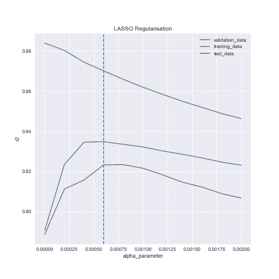
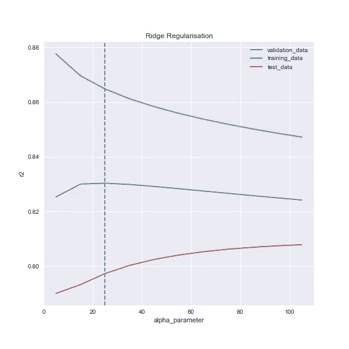
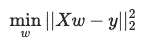
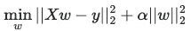
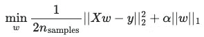
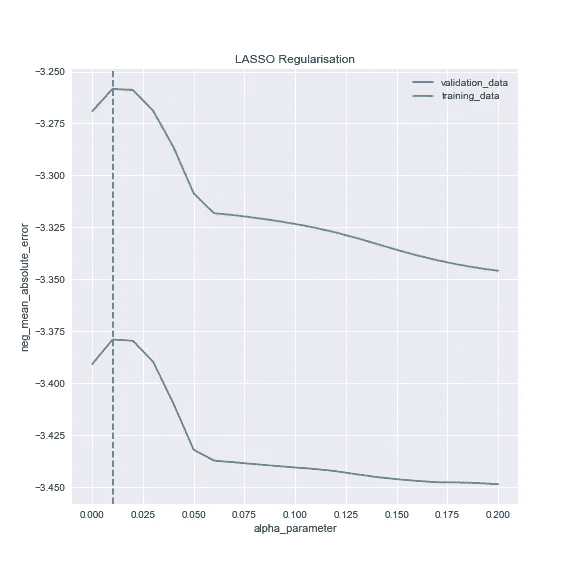
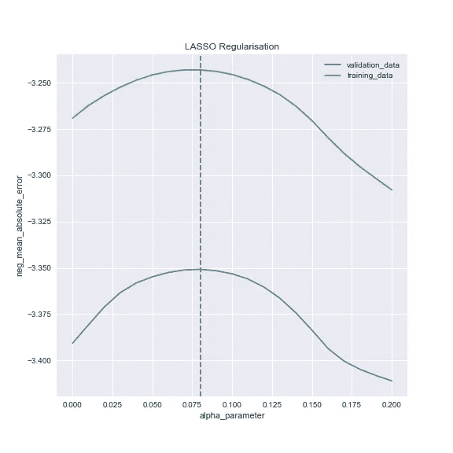
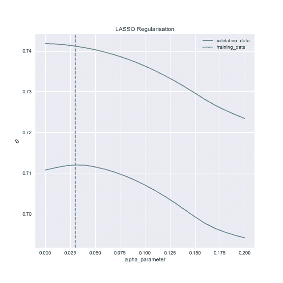
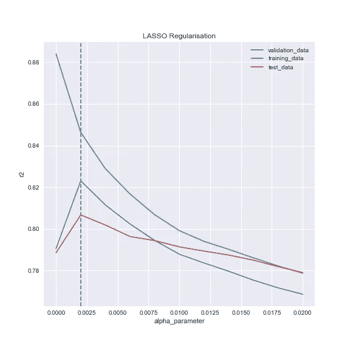

# Lasso 和 Ridge 回归中的超参数调整

> 原文：<https://towardsdatascience.com/hyperparameter-tuning-in-lasso-and-ridge-regressions-70a4b158ae6d?source=collection_archive---------4----------------------->

## 我用来优化正则化参数的方法。scikit-learn 的 Python 指南。



作者图片

在这篇文章中，我们首先来看看套索和岭回归时的一些常见错误，然后我将描述我通常采取的调整超参数的步骤。代码是用 Python 写的，我们主要依靠 [scikit-learn](https://scikit-learn.org/stable/) 。本指南主要关注套索的例子，但基本理论与山脊非常相似。

起初，我并没有真正意识到需要另一个关于这个主题的指南——毕竟这是一个非常基本的概念。然而，当我最近想证实一些事情时，我意识到，很多指南要么非常学术性，要么太简单，要么就是完全错误。一个非常常见的混淆来源是，在 sklearn 中，总是有十几种不同的方法来计算同一个东西。

所以，事不宜迟，这里是我对这个话题的 2 美分。

# 快速理论背景

Lasso 和 Ridge 都是正则化方法，它们旨在通过引入惩罚因子来正则化复杂模型。它们在减少过度拟合、处理多重共线性或自动特征工程方面非常出色。这可能看起来违反直觉，但通过使模型更努力地解释训练数据，我们可以更好地理解底层结构，从而更好地概括和更好地拟合测试数据。

## 线性回归

根据 [sklearn](https://scikit-learn.org/stable/modules/linear_model.html#ridge-regression) 的公式，这是在[线性回归](https://scikit-learn.org/stable/modules/generated/sklearn.linear_model.LinearRegression.html#sklearn.linear_model.LinearRegression)模型中最小化的表达式，即所谓的[普通最小二乘法](https://en.wikipedia.org/wiki/Ordinary_least_squares):



线性回归公式

其中 *X* 矩阵为自变量， *w* 为权重系数， *y* 为因变量。

## 山脉

[岭](https://scikit-learn.org/stable/modules/generated/sklearn.linear_model.Ridge.html#sklearn.linear_model.Ridge)回归采用该表达式，并在系数平方的末尾添加一个惩罚因子:



岭公式

这里，α是正则化参数，这是我们要优化的。该模型惩罚较大的系数，并试图更均匀地分配权重。通俗地说，这就是山脊模型的作用:

> X1，我们看到你做得很好，如果不是因为处罚因素，我们会给你很大的压力。然而，X2 只是比你稍微差一点，如果我们在你们两个之间分配权重，我们会得到更低的惩罚，因此总得分会更高。

## 套索

[Lasso](https://scikit-learn.org/stable/modules/generated/sklearn.linear_model.Lasso.html#sklearn.linear_model.Lasso) 做了类似的事情，但是使用权重的绝对值之和(l1 范数)作为惩罚。

*注意:在 sklearn 公式中还有一个* `*n_samples*` *，它是观测值的个数，对于同一个 X 和 y，它应该是不变的，我没有找到为什么会有那个的解释，也许是为了比较不同的模型，如果你有更好的想法，请告诉我。*



套索公式

Lasso 将开始降低不太重要的变量的系数，也有可能将系数降低到 0。通俗地说:

> X1，你对总分的最小贡献被记录下来。然而，根据最新的处罚分数，我们将不得不让你退出回归。把你留在身边不值得。

## 弹性网

值得注意的是，你还可以用一个[弹性网](https://scikit-learn.org/stable/modules/generated/sklearn.linear_model.ElasticNet.html#sklearn.linear_model.ElasticNet)将两种惩罚结合在同一个模型中。你需要优化两个超参数。在本指南中，我们不打算讨论这个选项。

# 使用的库

如果您想遵循代码，这里列出了您需要的所有库:

```
**import** pandas **as** pd
**import** numpy **as** np
**import** matplotlib.pyplot **as** plt
**import** seaborn **as** sns
**from** sklearn.metrics **import** \
    r2_score, get_scorer
**from** sklearn.linear_model **import** \
    Lasso, Ridge, LassoCV,LinearRegression
**from** sklearn.preprocessing **import** \
    StandardScaler, PolynomialFeatures
**from** sklearn.model_selection **import \
   ** KFold, RepeatedKFold, GridSearchCV, \
    cross_validate, train_test_split
```

# 一般提示

在这一节中，我们将讨论一些通用技巧和常见错误，以避免正则化回归。示例使用了波士顿住房数据，您可以从 [Kaggle](https://www.kaggle.com/prasadperera/the-boston-housing-dataset?select=housing.csv) 下载。

处理数据:

```
column_names = \
    ['CRIM', 'ZN', 'INDUS', 'CHAS', 'NOX', 'RM', 'AGE',\
     'DIS', 'RAD', 'TAX', 'PTRATIO', 'B', 'LSTAT', 'MEDV']
data = pd.read_csv("../datasets/housing.csv", \
    header=None, delimiter=r"\s+", names=column_names)
y = data['MEDV']
X = data.drop(['MEDV'], axis = 1)
```

## 提示 1:调整独立变量

正如标题所暗示的:这绝对是调整你的变量以进行正则化回归的必要条件。(正如我们所知，像缩放这样的线性变换对普通线性回归的预测没有影响。)如果你仔细看看这些公式，你就会很清楚为什么你必须为正则化回归进行缩放:如果你的一个变量恰好在一个非常小的范围内，它的系数将会很大，因此，它将会由于惩罚而受到更多的惩罚。反之亦然，一个大范围的变量将得到小的系数，受惩罚的影响较小。套索和山脊都是如此。

假设你做了如下的事情。

(再次说明，这个例子是没有缩放的，**不会产生正确的结果，不要这样做。**另外，请注意，除了缩放之外，还有其他问题，我们将很快返回。)

```
# don't copy!!!cv = RepeatedKFold(n_splits=10, n_repeats=3, random_state=1)
lasso_alphas = np.linspace(0, 0.2, 21)lasso = Lasso()
grid = dict()
grid['alpha'] = lasso_alphas
gscv = GridSearchCV( \
    lasso, grid, scoring='neg_mean_absolute_error', \
    cv=cv, n_jobs=-1)
results = gscv.fit(X, y)print('MAE: %.5f' % results.best_score_)
print('Config: %s' % results.best_params_)
```

这将是结果:

```
MAE: -3.37896
Config: {'alpha': 0.01}
```

然而，如果你事先调整你的`X`变量，你通常会得到一个更好的分数。为了缩放，我们可以使用 sklearn 的 [StandardScaler](https://scikit-learn.org/stable/modules/generated/sklearn.preprocessing.StandardScaler.html) 。这种方法将变量集中在 0 附近，使标准偏差等于 1。

```
sc = StandardScaler()X_scaled = sc.fit_transform(X)
X_scaled = pd.DataFrame(data = X_scaled, columns = X.columns)
```

如果我们在上面的代码块中用`X_scaled`替换`X`，我们会得到:

```
MAE: -3.35080
Config: {'alpha': 0.08}
```

是的，没有太大的改善，但这是由于我们稍后将看到的一些因素。最重要的是，波士顿住房数据是线性回归的一个非常好的定制玩具例子，所以我们不能提高预测那么多。

> **总结**:正则化前使用 StandardScaler 对自变量进行缩放。无需调整因变量。

## 提示№2。:当 Alpha 等于零时…

如果在“套索”和“山脊”中为 alpha 参数选择 0，则基本上是在拟合线性回归，因为在公式的 OLS 部分没有应用惩罚。

由于计算的复杂性，sklearn 文档实际上不鼓励使用 alpha = 0 参数运行这些模型。我还没有遇到过它引起任何计算问题的情况，它总是给出与线性回归模型相同的结果。

> **总结**:挑 alpha = 0 没有意义，那就是简单的线性回归。

## 提示№3:扫完一次不要停下来

在上面的例子中，我们遍历了一组 alphass，尝试了所有的 alpha，并选择了得分最高的一个。然而，就像通常使用 [GridSearchCV](https://scikit-learn.org/stable/modules/generated/sklearn.model_selection.GridSearchCV.html) 时一样，建议进行多次扫描。找到 alpha 值最高的区域，然后进行更细致的检查。

根据我的经验，尤其是 Lasso，选择最低的非零参数是一个常见的错误，而实际上最佳参数是一个小得多的数字。请看后半部分的例子。

*注:当然，我们永远不会用网格搜索法找到实际的最优数，但我们可以足够接近。*

你也可以看到结果。这是未缩放版本的样子:



住房数据，MAE，未按比例

对于每个 alpha，GridSearchCV 都符合一个模型，我们选择了验证数据得分最高的 alpha(例如，[重复文件夹](https://scikit-learn.org/stable/modules/generated/sklearn.model_selection.RepeatedKFold.html)中测试折叠的平均得分)。在这个例子中，你可以看到在 0 和 0.01 之间可能没有一个疯狂的尖峰。当然，这仍然是不正确的，因为我们没有扩展。

这是缩放版本的图:



住房数据，MAE，按比例

再一次，它看起来很好，在 0.07 和 0.09 之间可能没有什么奇怪的事情发生。

> **总结**:情节是你的朋友，观察阿尔法曲线。确保你选择的阿尔法在一个好的“曲线”区域。

## 提示№4:仔细考虑你的评分方法

你可能会尝试用不同的方法来检查你的结果。如前所述，sklearn 通常有一堆不同的方法来计算同一个东西。例如，有一种 [LassoCV](https://scikit-learn.org/stable/modules/generated/sklearn.linear_model.LassoCV.html) 方法将 Lasso 和 GridSearchCV 合二为一。

您可以尝试这样的方法来获得最佳 alpha(在示例中不再使用未缩放的版本):

```
lasso = LassoCV(alphas=lasso_alphas, cv=cv, n_jobs=-1)
lasso.fit(X_scaled, y)
print('alpha: %.2f' % lasso.alpha_)
```

这将返回:

```
alpha: 0.03
```

等等，这不是上面那个 0.08 的阿尔法值吗？是的。差异的原因是什么？LassoCV 使用 R 分数，您不能更改它，而在前面，我们在 GridSearchCV 对象中指定了 MAE(嗯，减去 MAE，但这只是为了最大化并保持一致)。这是我警告过你不要复制的代码:

```
scoring='neg_mean_absolute_error'
```

看到了吧，问题是，sklearn 有几十种评分方法，看看[列表](https://scikit-learn.org/stable/modules/model_evaluation.html)。你当然可以选择比如说 [max_error](https://scikit-learn.org/stable/modules/generated/sklearn.metrics.max_error.html#sklearn.metrics.max_error) 来衡量你的模型的性能。但是，该模型针对平方差进行了优化。我认为使用任何从平方差得到的东西都更加一致。毕竟 LassoCV 用的是 R，所以也许那是个征兆？

这整个*“在一个基础上优化，然后在另一个基础上比较性能”*实际上在上面的图中非常明显。注意绿线在一段时间内是如何增加的。那是训练分数。正常情况下，在我们施加惩罚因子后，它应该不会表现得更好。

通常，这是你会看到的曲线形状。训练数据得分立即下降，验证数据得分上升一段时间，然后下降:



住房数据，R，按比例

> **总结**:使用 R 或其他基于方差的模型作为回归的主要评分。

# 我的方法

在本节中，我将向大家介绍我用来准备数据和拟合正则化回归的方法。

## 准备数据

在得到 *X* 和 *y* 之前，我不会详述数据。我使用这个[美国县国民健康排名](https://www.countyhealthrankings.org/explore-health-rankings/rankings-data-documentation)数据集合中的一个版本来生成下面的结果，但是对于这个例子来说这真的无关紧要。

所以，假设你有一个漂亮干净的 *X* 和 *y* ，下一步是留出一个测试数据集，使用方便的 [train_test_split](https://scikit-learn.org/stable/modules/generated/sklearn.model_selection.train_test_split.html) 。如果您想使结果可重复，选择任意数字作为`my_random_state`。

```
X_train , X_test, y_train, y_test = train_test_split(
    X, y, test_size=1000, random_state=my_random_state)
```

下一步是包含[多项式特征](https://scikit-learn.org/stable/modules/generated/sklearn.preprocessing.PolynomialFeatures.html)。我们将结果保存在`poly`对象中，这很重要，我们稍后会用到它。

```
poly = PolynomialFeatures(
    degree = 2, include_bias = False, interaction_only = False)
```

这将产生变量的所有二次多项式组合。需要注意的是，我们将`include_bias`设置为`False`。这是因为我们不需要截距列，回归模型本身将包含一个截距列。

这就是我们如何转换和重命名 *X* 的方法。它假设您将 *X* 保存在 pandas 数据帧中，并且需要做一些调整来保持列名可用。如果你不想要名字，你只需要第一行。

```
X_train_poly = poly.fit_transform(X_train)
polynomial_column_names = \
    poly.get_feature_names(input_features = X_train.columns)
X_train_poly = \
    pd.DataFrame(data = X_train_poly, 
        columns = polynomial_column_names )X_train_poly.columns = X_train_poly.columns.str.replace(' ', '_')
X_train_poly.columns = X_train_poly.columns.str.replace('^', '_')
```

完成这一步后，下一步就是扩展。既然我们引入了多项式，这一点就更重要了，幅值将是无标度的。

```
sc = StandardScaler()X_train_poly_scaled = sc.fit_transform(X_train_poly)
X_train_poly_scaled = pd.DataFrame( \
        data = X_train_poly_scaled, columns = X_train_poly.columns)
```

棘手的部分来了。如果我们想要使用测试数据集，我们需要应用相同的步骤。

但是，我们不需要再次调整对象。嗯，和`poly`没关系，但是对于`sc`，我们想保留我们以前拟合`X_train_poly`的方法。是的，这意味着测试数据不会完全标准化，这没关系。所以不用`fit_transform`，我们用`transform`。

```
X_test_poly = poly.transform(X_test)
X_test_poly_scaled = sc.transform(X_test_poly)
```

## 功能

您可能想知道如何生成我们上面使用的图。我使用了两个函数，基于上面列出的库。第一个函数绘制一个图:

第二个基本上是一个网格搜索，有一些额外的东西:它也运行测试分数，当然保存情节。

我不想在这里赘述，我认为这是不言自明的，我们稍后会看到如何调用它的例子。

有一件事，我认为很酷:sklearn 有一个 [get_scorer](https://scikit-learn.org/stable/modules/generated/sklearn.metrics.get_scorer.html) 函数，它基于它的 sklearn 字符串代码返回一个 scorer 对象。例如:

```
scorer = get_scorer('r2')
scorer(model, X_test, y_test)
```

现在我们有了一个额外的方法来计算同样的事情。

## 微调

一旦这个过程像这样建立起来，我们需要做的就是运行不同 alpha 数组的函数。

这个过程中有趣的一点是，我们还绘制了测试分数:

1.  取训练数据集和一个 alpha
2.  做交叉验证，保存训练和验证分数；
3.  假设这是我们选择的 alpha，并在整个训练数据上拟合一个没有交叉验证的模型；
4.  计算该模型将在测试数据上获得的分数，并保存测试分数。

这不是你在“现实生活”中会做的事情(除非你做 Kaggle 比赛)，因为现在有可能优化你的测试数据集。我们在此仅包括它来说明模型性能。红线是不同阿尔法的测试分数。

我们还需要一个交叉验证对象，这里没有一个好的答案，这是一个选项:

```
cv = KFold(n_splits=5, shuffle=True, random_state=my_random_state)
```

为了说明我对多步参数搜索的重要性的观点，假设我们想要检查这些 alphas:

```
lasso_alphas = np.linspace(0, 0.02, 11)
```

运行该函数后:

```
chosen_alpha, max_validation_score, test_score_at_chosen_alpha = \
    regmodel_param_test(
        lasso_alphas, X_train_poly_scaled, y_train, 
        cv, scoring = 'r2', model_name = 'LASSO', 
        X_test = X_test_poly_scaled, y_test = y_test, 
        draw_plot = True, filename = 'lasso_wide_search')print("Chosen alpha: %.5f" % \
    chosen_alpha)
print("Validation score: %.5f" % \
    max_validation_score)
print("Test score at chosen alpha: %.5f" % \
    test_score_at_chosen_alpha)
```

结果是:



套索广泛搜索

```
Chosen alpha: 0.00200
Validation score: 0.82310
Test score at chosen alpha: 0.80673
```

这是否意味着我们找到了最优α？你可能会看着图，看到漂亮的尖钉，决定这是足够高的。不完全是。如果我们在更精细的层次上运行它:

```
lasso_alphas = np.linspace(0, 0.002, 11)
```

这是结果，请注意 0.02，最右边的点是我们在前面的图表中的峰值:


套索窄搜索

```
Chosen alpha: 0.00060
Validation score: 0.83483
Test score at chosen alpha: 0.82326
```

如果我们早一点停止，我们会选择一个导致总体测试 R 低 2%的 alpha，我认为这是相当重要的。

## 在我忘记之前…山脊！

对了，帖子的标题里有脊，除了理论介绍，我们还没讨论。

原因很简单:它的工作方式和 Lasso 完全一样，你可能只是想选择不同的 alpha 参数，然后在`model_name`参数中传递‘Ridge’。Ridge 也有同样的问题(我不包括我们搜索 alphas 范围来检查的部分):


岭窄搜索

你会注意到，我们基于蓝线选择的点似乎不再是红线的最佳点。是的，这是真的，但我认为这是一个巧合，它在套索模型中表现得如此之好。

# 摘要

所以你有它，这就是我如何为套索和山脊做超参数调整。我希望你觉得有帮助，要点再说一遍:

*   记得缩放你的变量；
*   α= 0 只是线性回归；
*   当搜索最佳参数时，执行多个步骤；
*   使用基于平方差的分数来衡量绩效。