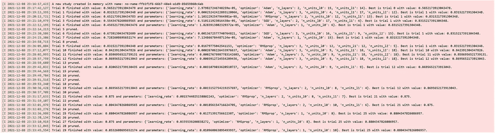

# 基于 Optuna 和 PyTorch 的神经网络超参数调整

> 原文：<https://towardsdatascience.com/hyperparameter-tuning-of-neural-networks-with-optuna-and-pytorch-22e179efc837?source=collection_archive---------2----------------------->

## 如何在 Optuna 帮助下为我们的用例找到完美的神经网络模型


由 [Unsplash](https://unsplash.com/s/photos/knob?utm_source=unsplash&utm_medium=referral&utm_content=creditCopyText) 上的 [Feelfarbig 杂志](https://unsplash.com/@feelfarbig?utm_source=unsplash&utm_medium=referral&utm_content=creditCopyText)拍摄的照片

开发正确的神经网络模型可能非常耗时。

您可能知道，神经网络模型中有许多超参数，我们需要调整它们来获得完美的拟合模型，例如学习率、优化器、批量大小、层中的单元数量、激活函数、辍学率，等等。

问题是，我们事先不知道最适合我们模型的超参数值的组合。

当然，我们可以使用任何超参数的默认值，然后查看模型的性能有多好，然后逐一迭代调整每个超参数的值，以找到最佳组合。

然而，由于以下原因，这显然非常耗时，并且不是非常有效的方法:

*   您需要监控并记录您已经手动尝试过的超参数组合。
*   随着搜索空间的扩大，你很有可能需要进行数百甚至数千次试验，才能得出最佳模型。

为了解决这些问题，我们可以用 Optuna 调整神经网络模型的超参数。

# 什么是 Optuna？

Optuna 是一个 python 库，它使我们能够自动调整我们的机器学习模型。

你基本上可以将 Optuna 与几乎所有可用的机器学习框架一起使用:TensorFlow、PyTorch、LightGBM、XGBoost、CatBoost、sklearn、FastAI 等。

当然，有很多 Python 库可以帮助我们自动调整机器学习模型的超参数。然而，有几个特性使 Optuna 从其他超参数调优库中脱颖而出，我们将在后面讨论。

在本文中，我们将使用 Optuna 来调整 PyTorch 中神经网络模型的超参数。因此，让我们先简单介绍一下我们将在本文中使用的数据集以及获取该数据集的代码。

# 关于数据集

如果你想跟进，你可以下载我们将在这篇关于 Kaggle 的文章中使用的数据集。这个数据集是根据开放数据库许可证(ODbL)许可的，这意味着只要我们引用官方数据源，我们就可以将数据用于我们的目的。

[](https://www.kaggle.com/fedesoriano/heart-failure-prediction) [## 心力衰竭预测数据集

### 预测心脏病事件的 11 个临床特征。

www.kaggle.com](https://www.kaggle.com/fedesoriano/heart-failure-prediction) 

我们的机器学习模型的目标是在考虑每个患者的年龄、性别、胆固醇水平等的情况下，预测患者是否患有心脏病。

数据集本身结合了连续特征和分类特征。我们需要将所有分类特征转换成它们的独热编码表示。

接下来，让我们用 PyTorch 创建一个简单的数据生成器类，在模型训练期间批量获取这个数据集作为神经网络模型的输入。

既然我们已经定义了生成数据的代码，我们就可以用 Optuna 来调优神经网络模型了！作为第一步，让我们了解一下如何使用 Optuna。

# Optuna 入门

要使用 Optuna，请确保首先通过 pip 安装它:

```
pip install optuna
```

每个 Optuna 超参数调整会话称为研究。我们通过调用`create_study`方法来实例化一个学习会话。我们可以将几个重要的参数传递给这个方法，如下所示。

如你所见，我们将变量`direction`和`sampler`作为参数传递给`create_study`方法。

## 方向

`direction`值可以设置为`maximize`或`minimize`，这取决于我们超参数调整的最终目标。

*   如果目标是通过准确性、F1 分数、精确度或召回率等指标来提高绩效，则将其设置为`maximize`。
*   如果目标是减少损失函数，如对数损失、MSE、RMSE 等，则将其设置为`minimize`。

## 取样器

`sampler` value 表示您希望 Optuna 实现哪个采样器方法。有几个采样器选项可供您选择，例如:

*   `GridSampler`:基于定义的搜索空间中的每个组合来选择超参数值的集合。
*   `RandomSampler`:超参数值的集合是从定义的搜索空间中随机选择的。
*   `TPESampler`:这是我们使用 Optuna 时的默认`sampler`。它基于贝叶斯超参数优化，这是一种有效的超参数调整方法。它将像随机采样器一样开始，但该采样器记录了一组超参数值的历史和来自过去试验的相应目标值。然后，它将基于具有来自过去试验的有希望的客观值的集合，为下一次试验建议一组超参数值。

接下来，我们可以在学习中调用`optimize`方法，并将我们的`objective`函数作为参数之一传递。

上面的`n_trials`参数表示您希望 Optuna 执行的研究中的试验次数。

到目前为止，我们还没有创建`objective` 函数。因此，让我们通过首先定义搜索空间来创建我们的`objective`函数。

# 搜索空间定义

在每个超参数调优会话中，我们需要为采样器定义一个搜索空间。搜索空间是采样器从超参数中应该考虑的值的范围。

例如，假设我们想要调整三个超参数:学习率、层的单元数和神经网络模型的优化器。然后，我们可以如下定义搜索空间:

在`objective`函数中，我们传递一个名为`trial`的参数，它来自 Optuna 的`Trial`类。这个类使 Optuna 能够记录一组选定的超参数值，并记录我们的`objective`函数在每次试验中的值(在我们的例子中是精度)。

从上面可以看到，我们将每个超参数的搜索空间定义为一个名为`params`的字典。对于每个超参数，我们用`suggest_*`方法定义搜索空间的范围(最小值和最大值)。

根据超参数的数据类型，`suggest_*`方法有几个扩展:

*   `suggest_int`:如果您的超参数接受整数类型的数值范围。
*   `suggest_categorical`:如果您的超参数接受分类值的选择。
*   `suggest_uniform`:如果您的超参数接受一个数值范围，并且您希望对每个值进行均等采样。
*   `suggest_loguniform`:如果您的超参数接受一个数值范围，并且您希望在对数域中对每个值进行均等采样。
*   `suggest_discrete_uniform`:如果您的超参数接受特定区间内的数值范围，并且您希望对每个数值进行均等采样。
*   `suggest_float`:如果您的超参数接受 float 类型的数值范围。这是`suggest_uniform`、`suggest_loguniform`和`suggest_discrete_uniform`的包装方法

# 建立 PyTorch 模型，训练循环，评估目标函数

现在我们可以使用保存在`params`字典中的所选超参数值来构建 PyTorch 模型。接下来，我们将训练模型并评估我们的目标函数，在我们的情况下是准确性。

# 运行超参数调整

我们已经创建了我们的目标函数，我们已经定义了搜索空间，我们已经建立了模型和训练循环，现在我们准备使用 Optuna 运行超参数调优。

要运行超参数调优，我们需要实例化一个`study`会话，调用`optimize`方法，并将我们的`objective`函数作为参数传递。我们已经在上面的“*Optuna*入门”一节中看到了这段代码。

随着超参数优化过程的运行，您将获得以下输出:


作者图片

超参数调整过程完成后，我们可以通过访问`best_trial`方法获取超参数的最佳组合，如下所示:

这就是你开始用 Optuna 调优你的神经网络超参数所需要做的一切！

然而，Optuna 提供了更多的功能，使我们的超参数调整管道更加有效。让我们来看看其中的一些特性。

# 运行定义设计

大多数时候，每当我们构建一个神经网络时，我们不希望仅仅调整一层中的单元数量，还希望调整层本身的数量。为了达到最佳性能，我们应该在神经网络模型中构建多少层？一层够吗？两个？三个？我们永远不会提前知道。

由于其模块化设计，Optuna 允许我们调整层数。这意味着允许用户动态构建搜索空间。

例如，假设我们想要调整神经网络模型中的 a)层数和 b)每层的单元数。我们可以通过实现以下方法来做到这一点:

请注意，我们没有预先为我们的神经网络模型定义任何特定的层数，也没有定义一层中的单元数。

相反，算法会在每次试验中选取特定的层数，然后选取每层中的单元数，然后建立相应的神经网络。所有过程都是以动态的方式完成的。

您可以将这一概念应用于更高级的神经网络层，例如卷积层。

# 修剪机制

我们知道超参数调整是一个耗时的过程，尤其是当我们有大量的超参数选择和搜索空间时。为了节省我们的时间，Optuna 提供了一个修剪机制特性。

这种修剪所做的是，它将在训练过程的早期阶段终止没有希望的试验，这样我们就不需要浪费时间和资源。

有几种修剪方法可用于 Optuna，它们是:

*   `MedianPruner`:如果当前试验的中间值(在我们的例子中是准确度)比相同训练时期的先前试验的中间值差，这将修剪试验。
*   `PercentilePruner`:如果当前试验的中间值在相同训练时期的试验的最低百分位数中，这将删除试验。
*   `SuccessiveHalvingPruner`:这是一种基于 [**中实现的逐次二等分算法(SHA)的剪枝策略。原理是，该算法通过将试验的数量减少到一半(通过修剪无希望的试验)，将更多的时期分配给有希望的试验。**](https://blog.ml.cmu.edu/2018/12/12/massively-parallel-hyperparameter-optimization/)
*   `HyperbandPruner`:这是一个修剪策略，将使用不同数量的超参数值集运行几次连续减半。

将特定的修剪程序集成到我们的代码中非常简单。首先，我们需要添加`pruner`变量作为参数，并在使用`create_study`创建学习会话时使用我们首选的修剪方法对其赋值，如下所示:

接下来，我们通过在每个训练步骤结束时调用`report`和`should_prune`方法来激活修剪程序。对于 PyTorch 中的神经网络，在训练循环的每个时期后调用这些方法，如下所示:

# 通过运行定义设计和普鲁纳实现代码

下面是在我们集成了修剪机制和运行定义设计来调整我们的神经网络中的层数之后，整个超参数调整过程的完整代码实现。

在你运行这项研究后，你会注意到我们的神经网络的层数和每层的单元数在不同的试验中是不同的。此外，为了加速超参数调整过程，一些不被看好的试验被删除了。



作者图片

和以前一样，我们可以用`best_trial`方法访问最佳试验的超参数。

Optuna 还有一个非常有用的特性我们可以使用，那就是可视化特性。

# 调谐过程的可视化

Optuna 提供了一个特性，使我们能够在调优过程结束后可视化该过程的历史。我们现在将介绍其中一些。

第一个可视化是每个训练步骤中每个试验的目标函数(在我们的例子中是准确性)的图。


作者图片

从上面的可视化可以看出，几个没有希望的试验在第一步就被修剪掉了，因为它们的准确性非常低。

您还可以按如下方式可视化优化历史:


作者图片

这种可视化有助于了解哪个试验是最佳试验，以及其他试验的客观价值与最佳试验相比如何。由于修剪机制，在特定试验中会丢失几个数据点。

接下来，我们有平行坐标图:


作者图片

如果您有大量的超参数和搜索空间，平行图可能很难看到和解释。然而，如果我们有合理数量的超参数和搜索空间，这个图将是有用的。我们可以在每一行中看到超参数的值组合以及它们在我们的目标函数上的表现。

Optuna 还使我们能够绘制超参数重要性，如下图所示:


作者图片

该图向我们展示了每个超参数对提高目标函数得分的重要性。以上面的可视化为例，结果表明第一层中的单元数量是最重要的超参数，而层数是不太重要的超参数。

该图对于提高调优过程的效率非常有用，尤其是在有大量超参数可供选择的情况下。

作为第一项研究，您可以运行大约 50 次超参数调整，然后检查哪些超参数是最重要的。接下来，您可以在第二次研究中省略不太重要的超参数，这可以节省您的时间和资源。

# 结论

在这篇文章中，我们逐步讲解了如何使用 Optuna 和 PyTorch 来调整神经网络模型的超参数。

我们已经看到，运行定义设计、修剪机制和一些可视化选项是使用 Optuna 进行超参数调优的主要好处。

我希望这篇文章能帮助你开始使用 Optuna，如果你想看这篇文章中的完整代码实现，你可以随时参考 [**这本笔记本**](https://github.com/marcellusruben/medium-resources/blob/main/Optuna/Optuna.ipynb) 。

# 数据集引用

[1]费德索里亚诺。(2021 年 9 月)。心力衰竭预测数据集。于 2021 年 12 月 14 日从 https://www.kaggle.com/fedesoriano/heart-failure-prediction[取回。](https://www.kaggle.com/fedesoriano/heart-failure-prediction)