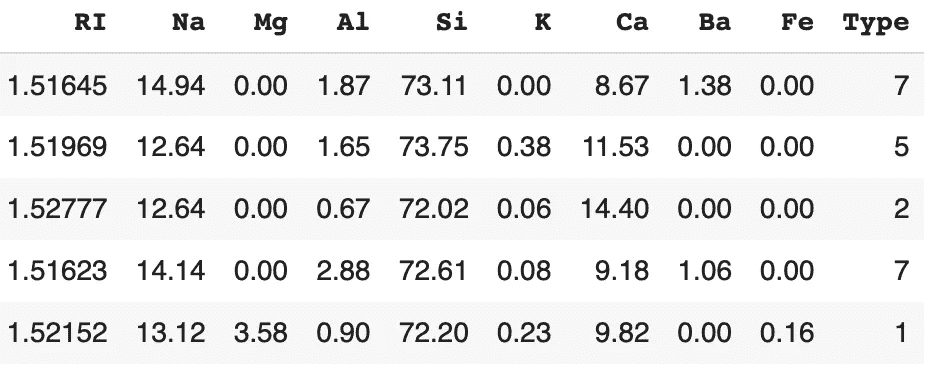
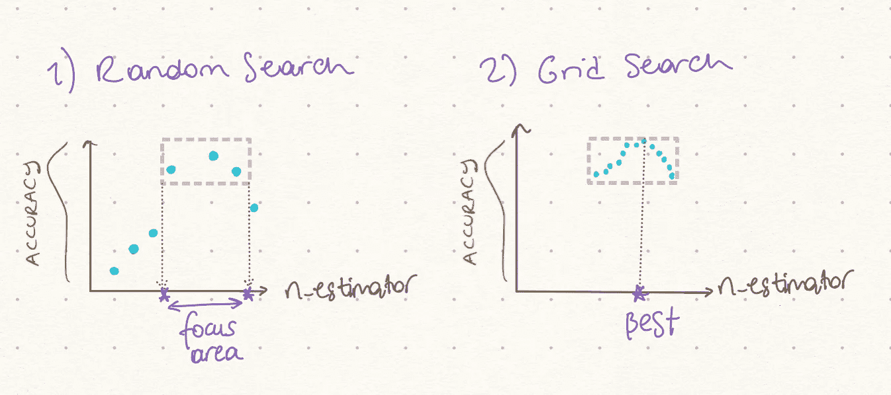

# 基于网格搜索和随机搜索的超参数调谐

> 原文：<https://towardsdatascience.com/hyperparameter-tuning-with-grid-search-and-random-search-6e1b5e175144?source=collection_archive---------5----------------------->

## 并深入探讨如何将它们结合起来


[来源](https://unsplash.com/@joshstyle?utm_source=medium&utm_medium=referral)

**超参数调整**也称为超参数优化，是任何机器学习模型训练中的重要步骤，直接影响模型性能。

本文涵盖了两种非常流行的超参数调优技术:**网格搜索**和**随机搜索**，并展示了如何将这两种算法与**从粗到细的调优结合起来。到本文结束时，你将知道它们的工作原理和主要区别，这将帮助你自信地决定使用哪一种。**

在阅读本文的同时，我鼓励您查看我的 GitHub 上的 J [upyter 笔记本，以获得完整的分析和代码。🌠](https://github.com/Idilismiguzel/Machine-Learning/blob/master/Hyperparameter_Tuning/Hyperparameter_Tuning_Grid_RandomSearch.ipynb)

# 背景

**超参数**是在训练之前**定义的参数** **，用于指定我们希望模型训练如何进行。我们可以完全控制超参数设置，这样我们就可以控制学习过程。**

例如，在随机森林模型中`n_estimators`(我们想要的决策树数量)是一个超参数。它可以设置为任何整数值，但是当然，设置为 10 或 1000 会显著改变学习过程。

**参数**、**、**相反，**、**是在训练时发现的**。我们无法控制参数值，因为它们是模型训练的结果。例如，在线性回归*中，系数*和*截距*是在模型训练结束时找到的参数。**

为了学习模型超参数和它们的值，我们可以简单地在 Python 中调用`get_params`。🔍

```
from sklearn.ensemble import RandomForestClassifier# Instantiate the model
rf_model = RandomForestClassifier()# Print hyperparameters
rf_model.get_params
```

> RandomForestClassifier(**bootstrap**= True，**CCP _ 阿尔法** =0.0， **class_weight** =None， **criterion** = '基尼'， **max_depth** =None， **max_features** = '自动'， **max_leaf_nodes** =None， **max_samples** =None，**min _ infinity _ decrease【T11**

如您所见，随机森林分类器有许多超参数，如果模型在没有定义超参数的情况下被实例化，那么它将有默认值。在随机森林中，默认情况下，n_estimators=100，这将产生一个中等大小的森林。(只有 100 棵树🌳)

您需要知道，在任何模型中(在本例中为随机森林),一些超参数比其他超参数更重要，例如:

```
**n_estimators**: Number of decision trees
**max_features**: Maximum number of features considered while splitting
**max_depth**: Max depth of the tree
**min_samples_leaf**: Minimum number of data points in a leaf node
**bootstrap**: Sampling with or without replacement
```

一些超参数不影响模型性能，例如:

```
**n_jobs**: Number of jobs to run in parallel
**random_state**: Seed
**verbose**: Printing information while training continues
**oob_score**: Whether or not to use out-of-bag samples
```

最后，**超参数调整**是根据定义的评分标准，寻找能够提供最佳性能的最佳超参数组合。

# 数据和初始模型

在本文中，我们将使用来自 UCI 的[玻璃识别数据集，其中我们有 9 个属性来预测玻璃的类型(从 7 个离散值中)。](https://www.kaggle.com/uciml/glass)



来自数据的 5 个随机行

接下来，我将分离 X 和 y，并生成训练集和测试集。

```
# Seperate X and yX = df.drop(columns=['Type'], axis=1)
y = df['Type']# Generate training and test sets for X and yX_train, X_test, y_train, y_test = train_test_split(X, y, train_size=0.8, random_state=1)
```

之后，我们简单地运行一个带有默认值的随机森林分类器，并获得测试集的预测。

```
# Instantiate and fit random forest classifierrf_model = RandomForestClassifier()
rf_model.fit(X_train, y_train)# Predict on the test set and call accuracyy_pred = rf_model.predict(X_test)
accuracy = accuracy_score(y_test, y_pred)print(accuracy)
```

> 0.81

如你所见，默认模型的准确率为 81%。现在，我们将了解如何使用网格搜索来优化选定的超参数。

# 网格搜索

网格搜索从定义搜索空间**网格**开始。网格由选定的超参数名称和值组成，并且**网格搜索**彻底搜索这些给定值的最佳组合。🚀

假设我们决定定义以下参数网格来优化我们的随机森林分类器的一些超参数。

```
**param_grid:**
n_estimators = [50, 100, 200, 300]
max_depth = [2, 4, 6, 8, 10]
min_samples_leaf = [1, 5, 10]
max_features = ['auto', 'sqrt']
bootstrap = [True, False]
```

我们将使用 Scikit-Learn 库中的`GridSearchCV`类进行优化。首先要提到的是，网格搜索必须运行并比较 240 个模型(=4*5*3*2*2，所选数值的乘积)。

此外，`GridSearchCV`类可以选择执行[交叉验证](https://scikit-learn.org/stable/modules/cross_validation.html)，将训练和测试数据重新采样到多个文件夹中。通过应用交叉验证，我们使用数据中的每条记录进行训练和测试，而不是在训练和测试时一次性拆分数据集。如果我们决定使用交叉验证(假设有 5 个折叠)，这意味着网格搜索必须评估 1200 (=240*5)个模型性能。

让我们看看`GridSearchCV`类的所有输入参数:

```
*class* sklearn.model_selection.**GridSearchCV**(*estimator*, *param_grid*, *scoring=None*, *n_jobs=None*, *refit=True*, *cv=None*, *return_train_score=False*)
```

我们首先为网格定义一个字典，我们将把它作为 GridSeachCv 的输入。

```
# Define the gridparam_grid = {
'n_estimators': [50, 100, 200, 300],
'min_samples_leaf': [1, 5, 10],
'max_depth': [2, 4, 6, 8, 10],
'max_features': ['auto', 'sqrt'],
'bootstrap': [True, False]}# Instantiate GridSearchCVmodel_gridsearch = GridSearchCV(
estimator=rf_model,
param_grid=param_grid,
scoring='accuracy',
n_jobs=4,
cv=5,
refit=True,
return_train_score=True)
```

如前所述，`estimator`是 RandomForestClassifier(RF _ model ),而`param_grid`是我们上面定义的参数网格。`scoring`是期望的评估指标，比如分类任务的准确性，而`n_jobs`并行执行模型评估，但是如果设置 n_jobs=-1，就要小心了，它使用所有的处理器！由于网格搜索是一种不知情的调优，我们可以利用并行运行的模型，因为它们的结果不会影响其他模型的运行。

设置`refit=True`最终用找到的最佳超参数值重新拟合估计器，因此我们不需要在额外的步骤中对它们进行编码。`cv`定义交叉验证策略和设置`return_train_score=True`我们可以打印模型运行的日志以进行进一步分析。

```
# Record the current time 
start = time()# Fit the selected model
model_gridsearch.fit(X_train, y_train)# Print the time spend and number of models ran
print("GridSearchCV took %.2f seconds for %d candidate parameter settings." % ((time() - start), len(model_gridsearch.cv_results_['params'])))
```

> GridSearchCV 对 240 个候选参数设置耗时 247.79 秒。

```
# Predict on the test set and call accuracyy_pred_grid = model_gridsearch.predict(X_test)
accuracy_grid = accuracy_score(y_test, y_pred_grid)
```

> 0.88

如您所见，简单地调整一些超参数将初始准确性从 81%提高到 88%,花费 247 秒来调整超参数。

网格搜索总是找到网格中提到的具有超参数值的最佳执行模型。它也很容易实现和解释。然而，随着要测试的超参数和值数量的增加，它很容易变得计算昂贵，因为它对超参数的所有组合进行建模。不从已经运行的模型中学习的缺点使得网格搜索低效且耗时。此外，参数网格起着极其重要的作用:即使网格搜索总是能找到最佳组合，但如果参数网格选择不当，最佳组合的性能也不会很好。

运行 GridSeachCV 后，我们可以返回以下属性以供进一步研究:

*   **cv_results_**
*   **最佳估算者 _**
*   **最好成绩 _**
*   **best_params_**

让我们来看看其中的一些:

```
print(model_gridsearch.best_params_)
```

> {'bootstrap': True，' max_depth': 10，' max_features': 'sqrt '，' min_samples_leaf': 1，' n_estimators': 300}

```
print(model_gridsearch.best_estimator_)
```

> RandomForestClassifier(bootstrap = True，CCP _ 阿尔法=0.0，class_weight=None，criterion= '基尼'，max_depth=10，max_features='sqrt '，max_leaf_nodes=None，max_samples=None，min _ infinity _ decrease = 0.0，min_samples_leaf=1，min_samples_split=2，min_weight_fraction_leaf=0.0，n_estimators=300，n_jobs=None，oob_score=False，random

# 随机搜索

在随机搜索中，我们为每个超参数定义**分布**，超参数可以统一定义*或使用*采样方法*。与网格搜索的关键区别在于随机搜索，不是所有的值都被测试，测试的值是随机选择的。*

*例如，如果分布中有 500 个值，如果我们输入`n_iter=50`，那么随机搜索将随机抽取 50 个值进行测试。通过这样做，随机搜索优化了时间花费，并且不定义绝对网格允许它探索给定分布中的其他值。*

*由于随机搜索并不尝试每个超参数组合，它不一定返回最佳性能值，但它会在*显著*更短的时间内返回相对较好的性能模型。⏰*

```
***param_distributions**
n_estimators = list(range(100, 300, 10))
min_samples_leaf = list(range(1, 50))
max_depth = list(range(2, 20)
max_features = ['auto', 'sqrt']
bootstrap = [True, False]*
```

*`RandomizedSearchCV`从 Scikit-Learn 有以下输入参数:*

```
**class* sklearn.model_selection.**RandomizedSearchCV**(*estimator*, *param_distributions*, *n_iter=10*, *scoring=None*, *n_jobs=None*, *refit=True*, *cv=None*, *verbose=0*, *pre_dispatch='2*n_jobs'*, *random_state=None*, *error_score=nan*, *return_train_score=False*)*
```

*我们首先为参数分布定义一个字典，它将成为 RandomizedSearchCV 的输入。*

```
*# specify distributions to sample fromparam_dist = {
'n_estimators': list(range(50, 300, 10)),
'min_samples_leaf': list(range(1, 50)),
'max_depth': list(range(2, 20)),
'max_features': ['auto', 'sqrt'],
'bootstrap': [True, False]}# specify number of search iterationsn_iter = 50# Instantiate RandomSearchCVmodel_random_search = RandomizedSearchCV(
estimator=rf_model,
param_distributions=param_dist,
n_iter=n_iter)*
```

*大多数参数与 GridSearchCV 相似，然而，在 RandomizedSearchCV 中，我们有`param_distributions`来定义搜索分布。`n_iter`用于限制模型运行的总数(换句话说，从网格中取样的参数组合)。这里要小心权衡，因为设置 ***高 n_iter*** 增加搜索运行时间，设置 ***低 n_iter*** 降低模型质量。*

```
*# Record the current time 
start = time()# Fit the selected model
model_random_search.fit(X_train, y_train)# Print the time spend and number of models ran
print("RandomizedSearchCV took %.2f seconds for %d candidate parameter settings." % ((time() - start), len(model_random_search.cv_results_['params'])))*
```

> *RandomizedSearchCV 对 50 个候选参数设置耗时 64.17 秒。*

```
*# Predict on the test set and call accuracyy_pred_random = model_random_search.predict(X_test)
accuracy_random = accuracy_score(y_test, y_pred_random)*
```

> *0.86*

*正如你所看到的，仅在 64 秒内，我们就能将初始模型的准确率从 81%提高到 86%。随机搜索没有达到网格搜索 88%的准确率，然而，这是两种调优方法之间的权衡。*

*最后，让我们看看用随机搜索找到的最佳参数。*

```
*print(model_random_search.best_params_)*
```

> *{'n_estimators': 230，' min_samples_leaf': 4，' max_features': 'auto '，' max_depth': 13，' bootstrap': False}*

# *粗调至微调*

*从文章开始，我们已经看到了如何应用网格搜索和随机搜索进行超参数优化。*

*使用网格搜索，我们能够测试网格中给定的所有超参数值，从中找出最佳值。然而，超参数数量的增加很容易成为瓶颈。理想情况下，我们可以结合网格搜索和随机搜索来防止这种低效率。*

*在从粗到细的调整中，我们从随机搜索开始，为每个超参数找到有希望的值范围。例如，如果随机搜索在 150 到 200 之间返回高性能，这是我们希望网格搜索关注的范围。使用随机搜索获得每个超参数的焦点区域后，我们可以相应地定义网格进行网格搜索，以找到其中的**最佳**值。*

**

*作者图片*

*在上图中，我们首先随机测试值，通过随机搜索找到一个焦点区域。其次，我们正在用网格搜索测试这个重点区域中的所有值，并最终找到最佳值。*

# *奖金*

*另一个微调机器学习模型的有用策略是使用 [**集成学习**](/practical-guide-to-ensemble-learning-d34c74e022a0) 技术。与超参数调整不同，集成学习旨在通过将多个模型组合成一个组模型来提高模型性能。这种群体模式旨在比每个单独的模式表现得更好。最常用的集成学习方法是**投票、bagging、boosting** 和**堆叠**，如果你想了解更多或更新你的知识，你可以[阅读我关于这个主题的文章](/practical-guide-to-ensemble-learning-d34c74e022a0)。🐬*

# *结论*

*在本文中，我们使用了一个随机森林分类器，使用 9 种不同的属性来预测“玻璃的类型”。具有默认超参数值的初始随机森林分类器在测试中达到 81%的准确度。使用网格搜索，我们能够在 247 秒内调整选定的超参数，并将准确性提高到 88%。接下来，我们使用随机搜索做了同样的工作，在 64 秒内，我们将准确率提高到了 86%。最后但同样重要的是，我们讨论了从粗到细的调优，以结合这两种方法并从两者中获得优势！*

*我希望您喜欢阅读关于超参数调优的文章，并发现这篇文章对您的分析有用！*

**如果你喜欢这篇文章，你可以* [***在这里阅读我的其他文章***](https://medium.com/@idilismiguzel)**和* [***关注我上媒***](http://medium.com/@idilismiguzel/follow)*如果有任何问题或建议，请告诉我。✨***

***喜欢这篇文章吗？ [**成为会员求更！**](https://idilismiguzel.medium.com/membership)***