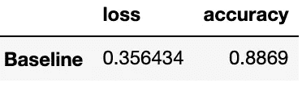
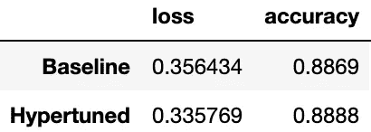
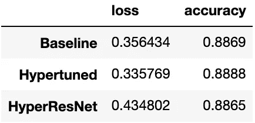

# 使用 KerasTuner 和 TensorFlow 进行超参数调谐

> 原文：<https://towardsdatascience.com/hyperparameter-tuning-with-kerastuner-and-tensorflow-c4a4d690b31a?source=collection_archive---------4----------------------->

## 了解使用 KerasTuner 和 TensorFlow 优化模型架构和超参数的最佳实践


图片由 Zoltan·塔西在[宣传片](https://unsplash.com/photos/CLJeQCr2F_A)上拍摄

构建机器学习模型是一个迭代过程，涉及优化模型的性能和计算资源。您在每次迭代中调整的设置被称为*超参数*。它们支配着训练过程，并在训练过程中保持不变。

搜索最佳超参数的过程被称为*超参数调整*或*超调整*，在任何机器学习项目中都是必不可少的。超调通过移除不必要的参数(例如，密集层中的单元数量)来帮助提高性能并降低模型复杂性。

有两种超参数:

1.  *影响模型架构的模型超参数*(例如，DNN 中隐藏层的数量和宽度)
2.  *影响训练速度和质量的算法超参数*(如学习率和激活函数)。

即使在浅层 DNN 中，超参数组合的数量也可能增长得惊人地大，导致手动搜索最优集合根本不可行也不可扩展。

这篇文章将向您介绍 Keras Tuner，这是一个自动化超参数搜索的库。我们将构建并比较在时尚 MNIST 数据集上训练的三个深度学习模型的结果:

*   具有预选超参数的基线模型
*   超带算法优化超参数
*   具有贝叶斯优化的调整的 ResNet 架构

你可以点击查看 jupyter 笔记本[。](https://github.com/lukenew2/ds-demos/blob/master/notebooks/hypertuning_kerastuner.ipynb)

# 导入和预处理

让我们首先导入所需的模块并打印它们的版本，以防您想要复制笔记本。我们使用的是 tensor flow 2 . 5 . 0 版和 kera stuner 1 . 0 . 1 版。

```
import tensorflow as tf
import kerastuner as ktfrom tensorflow import kerasprint(f"TensorFlow Version: {tf.__version__}")
print(f"KerasTuner Version: {kt.__version__}")>>> TensorFlow Version: 2.5.0
>>> KerasTuner Version: 1.0.1
```

我们将从加载[时尚 MNIST 数据集](https://github.com/zalandoresearch/fashion-mnist)开始。目标是训练一个机器学习模型来对不同的服装图像进行分类。

由于图像是灰度的，这意味着每个像素值代表一个 1 到 255 之间的数字，我们可以将每个像素除以 255 来归一化 0 到 1 之间的值。这样会让训练收敛的更快。

# 基线模型

如前所述，我们将首先用预选的超参数训练一个浅层密集神经网络(DNN ),为我们提供一个基准性能。我们稍后会看到简单的模型，像这个浅层 DNN，如何需要一些时间来调整。

注意我们如何在上面的代码中硬编码所有的超参数。这些包括隐藏层的数量(在我们的例子中有 1 个隐藏层)，隐藏层中的单元数量(512)，它的激活函数(ReLu)，以及退出百分比(0.2)。我们将在下一节中调整所有这些超参数。

让我们来设置优化器、损失和指标。我们稍后将调整的另一个超参数是学习率，但现在我们将它设置为 0.001。

定义好模型的设置后，我们就可以开始训练了！我们将把周期数设置为 20，如果 5 个周期后性能没有提高，就使用提前停止来中断训练。

最后，我们想看看我们的模型在测试集上的表现，因此我们将定义一个助手函数来轻松显示结果。



图一。基线评估结果|作者图片

这是一组超参数的结果。想象一下，尝试不同的学习率、辍学率、隐藏层的数量以及每个隐藏层中的神经元数量。如您所见，手动超调根本不可行，也不可扩展。在下一节中，您将看到 Keras Tuner 如何简单地通过自动化过程和以有效的方式搜索超参数空间来解决这些问题。

# Keras 调谐器

Keras Tuner 是一个简单的、可分发的超参数优化框架，它自动化了手动搜索最佳超参数的痛苦过程。Keras Tuner 带有随机搜索、超波段和贝叶斯优化内置搜索算法，旨在适应多种使用情况，包括:

*   分布式调谐
*   定制培训循环(例如，GANs、强化学习等。)
*   在模型建立功能(预处理、数据扩充、测试时间扩充等)之外添加超参数。)

这些过程超出了本文的范围，但是可以随意阅读更多的官方文档。

使用 Keras 调谐器超调浅 DNN 有四个步骤:

1.  定义模型
2.  指定要优化的超参数
3.  定义搜索空间
4.  定义搜索算法

## 定义模型

我们为超调建立的模型被称为*超模*。我们在构建超模型时定义了超参数搜索空间。

有两种方法可以建立一个超级模型:

1.  通过使用模型构建器功能
2.  使用 Keras Tuner API 的[超模子类](https://keras.io/guides/keras_tuner/getting_started/#you-can-use-a-hypermodel-subclass-instead-of-a-modelbuilding-function)

我们将使用第一种方法来定义模型构建函数中的 DNN。您会注意到超参数是如何内联定义的。我们的模型构建函数使用定义的超参数来返回编译后的模型。

## 指定要优化的超参数

我们将构建的模型与我们之前训练的浅层 DNN 非常相似，只是我们将调整模型的四个超参数:

*   隐藏层的数量
*   每个隐藏层中的单元数
*   每个隐藏层后的下降百分比
*   Adam 优化器的学习率

## 定义搜索空间

这是通过将一个超参数对象作为参数传递给模型构建函数来实现的，该函数配置您想要优化的超参数。在我们的函数中，我们将使用:

*   惠普。Int()来定义隐藏层的数量和每个隐藏层中的单元的搜索空间。这允许您定义最小值和最大值，以及增量的步长。
*   惠普。Float()定义辍学百分比的搜索空间。这个和惠普差不多。Int()，只不过它接受浮点值。
*   惠普。Choice()来定义学习率的搜索空间。这允许您定义离散值。

有关所有可用方法及其用法的更多信息，请访问[官方文档](https://keras.io/api/keras_tuner/hyperparameters/)。

## 定义搜索算法

在构建了模型构建器函数之后，我们可以实例化调谐器并指定搜索策略。对于我们的用例，我们将使用超波段算法。Hyperband 是一种新颖的基于 bandit 的方法，专门用于超参数优化。[研究论文](https://jmlr.org/papers/v18/16-558.html)发表于 2018 年，详细描述了一个通过自适应资源分配和提前停止快速收敛于高性能模型的过程。

这个想法很简单，Hyperband 使用了一个体育锦标赛风格的支架，并从搜索空间中随机选择大量具有随机超参数排列的模型开始。每个模型被训练几个时期，只有表现最好的一半模型进入下一轮。

要实例化我们的调谐器，我们需要定义以下超参数:

*   我们的超级模型(由我们的模型生成器函数构建)
*   目标(方向(最小或最大)将为内置指标自动推断——对于自定义指标，我们可以使用 kerastuner。目标)
*   因子和 max_epochs 用于通过取 max_epochs + 1 的对数基础因子来计算每个括号中的模型数量。这个数字被向上舍入到最接近的整数。
*   超带迭代用于控制您愿意分配给超调的资源预算。Hyperband iterations 是迭代整个搜索算法的次数。
*   在超参数搜索过程中，目录保存每次试运行的日志和检查点，允许我们从上次停止的地方继续搜索。您可以通过设置额外的超参数“overwrite”= True 来禁用此行为。
*   Project_name 用于与其他运行区分开，是目录下的子目录。

请参考[官方文档](https://keras.io/api/keras_tuner/tuners/hyperband/)中所有可用参数的列表。

我们可以看到搜索空间摘要:

当指标没有改善时，我们可以设置像提前停止这样的回调来提前停止训练。

我们开始搜索吧。

搜索结束后，我们可以得到最好的超参数，并重新训练模型。

然后我们将在测试集上评估我们的超调模型！



图二。超调模型评估|作者图片

通过超调，我们发现了一种比我们的基线模型少 100，000 个参数的架构，它在测试集上的性能略好。如果我们对 hyperband 算法进行更多的迭代，我们很可能会找到一个性能更好的架构。

# 超级网络

除了定义我们自己的超模型，Keras Tuner 还提供了两个预定义的可调模型，HyperXception 和 HyperResnet。这些模型搜索以下架构和超参数:

*   模型的版本
*   卷积层的深度
*   联营
*   学习率
*   最优化算法

让我们看看如何将 HyperXception 或 HyperResnet 与我们的调谐器一起使用。

我们在 HyperResnet 模型中指定输入形状和类的数量。这次我们将使用贝叶斯优化作为我们的搜索算法，它通过聚焦于更有希望的区域来搜索超参数空间。此外，我们使用不同的 project_name，以便我们的调音师可以区分之前的运行。

接下来，我们必须对数据进行预处理，以符合 HyperResnet 的要求。HyperResnet 希望要素的形状与卷积图层和一次性编码标注的形状相同。

使用下面的小代码块，我们可以开始搜索。

同上，我们可以得到最好的超参数，并重新训练模型。

最后，我们将在测试集上评估模型。



图 3。HyperResNet 模型评估|作者图片

在生产环境中，我们需要考虑的不仅仅是测试集的准确性。最佳部署选项是我们的超调 DNN，因为它在测试集上表现稍好，并且参数最少。

# 总结

超调是机器学习管道的重要组成部分。在这篇文章中，我们训练了一个基线模型，展示了为什么手动搜索最佳超参数是困难的。我们深入探讨了 Keras Tuner 以及如何使用它来自动执行超参数搜索。最后，我们超调了一个预定义的超 Resnet 模型。

感谢阅读！

*请查看我以前发布的更多数据科学项目和教程。*

*我写的是我进入数据科学和机器学习工程的学习历程，请关注并联系我的* [*中*](https://medium.com/@lukenewman_41351) *，* [*LinkedIn*](https://www.linkedin.com/in/lukenewman-/) ，或 [*Github*](https://github.com/lukenew2) *，我们一起学习！*

# 额外资源

<https://blog.tensorflow.org/2020/01/hyperparameter-tuning-with-keras-tuner.html>  <https://keras.io/guides/keras_tuner/>  

## 研究论文

<https://jmlr.org/papers/v18/16-558.html> 