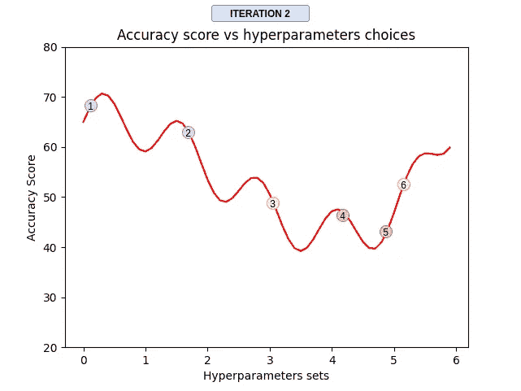
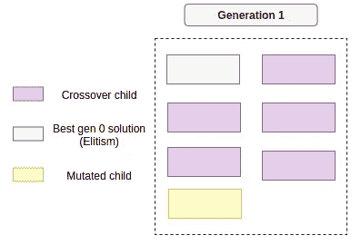

# 您还在使用网格搜索进行超参数优化吗？

> 原文：<https://towardsdatascience.com/hyperparameters-tuning-from-grid-search-to-optimization-a09853e4e9b8?source=collection_archive---------11----------------------->

## 让我们讨论如何以智能的方式搜索机器学习模型的超参数背后的思想。


由[米伊卡](https://unsplash.com/@mluotio83)在[上拍摄的照片](https://unsplash.com/photos/i3WlrO7oAHA)。

当我们训练一个机器学习模型时，我们需要做出一些选择，从哪个模型开始使用，如何准备我们的数据集，如何处理离群值，等等。

其中一个选择是超参数；这些是控制学习过程的参数，但不能由训练本身得出。一些例子是:

*   神经网络中的学习速率、时期和层数/神经元数。
*   随机森林中的树木数量、最大深度和质量标准。
*   来自支持向量机的核、gamma 和 C 值。

随之而来的一些问题是:我应该为这个模型设置什么超参数？默认的够好吗？我是否可以通过尝试更多架构来提高性能？我如何决定尝试哪些选项？所有这些问题都与超参数调整有关[1]。

在这篇文章中，我将讨论:

*   监督模型中超参数调整的标准策略。
*   不明智策略的问题在于。
*   明智策略的权衡。
*   如何实现超参数调整的遗传算法(GA)思想？
*   我们能给 GA 带来什么额外的特性。
*   包含几个实现的 python 包的参考和例子。

如果你想马上获得一些带有示例的代码，你可以查看我在[其他媒体](/tune-your-scikit-learn-model-using-evolutionary-algorithms-30538248ac16)上的帖子。

# **1。基本策略:**

有几个选项可用来找到那些将使您的模型增强的超参数，仅举几个例子:

*   网格搜索
*   随机网格搜索
*   贝叶斯优化
*   遗传算法

网格搜索和随机网格搜索都是我们所谓的“强力方法”，这意味着超参数的选择不是以一种提供信息的方式，而是通过尝试一些选项并希望它有效。

它们的优点是实现简单，并且可以足够快地得到合适的结果，尝试一些组合并基于一些度量选择最佳的，因此对于两个超参数；该过程可能如下所示:


网格布局。图片由 Yoshua Bengio 等人提供。

上图展示了网格和随机网格搜索如何优化一个模型，该模型的得分函数(如 AUC)是绿色和黄色区域的总和，对得分的贡献是区域的高度，因此基本上只有绿色区域对得分有意义。

# **2。将问题可视化**

您可以看到，随机布局在某种程度上优于网格布局，因为它可以探索优化函数的更多不同值，并且由于其中一个参数不重要，网格搜索“浪费”了六个额外的模型，得分没有重要变化，但在这两种情况下，我们都有可能获得接近或远离最佳值的值。

我将把这种表示简化为一维函数，只是为了获得一些直觉:


准确度分数与超参数选择。图片由作者提供。

在上面的图中，红线表示估计量可能达到的交叉验证准确度(或任何其他度量)，圆点是基于准确度分数的超参数的固定选择，因此，例如，如果这是一个神经网络，圆点可以表示以下内容:

```
**dot 1:** {"learning_rate": 0.001, "layers": 5, "optimizer": "Adam"}
**dot 2:** {"learning_rate": 0.01, "layers": 3, "optimizer": "Adagrad"}
**dot 3:** {"learning_rate": 1, "layers": 6, "optimizer": "SGD"}
**dot 4:** {"learning_rate": 0.001, "layers": 8, "optimizer": "RMSprop"}
**dot 5:** {"learning_rate": 0.1, "layers": 20, "optimizer": "SGD"}
```

根据这一点，我们可以得到沿着这条线的任何值，你想得到尽可能高的值，但是通过随机或手动选择点，我们可能会得到也可能不会得到好的结果。

好..我们发现了问题，那么我们如何才能让它变得更好呢？

# 3.信息的方式

我提到的另外两种方法是贝叶斯优化[3]和遗传算法[4]，我们可以说，它们遵循一个信息丰富的标准来做出选择，它们的共同点是，它们遵循一个顺序过程，试图通过它们过去做出的决策来找到一组更好的超参数，所以如果我们认为这是一个迭代过程，它可能看起来像这样:



迭代优化过程。图片由作者提供。

你可以看到，第一次迭代可能会看到一个随机网格会做什么，没关系，我们必须从某个点开始；其思想是聪明地探索超参数的空间，在每次迭代中取得进展，修改要尝试的集合的数量，创建新的集合，等等。

当然，正如数据科学中预期的那样，这不是一个银弹解决方案；可能会出现以下几种情况:

*   **探索与开发的困境:**我是否应该去探索较少的地区，以防错过什么？或者我应该继续尝试我已经知道的显示有希望的结果的区域附近的点？
*   **局部最大:**这是第一种可能的结果；如果我的优化函数是非凸的、非线性的、有噪声的怎么办？，如果我陷入局部最大值，认为这是最好的(全局最大值)解决方案，怎么办？
*   **资源消耗:**正如你所看到的，我们已经把它变成了一个迭代的过程，可能比简单的网格搜索消耗更多的资源。
*   **新参数:**我应该运行多少次迭代？我如何控制探索和开发？，我应该在每次迭代中创建更多的集合吗？，这些不就是我要决定的更多的超参数吗？

希望有几个实现已经(直到某个时候)解决了这些问题，并且这些选择对我们正在优化的分数的最终影响不如机器学习模型本身中超参数的选择敏感。

例如，你可以检查遗传算法方法的 [sklearn-genetic-opt](https://sklearn-genetic-opt.readthedocs.io/en/stable/) 或者贝叶斯方法的 [scikit-optimize](https://scikit-optimize.github.io/stable/modules/generated/skopt.BayesSearchCV.html) 。我将解释遗传算法的方法。

# 4.遗传算法(GA)方法

遗传算法是一种受自然选择启发的元启发式算法；它们通常用于优化和搜索问题，通常基于一组函数，如变异、交叉和选择[2]。我们称之为遗传算子。

在本节中，我将交替使用以下术语来建立遗传算法和机器学习之间的联系:

超参数的一个选择→个体

人口→若干个人

世代→一个包含固定群体的固定迭代

适应值→交叉验证分数

有几种变化，但一般来说，要遵循的步骤如下所示:

1.  生成随机抽样总体(不同的超参数集)；这是第 0 代。
2.  从机器学习的角度评估种群中每个个体的适应度值，得到交叉验证分数。
3.  通过使用几个遗传算子产生新一代。
4.  重复步骤 2 和 3，直到满足停止标准。

我们一步一步来。

**4.1-4.2 创建第 0 代并对其进行评估:**

如上所述，您可以生成一组随机的超参数，或者您可以包含一些您已经尝试过并认为是合适的候选参数的手动选择的超参数。

每个集合通常以染色体的形式被编码，染色体是这个群体的二进制表示；例如，如果我们将第一代的规模设置为三个个体，它将如下所示:


第 0 代。图片由作者提供。

所以在这一代中，我们使用红色箭头表示的编码函数将三个个体映射到一个染色体(二进制)表示中。染色体中的每个方框是一个性别。染色体的一个固定部分是超参数之一。

然后，我们使用显示为紫色箭头的评分函数来获得每个候选人的交叉验证分数(适合度)。

**4.3 创造新一代:**

现在我们可以创建一组新的候选人；如前所述，有几个遗传算子；我将展示最常见的几种:

***交叉:***

这种操作包括取两条亲代染色体并使它们交配以产生新的子代；我们选择亲本的方式可以是通过概率分布函数，该函数将更多的概率给予具有更高适应度的个体，假设个体编号 1 和 3 被选择，那么我们可以从每个亲本中随机选取两个点，并进行交叉，如下所示:


交叉操作。图片由作者提供。

现在孩子代表了一组新的超参数；如果我们解码每个孩子，我们可以得到，例如:

```
**Child 1:** {"learning_rate": 0.015, "layers": 4, "optimizer": "Adam"}
**Child 2:** {"learning_rate": 0.4, "layers": 6, "optimizer": "SGD"}
```

但是在一些迭代之后，在相同的超参数集合上进行交叉可能会给出相似的结果，所以我们会陷入同一种解决方案；这就是为什么我们引入了像变异这样的其他操作。

**突变:**

以足够低的概率(< ~0.1), this operator randomly changes one of the gens or a whole hyperparameter to create more diverse sets.

Let's take, for example, the child one from the previous image; let us pick up random gen and change its value:


Mutant child. Image by the author.

Or it could even change a whole parameter, for example, the optimizer:


Random change in one parameter. Image by the author.

**精英主义:**

这种选择策略指的是选择每一代中最优秀的个体，以确保其信息能够跨代传播。这种策略非常简单，只需根据个体的适应值选择最优秀的 k 个个体，并将其复制到下一代。

所以在执行了那些操作之后，新一代可能看起来像这样:



第一代。图片由作者提供。

从现在开始，重复这个过程几代，直到你满足一个停止标准，例如:

*   已达到最大代数。
*   流程运行时间超过了预算时间。
*   与上 *n* 代相比，性能没有提高(低于阈值)。

下图是我们运行 GA 优化器几代后得到的结果的一个例子；这是一个回归模型，使用带有 r 平方度量的随机森林:


几代人的度量改进。图片由作者提供。

我们可以绘制算法尝试的超参数，如点图，但在这种情况下，遵循最现实的表示，我们可以绘制每个参数的样本值的直方图和与第一个图类似的散点图。


超参数的抽样分布。图片由作者提供。

图中的颜色越深，在该区域适合的不同估计值就越多；“分数”是相同的 r 平方。

因此，在这一点上，问题是，我们如何实现这一点？我必须从头开始做吗？如前所述，已经有几个包可以帮助解决这个问题；我们会看到其中一个的特征。

**注:**我是下面这个包的作者；如果你想进一步了解，投稿或者提出一些建议，可以查看本文末尾的文档和 GitHub 资源库。

# 介绍 Sklearn-genetic-opt

Sklearn-genetic-opt 是一个基于 Python 的包，它使用来自 [DEAP](https://deap.readthedocs.io/en/master/) 包的进化算法来选择一组优化(最大或最小)交叉验证分数的超参数；该软件包可用于回归和分类问题。在这一点上，Sklearn-genetic-opt 与任何 scikit-learn 回归器或分类器(或 Sklearn 兼容的回归器或分类器)兼容。

该软件包具有以下特点:

*   **GASearchCV:** 包的主要类，保存进化交叉验证优化例程，它有一个类似于 scikit-learn GridSeachCV 的 API。
*   **GAFeatureSelectionCV:** 软件包的补充类，它使用与 GASearchCV 相同的进化算法进行特征选择，但通过尝试最小化所使用的特征数量，同时优化 CV 分数，所有这一切都使用一组固定的超参数。
*   **算法:**一组不同的进化算法，用作优化程序。
*   **回调:**定制评估策略，以生成早期停止规则、日志记录或您的定制逻辑。
*   **适配器:**改变参数作为代函数的策略。
*   **图:**生成预定义的图，以了解优化过程。比如最后两个情节就来自于包。
*   **MLflow:** 与 [mlflow](https://mlflow.org/) 的内置集成，用于记录和管理所有超参数、cv 值和拟合模型的生命周期。

因此，它的工作方式是遵循类似于上一节中描述的过程，但它添加了一些额外的功能，如回调、MLflow 日志记录和不同的算法方法；看起来是这样的:


Sklearn-genetic-opt 一般步骤。图片由作者提供。

这就是 MLflow 测井的外观:


Mlflow 日志记录。图片由作者提供。

这是一个如何使用它进行超参数调整的简单示例:

你可以在这篇文章中了解更多关于这个代码的每一部分。

原来如此！感谢您阅读此内容；我希望这有助于思考您的调优策略；以下是最后一个包的相关链接，如果你想查看的话:

**文献:**【https://sklearn-genetic-opt.readthedocs.io/en/stable/ 

【https://github.com/rodrigo-arenas/Sklearn-genetic-opt】储存库:

# 参考

[1][https://en.wikipedia.org/wiki/Hyperparameter_optimization](https://en.wikipedia.org/wiki/Hyperparameter_optimization)

[2][https://www . jmlr . org/papers/volume 13/bergstra 12a/bergstra 12a . pdf](https://www.jmlr.org/papers/volume13/bergstra12a/bergstra12a.pdf)

[3][https://www . cs . Toronto . edu/~ rgrosse/courses/CSC 411 _ f18/tutorials/tut 8 _ ADAMS _ slides . pdf](https://www.cs.toronto.edu/~rgrosse/courses/csc411_f18/tutorials/tut8_adams_slides.pdf)

[https://en.wikipedia.org/wiki/Genetic_algorithm](https://en.wikipedia.org/wiki/Genetic_algorithm)