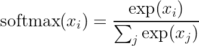
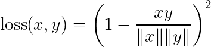

# Softmax 的超球面替代方案

> 原文：<https://towardsdatascience.com/hyperspherical-alternatives-to-softmax-6da03388fe3d?source=collection_archive---------18----------------------->

## 超球面替代品能和 Softmax 竞争吗？


迈克尔·泽兹奇在 [Unsplash](https://unsplash.com?utm_source=medium&utm_medium=referral) 上的照片

在分类问题的上下文中，具有交叉熵损失的 softmax 分类器通常是首选方法。但是，在有许多类的情况下，softmax 的训练速度可能会很慢，因为它要求每个类都有一个输出节点，从而导致输出层非常大。例如，一个隐藏层大小为 300 和 100，000 个输出类的网络仅在输出层就有 3000 万个参数。

在应用人工智能设置中，这些类型的问题经常发生。这方面的一个例子是学习匹配论文与作者，或产品描述与实际产品。虽然这看起来很适合分类问题，但可能的作者或产品的空间如此之大，以至于使用 softmax 训练它不太可能可行。解决这个问题的一个方法是学习或预先定义每个类的原型，例如，原型网络**【1】**。使用这些预定义或学习的原型允许您使用恒定的输出大小，而不管类的数量。

在这篇文章中，我们研究了超球原型网络(HPNs)**【2】**，它承诺了恒定的输出大小，性能与 softmax 网络相当，甚至更好。我们将进一步深入 HPNs 的网络输出和性能之间的关系。我们将证明，虽然 hpn 在相对较低的输出维度下工作良好，但随着类别数量的增加，softmax 的性能大大优于它。**有趣的是，这与我们预期的*正好相反*，这就是为什么我们决定写一篇关于它的博文。**

在深入研究我们令人惊讶的结果之前，我将首先解释一下 softmax 网络和 HPN 网络的一些基础知识。

# Softmax 网络公司

当在单标签分类设置中使用神经网络时，典型的方法是使用 softmax 网络。也就是说，不确定大小和图层的网络具有| **C** |个单位的输出图层，其中 **C** 是输出类的集合，以及 softmax 激活函数:



情商。softmax 激活功能。

Softmax 分类器通常通过最小化网络和目标预测之间的交叉熵来训练。这可以理解为试图相对于不正确的输出单位最大化正确输出的幅度。

由于 softmax 分类器具有 **|C|** 个输出单元，因此对于每个类，softmax 网络的输出层以因子 **H** 增长，其中 **H** 是最后一层中隐藏单元的数量。

# 超球面原型网络

相比之下，超球面原型网络(HPN)**【2】**的输出层具有预定义的固定维度，而不是类的数量。理论上，这意味着 HPN 中输出单元的数量可以比类的数量小得多，这对于大量的类来说是有效的。HPNs 通过**最小化从网络输出到预定义原型的余弦平方距离来学习，而不是交叉熵:**



情商。2:由 HPN 最小化的损失函数

在某种意义上，这需要网络学会将一个实例“旋转”到正确类的原型。注意，这个损失函数只需要正确类的原型，不像例如原型网络，它需要访问所有相关的原型。现在，超球面原型网络的特别之处在于，原型是**静态的**，即在训练期间不更新，并且**正交**。让我们解释一下为什么这两个属性都很重要。

## 深入静态和正交属性

如果原型不是静态的**，上面的损失函数就会变成一个**平凡解**。众所周知，如果一个问题有一个微不足道的解决方案，反向传播就会找到它。为了理解“为什么这变成一个微不足道的解决方案”,考虑损失函数仅仅使网络最小化原型和网络输出之间的距离，但是没有规定代表不同类别的原型应该是不同的。因此，通过输出一个常数矢量(例如一个全零矢量)，并给所有原型分配完全相同的矢量，网络可以完美地解决任何学习问题。如果学习的原型是期望的，例如，对于零次或少次学习，这个问题可以通过**负采样****【3】**来规避。**

**为什么原型应该是**正交的**就不那么明显了。直觉上，属于不同类的两个原型不应该有相同的表示，因为这意味着类是模糊的。所以，不太相似的原型更容易分开。从字面上看，正交表示是最不相似的，因此它们也可以被认为是最优可分的。因此，在某种意义上，表示应该是正交的是不正确的；他们只是表现得更好。在一些设置中，例如零镜头或少镜头分类，具有有意义相关的表示对性能非常有益，例如参见**【1】**。**

**因为正交表示的维度是可控的，所以 HPN 允许输出单元数量的灵活性。如果正交表示的维数等于类的数目，则 HPN 与等效的 softmax 分类器具有相同数目的参数。**

# **创建正交表示**

**制作正交表示似乎很容易，但并不容易。正如**【2】**所指出的，寻找与给定点集正交的点的问题仍然是公开的，并且被称为塔门问题。**【4】****

**本文研究了一种引入超球面原型网络的解决方案。**【2】**简而言之，他们首先随机生成向量，然后，对于每个向量，最小化与最接近向量的余弦相似度，同时在每次迭代后进行重正化。在我们的实施中，我们没有明确地重整，但是我们将 L2 范数的平均偏差从 1 增加到损失。这导致原型是准正交的，而没有显式重正化。与每次迭代后显式规格化相比，这具有导致更低损失的优点，因此平均来说表示更正交。**

**注意，通过反向投影来训练这些表示是相对有效的，但是它仍然会花费很长时间，特别是如果我们试图在低维空间中打包许多表示，例如，将 100，000 个表示打包到 100 维空间中。**

**为了显示生成正交表示的有效性，我们还比较了从 N 维正态分布采样的随机生成的表示。随着维数的增加，高维随机向量变得越来越随机，但永远不会真正正交。因此，随机生成的表示和训练的表示之间的任何分数差异显示了正交化过程的附加值。**

# **实际的实验**

**我们特别感兴趣的是一方面在类别的维度和数量之间的权衡，另一方面在性能、训练和推理速度之间的权衡。与高维正交原型相反，低维正交原型的训练速度更快，但可能会牺牲性能。**

**为了测试 softmax 和 HPN 网络之间的差异，我们使用了两个相同的网络，由两个具有批量归一化、校正线性单元激活、丢失和 300 个隐藏单元的隐藏层组成。网络之间的唯一区别是顶层。在 softmax 的情况下，这是具有(300， **|C|** )个单位的线性层，而在 HPN 的情况下，该层的大小取决于正交原型的输出维度。使用 ADAM 优化器**【5】**对所有网络进行优化，学习率为 1e-3，使用固定验证集上的早期停止。**

**我们生成 5 个不同的数据集，分别有 10、100 和 1000 个类。对于每个数据集中的每个类，我们通过从区间[-1，1]均匀采样 300 维表示来定义中心。对于每个中心，我们从正态分布中抽取样本，样本的中心和标准差取决于类别的数量。标准偏差列于表 1。**

```
.--------------------.----.-----.------.
|     n classes      | 10 | 100 | 1000 |
:--------------------+----+-----+------:
| standard deviation |  3 | 2.5 | 1.25 |
'--------------------'----'-----'------'
*Table 1: the standard deviations for the different numbers of classes*
```

**对于每个数据集，我们还分别生成 3 组 10、100 和 1000 维的原型。这些原型集允许我们研究输出维度对性能的影响。我们还尝试使用 1000 多个类(10，000 和 100，000)，但是为这些类创建正交原型花费了太长时间，比训练网络要长得多。**

# **结果**

## **表演**

**表 2 中列出了测试集的 F 分数，是五次运行的平均值。请注意，只有原型维度与类的数量一样多的模型才能与 softmax 模型相媲美。**

**对于 10 级和 100 级，HPNs 的表现往往与 softmax 模型相当，而对于 1000 级模型，HPN 表现不佳。增加原型的维度只会导致分数的边际增加，这表明对性能的上限效应。一旦你有了足够的工作空间，增加更多的空间并没有多大作用。**

**比较随机生成的原型和优化的原型可以发现一些有趣的模式。对于相应的维度，即 10 个类的 10 维原型，选择随机化的原型会降低性能。然而，当转向更高维的原型时，这种性能差异就消失了。重温上面的比喻:如果维度足够高，即使随机化的原型也为模型提供了足够的工作空间。因为从正态分布中生成随机样本几乎不需要时间，这对于许多类的问题来说可能是有趣的，在这些类中生成真正正交的原型是不可行的。**

```
.-----------.---------.------.------.------.-------.------.-------.
| n classes | softmax |  10  | 100  | 1000 |  r10  | r100 | r1000 |
:-----------+---------+------+------+------+-------+------+-------:
|        10 |    91.3 | 91.2 | 92.6 | 92.5 | 78.22 | 92.5 |  92.8 |
:-----------+---------+------+------+------+-------+------+-------:
|       100 |    84.5 | 72.9 | 86.0 | 85.3 |  73.6 | 85.7 |  86.1 |
:-----------+---------+------+------+------+-------+------+-------:
|      1000 |    83.8 | 15.8 | 58.3 | 47.3 |  14.9 | 54.3 |  47.3 |
'-----------'---------'------'------'------'-------'------'-------'
*Table 2: The F-scores on the test set for classes and various models. r stands for “random”*
```

## **速度**

**每个时期的速度对所有模型都是可比较的。这是令人惊讶的，因为我们预计随着类别数量的增加，与余弦相似性相比，softmax 会变慢。类似地，在收敛之前的历元数之间也有明显的差异，但前提是类别数等于原型的维数。表 3 总结了一些例子。**

```
.-------------------------.----.-----.------.
|        n classes        | 10 | 100 | 1000 |
:-------------------------+----+-----+------:
| softmax                 | 50 | 146 |  181 |
:-------------------------+----+-----+------:
| HPN dim == n_prototypes | 69 | 147 |  206 |
'-------------------------'----'-----'------'
*Table 3: The number of epochs until convergence for softmax, and the HPNs in which the prototype dimensionality matched the number of classes.*
```

# **讨论**

**在我们的实验中，我们看到使用 HPNs 的优势很小。我们期望它们在与许多类一起使用时性能优于 softmax，并且时间效率更高。这两件事都被证明是错误的，但可能是出于不同的原因。**

**让我们先来解决速度差异:我们假设，因为 HPNs 只查看正类的原型，也就是说，它们不需要负采样，所以它们也会更有效。尽管理论上效率很高，但网络的输出维度需要大致匹配类的数量，如上所示。这意味着 HPNs 和 softmax 网络在计算损耗时所执行的操作数量大致相等。此外，很可能 softmax 可以更高效地实现。**

**比速度差异更令人惊讶、也更关键的是性能差异。虽然 HPN 有时在较低维度上优于 softmax，但 1000 维的原型根本不起作用。随着空间维度的增加，正交化原型的损失函数很可能不能填充足够的原型。假设使用 hpn 的优势似乎很少，即使对于它们工作的环境，我们认为正确的反应不是改善空间的正交性，而是找到对相关输出表示鲁棒的 hpn 公式。**

**最后，我们想补充一点，我们使用了人工数据，因为我们希望能够控制班级的数量。在现实生活中，softmax 和 HPN 之间的差异可能更小或更大。例如，我们可能无意中制造了一个特别适合 HPNs 或 softmax 的问题。原始论文**【2】**的作者尝试了各种数据集，主要是图像集，并显示 HPNs 略微优于 softmax。重要的是，他们没有使用超过 200 个类的数据集。**

# **结论**

**我们发现，虽然 HPNs 似乎是一种有前途的分类方法，但随着类别数量的增加，其性能会急剧下降。这些结果对超球原型网络用于分类任务的效用提出了一些疑问。**

# **参考**

****【1】**Snell，j .、Swersky，k .和 Zemel，r .，《少投学习的原型网络》，(2017)，*《第 31 届神经信息处理系统国际会议论文集*(第 4080-4090 页)**

****【2】**Mettes，p .，van der Pol，e .和 Snoek，C.G .，超球面原型网络，(2019)， *arXiv 预印本 arXiv:1901.10514***

****【3】**米科洛夫、苏茨科夫、陈、科拉多和迪安..单词和短语的分布式表示及其组合性，(2013)，载于*神经信息处理系统进展*(第 3111-3119 页)。**

****【4】**tam mes，P.M.L .，《关于花粉粒表面出口位置的数量和排列的起源》(1930 年)，*《荷兰植物研究杂志*，第 1–84 页。**

****【5】**Kingma，D.P .和 Ba，j .，Adam:一种随机优化的方法，(2014)*arXiv 预印本 arXiv:1412.6980* 。**