# 手工假设检验

> 原文：<https://towardsdatascience.com/hypothesis-test-by-hand-3331f6b5e322?source=collection_archive---------40----------------------->

## 通过使用临界值、p 值和置信区间方法的 4 个简单步骤，手动学习假设检验的结构


照片由 [NeONBRAND](https://unsplash.com/@neonbrand?utm_source=medium&utm_medium=referral) 拍摄

# 描述性统计与推断性统计

请记住， [**描述性统计**](https://statsandr.com/blog/descriptive-statistics-by-hand/) 是统计学的一个分支，旨在以尽可能好的方式**描述和总结一组数据**，也就是说，通过将其减少到几个有意义的关键指标和可视化——尽可能少地丢失信息。换句话说，[描述性统计](https://statsandr.com/blog/descriptive-statistics-by-hand/)的分支借助汇总统计和图表，有助于对一组观察结果有更好的理解和清晰的印象。有了描述性统计，就没有不确定性，因为我们只描述我们决定研究的一组观察值，并不试图将观察到的特征推广到另一组或更大的一组观察值。

[**另一方面，推断统计学**](https://statsandr.com/tags/inferential-statistics/) 是统计学的一个分支，它使用从人群中随机抽取的数据样本进行推断，即**得出关于感兴趣的**人群*的结论(如果需要刷新这两个概念，请参见[人群和样本](https://statsandr.com/blog/what-is-the-difference-between-population-and-sample/)之间的差异)。换句话说，来自样本的信息用于对总体中感兴趣的参数进行归纳。*

*推理统计领域中使用的两个最重要的工具是:*

*   *假设检验(这是本文的主题)，以及*
*   *置信区间(在本[章节](https://statsandr.com/blog/hypothesis-test-by-hand/#method-c-comparing-the-target-parameter-with-the-confidence-interval)中简要讨论)*

# *动机和限制*

*通过我的[教学](https://www.antoinesoetewey.com/teaching/)任务，我意识到许多学生(尤其是统计学导论课的学生)很难进行假设检验和解释结果。在我看来，这些学生经常遇到困难，主要是因为假设检验对他们来说相当不清楚和抽象。对他们来说，它看起来很抽象的原因之一是因为他们不理解假设检验的最终目标——这个工具背后的“为什么”。他们经常在不理解推理背后的原因的情况下做推理统计，就好像他们在遵循一个不需要任何思考的烹饪食谱。然而，一旦他们理解了假设检验的基本原理，他们应用概念和解决练习就容易多了。*

*出于这个原因，我认为写一篇关于假设检验的目的的文章(为什么？)，在什么情况下应该使用它们(“什么时候？”)，它们是如何工作的(“如何？”)以及如何解释结果(即“那又怎样？”).就像统计学中的其他事情一样，当我们事先了解我们正在测试什么或者我们试图证明什么时，在实践中应用一个概念就变得容易得多。*

*在这篇文章中，我尽可能全面地介绍了手工执行和完成假设检验所需的不同的**步骤**。这些步骤用一个基本的例子来说明。这将建立假设检验的理论基础，进而对理解大多数统计检验有很大帮助。*

*假设检验有多种形式，可用于许多参数或研究问题。不幸的是，我在这篇文章中介绍的步骤并不适用于*所有的*假设检验。然而，它们适用于*至少是*最常见的假设检验——对以下方面的检验:*

1.  *一个平均值:μ*
2.  *两个意思是:*

*   *独立样本:μ1 和μ2*
*   *成对样本:μD*

*3.一个比例:p*

*4.两种比例:p1 和 p2*

*5.一个方差:σ2*

*6.两个方差:σ21 和σ22*

*好消息是，这 6 个统计测试(以及更多)背后的原理是完全相同的。因此，如果你理解了其中一个的直觉和过程，所有其他的就都差不多了。*

# *假设检验*

# *为什么？*

*不像[描述性统计](https://statsandr.com/blog/descriptive-statistics-in-r/)只描述手头的数据，**假设检验使用观察值**的子集，称为[样本](https://statsandr.com/blog/what-is-the-difference-between-population-and-sample/)，**来得出关于总体的结论**。*

*有人可能会问，为什么我们会试图根据样本“猜测”或推断某个群体的参数，而不是简单地收集整个群体的数据，计算我们感兴趣的统计数据，并根据这些数据做出决策。我们实际上使用样本而不是全部人口的主要原因是，在大多数情况下，收集全部人口的数据实际上是不可能的，太复杂，太昂贵，需要太长时间，或者这些情况的组合。 [1](https://statsandr.com/blog/hypothesis-test-by-hand/#fn1)*

*因此，假设检验的**总体目标是基于一小组较小的观察得出结论，以证实或反驳关于人口**的信念。*

*在实践中，我们对感兴趣的变量(代表样本)进行一些测量，并检查我们的测量结果是否符合我们的假设(我们的信念)。基于观察我们拥有的样本的[概率](https://statsandr.com/blog/the-9-concepts-and-formulas-in-probability-that-every-data-scientist-should-know/)，我们决定是否可以相信自己的信念。*

# *什么时候？*

*假设检验有许多实际应用。以下是说明上述 6 种测试何时适合的不同情况:*

1.  *一个平均值:假设健康专家想要测试比利时成年人的平均体重是否不同于 80 kg (176.4 lbs)。*
2.  *两个意思是:*

*   *独立样本:假设物理治疗师想要通过测量对照组患者和治疗组患者的平均反应时间(以秒为单位)来测试新治疗的有效性，其中两组患者是不同的。*
*   *成对样本:假设物理治疗师想要通过测量治疗前后的平均反应时间(以秒为单位)来测试新治疗的有效性，其中患者被测量两次——治疗前后，因此 2 个样本中的患者是相同的。*

*3.一个比例:假设一位政治评论家想要测试将投票给特定候选人的公民比例是否小于 30%。*

*4.两个比例:假设一个医生想测试职业运动员和业余运动员之间吸烟者的比例是否不同。*

*5.一个差异:假设一名工程师想要测试电压表的可变性是否低于安全标准规定的值。*

*6.两个差异:假设在一个工厂里，两条生产线相互独立工作。财务经理想要测试这两台机器的每周维护成本是否有相同的差异。请注意，对两个方差的测试也经常被用来验证方差相等的假设，这是其他几个统计测试所需要的，例如[学生的 t 检验](https://statsandr.com/blog/student-s-t-test-in-r-and-by-hand-how-to-compare-two-groups-under-different-scenarios/)。*

*当然，这只是一个潜在应用的非详尽列表，许多研究问题都可以通过假设检验得到解答。*

*需要记住的重要一点是，在假设检验中，我们总是对总体感兴趣，而不是样本。样本用于得出关于总体的结论，因此我们总是根据总体进行测试。*

*通常，**假设检验用于回答验证性分析中的研究问题**。验证性分析是指统计分析，其中假设(从理论中推导出来)是预先定义的(最好是在数据收集之前)。在这种方法中，研究人员对所考虑的变量有一个具体的想法，她试图看看她的想法，即假设，是否有数据支持。*

*另一方面，假设检验很少用于探索性分析。 [2](https://statsandr.com/blog/hypothesis-test-by-hand/#fn2) 探索性分析旨在揭示被调查变量之间可能的关系。在这种方法中，研究人员在收集数据之前没有任何明确的理论驱动的假设或想法。这就是探索性分析有时被称为假设生成分析的原因——它们被用来创建一些假设，这些假设反过来又可以在稍后阶段通过验证性分析进行测试。*

# *怎么会？*

*据我所知，有 3 种不同的方法来进行假设检验:*

*   *[方法 A:将检验统计量与**临界值**](https://statsandr.com/blog/hypothesis-test-by-hand/#method-a-comparing-the-test-statistic-with-the-critical-value) 进行比较*
*   *[方法 B:比较***p*-值**与显著性水平α](https://statsandr.com/blog/hypothesis-test-by-hand/#method-b-comparing-the-p-value-with-the-significance-level-alpha)*
*   *[方法 C:将目标参数与**置信区间**](https://statsandr.com/blog/hypothesis-test-by-hand/#method-c-comparing-the-target-parameter-with-the-confidence-interval) 进行比较*

*尽管这三种方法的过程可能略有不同，但它们都得出完全相同的结论。因此，使用这种或那种方法往往是个人选择的问题，或者是上下文的问题。看这个[部分](https://statsandr.com/blog/hypothesis-test-by-hand/#which-method-to-choose)来知道我根据上下文使用哪种方法。*

*我将在下面的章节中介绍这三种方法，从我认为最全面的手动方法开始:将测试统计数据与临界值进行比较。*

*对于这三种方法，我将从一般的角度解释执行假设检验所需的步骤，并用下面的情况来说明它们: [3](https://statsandr.com/blog/hypothesis-test-by-hand/#fn3)*

> **假设一名健康专家想要测试比利时成年人的平均体重是否不同于 80 kg。**

*注意，对于大多数假设检验，我们下面要用的例子需要一些假设。由于本文的目的是解释假设检验，我们假设所有的假设都满足。对于感兴趣的读者，请参见介绍[单样本 t 检验](https://statsandr.com/blog/how-to-perform-a-one-sample-t-test-by-hand-and-in-r-test-on-one-mean/#assumptions)的文章中关于这种假设检验的假设(以及如何验证它们)。*

# *方法 A:将检验统计量与临界值进行比较*

*方法 A 包括将测试统计值与临界值进行比较，可归结为以下 4 个步骤:*

1.  *陈述**无效和替代假设***
2.  *计算**测试统计量***
3.  *寻找**临界值***
4.  ***总结**并解释结果*

*下面详细介绍了每个步骤。*

## *步骤 1:陈述无效假设和替代假设*

*如前所述，假设检验首先需要一个想法，即关于一种现象的假设。这种假设，称为假说，来源于理论和/或研究问题。*

*由于假设检验是用来证实或反驳先前的信念，我们需要**制定我们的信念，这样就有一个无效假设和另一个假设**。那些假设必须是[互斥](https://statsandr.com/blog/the-9-concepts-and-formulas-in-probability-that-every-data-scientist-should-know/#union-of-two-events)，这意味着它们不能同时为真。这是第一步。*

*在我们的场景中，无效假设和替代假设是:*

*   *零假设 H0: μ=80*
*   *替代假设 H1: μ≠80*

*在陈述无效假设和替代假设时，请记住以下两点:*

1.  **我们总是对总体感兴趣，而不是样本。*这就是为什么《H0 与 H1》总是根据总体而不是样本(在这种情况下，μ而不是 xbar)来编写。*
2.  *我们想要测试的假设通常是另一个假设。如果研究人员想测试比利时成年人的平均体重是否低于 80 公斤，她会说 H0: μ=80(或者等价地，H0: μ≥80)和 H1: μ < 80。不要把零假设和替代假设混在一起，否则结论会截然相反！*
3.  **零假设往往是现状。*举个例子，假设一个医生想测试新的治疗方法 A 是否比旧的治疗方法 b 更有效率，现状是新的和旧的治疗方法同样有效率。假设值越大越好，那么她将写出 H0: μA=μB(或者等价地，H0:μA-μB = 0)和 H1: μA > μB(或者等价地，H0:μA-μB>0)。相反，如果越低越好，她会写出 H0: μA=μB(或者等价地，H0:μA-μB = 0)和 H1: μA < μB(或者等价地，H0:μA-μB<0)。*

## *步骤 2:计算测试统计量*

*从某种意义上来说，**检验统计量**(通常称为 **t-stat** )是一种指标，表明**观察值与零假设**相比有多极端。t-stat(绝对值)越高，观察结果越极端。*

*有几种计算 t-stat 的公式，每种类型的假设检验都有一个公式—一个或两个均值、一个或两个比例、一个或两个方差。这意味着有一个公式来计算一个均值假设检验的 t-stat，另一个公式用于计算两个均值的检验，另一个公式用于计算一个比例的检验，等等。第二步的唯一困难是选择合适的配方。一旦你知道基于测试的类型应该使用哪个公式，你只需要简单地将它应用到数据中。对于感兴趣的读者，可以在这个[闪亮的应用](https://antoinesoetewey.shinyapps.io/statistics-201/)中看到计算最常见测试的 t-stat 的不同公式。*

*幸运的是，一个和两个均值的假设检验公式，以及一个和两个比例遵循相同的结构。计算这些测试的测试统计类似于[缩放](https://statsandr.com/blog/do-my-data-follow-a-normal-distribution-a-note-on-the-most-widely-used-distribution-and-how-to-test-for-normality-in-r/#probabilities-and-standard-normal-distribution)一个随机变量(该过程也称为“标准化”或“规范化”)，即从该随机变量中减去平均值，并将结果除以标准偏差:*

*z =(Xμ)/σ*

*对于这 4 个假设检验(一/二均值和一/二比例)，计算检验统计量就像缩放与感兴趣的参数(总体中)相对应的估计量(从样本计算)。所以我们基本上是从点估计量中减去目标参数，然后将结果除以标准差(相当于标准差，但对于一个估计量来说)。*

*如果这还不清楚，下面是在我们的场景中如何计算检验统计量(表示为 tobs )(假设总体的方差未知):*

*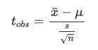*

*其中:*

*   *xbar 是样本平均值(即估计值)*
*   *μ是零假设下的平均值(即目标参数)*
*   *s 是样本标准偏差*
*   *n 是样本量*
*   *(s/√n 为标准误差)*

*请注意此测试统计的公式与用于标准化随机变量的公式之间的相似性。这种结构对于两个平均数的检验是相同的，一个比例和两个比例，除了估计量，参数和标准误差，当然，每种类型的检验略有不同。*

*假设我们的样本均值为 71 kg (xbar = 71)，样本标准差为 13 kg (s = 13)，样本量为 10 名成人(n = 10)。记住总体均值(零假设下的均值)是 80 kg (μ = 80)。*

*因此，t-stat 为:*

*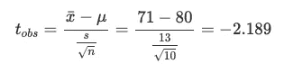*

*尽管公式因测试的参数而异，但测试统计的值表明了我们的观察结果有多极端。*

*我们记住这个值-2.189，因为它将在第 4 步中再次使用。*

## *第三步:寻找临界值*

*虽然 t-stat 给了我们观察结果有多极端的指示，但是我们不能仅仅根据它的值来判断这个“极端得分”是否太极端。因此，在这一点上，我们还不能断定我们的数据是否过于极端。为此，我们需要将我们的 t-stat 与一个阈值(称为**临界值**)进行比较，该阈值由[概率分布](https://statsandr.com/blog/a-guide-on-how-to-read-statistical-tables/)表给出(当然，也可以通过 R 找到)。*

*同样，计算 t-stat 的公式对于每个感兴趣的参数是不同的，临界值所基于的基本概率分布(以及统计表)对于每个目标参数也是不同的。这意味着，除了选择合适的公式来计算 t-stat，我们还需要根据我们测试的参数选择合适的概率分布。*

*幸运的是，对于本文中涉及的 6 个假设检验，只有 4 种不同的概率分布(1/2 均值、1/2 比例和 1/2 方差):*

1.  *[标准正态分布](https://statsandr.com/blog/do-my-data-follow-a-normal-distribution-a-note-on-the-most-widely-used-distribution-and-how-to-test-for-normality-in-r/#probabilities-and-standard-normal-distribution):*

*   *对已知总体方差的一个和两个均值进行检验*
*   *对两个配对样本进行测试，其中两个样本之间的差异方差σ2D 已知*
*   *对一个和两个比例进行测试(假设满足一些假设)*

*2.学生分布:*

*   *在*未知总体方差的情况下对一个和两个均值进行测试**
*   *对两个配对样本进行测试，其中两个样本之间的差异的方差σ2D 未知*

*3.卡方分布:*

*   *对一个方差的检验*

*4.费希尔分布:*

*   *两个方差的检验*

*每个概率分布也有它自己的参数(这里考虑的 4 个分布有两个参数)，定义它的形状和/或位置。概率分布的参数可以看作是它的 DNA 这意味着该分布完全由其参数定义。*

*以我们最初的场景为例，一名健康专家想要测试比利时成年人的平均体重是否不同于 80 kg。一个均值测试的潜在概率分布要么是标准正态分布，要么是学生分布，这取决于*总体*的方差(不是样本方差！)是已知还是未知: [6](https://statsandr.com/blog/hypothesis-test-by-hand/#fn6)*

*   *如果总体方差已知→使用标准正态分布*
*   *如果人口方差*un*unknown→使用学生分布*

*如果没有明确给出总体方差，您可以假设它是未知的，因为您不能基于样本计算它。如果你能计算出来，那就意味着你能接触到整个群体，在这种情况下，进行假设检验是没有意义的(你可以简单地使用一些描述性统计数据来证实或反驳你的观点)。在我们的例子中，没有指定总体方差，所以假设它是未知的。因此，我们使用学生分布。*

*学生分布有一个定义它的参数；自由度的数量。自由度的数量取决于假设检验的类型。例如，一个平均值测试的自由度数等于观察数减一(n-1)。在不深入细节的情况下，-1 来自于这样一个事实，即有一个量是估计的(即平均值)。 [7](https://statsandr.com/blog/hypothesis-test-by-hand/#fn7) 在我们的示例中，样本大小等于 10，自由度等于 n-1 = 10-1 = 9。*

*找到临界值只缺少最后一个元素:显著性水平[。用α表示的**显著性水平**是错误拒绝零假设的概率，因此**拒绝零假设的概率虽然它实际上是真的**。从这个意义上说，这是一个我们接受处理的错误(I 型错误，与 II 型错误](https://statsandr.com/blog/student-s-t-test-in-r-and-by-hand-how-to-compare-two-groups-under-different-scenarios/#a-note-on-p-value-and-significance-level-alpha) [8](https://statsandr.com/blog/hypothesis-test-by-hand/#fn8) 相对),以便能够根据一个子集得出关于总体的结论。*

*正如你可能在许多统计教科书中读到的，显著性水平通常被设置为 5%。 [9](https://statsandr.com/blog/hypothesis-test-by-hand/#fn9) 在某些领域(如医学或工程等)，显著性水平有时也会设置为 1%，以降低错误率。最好在执行假设检验之前指定显著性水平*，以避免根据结果设置显著性水平的诱惑(当结果处于显著边缘时，诱惑更大)。正如我经常告诉我的学生的，你不能“猜测”也不能计算显著性水平。因此，如果没有明确指定，您可以放心地假设它是 5%。在我们的例子中，我们没有指明，所以我们取α = 5% = 0.05。**

*此外，在我们的示例中，我们想要测试比利时成年人的平均体重是否与 80 kg 不同。由于我们没有指定测试的方向，所以这是一个**双边测试**。如果我们想测试平均体重是小于 80 kg (H1: μ < 80)还是大于 80 kg (H1: μ > 80)，我们会做一个单边测试。确保执行正确的测试(双面或单面)，因为它会影响如何找到临界值(详见以下段落)。*

*现在我们已经知道了合适的分布(学生分布)、其参数(自由度(df) = 9)、显著性水平(α = 0.05)和方向(双边)，我们已经得到了在[统计表](https://statsandr.com/blog/a-guide-on-how-to-read-statistical-tables/)中找到临界值所需的所有信息:*

*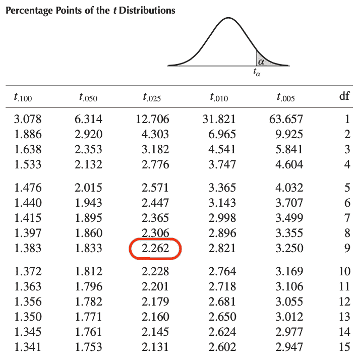*

*作者图片*

*通过查看学生分布表中的行 df = 9 和列 t.025，我们发现临界值为:*

*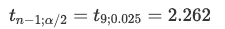*

*有人可能想知道为什么我们取 tα/2=t.025，而不是 tα=t.05，因为显著性水平是 0.05。原因是我们做的是双边测试(H1: μ≠ 80)，所以 0.05 的误差率必须除以 2 才能找到分布右边的临界值。由于学生的分布是对称的，所以分布左边的临界值简单来说就是:-2.262。*

*从视觉上看，0.05 的误差率分为两部分:*

*   *-2.262 左侧的 0.025，以及*
*   *2.262 右侧的 0.025*

*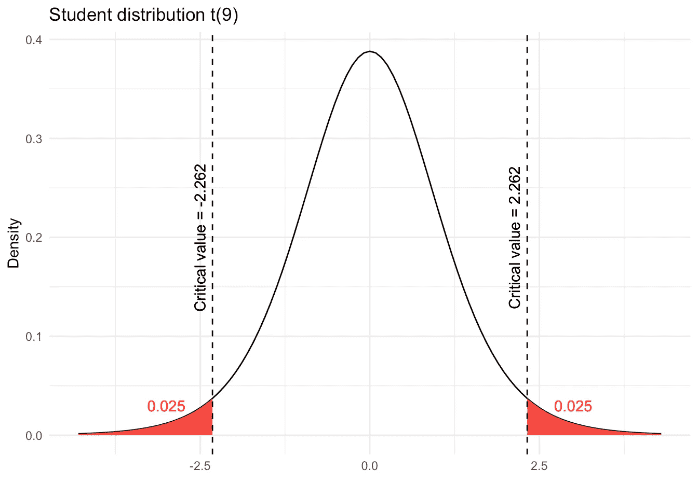*

*作者的情节*

*我们记住第四步和最后一步的临界值-2.262 和 2.262。*

*请注意，上图中的红色阴影区域也称为拒绝区域。下一节将详细介绍这一点。*

*得益于`qt()`函数，这些临界值也可以在 R 中找到:*

```
*qt(0.025, df = 9, lower.tail = TRUE)## [1] -2.262157qt(0.025, df = 9, lower.tail = FALSE)## [1] 2.262157*
```

*`qt()`函数用于学生的分布(`q`代表分位数，`t`代表学生)。不同的发行版还附带了其他功能:*

*   *`qnorm()`为正态分布*
*   *`qchisq()`为卡方分布*
*   *`qf()`为费希尔分布*

## *步骤 4:总结和解释结果*

*在第四步也是最后一步中，我们所要做的就是**将测试统计量**(在步骤#2 中计算)**与临界值**(在步骤#3 中找到)进行比较，以便**结束假设检验**。*

*在进行假设检验时，只有两种可能性:*

1.  *拒绝零假设*
2.  *不拒绝零假设*

*在我们的成人体重示例中，请记住:*

*   *t-stat 是-2.189*
*   *临界值为-2.262 和 2.262*

*还要记住:*

*   *与零假设相比， **t-stat 显示了我们的样本有多极端***
*   ***临界值是 t-stat 被视为*也是*极限**的阈值*

*为了比较 t-stat 和临界值，我总是建议绘制它们:*

*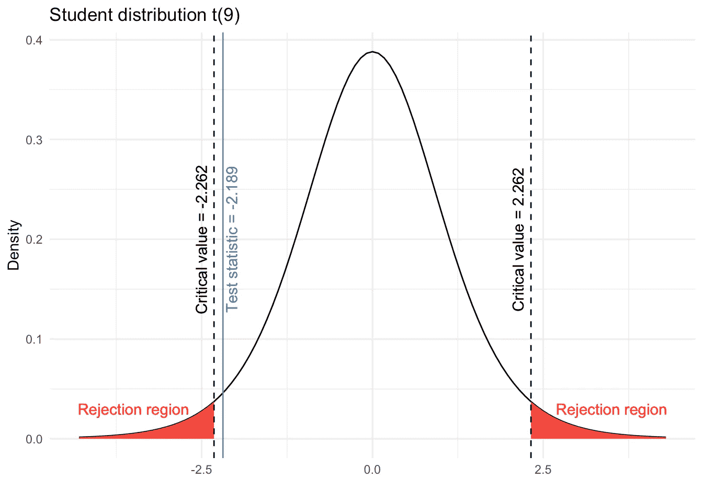*

*作者的情节*

*这两个临界值构成了剔除区域(红色阴影区域):*

*   *从-∞到-2.262，以及*
*   *从 2.262 到*

*如果 **t-stat 位于拒绝区域之一，我们拒绝零假设**。相反，如果 **t-stat 不*不*位于任何拒绝区域内，我们不*不*拒绝零假设**。*

*从上图可以看出，t-stat 没有临界值那么极端，因此不在任何拒绝区域内。总之，我们不拒绝μ=80 的零假设。*

*这是统计学上的结论，但是如果没有适当的解释，这些结论是没有意义的。因此，在问题的上下文中解释结果也是一个很好的做法:*

> *在 5%的显著性水平上，我们不拒绝比利时成年人平均体重为 80 kg 的假设。*

*我们为什么不接受 H0？*

*从更哲学(但仍然非常重要)的角度来看，注意我们写了“我们*不拒绝*零假设”和“我们*不拒绝*比利时成年人平均体重等于 80 kg 的假设”。我们没有写“我们*接受*零假设”，也没有写“比利时成年人的平均体重是 80 kg”。*

*原因在于，在假设检验中，我们根据样本得出一些关于总体的结论。因此，总有一些不确定性，我们不能 100%肯定我们的结论是正确的。*

*也许比利时成年人的平均体重实际上并不等于 80 公斤，但我们无法根据手头的数据证明这一点。可能的情况是，如果我们有更多的观察，我们会拒绝零假设(因为所有其他条件都相同，更大的样本量意味着更极端的 t-stat)。或者，即使有更多的观察，我们也不会拒绝零假设，因为比利时成年人的平均体重实际上接近 80 公斤。我们无法区分这两者。所以我们只能说，我们没有找到足够的证据来反对比利时成年人平均体重为 80 公斤的假设，但我们并没有得出平均值等于 80 公斤的结论。*

*如果您仍然不清楚其中的区别，下面的例子可能会有所帮助。假设一个人涉嫌犯罪。这个人要么是无辜的——零假设——要么是有罪的——另一个假设。为了知道嫌疑犯是否犯了罪，警察收集尽可能多的信息和证据。这类似于研究者收集数据形成样本。然后法官根据收集到的证据，决定嫌疑人是无罪还是有罪。如果有足够的证据证明嫌疑犯犯了罪，法官就会断定嫌疑犯有罪。换句话说，她会拒绝嫌疑人无罪的无效假设，因为有足够的证据表明嫌疑人犯了罪。这类似于 t-stat 比临界值更极端:我们有足够的信息(基于样本)来说零假设不太可能，因为如果零假设为真，我们的数据就会太极端。由于样本不可能是“错误的”(它对应于收集的数据)，唯一剩下的可能性是零假设事实上是错误的。这就是我们写“我们拒绝零假设”的原因。*

*另一方面，如果没有足够的证据证明嫌疑人犯了罪(或者根本没有证据)，法官就会认定嫌疑人无罪。换句话说，她不会拒绝嫌疑人无罪的无效假设。但即使她得出结论认为嫌疑人无罪，她也永远不会 100%确定他真的是无辜的。可能的情况是:*

1.  *嫌疑人没有犯罪，或者*
2.  *嫌疑犯犯了罪，但是警察不能收集足够的关于嫌疑犯的信息。*

*在前一种情况下，嫌疑人确实是无辜的，而在后一种情况下，嫌疑人是有罪的，但警察和法官未能证明这一点，因为他们没有找到足够的证据来指控他。类似于假设检验，法官不得不通过认为嫌疑人无罪来结束案件，而不能区分两者。*

*这是我们写“我们不拒绝零假设”或“我们未能拒绝零假设”(你甚至可能在一些教科书中读到诸如“数据中没有足够的证据来拒绝零假设”的结论)的主要原因，我们不写“我们接受零假设”。*

*我希望这个比喻能帮助你理解我们拒绝零假设而不是接受它的原因。*

*在下面的章节中，我们将介绍假设检验中使用的另外两种方法。这些方法都会得出完全相同的结论:不拒绝零假设，即我们不拒绝比利时成年人平均体重为 80 kg 的假设。因此，只有当您更喜欢使用这些方法而不是第一种方法时，才会显示它。*

# *方法 B:比较 p 值和显著性水平α*

*方法 B 包括计算 *p* 值并将该 *p* 值与显著性水平α进行比较，归结为以下 4 个步骤:*

1.  *陈述**无效和替代假设***
2.  *计算**测试统计量***
3.  *计算***p*-值***
4.  ***总结**并解释结果*

*在使用 *p* 值的第二种方法中，第一步和第二步与第一种方法相似。*

## *步骤 1:陈述无效假设和替代假设*

*无效假设和替代假设保持不变:*

*   *H0: μ=80*
*   *H1: μ≠80*

## *步骤 2:计算测试统计量*

*请记住，t-stat 的公式根据假设检验的类型而不同(一个或两个均值、一个或两个比例、一个或两个方差)。在方差未知的一个均值的情况下，我们有:*

*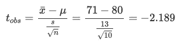*

## *步骤 3:计算 p 值*

****p*-值**是观察到一个样本的[概率](https://statsandr.com/blog/the-9-concepts-and-formulas-in-probability-that-every-data-scientist-should-know/)(因此它从 0 到 1)至少与我们在零假设为真的情况下观察到的样本一样极端。在某种意义上，它**给了你一个关于你的零假设有多可能**的提示。它也被定义为数据表明拒绝零假设的最小显著性水平。*

*有关 *p* 值的更多信息，我推荐阅读关于 *p* 值和显著性水平α 的[注释。](https://statsandr.com/blog/student-s-t-test-in-r-and-by-hand-how-to-compare-two-groups-under-different-scenarios/#a-note-on-p-value-and-significance-level-alpha)*

*形式上，*p*-值是超出测试统计的面积。由于我们正在进行双边测试，因此*p*-值是高于 2.189 和低于-2.189 的面积之和。*

*从视觉上看，*p*-值是下图中两个蓝色阴影区域的总和:*

*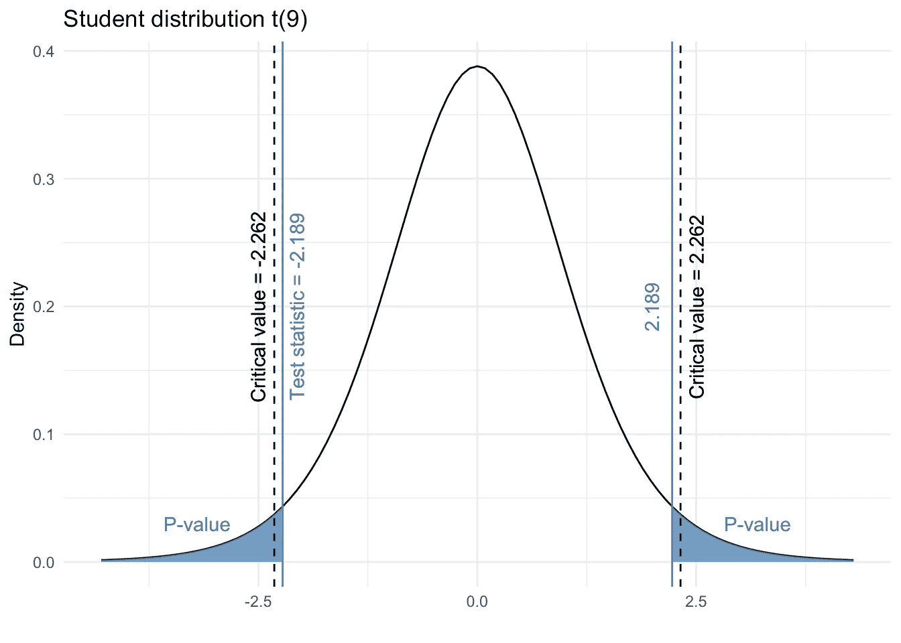*

*作者的情节*

*使用`pt()`函数可以计算出精度为 R 的 *p* 值:*

```
*p_val <- pt(-2.189, df = 9, lower.tail = TRUE) + pt(2.189, df = 9, lower.tail = FALSE)
p_val## [1] 0.05634202# which is equivalent than:
p_val <- 2 * pt(2.189, df = 9, lower.tail = FALSE)
p_val## [1] 0.05634202*
```

*p 值为 0.0563，这表明有 5.63%的机会观察到一个样本至少与零假设为真时观察到的样本一样极端。这已经给了我们 t-stat 是否太极端的提示(以及我们的零假设是否可能)，但是我们在第 4 步正式结束。*

*像`qt()`函数求临界值一样，我们用`pt()`求*p*-值，因为底层分布是学生分布。分别使用`pnorm()`、`pchisq()`和`pf()`表示正态分布、卡方分布和费希尔分布。另请参见这个[闪亮的应用程序](https://antoinesoetewey.shinyapps.io/statistics-101/)来计算*p*-对于大多数概率分布，给定某个 t-stat 的值。*

*如果你不能使用电脑(例如在考试期间)，你将不能精确地计算 p 值，但是你可以使用参照你的测试的统计表来限制它。在我们的例子中，我们使用学生分布，并查看行 df = 9(因为 df = *n-* 1):*

*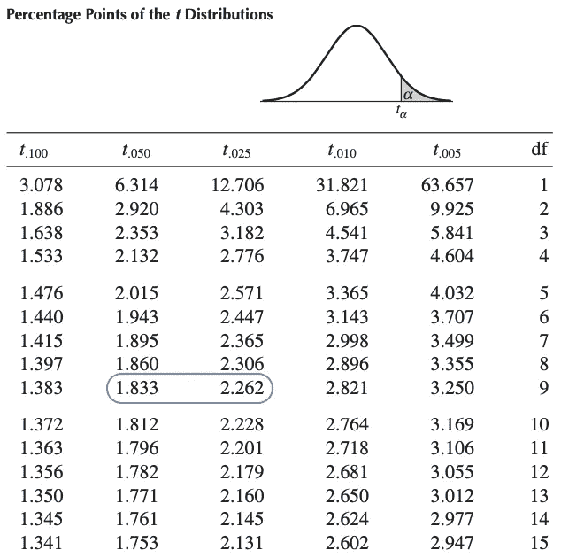*

*作者图片*

1.  *检验统计量是-2.189*
2.  *我们取绝对值，得到 2.189*
3.  *值 2.189 介于 1.833 和 2.262 之间(在上表中以蓝色突出显示)*
4.  *从与 1.833 和 2.262 相关的列名 t.050 和 t.025 中，我们知道:*

*   *1.833 右边的面积是 0.05*
*   *2.262 右边的面积是 0.025*

*5.所以我们知道 2.189 右边的面积一定在 0.025 和 0.05 之间*

*6.由于学生分布是对称的，我们知道-2.189 左边的面积也一定在 0.025 和 0.05 之间*

*7.因此，两个面积之和必须在 0.05 和 0.10 之间*

*8.换句话说，*p*-值介于 0.05 和 0.10 之间(即 0.05<p-值< 0.10)*

*虽然我们不能精确地计算它，但它足以在最后一步完成我们的假设检验。*

## *步骤 4:总结和解释结果*

*最后一步是简单地将*p*-值(在步骤#3 中计算)与显著性水平α进行比较。对于所有的统计测试:*

*   *如果***p*-值小于**α(*p*-值< 0.05) → H0 不太可能→我们**拒绝**零假设*
*   *如果***p*-值大于**或等于α(*p*-值≥ 0.05) → H0 很可能→我们做**不拒绝**零假设*

*无论我们考虑精确的*p*-值(即 0.0563)还是有界的(0.05<*p*-值< 0.10)，它都大于 0.05，所以我们不拒绝零假设。在这个问题的背景下，我们不拒绝比利时成年人平均体重为 80 公斤的无效假设。*

*请记住，当*p*-值低于(等于或大于)α(方法 B)时，使用临界值方法(方法 A)拒绝(或不拒绝)显著性水平为α的零假设相当于拒绝(或不拒绝)零假设。这就是我们发现与方法 A 完全相同的结论的原因，也是为什么如果你在相同的数据上使用两种方法，并且具有相同的显著性水平，你也应该得到相同的结论。*

# *方法 C:将目标参数与置信区间进行比较*

*方法 C 包括计算置信区间并将该置信区间与目标参数(零假设下的参数)进行比较，归结为以下 3 个步骤:*

1.  *陈述**无效和替代假设***
2.  *计算**置信区间***
3.  ***总结**并解释结果*

*在使用置信区间的最后一种方法中，第一步与前两种方法相似。*

## *步骤 1:陈述无效假设和替代假设*

*无效假设和替代假设保持不变:*

*   *H0: μ=80*
*   *H1: μ≠80*

## *步骤 2:计算置信区间*

*像假设检验一样，置信区间是推断统计学中一个众所周知的工具。*

***置信区间是**一个估计过程，它产生**一个区间**(即一个数值范围)**，包含具有某个** —通常是高的— **概率**的真实参数。*

*在计算检验统计量时，每种假设检验都有一个公式，同样，每种置信区间也有一个公式。不同类型的置信区间的公式可以在这个[闪亮的应用](https://antoinesoetewey.shinyapps.io/statistics-201/)中找到。*

*以下是一个均值μ的置信区间公式(未知总体方差):*

*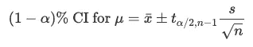*

*其中，tα/2，n1 可在学生分布表中找到(类似于方法 A 的步骤 3 中找到的临界值)。*

*给定我们的数据，α = 0.05，我们有:*

*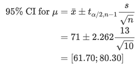*

*μ的 95%置信区间为[61.70；80.30] kg。但是**95%的置信区间意味着什么？***

*我们知道，这个估计过程有 95%的概率产生一个包含真均值μ的区间。换句话说，**如果我们构造许多置信区间**(用相同大小的不同样本)**，平均起来，其中 95%的区间**，**会包含总体的均值**(真参数)。所以平均来说，这些置信区间的 5%不会覆盖真实均值。*

*如果希望降低最后一个百分比，可以降低显著性水平(例如，设置α = 0.01 或 0.02)。在其他条件相同的情况下，这将增加置信区间的范围，从而增加包含真实参数的概率。*

## *步骤 3:总结和解释结果*

*最后一步只是将置信区间(在步骤#2 中构建)与目标参数值(在步骤#1 中提到的零假设下的值)进行比较:*

*   *如果**置信区间不包含**假设值→ H0 不太可能→我们**拒绝**零假设*
*   *如果**置信区间包含**假设值→ H0 是可能的→我们不**拒绝**零假设*

*在我们的例子中:*

*   *假设值是 80(因为 H0: μ = 80)*
*   *80 包含在 95%的置信区间内，因为它从 61.70 到 80.30 千克*
*   *所以我们不拒绝零假设*

*就问题而言，我们并不排斥比利时成年人平均体重为 80 kg 的假设。*

*如你所见，结论与临界值法(方法 A)和*p*-值法(方法 B)是等效的。同样，这是必须的，因为我们对所有三种方法使用相同的数据和相同的显著性水平α。*

# *选择哪种方法？*

*所有这三种方法都给出了相同的结论。然而，每种方法都有自己的优势，所以我通常会根据情况选择最方便的方法:*

*   *方法 A(将测试统计值与临界值进行比较):在我看来，当我无法访问 r 时，这是三种方法中最简单明了的方法。*
*   *方法 B(将*p*-值与显著性水平α进行比较):除了能够知道零假设是否被拒绝之外，计算**确切的*p*-值可能非常方便**，所以如果我可以访问 r，我倾向于使用这种方法*
*   *方法 C(将目标参数与置信区间进行比较):如果我需要测试**几个假设值**，我倾向于选择这种方法，因为我可以构建一个单一的置信区间，并将其与我想要的多个值进行比较。比如用我们 95%的置信区间[61.70；80.30]，我知道任何低于 61.70 kg 和高于 80.30 kg 的值都会被拒绝，不用对每个值进行测试。*

# *摘要*

*在本文中，我们回顾了使用假设检验时的[目标](https://statsandr.com/blog/hypothesis-test-by-hand/#why)和[。然后我们通过三种不同的方法(A.](https://statsandr.com/blog/hypothesis-test-by-hand/#when) [临界值](https://statsandr.com/blog/hypothesis-test-by-hand/#method-a-comparing-the-test-statistic-with-the-critical-value)，b .[p-值](https://statsandr.com/blog/hypothesis-test-by-hand/#method-b-comparing-the-p-value-with-the-significance-level-alpha)和 C. [置信区间](https://statsandr.com/blog/hypothesis-test-by-hand/#method-c-comparing-the-target-parameter-with-the-confidence-interval))向[展示了如何手工](https://statsandr.com/blog/hypothesis-test-by-hand/#how)进行假设检验。我们还展示了如何在初始问题的背景下[解释结果](https://statsandr.com/blog/hypothesis-test-by-hand/#step-4-concluding-and-interpreting-the-results)。*

*虽然当使用相同的数据和相同的显著性水平时，所有三种方法给出了完全相同的结论(否则在某个地方会有错误)，但当谈到选择一种方法而不是另外两种方法时，我也提出了我个人的[偏好](https://statsandr.com/blog/hypothesis-test-by-hand/#which-method-to-choose)。*

*感谢阅读。我希望这篇文章能帮助你理解一个假设的结构。我提醒你，至少对于本文中的 6 个假设检验，公式是不同的，但是其背后的结构和推理是相同的。所以你基本上要知道要用哪些公式，简单的按照本文提到的步骤去做。*

*对于感兴趣的读者，我创建了两个附带的闪亮应用程序:*

1.  *[假设测试和置信区间](https://antoinesoetewey.shinyapps.io/statistics-201/):输入数据后，应用程序会显示所有步骤，以结束测试并计算置信区间。更多信息请参见本文[中的](https://statsandr.com/blog/a-shiny-app-for-inferential-statistics-by-hand/)。*
2.  *[如何阅读统计表](https://antoinesoetewey.shinyapps.io/statistics-101/):该应用程序帮助你计算出大多数概率分布的 t-stat 下的*p*-值。更多信息请参见本文[的](https://statsandr.com/blog/a-guide-on-how-to-read-statistical-tables/)部分。*

*和往常一样，如果您有与本文主题相关的问题或建议，请将其添加为评论，以便其他读者可以从讨论中受益。*

1.  *假设一名研究人员想测试比利时女性是否比法国女性高。假设一位健康专家想知道运动员和非运动员中吸烟者的比例是否不同。测量所有比利时和法国女性的身高，询问所有运动员和非运动员的吸烟习惯，要花太多时间。所以大多数时候，决策是基于人口的代表性样本，而不是整个人口。如果我们能在一个合理的时间框架内测量整个人口，我们就不会做任何推断性的统计。 [↩︎](https://statsandr.com/blog/hypothesis-test-by-hand/#fnref1)*
2.  *不要误解我，这并不意味着假设检验在探索性分析中从不使用。它只是在探索性研究中比在验证性研究中少得多。 [↩︎](https://statsandr.com/blog/hypothesis-test-by-hand/#fnref2)*
3.  *你可能会在其他文章或教材中看到或多或少的步骤，取决于这些步骤是详细还是简洁。然而，假设检验应该遵循相同的过程，不管步骤有多少。 [↩︎](https://statsandr.com/blog/hypothesis-test-by-hand/#fnref3)*
4.  *对于单侧检验，写 H0: μ=80 或 H0: μ≥80 都是正确的。关键是无效假设和替代假设必须是互斥的，因为你是在用一个假设来检验另一个假设，所以两者不可能同时为真。 [↩︎](https://statsandr.com/blog/hypothesis-test-by-hand/#fnref4)*
5.  *为了完整起见，每种类型的测试中甚至有不同的公式，这取决于是否满足某些假设。对于感兴趣的读者来说，可以看到所有不同的场景，以及在[上测试一表示](https://statsandr.com/blog/how-to-perform-a-one-sample-t-test-by-hand-and-in-r-test-on-one-mean/)和在[上测试二表示](https://statsandr.com/blog/student-s-t-test-in-r-and-by-hand-how-to-compare-two-groups-under-different-scenarios/)的不同公式。 [↩︎](https://statsandr.com/blog/hypothesis-test-by-hand/#fnref5)*
6.  *总体方差未知时比已知时有更多的不确定性，通过使用学生分布而不是标准正态分布来考虑这种更大的不确定性。还要注意，随着样本量的增加，学生分布的自由度增加，两个分布变得越来越相似。对于大样本量(通常从 n> 30)，学生分布变得非常接近标准正态分布，即使总体方差未知，也可以使用标准正态分布。 [↩︎](https://statsandr.com/blog/hypothesis-test-by-hand/#fnref6)*
7.  *对于两个独立样本的测试，自由度为 n1+n2-2，其中 n1 和 N2 分别是第一个和第二个样本的大小。请注意-2，因为在这种情况下，估计了两个量。 [↩︎](https://statsandr.com/blog/hypothesis-test-by-hand/#fnref7)*
8.  *第二类误差是不拒绝零假设的概率，尽管它实际上是假的。 [↩︎](https://statsandr.com/blog/hypothesis-test-by-hand/#fnref8)*
9.  *这是一个好的还是坏的标准，这是一个经常出现的问题，也是有争议的。然而，这超出了本文的范围。 [↩︎](https://statsandr.com/blog/hypothesis-test-by-hand/#fnref9)*
10.  *同样，*p*-通过统计表或通过 R 找到的值必须是一致的。 [↩︎](https://statsandr.com/blog/hypothesis-test-by-hand/#fnref10)*

# *相关文章*

*   *[R 中的方差分析](https://statsandr.com/blog/anova-in-r/)*
*   *[一次比例和拟合优度检验(R 和手动)](https://statsandr.com/blog/one-proportion-and-goodness-of-fit-test-in-r-and-by-hand/)*
*   *[如何手工进行单样本 t 检验，并对一个均值进行 R:检验](https://statsandr.com/blog/how-to-perform-a-one-sample-t-test-by-hand-and-in-r-test-on-one-mean/)*
*   *[R 中的 Wilcoxon 检验:如何在非正态假设下比较两组](https://statsandr.com/blog/wilcoxon-test-in-r-how-to-compare-2-groups-under-the-non-normality-assumption/)*
*   *[如何在 R 中一次对多个变量进行 t 检验或方差分析](https://statsandr.com/blog/how-to-do-a-t-test-or-anova-for-many-variables-at-once-in-r-and-communicate-the-results-in-a-better-way/)*

**原载于 2021 年 1 月 27 日 https://statsandr.com*[](https://statsandr.com/blog/hypothesis-test-by-hand/)**。***