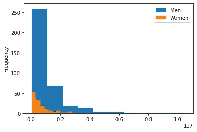

# 假设检验

> 原文：<https://towardsdatascience.com/hypothesis-testing-a23852264d09?source=collection_archive---------14----------------------->


在 [Unsplash](https://unsplash.com?utm_source=medium&utm_medium=referral) 上拍摄的 [ThisisEngineering RAEng](https://unsplash.com/@thisisengineering?utm_source=medium&utm_medium=referral)

## 它是什么以及如何在 Python 中实现它

# 为什么相关？

假设是我们想要检验的主张或前提。假设检验是一种用数据支持你的结论的方式，一种更“科学”的方式。它不仅对科学家有用，实际上在很多领域都很重要，从**营销**到**网页设计**到**药物试验**等等。因为它非常有用，并且基于基本的统计概念，所以学习何时应用最典型的测试将提高您的数据科学技能，即使您不是数据科学家，但仍然以某种方式处理数据。在本文中，我们试图解释最常见的假设检验的用处以及何时使用它们。它以一个 **Python 代码**说明如何在数据科学项目中执行测试作为结束。

# 这是什么？

那么，什么是统计假设呢？使用**数据**可以对**假设**进行**测试**。例如，如果你认为你的**电子商务**中的“加入购物车”按钮应该是红色而不是蓝色，因为这会让人们买得更多，你可以制定以下假设:“红色按钮会比蓝色按钮产生更多的销售”。

现在，你如何测试呢？最“显而易见”的方法是创建网站的两个版本，运行一段时间，随机分配用户给其中一个，然后看看哪个能产生更多的销售。如果“蓝色”版本在一个月内产生 100 万美元，而“红色”版本产生 1000 万美元，你得到了你的答案，对不对？如果“红色”版本产生 200 万美元呢？如果它能产生 100 万美元 1 美分呢？什么时候差异大到足够显著？这种方法的问题在于，当我们处理随机性时，它没有考虑到自然的可变性。另一方面，假设检验不仅考虑了随机性，还考虑了我们希望自己的结论有多可信。

因此，假设检验是一个程序，通过它我们可以评估我们结论的**合理性**，不仅使用我们的**样本**数据，而且知道我们愿意冒多大的**风险**，以及在这个过程中我们可能遇到的错误类型。

# 它是如何工作的？

## 零假设与替代假设

**零假设**是被普遍接受的**默认**主张、前提、值或参数。**替代假设**是一个研究或调查假设，包括要测试的主张，如果被证明为真，它有望取代原假设。下面的各种测试有助于确定样本数据中的信息可以在多大程度上推断出它所来自的人群。

在我们上面的例子中，零假设是两种颜色没有区别，而另一个假设是它们有区别(或者，更具体地说，红色按钮比蓝色按钮产生更多的销售)。

# 典型测试(以及何时使用)

## **学生的 t 检验**

这是一种有用的测试类型，用于比较数据集中两组之间的一个**数字**特征(如身高或体重)。它通过产生 p 值来确定两组的平均值之间是否存在显著差异，这将告诉您如果在总体水平上没有差异(您的零假设)，这两个样本组之间在样本中观察到的差异发生的可能性有多大。如果 p 值小于某个阈值(通常为 0.05)，那么两组受试者之间存在显著的统计学差异。

t 检验的一个重要问题是，它假设两组的正态分布和方差相等。好的，但是我怎么知道我的分布是否正常呢？比如夏皮罗-维尔克测试。

## 夏皮罗-威尔克

以萨缪尔·桑福德·夏皮罗和马丁·维尔克命名的夏皮罗-维尔克检验通常用于检验频率统计中的正态性。当你想判断一个随机样本是否来自正态分布时，你可以使用它。测试返回的 W 值越小，您就越确信样本不是正态分布的。这个结果会导致你最初提出的零假设被拒绝。你也可以从 p 值的角度来考虑这个问题:当它小于或等于某个阈值(通常为 0.05)时，你就可以拒绝零假设。

对，但是如果我的分布不正常呢？我就是没法比较？你可以，但这次要用曼-惠特尼检验。

## 曼-惠特尼试验

这在统计学中也被称为曼-惠特尼 U 检验。当您想要查看两个**独立**组之间的**差异**时，尤其是当因变量是有序或连续的，但不是正态分布时，该测试变得非常有用。

我们看到的比较组的两种类型的测试都是通过使用两个组来完成的，但是如果我们有两个以上的组呢？

## 方差分析

当我们想要比较一个数据集中的**多个**类别时，方差分析测试变得很方便。ANOVA(有时称为方差分析)在同时测试两个以上类别中**数字**变量的差异时特别有用。方差分析还依赖于 3 个主要假设:样本是**独立的**，来自一个**正常** **分布的**总体，并且具有**相同的方差**。

但是如果你的两个变量都是分类的，并且你想检查它们的行为是否像它们是独立的呢？然后对你的数据进行皮尔森卡方检验。

## 皮尔逊卡方检验

这在处理**分类**变量时很有用，可以看出如果这些变量是**独立的**，观察数据分布的可能性有多大。例如，假设你想知道作为一个男人或女人，你更有可能还是更不可能成为一个吸烟者。如果这两个变量是独立的，你可以预期吸烟者和不吸烟者的男女比例是一样的。皮尔森的卡方检验将告诉你，你有多确信有这样的差异，或者没有。

# 使用 Python 的实际例子

我们将使用包含黑色星期五销售信息的数据集，并运行我们刚刚看到的测试(完整代码可在此处获得)。原始数据集在[这里](https://www.kaggle.com/sdolezel/black-friday)是可用的，每个订单有一行，但是我们已经将其更改为每个客户有一行，以使我们的一些分析更加直观。

然后，我们的最终数据集包含客户的性别、婚姻状况、职业、城市和购买金额等信息。

首先，让我们从 scipy 库中装入测试所需的所有函数(每个测试一个函数):

```
**[IN]:**
from scipy.stats import ttest_ind, shapiro, mannwhitneyu, f_oneway, chi2_contingency
```

接下来，我们将定义我们的 **p 值**阈值(0.05)，并创建一个函数来确定我们是否应该拒绝零假设:

```
**[IN]:**
def test_result(p, ref_pvalue=0.05): if p<ref_pvalue: result=”Reject null hypothesis” else: result=”Don’t reject null hypothesis” return result
```

为什么我们总是选择 0.05 作为 p 值的阈值？这主要是一种约定，可能取决于你工作的领域(市场营销、生物统计学等)。)阈值越小，当你决定拒绝零假设时，你就越有信心，但你拒绝的频率就越低。

现在，假设我们想回答一个非常基本的问题:男人和女人花的钱一样多吗？起初，这看起来像是 t-test 的工作，所以让我们试一试:

```
**[IN]:**men = df[df['Gender']=='M']women = df[df['Gender']=='F']ttest_results = ttest_ind(men['Purchase'], women['Purchase'])print('T-test result: {}'.format(test_result(ttest_results[1])))**[OUT]:**T-test result: Reject null hypothesis
```

这里的零假设是，男性和女性的平均购买价值是相同的，因此拒绝它意味着这些价值之间可能存在差异。然而，在运行我们的测试之前，我们似乎忘记了检查一个非常重要的假设:那些样本**是否正态分布**？为了验证这一点，我们将看看我们数据的**分布**，然后运行**夏皮罗-维尔克**测试:



按性别分列的购买价值分布。图片作者。

观察男性和女性购买价值的分布，我们可以看出这可能不是正态分布，因为它有很高的**偏斜度**(不对称)。不过，让我们进行测试，看看我们的直觉是否正确:

```
**[IN]:**shapiro_results_men = shapiro(men['Purchase'])print('Shapiro-wilk test results for men: {}'.format( test_result(shapiro_results_men[1])) )shapiro_results_women = shapiro(women['Purchase'])print('Shapiro-wilk test results for women: {}'.format( test_result(shapiro_results_women[1])) )**[OUT]:**Shapiro-wilk test results for men: Reject null hypothesisShapiro-wilk test results for women: Reject null hypothesis
```

这里，拒绝零假设意味着拒绝观测值正态分布的假设。所以，事实上，我们之前的 t 检验结果是无效的。相反，我们应该尝试一个曼-惠特尼检验:

```
**[IN]:**mannwhitney_results = mannwhitneyu(men['Purchase'],women['Purchase'])print('Mann-Whitney test results: {}'.format(test_result(mannwhitney_results[1])))**[OUT]:**Mann-Whitney test results: Reject null hypothesis
```

同样，我们拒绝样本均值之间没有差异的假设(但这一次，使用适当的检验)。

现在，让我们尝试回答一个不同的问题:不同城市类别的购买价值是否存在差异？这一次，有 3 个不同的类别，所以 t 检验或曼-惠特尼都不行。相反，我们可以使用 **ANOVA** ，同样需要正态分布。有一个聪明的技巧可以让我们的数据更接近正态分布:使用对数变换。在运行方差分析测试之前，我们将在这里使用这个技巧。

```
**[IN]**:a = df[df['City_Category']=='A']b = df[df['City_Category']=='B']c = df[df['City_Category']=='C']a['Purchase'] = a['Purchase'].apply(lambda x: np.log(x))b['Purchase'] = b['Purchase'].apply(lambda x: np.log(x))c['Purchase'] = c['Purchase'].apply(lambda x: np.log(x))anova_results = f_oneway(a['Purchase'], b['Purchase'], c['Purchase'])print('ANOVA test results: {}'.format(test_result(anova_results[1])))**[OUT]:**ANOVA test results: Reject null hypothesis
```

同样，我们拒绝零假设，即我们的城市类别之间没有差异。

现在，到最后一个问题，这次涉及两个分类变量:婚姻状况和职业相关吗？这次不是比手段，而是比频率。因此，首先我们创建一个列联表来计算职业和婚姻状况的所有组合的频率，然后我们运行我们的测试:

```
**[IN]:**contingency_table = pd.crosstab(df['Marital_Status'],df['Occupation'])chisquare_results = chi2_contingency(contingency_table)print('Chi-squared contingency test results: {}'.format(test_result(chisquare_results[1]))) **[OUT]:**Chi-squared contingency test results: Don't reject null hypothesis
```

这一次，我们没有拒绝零假设，这意味着没有理由相信婚姻状况和职业之间存在某种依赖关系:他们的行为或多或少像是独立的。

请注意**我们没有在代码中验证我们测试所需的所有假设**。目标是展示如何在 Python 中执行它们以及如何解释它们的结果。找到一个数据集的变量同时满足所有测试的标准是不切实际的。然而在现实中，你应该**总是在**运行你的测试之前验证那些假设是否成立**。**

# 更进一步

统计学中有许多假设检验，这个列表远远没有包括所有的假设检验。然而，这些测试是最常用的，应该覆盖最基本的用例。如果你想了解更多关于假设检验或应用统计学的知识，一本关于这个主题的好书是《数据科学家实用统计学》。另一个深入研究统计学的好资源是 LearnMore365(尽管他们的课程通常不是免费的)。[这篇关于莱尔德的文章](https://statistics.laerd.com/spss-tutorials/mann-whitney-u-test-using-spss-statistics.php)详细介绍了曼-惠特尼检验。

大多数测试对数据做出某种假设，所以请仔细阅读这些假设是什么以及如何验证它们(通常可以在 Python 函数文档中找到)。

如果你喜欢阅读应用统计学，你可能会喜欢这篇文章:

[](/support-vector-machine-theory-and-practice-13c2cbef1980) [## 支持向量机:理论与实践

### 了解 SVM，最强大的最大似然算法之一

towardsdatascience.com](/support-vector-machine-theory-and-practice-13c2cbef1980) 

这篇文章是由亚瑟·梅洛和金斯利·埃塞格贝撰写的。

> 如果你想进一步讨论，请随时联系 LinkedIn 上的 Arthur 或 Kingsley。