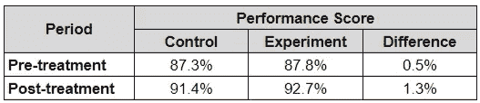

# A/B 检验的假设检验:推断统计学的应用

> 原文：<https://towardsdatascience.com/hypothesis-testing-for-a-b-test-an-application-of-inferential-statistics-5ae2e779ff04?source=collection_archive---------5----------------------->

## 为什么描述性统计可能不足以解释 A/B 测试结果

为什么我们需要推断统计学(例如假设检验)来进行数据分析？为什么我们不直接计算两组的差异来知道哪一组表现更好呢？

我们来举个例子:我们想探究在送货中对司机应用某种待遇是否能更好地提高他们的绩效。但是，如果我们只比较上个月的表现(治疗前)和本月的表现(治疗后)，数据集中会有太多的噪声，例如本月的雨季会影响驾驶员的表现。因此，我们将这组驾驶员随机分成两组(对照组和实验组)以隔离治疗的效果，并在相同的时间段内应用治疗。

接受治疗后，我们想比较两组的表现，是否接受治疗的实验组在接受治疗后表现更好。然而，我们看到的只是 1.3%的微小差异。此外，与治疗前相比，差异仅增加了+0.8%。我们能自信地断定治疗是有效的吗？

示例用例(虚拟数据)

## 什么是 A/B 测试？

在一家技术公司，执行 A/B 测试是一种常用的方法，用来确定某项治疗是否能有效地给我们带来想要的结果。经验法则如下:

1.  将目标人群分为两组:**对照组(不治疗)和实验组(接受治疗)**
2.  确定我们想要测量的性能指标，以及期望的结果是什么(通过治疗，我们应该期望实验组比对照组表现得更好)
3.  确保对照组和实验组在治疗前有相同的表现
4.  应用治疗一段时间
5.  评估结果，实验组是否比控制组表现更好

图示 A/B 测试，A 组和 B 组给予不同的待遇(图片由作者提供)

A/B 测试的实验设计允许我们隔离外部因素，治疗是影响两组之间表现差异的唯一因素。因此，我们知道如果一组比另一组表现好，那是由于治疗。

## 我应该选择哪种假设检验？

为了比较控制组和实验组之间的表现，有各种类型的假设检验，我们需要选择一种来获得正确的 P 值。对于 A/B 检验，我们应该使用**非配对的两样本检验**，因为:

1.  我们要比较两个样本或两组(对照组和实验组)。
2.  我们要比较的是对照组和实验组治疗后的差异(非配对或非独立)，而不是治疗前和治疗后的差异(配对或非独立)。

如果样本服从正态分布，我们可以使用参数检验，否则我们使用非参数检验。假设检验的更多类型和细节将在下面的文章中解释:

 [## 解释假设检验— KDnuggets

### 语义网、数据集成和数据科学研究员安吉丽卡·洛·杜卡。根据吉姆·弗罗斯特的理论，假设…

www.kdnuggets.com](https://www.kdnuggets.com/2021/09/hypothesis-testing-explained.html) 

## 评估 A/B 测试的结果

要自信地总结控制组和实验组之间的显著差异，需要评估以下几点:

1.  **预处理期:**确保在进行处理之前，两个对照&实验组的表现相同
2.  **后处理期:**证明 if 实验组是否比对照组表现更好(表现显著更高)的假设

对于下面的例子，我们可以对治疗前和治疗后进行假设检验，以确定控制组和实验组的驾驶员是否有明显不同的表现。常用的置信度为 95%(α= 0.05)。

A/B 测试结果评估(虚拟数据)

结果解释如下:
1。在预处理期间，我们有 95%的把握认为控制&实验组的驾驶员在表现上没有显著差异，因此不应该有偏差。如果在治疗前他们已经有不同的表现，我们需要重新分组。

2.在后治疗期间，我们有 95%的把握认为，与对照组相比，实验组的驾驶员具有显著更高的表现。因此，我们可以有把握地得出结论，这种治疗在提高驾驶员的表现分数方面是有效的。

顺便提一下，我们还可以检测到治疗前和治疗后期间的增加或减少(两组都从约 87%到约 92%)，这是由外部因素引起的。如果我们直接将治疗应用于 100%的目标人群，而不将其分成两组，我们的分析就会有偏差。通过将目标人群分为对照组和实验组，我们可以将治疗效果与任何外部因素隔离开来。

通过对 A/B 测试应用假设检验，我们不仅仅基于绩效得分均值的差异来评估结果。假设检验允许我们评估其他参数，如样本数量(两组可能有不同的样本大小)、方差或标准差等。