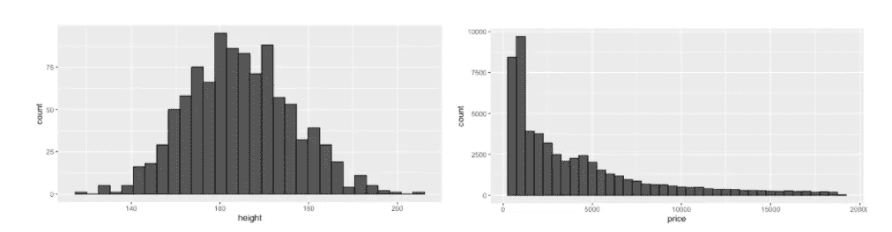
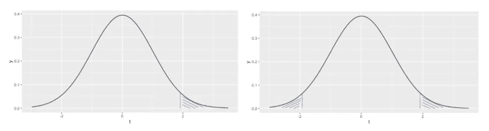
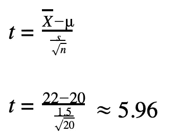

# 数据科学家的假设检验

> 原文：<https://towardsdatascience.com/hypothesis-testing-for-data-scientists-everything-you-need-to-know-8c36ddde4cd2?source=collection_archive---------2----------------------->

## 频繁主义者的方法

安娜·涅克拉舍维奇摄于[佩克斯](https://www.pexels.com/photo/pen-business-eyewear-research-6801648/?utm_content=attributionCopyText&utm_medium=referral&utm_source=pexels)

假设检验是研究和数据科学中常用的统计工具，用于支持研究结果的确定性。测试的目的是回答在给定随机数据样本的情况下，偶然检测到明显效应的可能性有多大。本文以商业领域的问题为例，详细解释了频繁假设检验中的关键概念。

## **什么是假设？**

假设通常被描述为对特定参数或总体的“有根据的猜测”。一旦它被定义，人们可以收集数据来确定它是否提供了足够的证据来证明假设是正确的。

## **假设检验**

在假设检验中，对关于参数或总体(假设)的两个互斥的陈述进行评估，以决定哪一个陈述最能得到样本数据的支持。

## **参数和统计**

在统计学中，**参数**是对**总体**的描述，而**统计量**描述的是总体的一小部分(**样本**)。例如，如果你问你班上的每个人(人群)的平均身高，你会得到一个参数，一个关于人群的真实描述，因为每个人都被问过。如果您现在想使用从您的班级(样本)获得的信息来猜测您的年级(人群)中的人的平均身高，这些信息会变成一个统计数据。

包含特定参数的假设检验称为**参数检验**。在参数测试中，假设人口具有**正态分布**(例如，一个班级中人的身高)。

## **非参数测试**

相比之下，**非参数检验**(也称无分布检验)用于不能假设总体参数呈正态分布的情况。例如，钻石的价格似乎呈指数分布(右下)。非参数化并不意味着你对一个群体一无所知，而是它不是正态分布的。

左图:正态分布数据示例。右图:非正态数据分布的例子。图片作者。

为了简单起见，我将在下面集中讨论参数测试，如果不能假设正态分布，还会提到在哪里进一步研究。

## **现实世界的例子**

解释假设检验的一个常用例子是公平硬币的例子。这是一个很好的解释测试基本概念的方法，但也很抽象。人们可以自问的商业假设的更具体的例子是:

**假设 1**

**参数** : *平均订单值*

**测试类型** : *单样本、参数测试*(假设订单值服从正态分布)

— — — — — — — — — — — — — — — — — — — — — — — — — —

**假设二** : *投资 A 比投资 B 带来更高的回报*

**参数** : *平均收益差*

**检验类型** : *双样本，参数检验，也称 AB 检验*(假设回报服从正态分布)

— — — — — — — — — — — — — — — — — — — — — — — — — —

**假设 3** : *新的用户界面将比预期多 30%的用户转化为客户*

**参数** : *无*

**检验类型** : *单样本、非参数检验*(假设客户数量不呈正态分布)

## **单样本、双样本或多样本测试**

在检验假设时，要区分单样本、双样本或多样本检验。这不要与单面和双面测试混淆，我们将在后面介绍。在**单样本测试**中，将样本(今年的平均订单值)与已知值(去年的平均订单值)进行比较。在**双样本测试**中，两个样本(投资 A 和 B)相互比较。

# **假设检验的基本步骤**

几个步骤被用来测试一个假设和验证它的重要性。在下面，我将详细解释每个步骤，并将使用上面的例子来解释所有的概念。

## **1。空&替代假设**

**空**和**备选项** **假设**是引言中提到的关于一个参数或总体的两个互斥的陈述。零假设(通常缩写为 H0)声称没有影响或没有差异。另一个假设(通常缩写为 H1 或哈)是你想要证明的。使用上面的一个例子:

**H0:***A 和 B 的平均收益没有差别，或者 A 和 B 的差别为零。*

**H1:***A 和 B 的平均收益有差异或者 A 和 B 的差异>零。*

**单边和双边(单边和双边)测试**

上面的示例假设描述了所谓的**双尾检验**。在双尾测试中，你在两个方向上测试*，这意味着测试来自 A 的平均回报是否显著大于和显著小于来自 b 的平均回报。*

*在一个**单尾测试**中，你在一个方向测试*，这意味着要么测试来自 A 的平均回报显著大于要么显著小于来自 b 的平均回报。在这种情况下，替代假设将变为:**

***H1:**A 的平均收益大于 b 的平均收益**或***

***H1:**A 的平均收益低于 b 的平均收益*

## *2.**选择合适的检验统计量***

*为了测试你的主张，你需要决定正确的**测试**或**测试统计**。经常讨论的检验是 t 检验、z 检验或 f 检验，它们都假设正态分布。然而，在商业中，通常不能假设正态分布。因此，我将简要解释你需要知道的主要概念，以便为你的假设找到合适的测试。*

***测试统计***

*参数或非参数测试，每个测试都有一个**测试统计量**。检验统计是样本的数字汇总。它是一个*随机变量*，因为它是从一个**随机样本**中导出的。在假设检验中，它将样本统计量与零假设的预期结果进行比较。检验统计的选择取决于:*

*   *参数与非参数*
*   *样本数量(一个、两个、多个)*
*   *离散变量(如客户数量)或连续变量(如订单价值)*

*让我们假设你的网上商店的平均订单价值 AOV 曾经是 20 美元。在雇佣了一个有潜力的新网页设计师后，AOV 涨到了 22 美元。您想要测试平均 AOV 是否显著增加:*

*参数:*表示 AOV* ( **连续变量**，**假设正态分布**)*

*样本统计: *$22* ( **一个样本**)*

*期望值: *$20**

*测试统计: *t 值**

*测试:*单样本 t 检验**

## ***3。选择适当的显著性水平***

*在检验假设时，我们不能总是对整个人口进行检验，而只能对随机选择的数据样本进行检验。因此，我们能说我们的结论对总体来说总是 100%正确吗？不完全是。我们会犯两种错误:*

***第一类错误**:当原假设为真时拒绝原假设。*

***第二类错误**:当零假设为假时接受零假设。*

***Alpha** 是第一类错误的*概率，以及当零假设为真时拒绝零假设而出错的几率。阿尔法值越低越好。因此，它被用作决策的门槛。在开始假设检验之前，你通常会选择一个你愿意接受的误差水平。例如，当你拒绝零假设时，你愿意接受 5%的错误概率。**

*但是，我不是总想 100%的自信自己没有犯错，所以 alpha = 0%吗？*

***测试的功效***

*是的，这就是问题所在。因为除了α，我们还有β，第二类错误的概率。1-β是不犯第二类错误的概率，定义为测试的*功效。β越低，功率越高。很自然，您希望尽可能降低这两个误差。然而，重要的是要注意到这两个错误在某种程度上是相互抵消的:假设你想要最小化错误 I 或者当它为真时拒绝零假设的错误。那么，最简单的方法就是永远接受它。但是这将直接对抗第二类错误，即当它不为真时接受它。**

*因此，常用的显著性(alpha)水平 0.01、0.05 或 0.10 是一个很好的平衡，应在数据收集前确定。请注意，在双尾测试中，alpha 水平被分成两半，并应用于统计数据的**采样分布**的两侧。*

**

*左图:仅在一侧有拒绝区域的采样分布示例。右图:两侧都有拒绝区域的抽样分布示例。图片作者。*

## *4.**数据收集***

*为了进行假设检验，我们需要一部分真正感兴趣的人群，一个随机样本。应随机选择样本，以避免任何偏差或不良影响。*

*关于最佳样本量的问题并不容易回答。一般来说，可以肯定地说:数据越多越好。但是，在有些情况下，由于预算或时间限制或者只是数据的性质，这很难实现。有几个公式可以帮助找到正确的样本量:*

*   *科克伦样本容量公式*
*   *斯洛文思公式*

*此外，一些检验可以使用小样本量，例如 t 检验或非参数检验，它们通常需要较少的样本量，因为它们不需要正态分布。*

***双样本或多样本测试中的样本量***

*进行双样本或多样本测试时，请注意您选择的测试可能需要相似的样本量，除非它对不同的样本量具有稳健性。例如，像 t-检验这样的检验可能不再合适，因为不相等的样本大小会影响类型 1 误差。在这种情况下，最好寻找一个稳健的替代方案(如韦尔奇的 t 检验)。*

## ***5。测试统计和 p 值的计算***

*一旦收集了数据，就可以计算所选的检验统计量和相应的 **p 值**。这两个值都可以用来对推断做出最终决定，并从测试统计的概率分布中检索(也称为**抽样分布**)。*

***如何计算检验统计量？***

*您可以使用公式(可以在网上找到)传统地计算测试统计，或者通过统计软件如 SPSS 或使用 R/python。对于我们之前的一个示例，假设样本大小(n)为 20，样本标准偏差(s)为 1.5，我们的测试统计数据为:*

**

*[单样本 t 检验](https://www.statisticshowto.com/probability-and-statistics/hypothesis-testing/one-sample-t-test/)*

***p 值***

***p 值**(概率值的简称)是统计学中最关键的数字。它被定义为假设零假设为真，得到至少与观察到的结果一样极端的结果的概率。我最喜欢的用简单的词语描述 p 值的资源是 Cassie Kozyrkov 的:*

> *p 值告诉你，给定你拥有的证据(数据)，如果零假设看起来可笑与否[……]p 值越低，零假设看起来越可笑。*

*p 值是介于 0%和 100%之间的值，可以从零假设、采样分布和数据中检索。一般来说，它是在统计软件的帮助下计算出来的，或者是通过读取带有设定参数(自由度、α水平等)的分布表计算出来的。).对于大多数测试统计数据，可以在网上找到最常见参数的分布表，如 [t-score](https://www.statisticshowto.com/tables/t-distribution-table/) 、[卡方得分](https://www.itl.nist.gov/div898/handbook/eda/section3/eda3674.htm)或 [Wilcoxon-rank-sum](http://www.socr.ucla.edu/Applets.dir/WilcoxonRankSumTable.html) 。*

## *6.**决定***

*为了决定推论，要么将测试统计与一个**临界值**进行比较(临界值方法)，要么将 p 值与**α水平**进行比较(p 值方法)。*

***临界值***

*临界值将抽样分布分为“拒绝区域”和“接受区域”。如果检验统计量大于临界值，则零假设被拒绝，取而代之的是置信水平为 1-α的替代假设。如果检验统计量小于临界值，则不拒绝零假设。临界值是通过抽样分布和阿尔法水平找到的。然而，更常见的测试决策方法是 p 值法。*

***P 值与 alpha 值的对比***

*鉴于你的阿尔法水平，如果 p <= alpha, the null hypothesis is rejected in favour of the alternative hypothesis with confidence level 1-alpha. If the p-value is greater than the alpha-level, the null hypothesis is accepted.*

# ***总结***

*在假设检验中，使用随机数据样本检验关于总体的两个互斥陈述。它包括许多对结果有很大影响的概念和步骤，如制定假设或选择测试统计、α水平和样本大小。*

***资源***

*   *[https://greenteapress.com/thinkstats2/thinkstats2.pdf](https://greenteapress.com/thinkstats2/thinkstats2.pdf)*
*   *[https://www.statisticshowto.com/](https://www.statisticshowto.com/)*
*   *[https://open StAX . org/books/introductive-business-statistics/pages/10-1-comparising-two-independent-population-means](https://openstax.org/books/introductory-business-statistics/pages/10-1-comparing-two-independent-population-means)*
*   *[https://stats . libre texts . org/Courses/Highline _ College/Book % 3A _ Statistics _ Using _ Technology _(科萨克)/07% 3A _ One-Sample _ Inference/7.01% 3A _ Basics _ of _ Hypothesis _ Testing](https://stats.libretexts.org/Courses/Highline_College/Book%3A_Statistics_Using_Technology_(Kozak)/07%3A_One-Sample_Inference/7.01%3A_Basics_of_Hypothesis_Testing)*