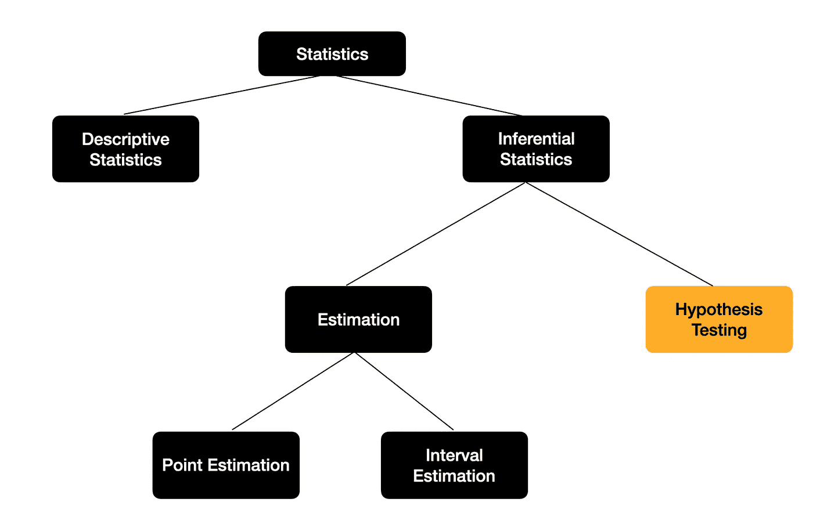
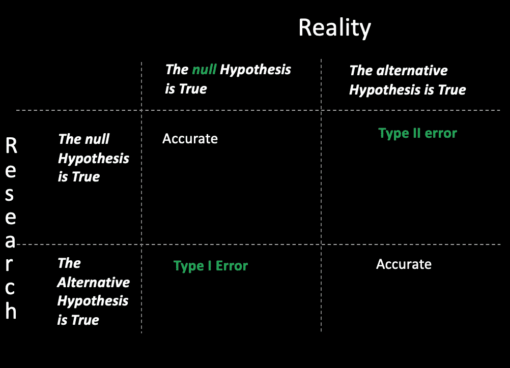
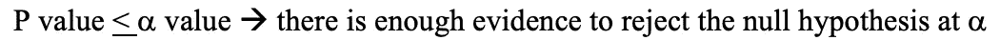
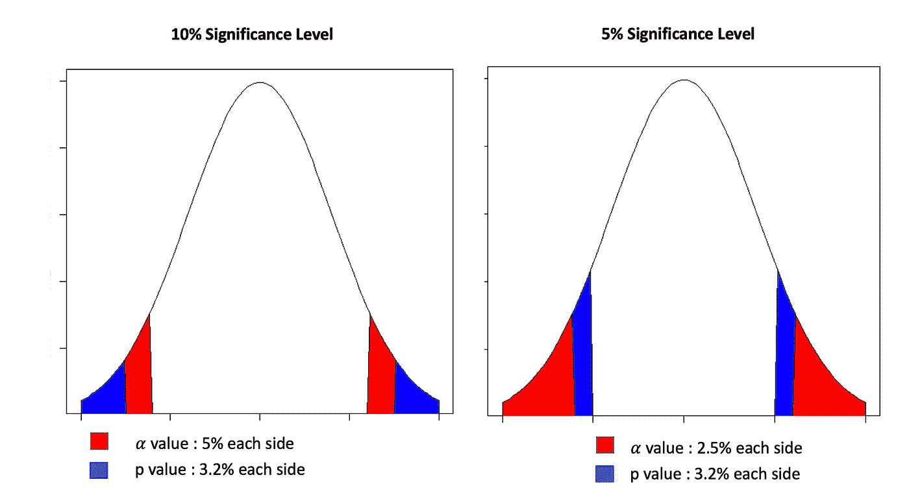

# 简化的假设检验

> 原文：<https://towardsdatascience.com/hypothesis-testing-simplified-5264f490a578?source=collection_archive---------24----------------------->

## 不确定型决策

图片来自弗拉季斯拉夫·巴比延科的作品《Unplash》

你在生活中面临过不确定性吗？那时候你是怎么做决定的？我确信这应该是凭经验、直觉或基于一些数据。

当今世界比以往任何时候都更容易进入数据驱动的决策阶段。当所有必要的数据都可以用来做决策时，对数据进行分割和分析以获得信息就变得更加容易了。然而，在大多数情况下，只有部分数据可用。例如，在这个疫情时代，冠状病毒在我们周围迅速传播，让我们说，我们想确定是否老年人受影响最大。找到所有得过冠状病毒的人来确定这一点是相当不现实的。我们只能依靠一些样本信息。

那么，我们如何知道从样本中得到的信息对于整个数据群体是否是真实的呢？这是相当不确定的。推断统计学，确切地说，推断统计学中的假设检验在这里可以帮到我们。它提供了一个工具包/方法来帮助做出这种决策。

作者图片

# 什么是假设检验？

顾名思义，假设检验检查作为推理基础的命题是真还是假。

先说个例子。

比方说，在一个村庄里，据最近一次统计，人们每月在食品杂货上花费 230 美元。村长想知道今年是否也是如此。他随机选择了 25 个家庭，并检查了该样本的平均花费，结果为 242 美元，标准差为 31，因为这次他无法收集所有关于家庭的信息。

这似乎是一个增长，但我们不能确切地说这是由于人口平均数的实际变化，还是由于抽样误差不能代表基于这些数字的整个人口。

在这样的场景中，默认选择是这一年家庭的平均收入也是 230 美元，这被称为**零假设(*【H0】****)，而完全相反的被称为**替代假设(H1)** 。*

*   ****H0 : μ = 230****
*   ***H1:μ<230***

*假设检验通过检验可用的样本数据来检查数据是否足够强大，或者它是否提供了足够的证据来改变默认选择或零假设的决策。在没有直接默认选择的情况下，可以从基本数据分析中得出质量零假设，这种分析侧重于从可用数据中得出见解。*

*简而言之，假设检验检查是否有足够的证据来改变我们的想法。*

*我相信你们大多数人都很熟悉这个术语，*

> *"在被证明有罪之前是无辜的"*

*这是一个被称为无罪推定的法律原则，任何被指控犯有任何罪行的人在被证明有罪之前都被认为是无辜的。举证责任落在控方身上，控方必须拿出令人信服的证据和事实来证明事实并非如此。*

*这与我们正在进行的假设检验非常相似。我们首先假设我们的零假设是正确的，然后检查可用的数据来证明相反的证据。*

# *可接受风险阈值*

*如果我们回过头来看看，为什么我们必须依赖于这些类型的测试，这仅仅是因为我们不确定样本信息对总体来说是否真实。虽然这些测试不能从不确定性中得出确定性，但它们提供了科学的方法来充分利用我们所拥有的。然而，由于背后隐藏着不确定性，因此总是存在做出错误决定的风险。*

*我们有机会，*

*   *错误地拒绝我们的默认选择*
*   *错误地不改变我们的默认选择*

*这些分别被称为 t**I 型误差和 II 型误差**。第一类错误的概率由**α**表示，第二类错误的概率由**β**表示。这些误差很少为零，所以我们应该尽可能地减小它们。*

**

*作者图片*

*上图显示了可能性矩阵，统计学家通过第四象限的概率定义了测试的**功效，即当零假设不成立时，成功拒绝零假设 **( 1- Beta)** 的概率。一般来说，这可以通过获取更大的代表性样本来提高。***

*所以，回到这些错误可能性的风险上来，假设检验的美妙之处在于决策者甚至在开始检验之前就可以确定他/她愿意承担的风险阈值。这被称为**置信水平** l。*

*用概率的术语来说，它可以定义为当决策实际上为真时，你愿意承担多大的风险概率来错误地改变默认状态的决策。*

> ****α =*** P(当其为真时拒绝零假设)*

*如果它更倾向于零，它更有可能不改变默认决策，我们将期望样本数据提供更多的证据来拒绝零假设。那么如何才能确定这个阈值呢？答案是，这取决于具体情况。*

*我们来看一个假设的极端情况。*

****H0:一名昏迷的病人入院时还活着****

*   ****I 型错误:***医护人员在患者实际活着的情况下，认为患者已经死亡而不立即对其进行治疗。*
*   ****ⅱ型错误:***医护人员在病人实际上已经*死亡的情况下，相信病人还活着，并立即对其进行治疗。**

*在这种情况下，第一类错误会导致可怕的结果，我们应该尽量减少第一类错误，这意味着在这里最好降低置信度。*

## *统计测试*

*现在，如果我们看看假设检验中的统计检验，有两种流行的检验。这些背后的数学值得一篇新文章。所以让我们保持简单如下。*

*   ***Z 检验**:当我们有足够大的样本集时(根据经验法则，当样本大小，根据中心极限定理，n≥ 30 时，我们假设数据集遵循近似正态分布)，或者如果我们知道总体方差，我们就进行 Z 检验。*
*   *T 检验:如果样本较小或者我们不知道总体方差，我们就用 T 检验。*

*通过提供样本数据和置信水平，通过统计软件进行这些测试是相当容易的，这反过来给出了一个称为 p 值的值。这个值允许我们决定在给定的置信水平下是否应该拒绝零假设。*

*基本上如果，*

**

*作者图片*

*如您所见，实现和得出结果非常简单。所以让我们更进一步，深入探究这背后的理论。*

# *什么是 p 值？*

*p 值的正式定义是*

> *“如果零假设是正确的，样本产生的影响至少与样本中观察到的影响一样极端的概率”*

*我相信我们很多人都不会理解。因此，让我们简化一下，检查一下前面的食品杂货平均支出的例子。这个例子的事实是，*

*   *上次人们的平均食品支出是 230 美元。*
*   *目前，25 个家庭的样本平均食品支出为 242 美元，标准差为 31。*

*可能的情况是，*

*   *人口平均值从 230 变为 242
    或*
*   *它没有改变，这个 242 是因为它只是我们所取样本的平均值；这有可能来自平均值为 230 的人群。*

*出于理解的目的，让我们直观地看这个问题。假设零假设为真，这意味着总体的均值仍为 230。根据我在统计测试部分提到的指令，我们可以假设这是一个 t 分布。*

**

*作者图片*

*曲线下的面积是 100%,我们可以看到，如果我们从这个分布中取出任何随机样本，它们的平均值很有可能接近 230。此外，我们可以注意到，即使很小，样本均值也有可能是 242。这也并非完全不可信。*

*红色区域表示从该分布中抽取样本的概率，其平均值至少与我们观察到的样本平均值一样极端(在 242 和 218 的极端侧；即 230 +/-12)。这就是 p 值的确切含义，我相信现在已经很清楚定义中说**的部分意味着什么，如果零假设是正确的话，那么**的效果至少与在您的样本中观察到的效果一样极端。*

*假设突出显示的区域占 0.064。这是我们假设的 p 值。这意味着，如果总体实际上具有平均值 230，则有 6.4%的机会出现平均值至少为 242 的样本。*

*接下来的问题是这个值有多极端？这种极端足以拒绝零假设吗？**什么区域定义了样本值是不可能的，足以保证拒绝零假设？这是我们的信心水平。***

**

*作者图片*

*假设我们的置信水平是 10%，这意味着我们愿意承担 10%的错误拒绝零假设的风险。在我们的例子中，我们的 p 值是 6.4%，正如您在上面的图像中看到的，它位于极端的 10%区域内，该区域被称为**临界区域**。这意味着我们愿意承担上述风险。因此，我们可以得出结论，在 10%的显著性水平上，有足够的证据来拒绝零假设。*

*如果置信度是 5%呢？然后，如上图所示，6.4%(蓝色区域)超出了我们可接受的风险水平(红色区域)，然后我们将不得不得出结论，我们没有足够的统计显著性证据来拒绝 5%置信水平的零假设。*

# *结论*

*正如我们所看到的，假设检验是一个很好的工具，当只有关于样本的信息时，当我们需要对整个群体做出决定时，可以使用它。*

*决策者在推动决策方面占据上风，因为决策在很大程度上取决于置信度，如上所述。为了强调这种置信水平的重要性，如果我们回到被证明有罪之前无罪的法律例子，错误的置信水平会增加类似 I 型和 II 型的错误，这就像分别判一个无辜的人有罪或未能判一个有罪。*

*同样重要的是要记住，这只是一个辅助科学决策的工具包；在现实世界中，在做出最终决定之前，总是需要对结果进行感觉检查。例如，当对照 0.05 的置信水平分析 0.049 p 值时，分析师应该更清楚他/她做出了正确的决策，而不是随意地应用规则。*