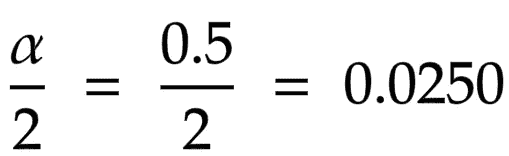

# 假设检验:Z 分数

> 原文：<https://towardsdatascience.com/hypothesis-testing-z-scores-337fb06e26ab?source=collection_archive---------2----------------------->

## 理解什么是假设检验以及如何解释和实施 z 检验的指南

图一。双尾和单尾测试|作者图片

当然，在你培训的某个部分，甚至在你的工作中，你听说过假设检验，但是你知道它们是用来做什么的，或者它们是如何实现的吗？如果答案是否定的，我邀请你留下来，因为我们将在这个博客中讨论著名的假设检验。

放松一下，去拿你最喜欢的饮料，尽情享受吧。

# **假设检验**

想象一下，我们在一篇文章中读到这样的陈述:“ *…所有成年人平均每天睡 7 个小时*”。如何验证前面的断言是有效的？假设检验。

假设检验允许我们验证从总体中假设的某些性质，这些性质与从代表性样本中提取的性质有关。在我们之前的例子中，“所有成年人”是我们的人口，我们将试图验证“T9 每天睡 7 个小时”的属性。

为了证实所有成年人每天睡 7 个小时的说法，我们需要收集一个重要的样本来与总体进行比较。

想象一下，我们随机问 100 个成年人他们每天睡多少小时，从中我们得出他们平均每天睡 7.5 小时。因此，我们的*样本均值*是 7.5 小时，比总体均值高 0.5 小时。

所以给定样本均值，我们可能会想:既然差只有 0.5，我们假设这个说法是对的吗？或者既然不一样，我们说这个说法是不正确的吗？为了解决这些问题，我们需要使用一个叫做`z-scores`的东西，我们将在后面看到它的细节。

到目前为止一切都很简单，对吗？在继续之前，让我们形式化一些事情。

> 为了进行假设检验，我们需要确定两个假设:第**个零假设第**(或第`H0`)和第**个备择假设第**(或第`H1`)。零假设是指要验证的总体的统计特性的断言的形式化。备择假设是零假设的对立者，也就是说，它是反驳零假设的断言。

现在让我们回到之前的问题，当我们的样本均值结果是高 0.5 时，如何知道总体陈述是否正确？为了解决这个问题，我们首先需要知道一些事情。

为了检查零假设中的陈述是否正确，我们需要定义一个**显著性水平**。通常显著性水平为 5%，解释如下:如果我们样本均值的概率小于或等于 5%，则拒绝零假设，反之，如果我们样本均值的概率大于 5%，则保留零假设或*未被拒绝*。

但是为什么是 5%？让我们继续理解这是如何工作的。

在处理正态分布时，为了实用，这种分布通常被转换成一个**标准正态分布**，这个过程被称为*标准化*。标准正态分布是一条均值为 0、标准差为 1 的对称曲线，其曲线下的面积为 1 或 100%(如图 2 所示)。这种标准化使我们能够量化标准偏差的数量，在该数量下，样本均值与总体均值相关。标准偏差的数量由 **z 值**决定。嘣！

图二。标准正态分布|作者图片

因此，由于我们使用标准正态分布，所有与总体平均值相关的样本平均值都是正态分布的，因此，至少 95%的样本平均值落在总体平均值的 2 个标准差内，也就是说，获得超过总体平均值的 2 个标准差的样本平均值的概率小于 5%。

图 3。alpha = 5%的双尾检验|图片由作者提供

在继续之前，让我们形式化一些事情:

> 当样本均值与低发生概率相关联时，零假设被**拒绝**。当样本均值与高发生概率相关联时，保留零假设**。**
> 
> **这种发生概率更好地称为 **p 值**。**

**然后，如果出现概率(或 p 值)小于或等于 5%，则拒绝零假设，反之，如果出现概率(或 p 值)大于 5%，则保留零假设。**

**总之，假设检验方法被描述为以下步骤的序列:**

1.  ****陈述假设**:在这个阶段，声明待检验的语句，即零假设。因此，产生了另一个假设。替代假设可以确定 3 种情况:总体均值大于(>)、小于(<)或不等于( **≠** )原假设中定义的值。**
2.  ****设定决策的标准**:决策的标准是通过显著性水平来定义的，通常定义为 5%，但是也经常使用 10%和 1%。**
3.  ****计算 de 检验统计量**:在这个阶段，应用统计检验来确定我们的样本均值与总体均值有多接近或多远。不同类型的分布有几种统计检验，通常，对于正态分布，使用基于 z 得分的 *z 检验*或*检验*。**
4.  ****做出决定**:给定统计测试获得的结果和步骤 2 中定义的决定标准，确定是拒绝还是保留零假设。**

**太棒了，现在我们已经了解了什么是假设检验，以及关于如何通过一些形式实现的直觉，现在让我们看看如何对备选假设可能采用的每个变量应用 **z-test** ，让我们进入下一部分！**

# ****方向性&非方向性假设检验****

**根据我们对人口的了解，这是我们可以应用的测试。如果我们知道平均值和方差，z 检验将是最合适的选择。**

**正如我们在上一节中看到的，替代假设是反驳或否定原假设的假设。这个矛盾是指样本均值大于(>)，小于(≦)于零假设中建立的，即备择假设可以是定向的，也可以是不定向的。**

****

**图 4。定向和非定向测试|作者图片**

**当另一个假设定义了一个方向，或者大于(>)或者小于(**

*   ****无效假设**:所有成年人每天睡 7 个小时**
*   ****另类假设** : *所有成年人每天睡眠时间都超过 7 小时***

**以同样的方式，该假设可以被定向如下:**

*   ****零假设**:一个 *ll 成年人每天睡 7 个小时***
*   ****另类假设** : *所有成年人每天睡眠时间都少于 7 小时***

**在这两种情况下，假设都是方向性的。**

**另一方面，当替代假设没有明确地定义一个方向时，假设是非定向的，也就是说，它只确定该假设不同于零假设。例如:**

*   ****零假设** : *所有成年人每天睡 7 个小时***
*   ****另类假设** : *所有成年人都不是每天睡 7 个小时***

**很好，现在我们知道了什么是假设检验，什么时候应用 z 检验，以及根据替代假设的假设方向，是时候看几个例子了。让我们去吧！**

# **例子**

**就拿下面这个说法来说吧:“*在一项研究中，发现所有成年人每天都睡 7 小时，标准差为 1 小时。假设我们取一个样本，从中我们得到样本平均值为 8 小时。执行假设检验以验证总体均值***

**为了进行假设检验，我们遵循以下 4 个步骤:**

****第一步:陈述假设。**假设我们要处理一个非方向性假设，我们的零假设和替代假设如下:**

*   **零假设:成年人每天睡 7 个小时**
*   ****另类假设**:成年人每天不睡 7 小时**

****第二步:设定决策标准。****

**显著性水平将为 0.5 或 5%，因此决定了`alpha = 0.5`。由于我们正在处理一个无方向的双尾测试，我们将 alpha 值分成两半，这样上下尾的面积比例相等，如图 3 所示。α的计算如等式 1 所示。**

****

**等式 1。为双尾检验处理 alpha**

**既然我们已经计算了双尾检验的`alpha value`，那么我们就可以确定**临界值**，也就是在标准正态分布中决定拒绝区域的那些值。**

**为了找到临界值，我们看一下`z-table``z`的值，它近似于曲线下的面积，类似于 0.0250。在这种情况下，值是 1.96，也就是说，如果我们的统计测试值大于 1.96 标准差或小于-1.96 标准差，我们将处于*剔除区*。**

****

**图 5。alpha = 0.05 的拒绝区域|作者提供的图片**

**第三步:计算检验统计量。一旦我们定义了假设和显著性水平，我们就开始计算 *z 统计量*。**

**z 统计量给出了标准正态分布中样本均值偏离总体均值的标准偏差数。 *z 统计量*的计算方法是取样本平均值减去总体平均值(在零假设中定义)，除以标准差，如公式 2 所示。**

****

**等式 2。z 统计计算**

**然后，通过计算，我们得到`z = 1`。最后，我们必须做出决定，这将在下一步中进行。**

****第四步。做个决定。**为了做出决定，我们根据显著性水平查看步骤 2 中获得的临界值。由于`z statistic`(在步骤 3 中获得)的值小于临界值，所以决定保持零假设。**

****

**图 6。z 得分= 1 |作者图片**

**最后，获得`z = 1`的概率由`p-value`决定。为了找到这样的值，我们使用*单位标准表*。在这种情况下，我们寻找等于 1 的`z-score`，值是 0.15866。假设我们提出了另一个双尾假设，我们将获得的值乘以 2，得到 p = (0.15866) * 2 = 0.31732。**

**在步骤 2 中，我们确定显著性水平等于 5%，也就是说，如果`p-value`小于 5%，假设被拒绝，否则，如果`p-value`大于 5%，假设无效。在这种情况下，p = 31.7%，大于 5%，因此保持零假设。**

# **参考**

**[1] [假设检验简介](https://www.sagepub.com/sites/default/files/upm-binaries/40007_Chapter8.pdf)**