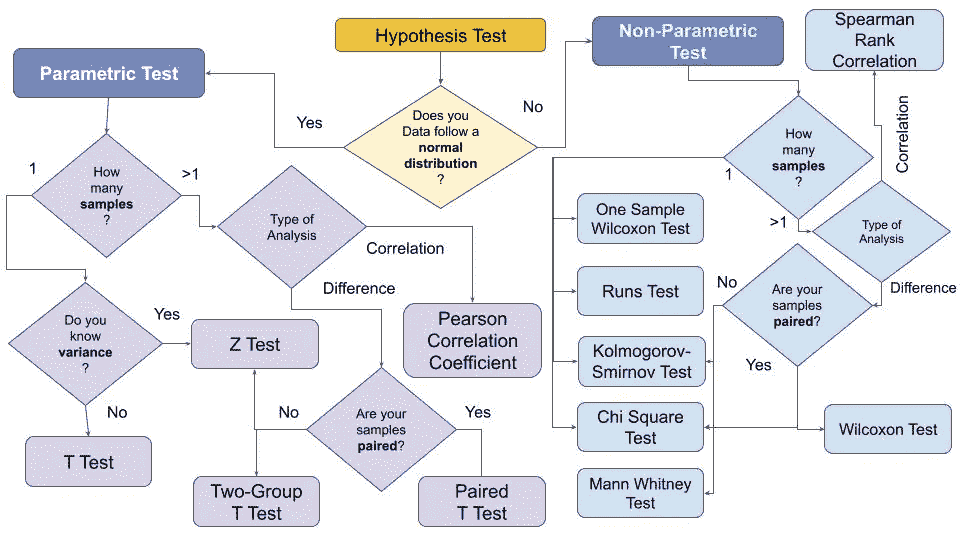
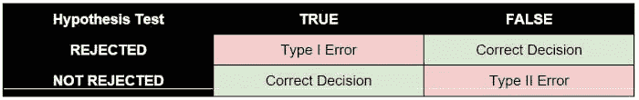
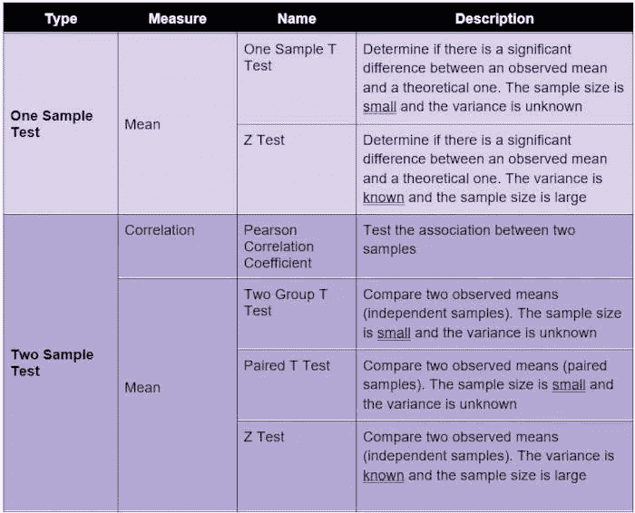
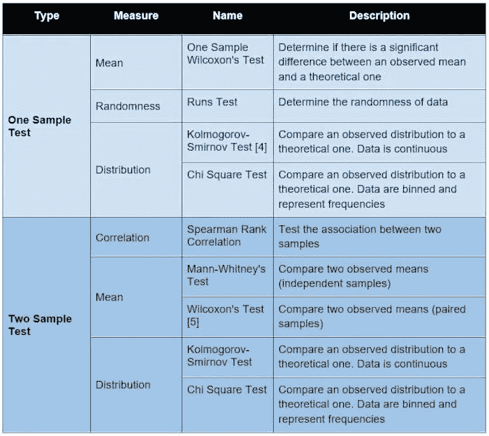

# 假设检验解释

> 原文：<https://towardsdatascience.com/hypothesis-tests-explained-8a070636bd28?source=collection_archive---------6----------------------->

## 统计数字

## ***快速概述假设检验的概念，它在参数和非参数检验中的分类，以及何时使用最流行的假设检验。***

作者图片

# 什么是假设检验

根据 Jim Frost 的说法，假设检验是一种推断统计学的**形式，它允许我们根据一个有代表性的样本对整个人口做出结论..]在大多数情况下，观察整个种群以了解其特性是根本不可能的。唯一的选择是收集一个随机样本，然后用统计学来分析它[1]。**

在进行假设检验时，首先，必须制定一个假设。假设的一个例子是“人口中的身高和性别之间存在相关性”，或者“人口中的两组之间存在差异。”

通常，要论证的论题称为**备择假设** (HA)，它的反义词是**零假设** (H0)。实际上，零假设表明人口中没有新的事情发生。

在前面的例子中，无效假设可以表述为:人口中的身高和性别之间没有相关性，两组之间没有差异。假设检验的目的是验证是否可以拒绝零假设。**一般来说，拒绝零假设并不自动意味着替代假设被接受。**然而，在某些情况下，拒绝零假设可能意味着可以接受替代假设。

执行假设检验时，可能会出现两种错误:

*   第一类错误:拒绝零假设，当它实际上是真的。
*   第二类错误:接受零假设，当它实际上是假的。

下表恢复了第一类和第二类错误:

作者图片

# 假设检验的类型

假设检验可以分为两大类[2]:

*   **参数测试**，如果样本遵循正态分布。通常，如果样本的均值为 0，方差为 1，则样本服从正态分布。
*   **非参数检验**，如果样本不符合正态分布。

根据要比较的样本数量，可以制定两类假设检验:

*   **一个样本**，如果只有一个样本，必须与给定值进行比较
*   **两个样本**，如果有两个或两个以上的样本要比较。在这种情况下，可能的测试包括样本间的**相关性**和**差异**。在这两种情况下，样本可以配对，也可以不配对。**配对样本**也叫相依样本，而不配对的样本也叫独立样本。在成对样本中，会出现自然或匹配的耦合。

通常，参数测试有相应的非参数测试，正如[3]中所述。

本文顶部的图表回顾了如何根据样本选择正确的假设检验。

# 参数测试

如前所述，参数测试假设数据呈正态分布。下表描述了一些最流行的参数测试及其测量内容。

作者图片

# 非参数检验

非参数检验不对数据的分布做任何假设。下表描述了一些最流行的非参数测试及其测量内容。

作者图片

# 摘要

在这篇短文中，我描述了假设检验的概念，以及最流行的检验和它们的使用时机。

对于那些仍然难以理解假设检验的人，有一个 Python 库，叫做 easy-ht [6]，它在没有任何统计学知识的情况下运行主要的假设检验。关于如何使用 *easy-ht* 的教程可在[此链接](https://alod83.altervista.org/)获得。

**原贴于**[**KD nuggets**](https://www.kdnuggets.com/2021/09/hypothesis-testing-explained.html)**。**

如果你喜欢这篇文章，你可以直接支持我，点击这个链接，在推特上关注我，或者访问我的新网站。

# 参考

[1]统计假设检验概述[https://statistics byjim . com/Hypothesis-Testing/Statistical-Hypothesis-Testing-Overview/](https://statisticsbyjim.com/hypothesis-testing/statistical-hypothesis-testing-overview/)

[2]参数统计和非参数统计有什么区别？[https://source essay . com/参数统计和非参数统计的区别是什么/](https://sourceessay.com/what-is-the-difference-between-parametric-and-non-parametric-statistics/)

[3]您应该使用哪种统计测试？[https://help . XL stat . com/s/article/which-statistical-test-you-use？language=en_US](https://help.xlstat.com/s/article/which-statistical-test-should-you-use?language=en_US)

[4]Kolmogorov–Smirnov 测试[https://en . Wikipedia . org/wiki/Kolmogorov % E2 % 80% 93 Smirnov _ test](https://en.wikipedia.org/wiki/Kolmogorov%E2%80%93Smirnov_test)

[5]威尔考森测试【https://www.investopedia.com/terms/w/wilcoxon-test.asp 的 

[6]易 ht[https://pypi.org/project/easy-ht/](https://pypi.org/project/easy-ht/)

# 相关文章

</hypothesis-testing-made-easy-through-the-easy-ht-python-package-2ee395b95fe2>  <https://medium.datadriveninvestor.com/a-brief-introduction-to-the-concept-of-data-7b593587e0cf>  <https://medium.com/analytics-vidhya/basic-statistics-with-python-pandas-ec7837438a62>  

# 新到中？您可以每月订阅几美元，并解锁无限的文章— [单击此处](https://alod83.medium.com/membership)。