# 我分析了数百名用户的 Tinder 数据——包括消息——所以你不必这么做。

> 原文：<https://towardsdatascience.com/i-analyzed-hundreds-of-users-tinder-data-including-messages-so-you-dont-have-to-14c6dc4a5fdd?source=collection_archive---------3----------------------->

## 这些数据是令人尴尬的隐私，但揭示了我们已经知道的自己最无聊的部分。

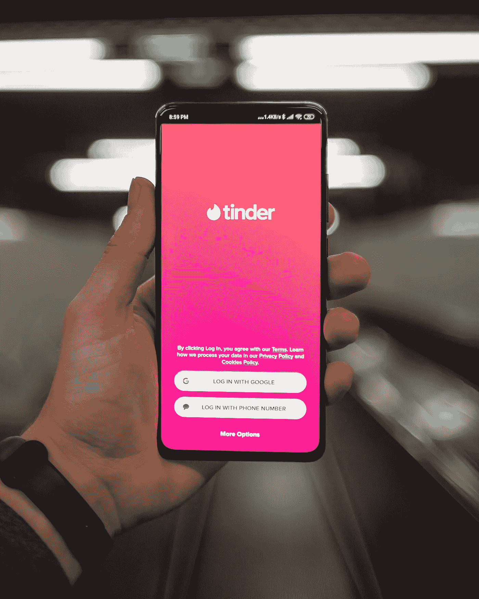

米卡·鲍梅斯特在 [Unsplash](https://unsplash.com/s/photos/tinder?utm_source=unsplash&utm_medium=referral&utm_content=creditCopyText) 上的照片

我在 2016 年读了阿齐兹·安萨里的《T4 现代浪漫史》，毫无疑问，这是我读过的最有影响力的书之一。那时，我还是一个鼻涕横流的大学生，还在和高中同学约会。

这本书给出的关于网上约会成功的数字和数据让我觉得冷酷无情。千禧一代和他们的前辈随着互联网的出现而受到祝福和诅咒。在寻找我们的“灵魂伴侣”时，伴侣选择的激增使我们变得麻木，并给了我们不切实际的期望。

我不但没有被劝阻，反而受到了鼓舞。几个月之内我就和高中男友分手了，自己也进入了网恋世界。我很快意识到约会本身就很糟糕，当它数字化时，情况变得更糟。

火绒。邦布尔。铰链。CoffeeMeetsBagel。如果它在 App Store 上，那么我可能会使用它。尽管我的约会经历大多很平淡，但我无法摆脱对这些被上帝遗弃的应用程序的迷恋。我决定将这种魅力作为我在哥伦比亚大学数据新闻学 Lede 项目的最终项目的一部分。

仅仅使用 Python、Jupyter 笔记本和疯狂的电子邮件，我就直接使用约会应用程序数据创建了一个项目。

# 1.寻找数据

现在我已经有了一个项目，我需要找到实际的数据。这是一个巨大的障碍。

首先，我需要选择一个应用程序来关注。在 r/dataisbeautiful 上浏览了几个小时后，我决定使用 Tinder，因为它很受欢迎。

我从 Reddit 上了解到，通过阅读[其他](https://medium.com/r?url=https%3A%2F%2Ftowardsdatascience.com%2Fmy-friends-gave-me-their-tinder-data-7fcd2621c140) [文章](https://medium.com/swlh/analyzing-my-tinder-data-3b4f05a4a34f)，我可以请求我自己的数据。几年前，*卫报*写了一篇关于 Tinder 如何使用个人数据的报道。该公司的部分回应是根据要求提供用户数据

[](https://www.theguardian.com/technology/2017/sep/26/tinder-personal-data-dating-app-messages-hacked-sold) [## 我向 Tinder 要了我的数据。它寄给我 800 页我最深最黑暗的秘密

### 2013 年 12 月 18 日星期三晚上 9 点 24 分(零 1 秒)，在巴黎第二区，我写道…

www.theguardian.com](https://www.theguardian.com/technology/2017/sep/26/tinder-personal-data-dating-app-messages-hacked-sold) 

似乎很容易做到，对不对？除了，我没有任何数据下载。我有下载 Tinder 使用几个月的习惯，然后出于沮丧删除我的账户，结果只是重复这个过程。

我知道数据就在那里，尽管障碍重重，我决心找到它。在谷歌搜索了几轮“Tinder 数据”却一无所获之后，我回到了 Reddit。我在 r/dataisbeautiful 上注意到，一些人正在使用一个名为 [Swipestats.io](https://swipestats.io/) 的网站可视化他们的 Tinder 数据。


随机男性用户的 Swipestats.io 可视化

我决定尝试一下，给网站的所有者发一封电子邮件，询问他是否可以为我的项目与我分享匿名的 Tinder 数据。他同意了(谢谢你，克里斯)。

接下来你知道，我坐在一个有 556 个 Tinder 个人资料的 JSON 上。

# 2.清理数据

这完全是一场噩梦。

我已经浪费了生命中的几十个小时，不仅试图理解这些数据，还试图清理它们。最后，我和一个臃肿的 JSON 建立了一段非常忠诚的关系。

我面临的第一个障碍是如何打开文件。它很大，每当我试图把它上传到笔记本电脑，我会得到一个错误。我和 Lede 项目的导师谈过(谢谢你，Jeff)，他建议通过 JSON lint 来运行它。我不知道那是什么。

我觉得打开一个大 JSON 是没有用的。事情看起来很黯淡，但我下定决心要用 Tinder 数据创建一个项目。

长话短说，我把 JSON 转换成. txt 文件，然后把大的。使用[这个站点](https://textfilesplitter.com/)把 txt 文件变成更小的文件。由于某种神的奇迹，网站分裂了。txt 文件完美地由每个人的文件组成。接下来，我转换了新的吐槽。txt 文件转换成 JSON 格式。现在我有一个包含 556 个 JSONs 的文件夹。

```
# Loading the data
import jsonf = open(“user_x.json”, encoding=”utf-8")
data = json.load(f)
```

最后，我能够打开我的数据。令我惊讶的是，我注意到邮件被包括在内。

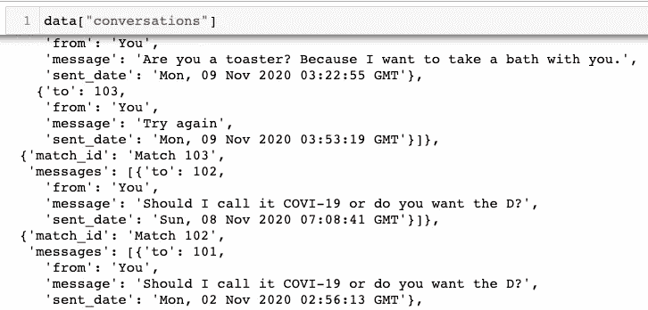

21 世纪的浪漫

我知道我必须优先考虑，并决定只关注三个不同的对象，**对话**、**对话元**和**用户**。在流程图中，我概述了每个对象中的信息。

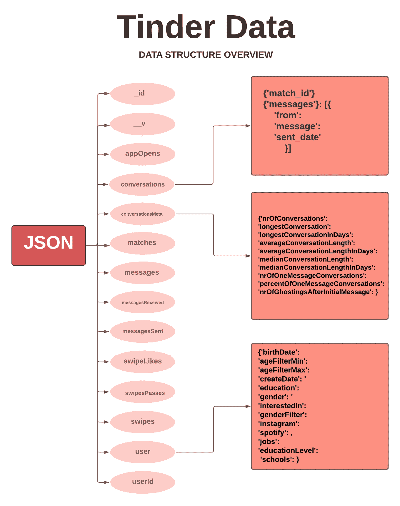

我能做的事情有无数种可能性，但我仍然没有清理完数据。下一个障碍是组织它。

我的下一步是按照性别和语言来组织文件。我读过的很多文章都喜欢比较男人和女人的约会经历，所以我想拥有那些独立的数据集。此外，我还收到了一套相当国际化的套装，上面散布着日语、西班牙语或德语等语言。尽管我很欣赏这种多样性，但我只想用英文资料工作。

我不知道从哪里开始组织，所以我去了办公时间(谢谢你，Thanasis)。在 Gather 上绞尽脑汁之后，我们——主要是 than asis——找到了一个解决方案。

```
import shutil
import os
import glob
from os import pathall_files = '/directory'
male = "/directory/MALE"
female = "/directory/FEMALE"
files = glob.glob(all_files+"/*.json")
for file in files:
    with open(file, encoding="utf-8") as f:
        data = json.load(f)
        stat = data["user"]
        for stats in stat:
            if stat["gender"] == "M":
                try:
                    shutil.move(os.path.join(all_files, file), male)
                except:
                    pass 
            else:
                try:
                    shutil.move(os.path.join(all_files, file),   female)
                except:
                    pass
```

这段代码只是将一个 JSON 移动到它各自的文件夹中，不管它是男的还是女的。

我试图用 **TextBlob** 和 **langdetect 写一个类似的代码来区分语言。**没用。出于纯粹的恶意，我根据语言手工分离了文件。

到这一点，我感觉神志不清，但我几乎结束了。我的最后一步是将数据保存到友好的 CSV 中，给我留下大约 300 个英语数据。

## 将对话保存到 CSV 中:

*注意:*Tinder 消息带有 HTML 标签。我在下面包含了删除它们的代码。

```
all_files = '/GENDER/ENGLISH'
files = glob.glob(all_files+"/*.json")# HTML parser code
from io import StringIO
from html.parser import HTMLParserclass MLStripper(HTMLParser):
    def __init__(self):
        super().__init__()
        self.reset()
        self.strict = False
        self.convert_charrefs= True
        self.text = StringIO()
    def handle_data(self, d):
        self.text.write(d)
    def get_data(self):
        return self.text.getvalue()def strip_tags(html):
    s = MLStripper()
    s.feed(html)
    return s.get_data()for file in files:
    with open(file, encoding="utf-8") as q:
        data = json.load(q)
        all_convo = data["conversations"]
        text = []
        for message in all_convo: 
            for messages in message["messages"]:
                messages["final_messages"] = ""
                updated = messages["message"]
                messages["final_messages"] = strip_tags(updated)
                text.append(messages)

        with open('GENDER_convos.csv', 'a') as csvfile:
            field_names = ['to', 'from', 'message', 'sent_date', 'final_messages']
            writer = csv.DictWriter(csvfile, fieldnames=field_names, extrasaction='ignore')
            writer.writeheader()
            writer.writerows(text)
```

## 将对话元保存到 CSV 中:

```
for file in files:
    with open(file, encoding="utf-8") as q:
        data = json.load(q)
        user_data = []
        user_data.append(data["conversationsMeta"])
        field_names = ['nrOfConversations', 'longestConversation', 'longestConversationInDays', 
                       'averageConversationLength', 'averageConversationLengthInDays', 
                       'medianConversationLength', 'medianConversationLengthInDays', 
                       'nrOfOneMessageConversations', 'percentOfOneMessageConversations', 
                       'nrOfGhostingsAfterInitialMessage']
        with open('GENDER_convometa.csv', 'a') as csvfile:
            writer = csv.DictWriter(csvfile, fieldnames=field_names)
            writer.writeheader()
            writer.writerows(user_data)
```

## 将用户元数据保存到 CSV 中:

```
for file in files:
    with open(file, encoding="utf-8") as q:
        data = json.load(q)
        user_data = []
        md = data["user"]
        for job in md['jobs']:
            if job['title'] == None:
                pass
            else: 
                md['jobs'] = job['title']
        try:         
            for school in md['schools']:
                if school['name'] == None:
                    pass        
                else: 
                    md['schools'] = school['name']  
        except:
            pass
        user_data.append(md)
        field_names = ['birthDate', 'ageFilterMin', 'ageFilterMax', 'cityName', 'country', 'createDate', 
                    'education', 'gender', 'interestedIn', 'genderFilter', 'instagram', 'spotify', 'jobs', 
                    'educationLevel', 'schools']
        with open('GENDER_md.csv', 'a') as csvfile:
            writer = csv.DictWriter(csvfile, fieldnames=field_names)
            writer.writeheader()
            writer.writerows(user_data)
```

数据曾经被完全清理过吗？不。这是一个无止境的任务。

# 3.分析数据

在你变得太兴奋之前，我需要承认我发现的所有东西都有点无聊。我花了大部分时间清理数据，所以这一部分有点枯燥，特别是考虑到我是在晚上 10:54 写的这篇文章，我应该在明天早上 9:00 提交。

你生活和学习。

我根据之前做的三个 CSV 做了一个分析。提醒一下，它们每个都包含**对话**、**对话元**和**用户**元数据。代码可在[这里](https://github.com/alyssafrndz/lede_final_project)获得。

> S *ide 注:我是从* [*数据驱动*](https://data-dive.com/tinder-statistics-insights-from-unique-dataset) *分析僵尸工具制作的 Tinder 数据开始，受这篇文章*影响很大。那篇文章更深入，并且使用了更简洁的代码。

## a)分析对话

这可以说是所有数据集中最乏味的，因为它包含了 50 万条 Tinder 消息。不足之处是，Tinder 只存储发送的和未接收的消息。

我对对话做的第一件事是创建一个语言模型来检测调情。最终产品充其量是初步的，可以在这里阅读。

接下来，我做的第一个分析是发现用户中最常用的单词和表情符号是什么。为了避免我的电脑崩溃，我只用了 20 万条信息，而且男女混合。

那么十大单词是什么呢？

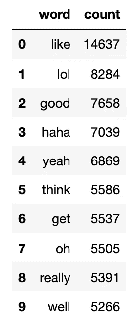

《男女之间的火绒》中使用的十大词汇

引人入胜。

为了让它更令人兴奋，我借鉴了 Data Dive 的做法，在过滤掉停用词后，制作了一个标志性的 Tinder flame 形状的词云。

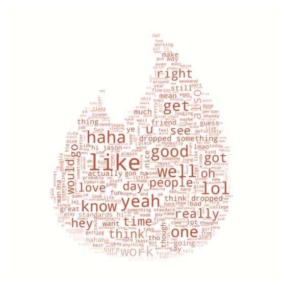

《男女火绒》500 大热门词汇云

是啊是啊。文字是伟大的——但是表情符号呢？

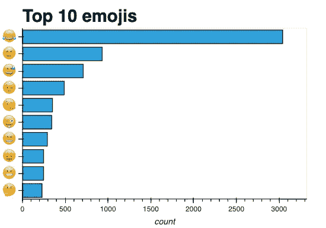

男女火绒中使用的十大表情符号

有趣的事实:我最讨厌的是哭笑表情符号，简称:joy。我非常不喜欢它，甚至不会在本文中将它展示在图表之外。我投票决定立即并无限期地撤销它。

这些结果在多大程度上因性别而异？

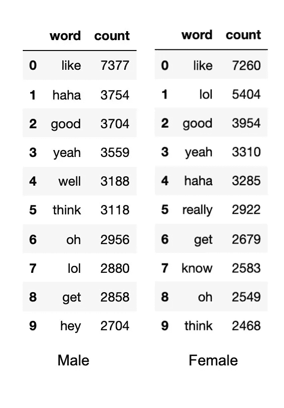

看来“喜欢”依然是两性中的勒宁冠军。虽然，我觉得很有意思的是“嘿”怎么会出现在男性的前十名里，而不是女性。会不会是因为男人应该主动发起对话？可能吧。

表情符号对比呢？

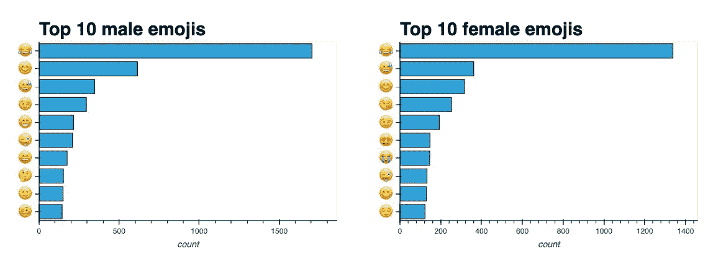

似乎女性用户使用更调情的表情符号(😍,😘)比男性用户多。尽管如此，我仍然感到不安，但并不感到惊讶:《欢乐:超越性别》在表情符号排行榜上占据主导地位。

## b)分析对话元

这部分是最直接的，但也可能是最费力的。现在，我用它来寻找平均值。

以下是该数据帧中可用的键:

> ['nrOfConversations '，' longestConversation '，' longestConversationInDays '，
> ，' averageConversationLength '，
> ，' medianConversationLength '，' medianConversationLengthInDays '，
> ，' nrOfOneMessageConversations '，' percentOfOneMessageConversations '，
> ，' nrofghostingafterinitialmessage '，' Sex']

给我留下深刻印象的是 **nrOfConversations** 、**nrOfOneMessageConversations**和**nrofghostingsaftinitialmessage。**

```
import pandas as pd
import numpy as npcmd = pd.read_csv('all_eng_convometa.csv')# Average number of conversations between both sexes
print("The average number of total Tinder conversations for both sexes is", cmd.nrOfConversations.mean().round())# Average number of conversations separated by sex
print("The average number of total Tinder conversations for men is", cmd.nrOfConversations[cmd.Sex.str.contains("M")].mean().round())
print("The average number of total Tinder conversations for women is", cmd.nrOfConversations[cmd.Sex.str.contains("F")].mean().round())
```

*男性和女性的平均聊天次数是 278.0 次。*

*男性的总 Tinder 对话平均次数为 218.0 次。*

*女性总 Tinder 对话的平均次数是 464.0。*

哇哦。这里可以感受到男人和女人的不同经历。

```
# Average number of one message conversations between both sexes
print("The average number of one message Tinder conversations for both sexes is", cmd.nrOfOneMessageConversations.mean().round())# Average number of one message conversations separated by sex
print("The average number of one message Tinder conversations for men is", cmd.nrOfOneMessageConversations[cmd.Sex.str.contains("M")].mean().round())
print("The average number of one message Tinder conversations for women is", cmd.nrOfOneMessageConversations[cmd.Sex.str.contains("F")].mean().round())
```

男性和女性在交谈中平均收到 80.0 条信息。

男性在交谈中平均每条短信的数量是 74.0 条。

女性在交谈中平均每条信息的数量是 99.0 条。

有意思。尤其是当我看到女性在 Tinder 上收到的平均信息是男性的两倍多时，我很惊讶她们的一条信息对话是最多的。然而，还不清楚是谁发送了第一条信息。我的客人是，它只在用户发送第一条消息时读取，因为 Tinder 不保存收到的消息。只有 Tinder 可以澄清。

```
# Average number of ghostings between each sex
print("The average number of ghostings after one message between both sexes is", cmd.nrOfGhostingsAfterInitialMessage.mean().round())# Average number of ghostings separated by sex
print("The average number of ghostings after one message for men is", cmd.nrOfGhostingsAfterInitialMessage[cmd.Sex.str.contains("M")].mean().round())
print("The average number of ghostings after one message for women is", cmd.nrOfGhostingsAfterInitialMessage[cmd.Sex.str.contains("F")].mean().round())
```

*两性之间一条信息后的代笔次数平均为 50.0 次。*

男性发一条信息后的平均代笔次数为 18.0 次。

*女性发一条信息后的平均代笔次数是 151.0 次*

类似于我之前在**nrOfOneMessageConversations**中提到的，并不完全清楚是谁发起了重影。如果女性在 Tinder 上被更多人跟踪，我个人会感到震惊。

## c)分析用户元数据

以下是用户元数据中可用的对象。

> ['生日'，'年龄过滤'，'年龄过滤'，'最大值'，'城市名'，'国家'，【T2 '，'创建日期'，'教育'，'性别'，'兴趣'，'性别过滤'，【T3 '，' instagram '，' spotify '，'工作'，'教育水平'，'学校']

我想创建一个年龄列，并决定可以将用户年龄确定为(**创建日期** - **出生日期** ) **。**

```
# CSV of updated_md has duplicates
md = md.drop_duplicates(keep=False)from datetime import datetime, datemd['birthDate'] = pd.to_datetime(md.birthDate, format='%Y.%m.%d').dt.date
md['createDate'] = pd.to_datetime(md.createDate, format='%Y.%m.%d').dt.datemd['Age'] = (md['createDate'] - md['birthDate'])/365
md['age'] = md['Age'].astype(str)
md['age'] = md['age'].str[:3]
md['age'] = md['age'].astype(int)# Dropping unnecessary columns
md = md.drop(columns = 'Age')
md = md.drop(columns= 'education')
md = md.drop(columns= 'educationLevel')# Rearranging columns
md = md[['gender', 'age', 'birthDate','createDate', 'jobs', 'schools', 'cityName', 'country',
        'interestedIn', 'genderFilter', 'ageFilterMin', 'ageFilterMax','instagram',
       'spotify']]
# Replaces empty list with NaN
md = md.mask(md.applymap(str).eq('[]'))# Converting age filter to integer
md['ageFilterMax'] = md['ageFilterMax'].astype(int)
md['ageFilterMin'] = md['ageFilterMin'].astype(int)
```

接下来，我想找出**年龄**、**年龄过滤最大值**和**年龄过滤最小值**的平均值。我注意到这些数字异常偏高，所以我检查了我的数据集，并注意到一些钓鱼。我从数据集中删除了以下内容。

一个人 106 岁，另一个 137 岁。两人 16 岁，一人列为 15 岁。我还去掉了 17 个把 1000 作为自己 **ageFilterMax** 的人和一个列出 95 的人。

我发现了以下情况:

```
*# Combined age data* 
print("The average user age for both genders is", all_age.age.mean().round()) print("The average user age filter maximum for both genders is", all_age.ageFilterMin.mean().round()) print("The average user age filter minimum for both genders is", all_age.ageFilterMax.mean().round()) print("--------------------") *# By gender* 
print("The average male user age is", all_age.age[all_age.gender.str.contains("M")].mean().round()) print("The average female user age", all_age.age[all_age.gender.str.contains("F")].mean().round())  print("--------------------") print("The average male user age filter maximum is", all_age.ageFilterMax[all_age.gender.str.contains("M")].mean().round()) print("The average female user age filter maximum is", all_age.ageFilterMax[all_age.gender.str.contains("F")].mean().round()) print("--------------------") print("The average male user age filter minumum is", all_age.ageFilterMin[all_age.gender.str.contains("M")].mean().round()) print("The average female user age filter minumum is", all_age.ageFilterMin[all_age.gender.str.contains("F")].mean().round())
```

*男女用户平均年龄为 24.0
男女用户平均年龄过滤最大值为 21.0
男女用户平均年龄过滤最小值为 31.0
-
男性用户平均年龄为 24.0
女性用户平均年龄为 23.0
-
男性用户平均年龄过滤最大值为 31.0
女性用户平均年龄过滤最大值为 32.0 【T27*

为了增加效果，我用同样的数据制作直方图。

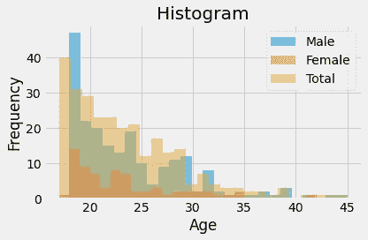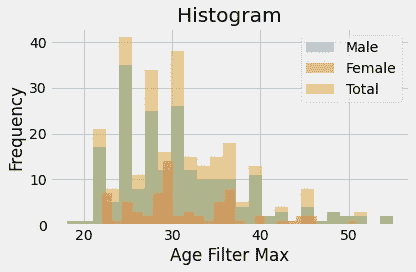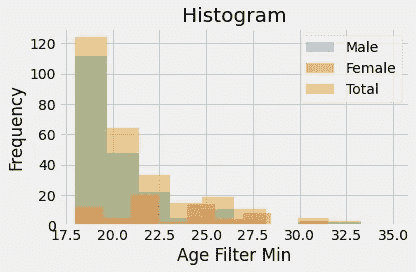

最后，但肯定不是最不重要的，我看了**工作、学校**、城市**和国家**。****

```
# Creating df of jobs listed
jobs_df = pd.DataFrame(md['jobs'].value_counts(dropna=True))
jobs_df.reset_index(level=0, inplace=True)
jobs_df = jobs_df.rename(columns={"index": "Jobs", "jobs": "Count"})# Dropped index that said False
jobs_df = jobs_df.drop(0)
jobs_df = jobs_df.drop(1)jobs_df.head(10)
```

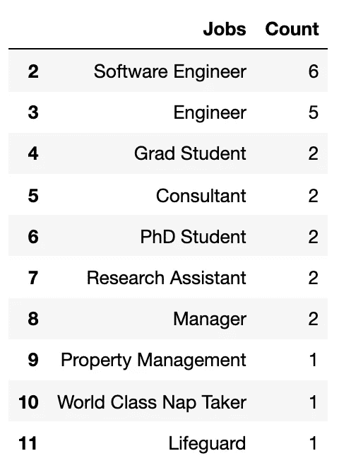

我知道你在想什么——无聊，对吧？我自己浏览了一下列表，选出了我最喜欢的。

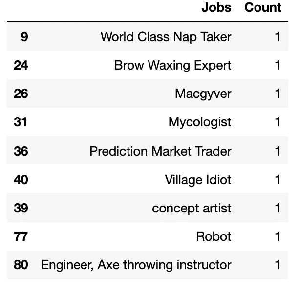

Tinder 数据中显示的 Alyssa 最喜欢的工作

这些是 Tinder 数据中排名前十的学校。

```
# Creating df of schools listed
school_df = pd.DataFrame(md['schools'].value_counts(dropna=True))
school_df.reset_index(level=0, inplace=True)
school_df = school_df.rename(columns={"index": "Schools", "schools": "Count"})# Dropped index that was empty list
school_df = school_df.drop(0)school_df.head(10)
```


基于 Tinder 数据的十大城市。

```
# Creating df of cities listed
city_df = pd.DataFrame(md['cityName'].value_counts(dropna=True))
city_df.reset_index(level=0, inplace=True)
city_df = city_df.rename(columns={"index": "City", "cityName": "Count"})city_df.head(10)
```

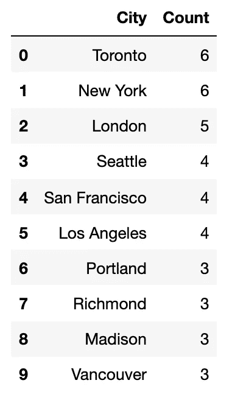

很多加拿大人和冷酷的美国人。

最后，十大国家。然而，Tinder 将州和国家分组在一起，所以至少可以说它很混乱。

```
# Creating df of countries/states listed
country_df = pd.DataFrame(md['country'].value_counts(dropna=True))
country_df.reset_index(level=0, inplace=True)
country_df = country_df.rename(columns={"index": "Country/State", "country": "Count"})country_df.head(10)
```

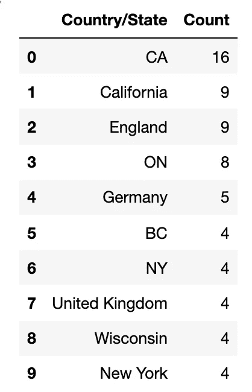

# 最后的想法

总而言之，这些数据是令人尴尬的隐私，但揭示了我们已知的最无聊的部分。

毫不奇怪，我们发现女性在 Tinder 上的平均对话次数比男性多，或者“快乐:是最受欢迎的表情符号”。坦白地说，我的发现令人印象深刻，但这是一个开始。

我看到了未来项目使用这些数据的巨大潜力，我几乎没有触及表面。未来的想法包括建立一个更可靠的调情分析工具或创建一个 Tinder 消息机器人。

不管是哪种情况，我都对即将到来的事情感到兴奋。

## 承认

感谢 Soma 不仅是一名优秀的教师，也是 Lede 项目的先锋！额外感谢卡森、塔纳西斯、杰夫和皮特对我的帮助。

特别感谢 [Swipestats.io](https://swipestats.io/) 为我提供数据，联系方式如下。

克里斯蒂安·埃尔塞特·博

电子邮件:[克里斯蒂安@京东方.风投](mailto:kristian@boe.ventures)

领英:【https://www.linkedin.com/in/kristianeboe/ 