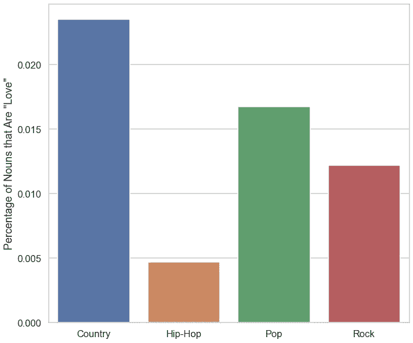
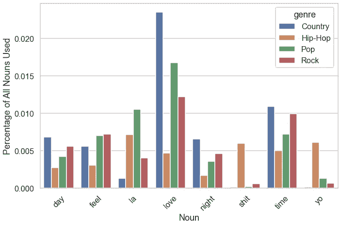
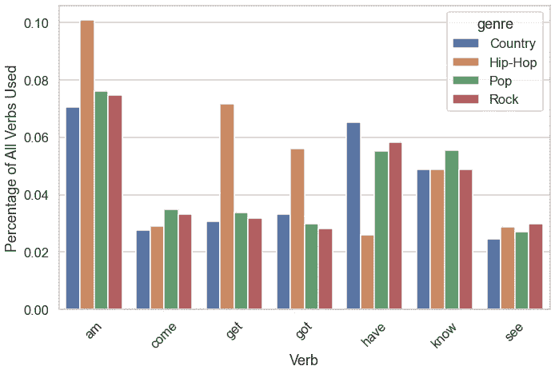
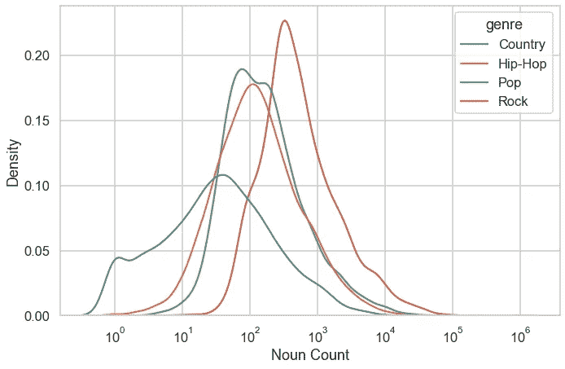
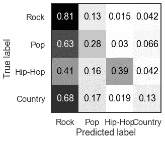
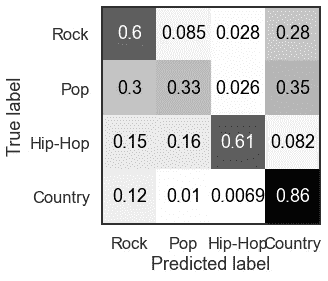

# 朴素贝叶斯、歌词和体裁

> 原文：<https://towardsdatascience.com/i-built-a-naive-bayes-model-to-predict-genre-from-song-lyrics-and-it-went-ok-ish-639af0b0a078?source=collection_archive---------21----------------------->

## 我建立了一个朴素贝叶斯模型来预测歌曲的风格，结果还不错

如果你对音乐和数据感兴趣，那么[百万首歌曲数据集](http://millionsongdataset.com)是一个非常棒的资源。不出所料，总共有 100 万首歌曲的元数据，如果你决定下载完整的数据集，大约有 280GB。还有一堆关联的数据集，比如 [musiXmatch 数据集](http://millionsongdataset.com/musixmatch/)和 [tagtraum 流派注释](https://www.tagtraum.com/msd_genre_datasets.html)，所以我认为这将是一个很酷的用途，尝试看看是否有可能建立一个模型来预测基于一组歌词的音乐流派。

有数百种流派，包括一些没有歌词的，如“豪斯医生”或“器乐爵士乐”，所以我决定只看前四名:
-摇滚
-流行
-嘻哈
-乡村

(最奇怪的发现是，乡村音乐是第四种最常见的音乐类型，我一点也不理解，我认为这可能是因为人们没有把它分成一系列子类型，比如“另类音乐-乡村音乐”或“极端死亡-乡村音乐-核心音乐”)

给整个数据集做词性标注花了很长时间，但是做完之后，我就可以看看每种体裁中最常用的名词和动词了。代码很简单，因为我只是使用了 NLTK 的内置 pos_tag 函数，但这使用了感知器，所以在一个非常大的数据集上运行它，尤其是像我这样使用 pandas apply 函数，需要大约 40 分钟左右。

```
def pos_tag_word(word):
    '''
    try to pos tag a single word
    if word is nan then return nan
    nan check done by seeing if word is equal to self
    '''
    if word != word:
        return word
    else:
        return pos_tag([word])[0][1]genre_and_lyrics[‘pos’] = genre_and_lyrics[‘word’].apply(pos_tag_word)
```

就单词用法而言，使用最多的名词是“I ”,这是有道理的，但看到“love”是第二个使用最多的名词也很酷，特别是在这个国家，超过 1/500 的名词都是“love ”(我猜整个“每首歌都是情歌”的事情是真的)。



按流派显示爱情一词使用情况的条形图

除此之外，最突出的一点是，嘻哈音乐似乎真的不同于其他三种流派——像“shit”和“yo”这样的词是一些最常用的名词(“yo”是名词吗？)对于嘻哈音乐来说是如此，但是在其他音乐类型中却很少。另一方面，很多在乡村、摇滚和流行音乐中最常用的词，如“日”、“时间”和“爱”，在嘻哈音乐中出现的频率要低得多。



显示按类别选择的最常用名词的条形图

我在动词上看到了同样的情况，但是程度较轻。Hop-Hop 看起来仍然是个例外，其他三个流派在最常用动词的用法上或多或少是一致的。



显示按类别选择的最常用动词的条形图

我还认为，看看哪种体裁使用了“最罕见”的名词(即在所有使用的单词中，用法的分布情况)会很有趣。所以我开始评估他们的单词总数。

```
select_nouns[‘word_proportion’] = select_nouns.apply(
    lambda row: row[‘count’] / noun_count[row[‘genre’]], axis=1
)
```

摇滚看起来有一个明显更窄的词汇库，而乡村音乐比其他三个要宽泛得多——想到这一点真的很有趣，尽管我不知道，也许这与地名有关，地名在乡村音乐中很重要(在其他流派中很少)，或者也许有一个很大的乡村音乐亚类唱着关于乌贼和肩带之类的歌曲。

```
kde = sns.kdeplot(
    x=’count’,
    data=grouped_nouns,
    log_scale=10,
    hue=’genre’,
)
```



名词用法分布的 KDE 图

在浏览了数据集之后，我训练了一个朴素贝叶斯和一个支持向量机模型。在整个数据集上训练了一个支持向量机(这需要很长时间)后，我看到 75%的准确率时非常兴奋，但当我意识到这只是因为它预测一切都是摇滚(最常见的流派)时，我立即感到失望



SVM 模型的混淆矩阵

朴素贝叶斯模型表现得还可以/令人惊讶地好，并且在大约 60%的时间里做出正确的分类。这不是很多，但比我预期的要好，除了 Hip-Hop 之外，从高层次的比较来看，流派词的用法并没有显示出很大的差异。它也做得很精确，而不是把所有东西都放在最常见的类别中。

```
from sklearn.naive_bayes import MultinomialNB
nb_model = MultinomialNB()
nb_model.fit(train_features, train_labels)
```

混淆矩阵在这方面也很酷——交叉点和你所期望的有很大关系。流行音乐是一个非常模糊的流派，经常被与摇滚(对所有酷玩乐队的粉丝来说)和乡村(对所有斯威夫特来说)混为一谈。摇滚和乡村音乐很容易混淆。奇怪的是，国家预测非常准确。



NB 模型的混淆矩阵

[随意检查任何代码，这些代码主要分散在几个 jupyter 笔记本中](http://github.com/benrutter)，或者如果您喜欢使用 POS 标记的数据集，不需要等待 45 分钟让 NLTK 在成千上万行上运行正电子网络，[请便](https://ufile.io/2z1tfu5r)！