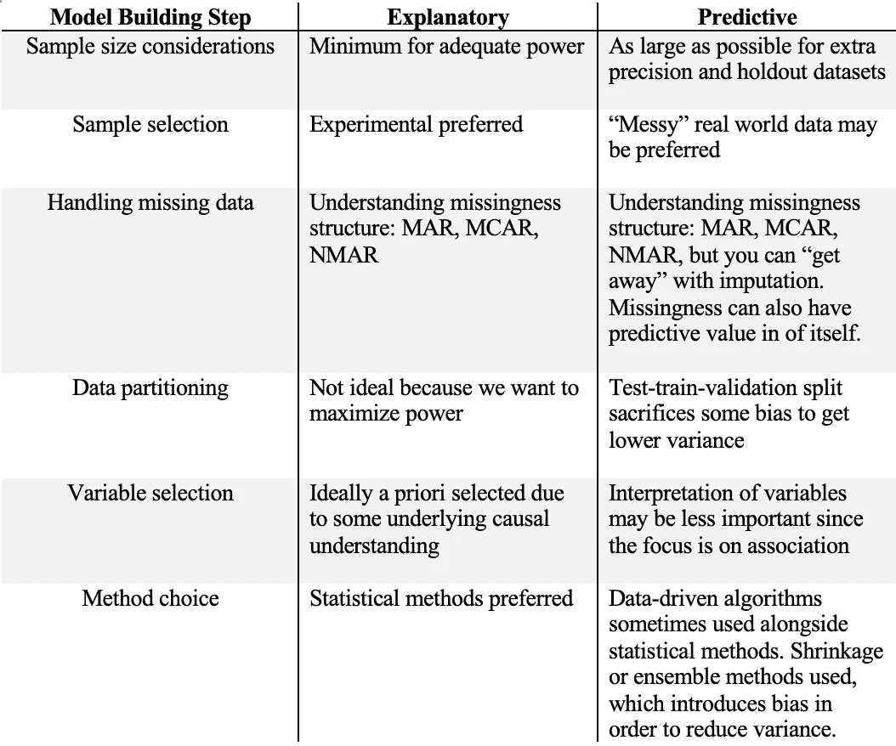
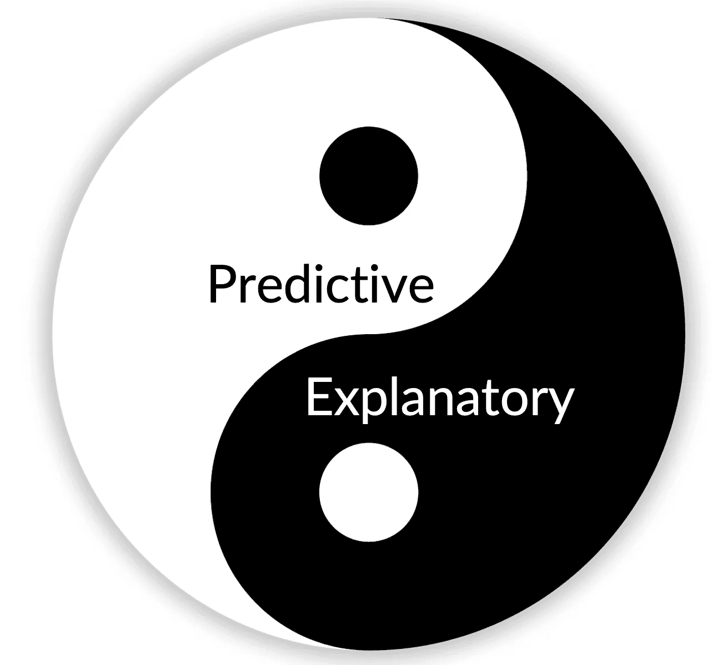

# 你确定你在建立预测模型吗？

> 原文：<https://towardsdatascience.com/i-built-a-predictive-model-is-b-s-a905077fe4?source=collection_archive---------14----------------------->

## 第 1 部分:构建预测模型是正确的吗？

在 [Unsplash](https://unsplash.com?utm_source=medium&utm_medium=referral) 上 [NeONBRAND](https://unsplash.com/@neonbrand?utm_source=medium&utm_medium=referral) 拍摄的照片

我承认——这个标题很有煽动性，但是请继续读下去，看看最后是否有意义。我想促使我写这篇文章的是我越来越强烈的感觉到，随着构建这种模型的工具和资源的增加(例如 R、Python 等)。)，在我看来，如何正确使用这些工具和资源的意识**有了不成比例的小增长**。

我发现很容易想象这样一个场景，一个希望开始做一些预测建模的初学者首先求助于 Google。如果你在谷歌上搜索“如何建立一个预测模型”，你会得到大量主题为“[在不到 10 分钟内建立一个预测模型的完美方法](https://www.analyticsvidhya.com/blog/2015/09/perfect-build-predictive-model-10-minutes/)”的文章。这些文章都很棒——它们确实教会了你构建预测模型的步骤和代码。我不是在打击他们。他们的目的很明确。然而，最让我印象深刻的是，谷歌的搜索引擎优化并没有返回我认为*甚至* *更重要的*—*你是否应该建立一个预测模型，如果是，你如何正确地做*？也许这些快速文章是最先出现的没关系——毕竟，我自己也写过类似的文章。我确实认为他们有价值，因为他们可以吸引新来的人进入这个领域，并向他们介绍这个主题，这可能比用刻板枯燥的学术语言写的传统同行评议文章更有价值。

> 然而，我们必须在新来者成为中间用户，但未能成为“中间”和更严格的预测建模方法的点上划一条线。

这就是我希望我的文章可以进来的地方。我将这篇文章作为系列文章的第 1 部分。我打算讨论三个要点:

1.  你真的想建立一个预测模型吗？了解解释性模型和预测性模型的区别。
2.  如果你这样做了，以下是你应该考虑的事情。
3.  赌注是什么？对你们大多数人来说，它们很低，你可以“建立一个预测模型”然后继续你的路。对其他人来说，它变得很危险。

# **解释性与预测性模型**

本节主要基于 Shmueli 的论文,该论文描述了解释性建模和预测性建模之间的差异——我强烈建议您阅读一下！

这篇论文背后的主要动机是，许多人将具有高解释能力的模型与固有地具有高预测能力的模型混为一谈。好吧，那是什么意思？让我们举一个微不足道的例子:

*智商=年龄*b1 + b*

我们假设一个人的年龄和智商成线性关系。

**解释性**意味着我们寻求理解一个关联解释了多少可变性(在这种情况下，是年龄和智商之间的差异)。具有高解释力的模型包括解释因变量**中**的**大可变性**的自变量(如年龄)。值得注意的是，在解释性建模中，我们假设一个潜在的**因果假设，即某个事物会影响另一个事物。**另一方面，**预测性**意味着我们寻求理解年龄在新数据中能多好地预测智商(即我们能多精确地估计 *b1* 和 *b)。*

这种差异主要表现在四个方面

1.  解释性模型试图捕捉**因果关系。**预测模型试图精确捕捉**关联**
2.  解释性模型往往是**假设驱动的**。预测模型往往是数据驱动的。
3.  解释模型为**回顾型**。预测模型是前瞻性的。
4.  解释性模型侧重于**最小化偏差**。预测模型关注最小化**偏差和估计方差**。

为了理解第 4 点，我们必须快速讨论一下**偏差-方差权衡。**你可能听说过它，也可能见过这张流行的教学图:

形式上，您可以将给定观测值的预期预测误差表示为:

*EPE = Var(Y)+Bias+Var(f(x))*【来自[统计学习要素](https://web.stanford.edu/~hastie/ElemStatLearn/)】

其中 Var(Y)是生活中的自然可变性，偏差是“真实”关系之间的系统差异(我们永远不知道！)和我们建模的关系，Var(f(x))是我们模型中的可变性。

在解释性建模中，因为我们寻求尽可能准确地理解“真实”关系，所以最小化偏差是我们主要关心的问题。然而，对于预测建模，我们希望通过最小化偏差和我们的估计可变性来获得“最佳点”,以便最小化我们的预期预测误差。

我编制了下表，说明了当您试图构建自己的模型时，解释性建模和预测性建模之间的差异在常见步骤中是如何表现出来的。

* NMAR MCAR 马尔(利特尔和鲁宾，2002 年)

# 三脚架声明

因此，理想情况下，您已经阅读了上一节，并且更加了解您是想要构建解释性模型还是预测性模型。如果您仍然对构建预测模型感兴趣，请继续阅读！

既然我们对*何时*构建预测模型有了更多的了解，让我们来关注一下*如何构建。*这种情况下的“如何”更适用于您在构建模型时必须考虑的事项。本文并不涵盖*技术如何*，比如选择一个模型或者用 R 之类的语言实现(我计划作为后续文章撰写)。但是我选择优先写这个，因为我认为**理解如何正确地做某事是如此重要，而不是复制和粘贴代码来构建某种类型的回归模型。**

幸运的是，许多人将一种叫做 [TRIPOD statement](https://www.equator-network.org/reporting-guidelines/tripod-statement/) 的东西放在一起，即“用于个体预后或诊断的多变量预测模型的透明报告”。它发表在多种健康杂志上，但是这个声明中的项目也可以应用于其他预测环境(商业、政治等)。).我将特别关注[开发清单](https://www.tripod-statement.org/wp-content/uploads/2020/01/Tripod-Checlist-Prediction-Model-Development.pdf)(相对于[验证清单](https://www.tripod-statement.org/wp-content/uploads/2020/01/Tripod-Checklist-Prediction-Model-Validation.pdf))中的项目，因为这篇中型文章的最初前提是构建一个预测模型。底线如下:

*   **尽可能详细地证明数据本身、模型的目的、预测因素的定义、结果的定义、模型的选择**
*   正确解释模型系数并提供置信区间(如果使用线性模型)
*   报告**维持数据**的辨别和校准指标
*   讨论使用此模型的任何限制(此模型是否可用于所有人或所有事物？如果没有，为什么？)

# 这真的适用于我吗？

我还想将这一小段内容提供给那些可能已经读到这里但仍想建立一个预测模型的人。是的，你当然可以！你肯定可以通过从某个地方抓取一个数据集(例如 [Kaggle](https://www.kaggle.com) )来学习如何构建预测模型，并摆弄代码，看看会发生什么。我想强调我在文章开始时提出的观点，即**这样做是没问题的，直到你开始建立具有潜在现实世界影响的预测模型，而没有做尽职调查。**换句话说，对我来说，最糟糕的情况是，如果一个拥有某种程度权威的人连预测模型的基本方面都不了解，他就开始对预测模型发表意见。这是危险和误导的。

# 解释和预测是朋友

我想以一个更抽象的解释性和预测性建模来结束我的演讲。区别比什么都细微，很多人可能并不明确知道这些区别。然而，为什么人们认为这两者有如此多的重叠，这是有一定道理的。两者都非常重要。虽然预测可能不会直接解决因果关系的理解，但它可能会揭示复杂的关联，这可能会在鲜为人知的现象中产生新的假设。同样，解释性模型试图解释解释不足或无法解释。没有一个就没有另一个。但是理解这些细微差别会有很大的不同。

