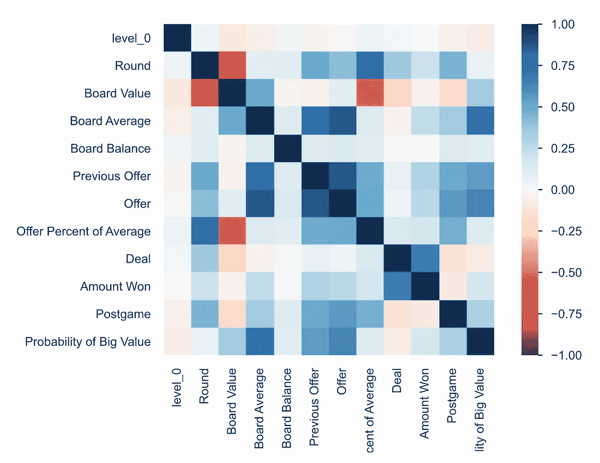

# 我明白了一掷千金是如何运作的

> 原文：<https://towardsdatascience.com/i-figured-out-how-deal-or-no-deal-works-kind-of-875e63a8cef6?source=collection_archive---------17----------------------->

## 小心，银行家

这是 a 的第三部分？？部分系列，其中我揭开了方法和疯狂的交易或没有交易。想叙叙旧吗？下面是零件 [*一个*](https://jaredstock.medium.com/whats-the-deal-with-deal-or-no-deal-449c76d10eb5) *和* [*两个*](https://jaredstock.medium.com/what-do-you-learn-from-50-games-of-deal-or-no-deal-ca8f62fa101a) *。*

我有理由相信我目前拥有 NBC 演播室之外最大的*一掷千金*数据集。我记录了超过 100 场比赛，一轮接一轮，一丝不苟，代表了近 800 轮比赛。利用这些大量的数据，我开始解开这个节目。

## 让我们看看里面有什么

现在我有了所有这些数据，最好的办法就是开始可视化它。作为数据验证的一部分，我运行了`pandas-profiling`,它给了我一些很好的统计数据和每个特性的可视化，但我得到的最有趣的东西是这个显示每个变量如何相互影响的关联图。

使用 Pearson's r 的相关图。忽略 level_0，它是一个指数，不存在。正值表示变量一起移动，负值表示变量反向移动。

我们可以立即看到变量高度相关的几个地方。之前的出价与当前的出价高度相关，这支持了我的观察，即出价通常不会在游戏过程中大幅变化。董事会平均值(或期望值)也与出价金额高度相关。我们还可以看到，游戏回合与报价呈负相关。乍一看，这似乎有悖常理。但是，大多数游戏都不是烧钱的，所以后期的游戏优惠反映了人们在消除了他们所有的大价值后试图收回一些钱。

因此，让我们做下一个合乎逻辑的事情，只是为每个游戏绘制每一轮的报价(加上一些其他东西)。当我这样做的时候，我得到了这个非常漂亮，难以理解的图表:

每场游戏过程中的出价(彩色线)，这些游戏中每轮的期望值(褪色的彩色线)，以及每轮的平均出价(蓝色粗线)。每一个彩色点显示了参赛选手在每场比赛中的交易位置，因此超出该位置的线显示了假设的报价。

这是非常漂亮的，如果只是有一点点帮助，但我们可以做得更多。我们怀疑银行家的出价遵循了董事会预期价值的某个比例，所以让我们把它画出来。

报价占预期值的百分比(Y)与四舍五入(X)

我们可以看到一个非常明显的上升趋势，但看到每个游戏都重叠，这仍然有点混乱。让我们后退一步，回忆一下是什么让我踏上了这段旅程。我想弄清楚银行家是如何工作的，并向你揭示他们的秘密，忠实的读者。因此，如果我想了解银行家是如何操作的，看到每一场比赛的进展并不能提供太多信息。我想去掉每场比赛的细节，只看总的数据。所以，如果我用一个方框图进一步抽象事物，我会得到这个绝对的宝石:

@银行家，这是你？

这是值得细想一下的。我们可以很清楚地看到庄家的出价在游戏过程中是如何变化的。正如人们所推测的那样，每一轮的出价都非常接近预期价值的一部分。这是我一直在寻找的确凿证据。

这张图表告诉了我们很多。很明显，在报价中有潜在的*模式*，但没有潜在的*算法*，至少在我的想象中是这样的。起初，我想知道银行家是否只是一个拿着 Excel 表格的制片人，处理数字并果断地提出报价，但很明显，无论是制片人还是扮演银行家的演员，都有人在幕后操纵并提出独特的报价(至少在正常播放期间)。

这让我想到了我的第二个体会。虽然每个提议都有一定程度的自由裁量权，但它是由董事会之外的各种事情驱动的。银行家在一个系统中工作，这个系统有规则，但是这些规则会改变，有时会被打破。庄家可以在关键时刻向参赛者提供低价，为游戏增加一些戏剧性，开个玩笑，或者只是出于纯粹的，美味的怨恨。银行家有护栏，他们有时仍然会超越护栏，但在大多数情况下，报价会根据董事会和本轮的预期价值在一定范围内波动。这种故意的混乱是不会说话的电脑做不到的。

虽然这些认识意味着我不能逆向工程一个完美的假银行家算法来为我运行*和*游戏，并完全取代银行家，但这意味着我仍然可以通过一些机器学习创造一个半完美的银行家近似器(正在申请专利)。有了这种力量，我可能比除了银行家自己以外的任何人都更清楚这个游戏是如何运作的。

## 运气、时机和勇气

这就包括了我们最喜欢的注册金融分析师，所以让我们转向参赛者。Howie 经常称 *DoND* 为“运气、时机和勇气的游戏”一个玩家需要这三样东西才能在游戏中真正成功。我见过如此多的参赛者拒绝了他们在比赛中的最高出价，随后只是兴登堡他们的董事会，最终带走了一小部分如果他们在正确的时间离开他们可以得到的东西。

所以，让我们来看看参赛者在比赛结束时拿走了什么。只是为了好玩。

只有一个人在游戏的最后阶段还价，成功击败了他们的最佳报价。

在这个图表中，零意味着有人接受了他们游戏的最佳报价。我们可以看到，大多数人没有接受他们的最佳报价，错过了许多潜在的奖金。事实上，平均理论“损失”超过 10 万美元！这被一些大的异常值扭曲了(这个可怜的傻瓜错过了 840，000 美元)，但即使是中值损失也是 66，000 美元。参赛者经常把他们的*运气*推得有点过了，而没有考虑到*时机。*

`*<caveat>*`

*我应该说，这不是根据某人的情况来评估他是否做了一笔好交易——我只是在考虑他们是否应该接受银行的提议，而不是他们是否应该坚持到底。你可以争辩说这两件事是相关的，你可能是对的！考虑你箱子里的东西是这个游戏的一个关键因素。但由于我专注于银行家的报价，我通常不会记录某人的情况，除非他们到了最后，因为那是他们赢得的。所以，我不能绝对肯定地说这些参赛者的决定是好是坏。但他们中的大多数人可能做了错误的决定。*

`</caveat>`

在*和*赢意味着侥幸赢了比银行家期望的更多的钱。该节目存在的事实意味着 NBC 愿意接受每个玩家 131，478 美元的假设平均支出(在我的数据集中，平均实际支出是 108，332 美元，所以他们做得很好)。所以，如果你能得到比这更高的报价，你就已经打败了银行家。这是对该剧所利用的游戏的根本误解。*一掷千金*这不是一个关于信念的游戏，不管它有多想要。这绝对不是在你的案例中获得一百万美元并坚持到底。

这不是大多数玩家玩游戏的方式。在游戏中，每个人——支持者、观众，甚至我们闪亮的男孩豪伊——都积极鼓励处于危险境地的参赛者简单地*相信*他们的案子在棋盘上有最大的价值，而事实上，在这一点上他们只是在赌博。这部剧纯粹是*胆量*。有时它会起作用，参赛者的勇气会得到相应的回报，但更多的时候，它会灾难性地失败。

如果你愿意像赌博一样对待这些决定，你可以在游戏后期做出更好的决定。但是如果你在不利的情况下仅仅依靠盲目的信仰，你很可能会崩溃。

显示哪一轮竞争者接受报价的直方图。到了第 9 轮，人们通常会选择一张不好的牌。

当然，这才是节目的症结所在！说“不，不要追求 100 万”并不令人兴奋！只要根据概率尽量把你赢的钱最大化！”那场演出糟透了！我不会看的！我们希望看到有人不顾一切坚持到底，把那 100 万美元带回家！

每个参赛者的决定中有许多不同的因素，这些因素决定了带着几块钱离开还是带着一大笔钱离开。虽然我一直专注于模拟银行家的报价，但我不能假装参赛者的决定没有影响银行家。尽管这个节目试图说服我们，尽管我试图证明事实并非如此，但银行家和我们其他人一样也是人。

我无法提出一个明确的数学模型来判断某人是否应该接受交易。至少现在还没有。但现在，我认为我们必须同意豪伊。

这一切都归结于运气、时机和勇气。