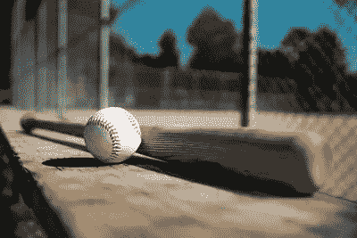

# 我模拟了棒球接下来的 50 年

> 原文：<https://towardsdatascience.com/i-simulated-the-next-50-years-of-baseball-acaffb970a48?source=collection_archive---------31----------------------->



图片由[提供，备货](https://stockup.sitebuilderreport.com/)

1920 年 5 月 1 日。布鲁克林知更鸟队对阵波士顿勇士队，这是有史以来局数最长的一场比赛。26 局后，比赛因天黑而结束，他们打成平局。这场游戏会持续多久？连续 20 局都没有得分，所以这场比赛会不会持续到 30 局以上？不幸的是，我们永远不会知道最长的 MLB 比赛会持续多久……但是我们可以模拟这场比赛来找出现代棒球的极限，也许可以弄清楚罗宾斯和勇士队还剩多少局没有得分。

虽然这始于试图找到一个打破局数记录的游戏，但我意识到我有所有必要的工具去追求其他一些疯狂的记录。因此，我的额外目标是打破一些更荒谬的得分记录，如一场比赛中最多的组合得分(1922 年费城人队和小熊队，49 分)，一场比赛中最多的组合本垒打(2019 年响尾蛇队和费城人队，13 分)，甚至可能是最大的井喷(2007 年流浪者队和金莺队，27 分)。使用 2021 年 MLB 赛季的击球统计数据，我模拟了直到 2070 年的每个赛季(121，500 场比赛)，发现了一些非常有趣的结果。

为了让这个模拟工作，我需要 2021 年 MLB 赛季的真实数据。在制作这个项目的时候，大约有 121，000 次击球亮相，有 12 种不同的击球结果。将这些与基础上的不同场景结合起来，可以产生与现实生活非常接近的模拟。下面显示了一个场景示例。这是为了如果垒是空的，击球手击出一垒或二垒安打。

```
if sum(bases) == 0 % if nobody on baseif indicator == 1 % if batter hits a singlebases(3) = 1; % sets first base to occupiedouts = outs + 0; % no outs addedif top_bottom == 0 % if top of inning, gives stats to away teamrunsA = runsA + 0;hitsA = hitsA + 1;rbiA = rbiA + 0;else               % if bottom of inning, gives stats to home teamrunsB = runsB + 0;hitsB = hitsB + 1;rbiB = rbiB + 0;endelseif indicator == 2 % if batter hits a doublebases(2) = 1; % sets second base to occupiedouts = outs + 0; % no outs addedif top_bottom == 0 % if top of inning, gives stats to away teamrunsA = runsA + 0;hitsA = hitsA + 1;rbiA = rbiA + 0;else               % if bottom of inning, gives stats to home teamrunsB = runsB + 0;hitsB = hitsB + 1;rbiB = rbiB + 0;end
```

为每个基本场景和击球事件添加了类似的代码副本。

在模拟的 50 年中，平均打击率为 0.239，非常接近实际的平均打击率 0.241。同样，模拟中的上垒率是 0.315，而现实中是 0.316(至少在 2021 赛季)。现在我们有了现实的精确描述，我们可以开始模拟游戏了。

看看能否打破 26 局的 100 年纪录。在 2048 年 MLB 赛季的第 983 场比赛中，经过艰苦的 28 局比赛，A 队以 5-3 击败 B 队，成为 MLB 历史上最长的比赛。在 19 局中以 3 比 3 打平后，A 队终于在第 28 局开始时以一局两分的成绩打开了局面，然后在第 28 局结束时将 B 队拒之门外。

在 2062 年 MLB 赛季的第 1257 场比赛中，A 队以 26 比 2 的比分击败 B 队，成为 MLB 历史上第三大井喷(24 分差)。虽然我可以再模拟几组 50 年，试图找到一个创纪录的分数，但我认为最好还是欣赏一下 2007 年流浪者队以 30 比 3 战胜金莺队的比赛，这是 MLB 历史上最大的井喷。

在 2050 年 MLB 赛季的第 1045 场比赛中，A 队以 18 比 9 击败 B 队，两队在比赛中一共打出了 14 个本垒打。这打破了 2019 年响尾蛇队和费城人队对抗并联合 13 场的纪录。

在 2070 年 MLB 赛季的第 2302 场比赛中，B 队以 19 比 14 击败 A 队，共得 33 分。虽然这对两支球队来说都是一个不可思议的壮举，但不幸的是，它没有接近 1922 年 49 分的纪录。看起来我们将不得不等待超过 50 年才能看到任何两支球队接近这一纪录。

对于我想打破的最后一个得分记录，我选择了一场比赛中的组合大满贯。在 2067 MLB 赛季的第 1509 场比赛中，A 队以 15 比 9 击败 B 队，获得 4 个大满贯。这打破了 1986 年至 2015 年期间 4 支不同球队创下的 3 次大满贯纪录。

在这个模拟中，我可以采取许多不同的方向。最长的无安打比赛还是完美比赛？一场比赛最多三分球？最多连续本垒打？所有这些都可以用当前的程序实现。我也可以采取更具分析性的方法，试图找到一个在看分数时最重要的统计数据。击球率较高的球队最有可能赢得比赛吗？领先 4 局后获胜的球队比例是多少？所有有趣的话题都可以在以后的文章中探讨。

打破一些得分记录被证明是一项有趣且相当有趣的任务。这部 28 局的惊悚片证明了 1920 年知更鸟队和勇士队之间的比赛可能至少会多进行几局。B 队遭受的 24 分差距无法与游骑兵队在 2007 年对金莺队的 27 分差距相提并论。如果有什么不同的话，这个项目显示了这种类型的游戏是多么的罕见，他们应该为这种罕见而受到赞赏。