# 📊我在 2020 年研究了 365 个数据可视化

> 原文：<https://towardsdatascience.com/i-studied-365-data-visualizations-in-2020-ac1e0fc9799c?source=collection_archive---------11----------------------->

## 📅一年的数据分析

## 疯狂的 Instagram 数据验证实验📸

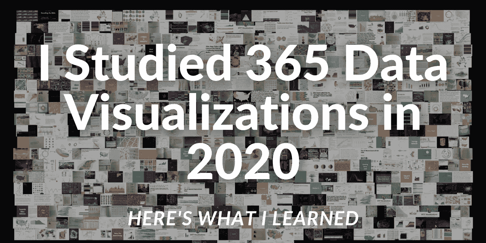

图片来源:由[作者](https://www.linkedin.com/feed/)创作

2020 年 1 月 1 日，我创建了 Instagram 账户@ [VeryData_365](https://www.instagram.com/snowdatascience_/) (最近把账户名改成了@SnowDataScience_)。“非常”是因为我的名字叫艾弗里(我喜欢摆弄“非常”是我名字的事实)，而“数据”是因为我*喜欢*数据；我得说我被迷住了。“365”试图捕捉我将在 2020 年每天研究/发布一个数据可视化的想法。

我创建这个账户的目的是学习更多关于数据可视化的知识。我希望我能从其他人的工作中得到启发，并理解什么时候使用特定的技术，以及什么类型的图表强调了某些要点。从很多方面来说，这次经历对我来说都是一次变革。不仅我对数据可视化艺术的理解和知识增长了，我的网络和社交媒体营销技能也增长了。

我学到了什么？你可以查看我的年中文章，在那里我讨论了前 6 个月。这篇文章解释了我从这个长达一年的数据实验中学到的其他东西。

2020 年，我:

# 学习新的技术和图表

当然还有折线图，条形图，还有大家最喜欢的，饼状图。但是有哪些不太典型的数据显示方式呢？

**文字:**
我了解到当描绘成数据可视化时，文字是多么强大。通常，我们作为人类 ***阅读*** 词语，但如果使用正确，有时我们可以 ***看到*** 词语并理解它们的影响。

《纽约时报》是这方面的奇才。他们的两篇文章让我大吃一惊: [*集会是川普竞选的核心，一大堆谎言和错误信息*](https://www.nytimes.com/2020/10/26/us/politics/trump-rallies.html?auth=login-google) 以及他们的头版标题 [*美国死亡人数近 10 万，无法估量的损失*](https://en.wikipedia.org/wiki/U.S._Deaths_Near_100,000,_An_Incalculable_Loss)

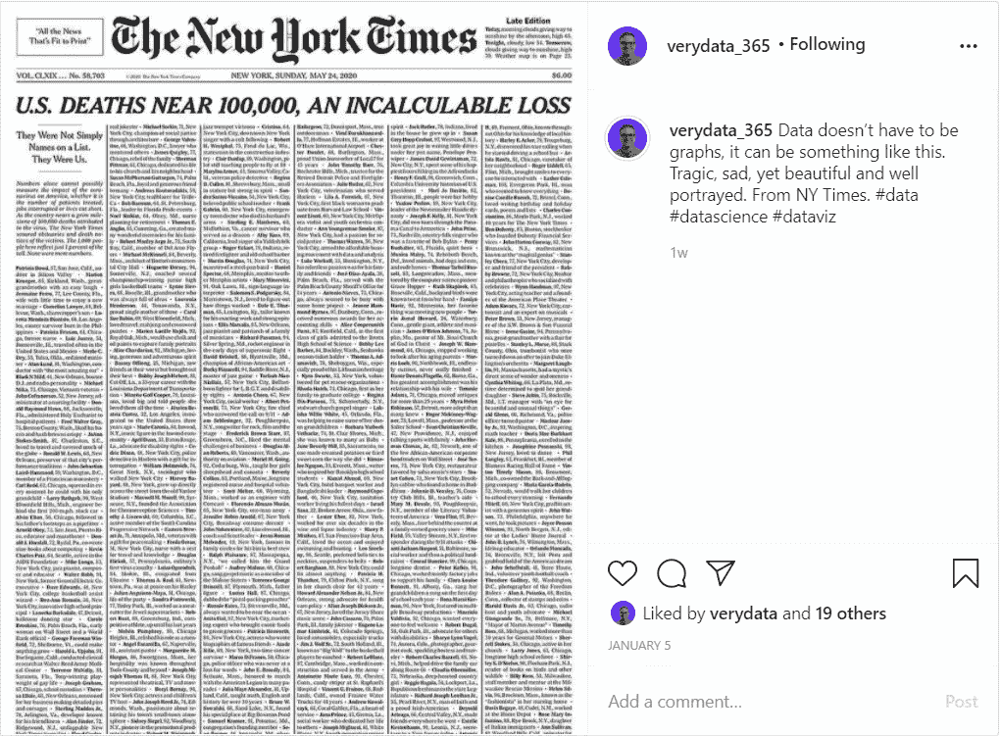

图片来源:纽约时报

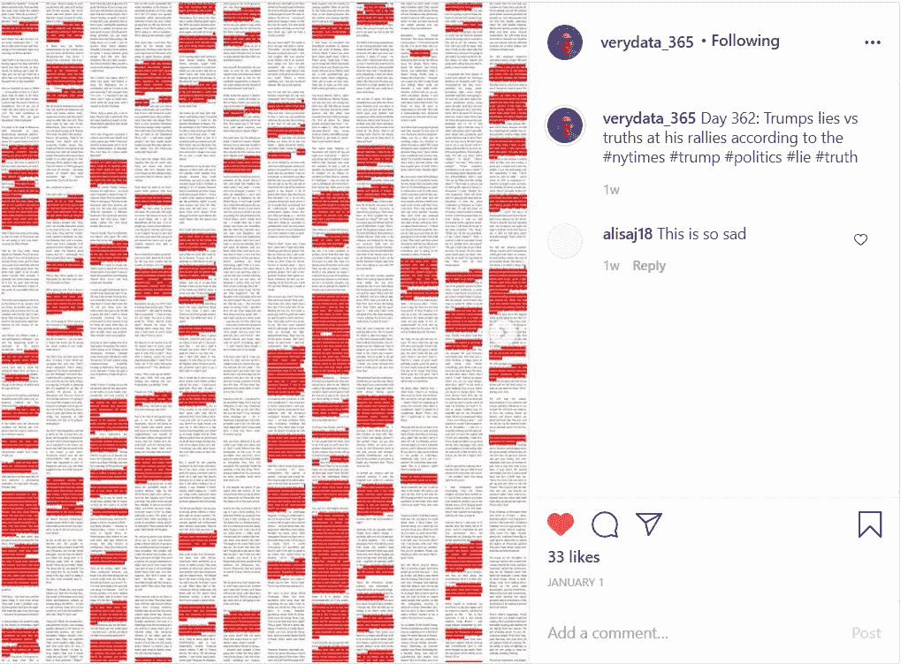

图片来源:纽约时报

**可滚动的数据故事:**

最近，纽约时报和其他创作者发布了通过滚动制作动画的数据故事。这是一个令人难以置信的用户界面，将故事带入生活。这些是数据的未来，即。下面是《泰晤士报》做的一个名为 [*的病毒是如何赢得*](https://www.nytimes.com/interactive/2020/us/coronavirus-spread.html) *:*

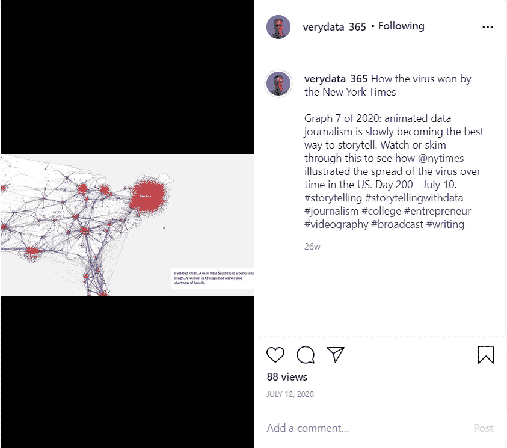

图片来源:纽约时报

Flow Immersive 的业务负责人 Michael DiBenigno 在抖音走红，向世界展示了一种可视化数据的新方法，给了 3d 一个全新的定义

# 开发了一种独创的数据可视化技术

推特+人像。推特头像！他们说一张图片抵得上一千个字。嗯，如果图片是 1000 字呢？我想出了这个问题，“某人的社交媒体是如何评价他们的？”我想，“哇！Twitter 实际上只是人们在说话。如果我们用他们的话画一幅肖像会怎么样。”砰。推特肖像诞生了。

Twitter Portraits 只是简单地提取某人在 Twitter 上发布的每个单词，进行一些分析以找到他们使用最多的单词，并将这些单词作为颜色遮罩应用到图片上，单词的大小与该单词的使用次数相关联。

我喜欢分析我的朋友或最喜欢的名人，看看他们的肖像是什么样子。

这是我高中时的推特。我看到了“女孩”、“足球”和“爱情”。啊，又年轻了！我现在有了一个新的 Twitter，在那里我可以更多地谈论数据。

图片来源:由[作者](https://www.linkedin.com/feed/)创作

这是最近被禁的推特，即将成为美国前总统的唐纳德·特朗普。“很好”、“现在”和“工作”对我来说很突出。我也想过为他的演讲做这个。

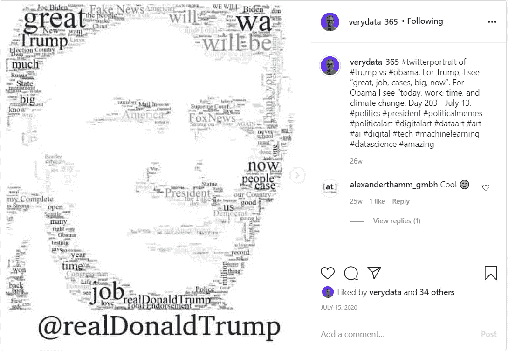

图片来源:由[作者](https://www.linkedin.com/feed/)创作

还有一些我最喜欢的 NBA 篮球运动员:

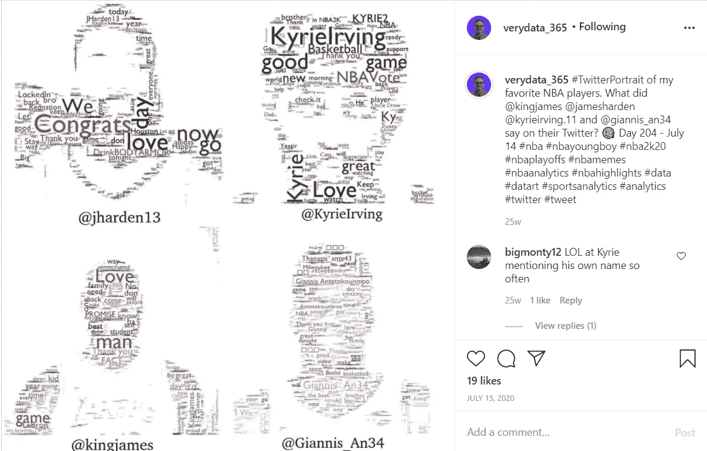

图片来源:由[作者](https://www.linkedin.com/feed/)创作

# 找到了大量研究数据的资源，即

**集合:**
以下是在任何给定主题下，从世界各地寻找集合并发现数据可视化的惊人之举。

*   [流动数据](https://flowingdata.com/):吸收互联网上最好的数据
*   原始的、有趣的、病毒式的、大量的评论
*   [走向数据科学](https://towardsdatascience.com/data-visualization/home):如何制作数据的教程
*   [夜莺](https://medium.com/nightingale):深度数据故事
*   [很酷的信息图](https://coolinfographics.com/):大量的信息图以一种美学的方式展示数据
*   [Tableau 公共画廊](https://public.tableau.com/en-us/gallery/?tab=viz-of-the-day&type=viz-of-the-day):突出 Tableau 的最佳创意

**Creators:**
以下是观看数据可视化的好去处。

*   [纽约时报图形](https://twitter.com/nytgraphics?ref_src=twsrc%5Egoogle%7Ctwcamp%5Eserp%7Ctwgr%5Eauthor):世界上最好的数据可视化
*   [信息是美丽的](https://informationisbeautiful.net/):直观、流畅的数据显示
*   [图表:讲故事的数据](https://www.chartr.co/):有趣的、相关的、每周一次的数据，即讲述故事的数据
*   [金融时报图表](https://www.ft.com/graphics):有力、严肃的图表
*   [五三八](https://fivethirtyeight.com/tag/data-visualization/):政治+体育

# 发现数据艺术

数据是一门技术性很强的学科，但也不尽然。我找到了几十个人们把数据变成艺术的例子；让它变得美丽。

一年中，有好几次我都注意到了 StoxArt[。把枯燥的财务数据和生命注入其中，创造出美丽的风景。参差不齐的特斯拉山是什么样子的？比特币的波峰波谷怎么样？](https://www.stoxart.com/gallery)

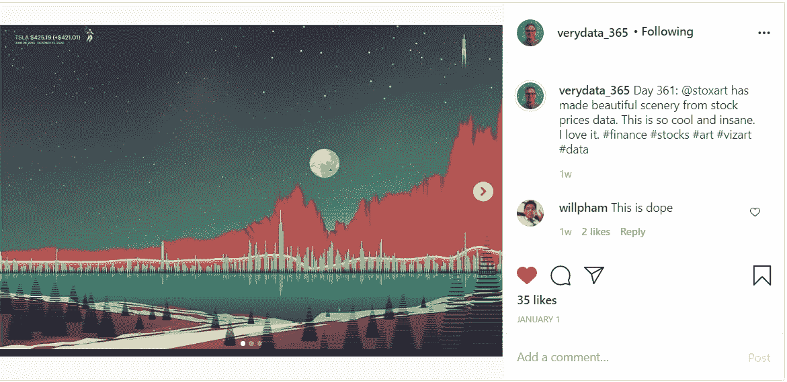

图片来源:StoxArt

Nick Rougeaux 用一种全新的方式将巴赫的杰作融入到这种“抽象”艺术中，实际上描绘了你可能知道的东西。

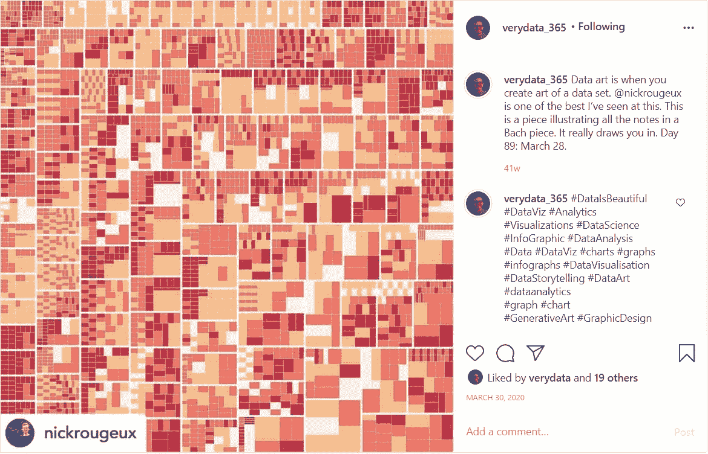

图片来源:Nick Rougeaux

当我象征性地将 NBA 球员的脚浸在墨水中，并绘制他们在球场上创造的独特形状时，我创造了自己的篮球主题抽象艺术作品。

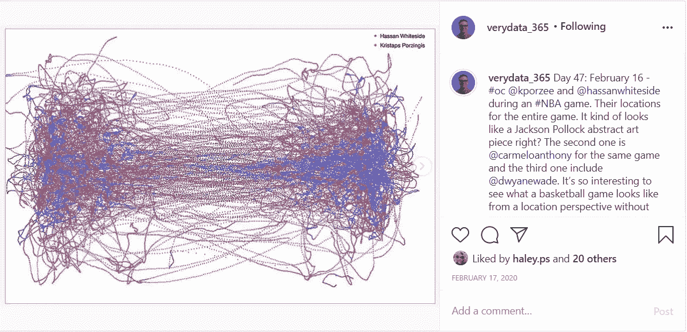

图片来源:由[作者](https://www.linkedin.com/feed/)创作

# 爱上了塔夫特

我很幸运地在二月份参加了一个凝灰岩可视化课程。我现在有他所有的四本书，并在推特上关注他。我完全相信他说的话。在我的书房里，我看到他的技术被反复谈论。以下是我最喜欢的一些。

如果你没有读过任何 Tufte，并且你正在做数据，请停下你正在做的事情，[读一些 Tufte](https://www.amazon.com/gp/product/0961392118/ref=as_li_tl?ie=UTF8&camp=1789&creative=9325&creativeASIN=0961392118&linkCode=as2&tag=averyjsmith0e-20&linkId=4d87cb4da08c6a0e0020ecaa46650d78) 。

**迷你图:**

Tufte 的数据-油墨比:

> “最重要的是展示数据”

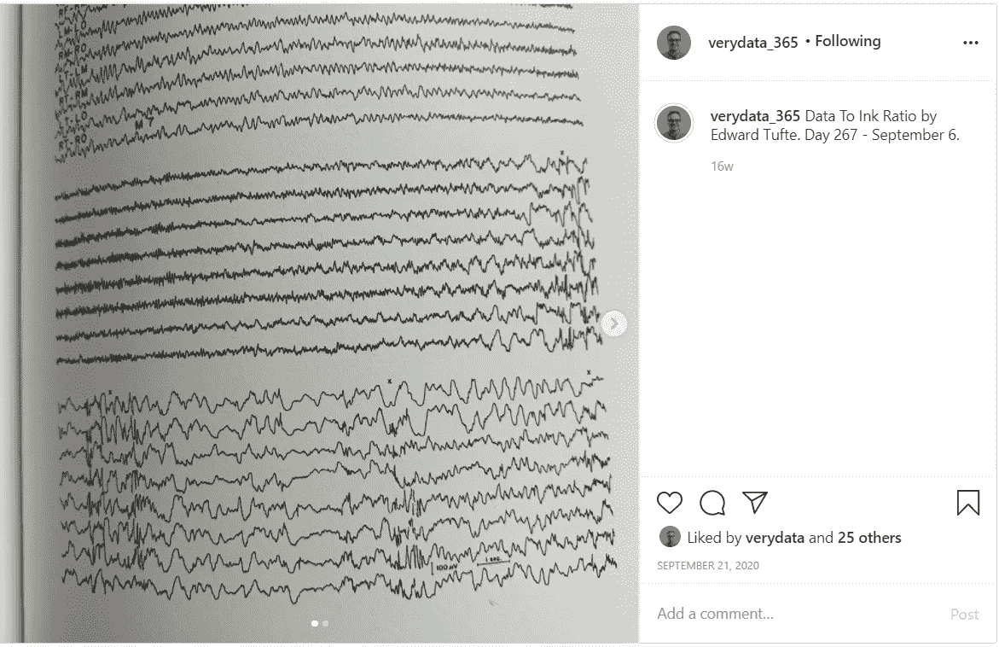

图片来源:爱德华·塔夫特

[罗沙汗](https://www.linkedin.com/in/roshaankhan/)的*搜索 2020 年:* 这些从技术上来说是山脊图，但足够接近迷你图。罗尚恩优雅地强调了世界在一年中不同地方搜索的词汇，这样我们就可以进行关联和比较。

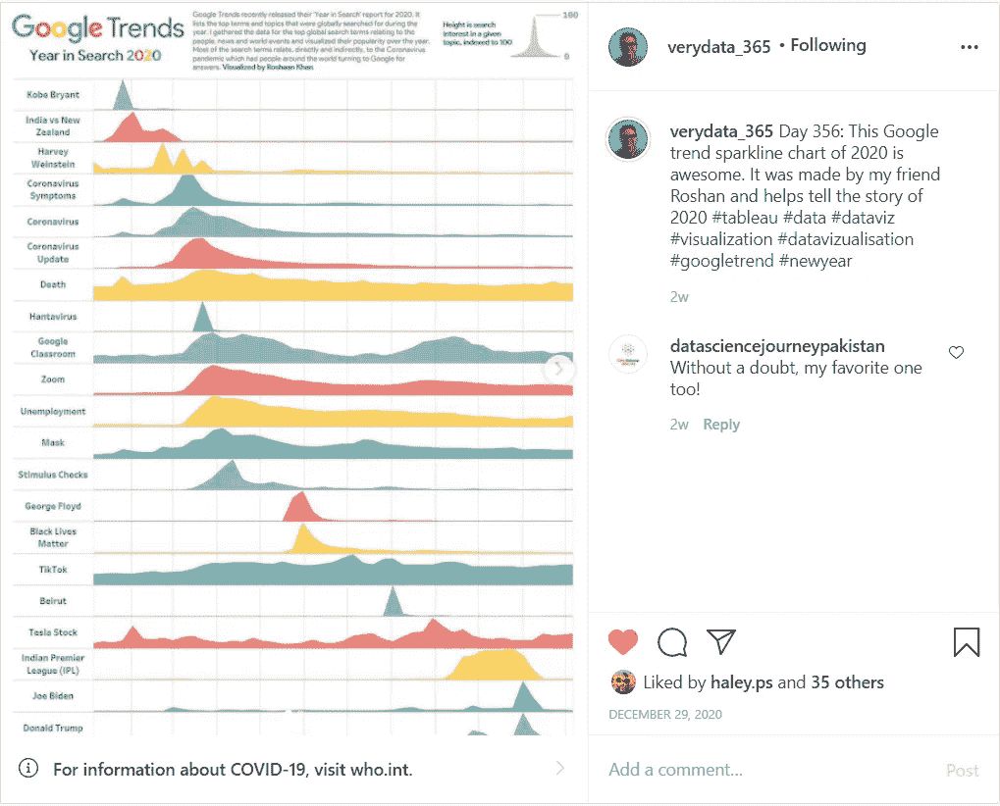

图片来源:罗沙汗

**小倍数:**

*NBA 球队最常见的拍摄地点*作者[欧文·菲利普斯](https://www.instagram.com/llewellyn_jean/)展示了一次比较许多图表并理解更大的画面是多么有趣。

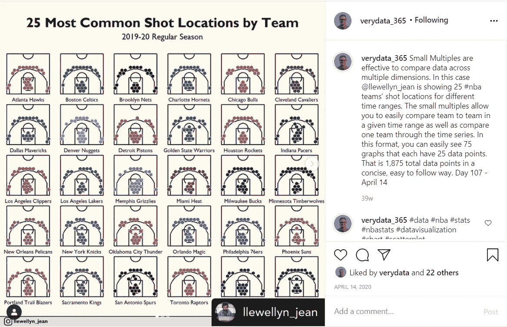

图片来源:欧文·菲利普斯

[Klara prps TL](https://www.instagram.com/k.proepstl/)用抽象的方式，创造性地向我们展示了地铁上几个人的样子。

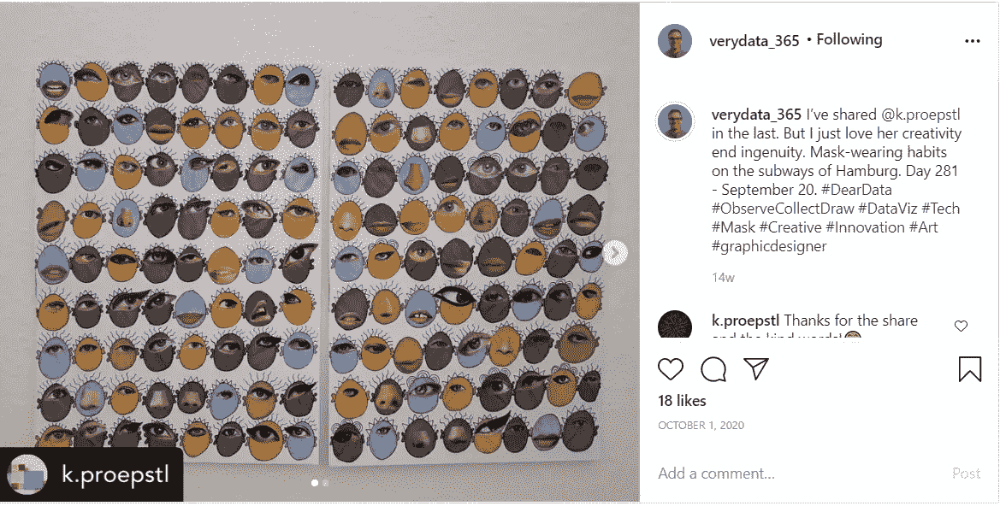

图片来源:Klara Prö pstl

凯特·格林布鲁克通过小塑料回收龟展示了我们对地球的影响。

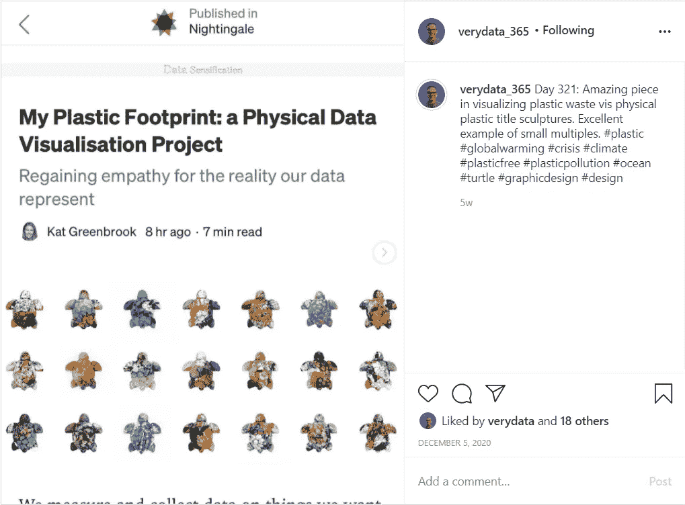

图片来源:Kat Greenbook

# 遇到了很多很酷的志同道合的人

这一年来，我发现了一些很棒的数据人员。

*   凯尔·帕斯托尔经营着[@ datastufplus](https://www.instagram.com/datastuffplus/)，他帮助其他人的 viz 迅速传播，并分享他对数据可视化的热情。
*   Aaron Penne 是一位不可思议的艺术创作力艺术家，他的杰出作品可供购买，所有收入将捐给慈善机构。
*   我遇到了 Kate Strachnyi，她是 LinkedIn 上一位善良的数据女王，也是许多数据原则的指导者。

# 读一些很棒的书

我喜欢数据可视化书籍。以下是我今年最喜欢的:

*   史蒂夫·韦克斯勒、安迪·科特格里夫和杰夫·谢弗的《仪表板大全》;在任何情况下突出显示您想要的仪表板。
*   [用数据讲故事](https://amzn.to/3nqgrUR)科尔·克纳弗利奇；dummie 的数据入门指南。
*   [设想信息](https://amzn.to/3pWhs98)由爱德华·塔夫特提供；涉猎使数据变得简单的复杂性。
*   [观察，收集，绘制！Giorgia Lupi 和 Stefani Psavec 的视觉杂志](https://amzn.to/3oo8mBs)；引领您体验基于数据的日志记录。
*   柯克·戈德贝里的《蔓生球》;描述了 NBA 的历史和数据在发展中的作用。
*   [图表如何说谎](https://amzn.to/39cED8c)阿尔贝托·开罗；说明了图表是如何被用来传播错误信息的。
*   彼得·戈尔曼著[勉强地图](https://www.barelymaps.com/book/barely-maps-the-book)；讲述了一个简单的故事，关于一个人，他的自行车，以及他在越野自行车骑行中看到的模式。这本书确实鼓舞人心，是一个有趣的故事。

# 快速消防知识

*   人们喜欢地图。地图是人们能够立即理解和联想到的东西。这是美国许多城市的字体地图。这是另一张显示美国街道上不同自然名称的照片。
*   热门话题:有史以来最好的数据可视化是[神奇宝贝卡片](https://www.instagram.com/p/CF4n71pgUlu/)？不要@我。
*   数据视频更有诱惑力和教育意义。看看这张显示两年各州谷歌搜索排行榜的。下面是另一部[关于大片兴衰的](https://www.instagram.com/p/CIjOw6wgiBp/)动画。
*   Data viz 在 2020 年占据了前座席位。我们经常检查这个来自约翰·霍普斯金的仪表板。
*   并非所有的数据可视化[结果都是](https://www.instagram.com/p/CHIbGxagYEg/) …
*   [种族条形图](https://www.instagram.com/p/CBk21BLgQCQ/)很好玩；人们喜欢它们。中国会赶上美国吗？观看以找出答案。

图片来源:作者创作

# 很棒的一年？

这是充满压力的一年。这是悲惨的一年。但这并不意味着今年不会很棒。2020 年对我来说是伟大的一年。通过这次实验，我学到了很多东西。我迫不及待地想看看数据可视化的 2021 年会带来什么！

欢迎继续在 [Instagram](https://www.instagram.com/snowdatascience_/) 上关注我的旅程！

*附言:这些书的一些链接是亚马逊的附属链接，如果你最终从链接上买了这本书，我会收到一分钱:】*