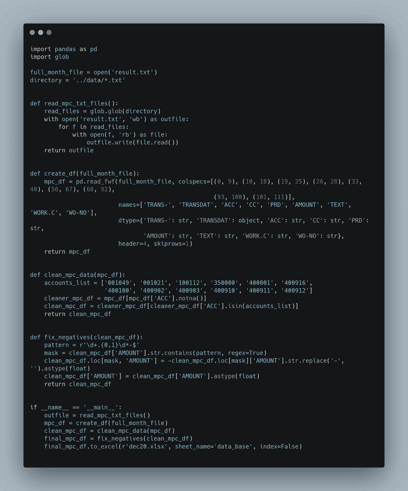

# 我偶然发现了数据科学

> 原文：<https://towardsdatascience.com/i-stumbled-into-data-science-by-accident-part-1-52498c44206e?source=collection_archive---------28----------------------->

## [办公时间](https://towardsdatascience.com/tagged/office-hours)，引导数据进行改进

## 如果像我这样的假人能学会编码和分析数据，任何人都可以！


我自己的照片:)

似乎人们从各种不同的背景进入数据科学。很明显，进入这个领域没有“最佳”方法。我觉得分享我自己的故事可能会很有趣。

我在 LDC(最不发达国家)的一家制造公司做了 15 年的 CEO。一些人口统计数据(来源:【http://hdr.undp.org/en/countries/profiles/PNG】T2

*   80%的人口过着自给自足的农村生活。
*   平均年龄= 22 岁。
*   教育指数= 0.439(定义:教育指数是平均受教育年限(成人)和预期受教育年限(儿童)的平均值。
*   城市人口:13.2%。自给自足的农村人口 82.7%。

我们一直在努力使我们的流程现代化，有过一些成功，也有过一些失败，但我们总能从经验中学到一些东西。十多年来，我的职业生涯一直是一个接一个的改进项目，说实话，我喜欢这样。也许是未来文章的主题。

最新的是一个改变我们计划和报告生产方式的雄心勃勃的项目。

许多年来，我们的生产计划过程是非正统的。没有与其他利益相关者协商或沟通，生产经理就会武断地决定他们的生产计划。该计划基于 excel 电子表格，只有生产经理可以访问。任何类型的生产数据第一次进入该公司的企业资源规划系统(ERP)是在一天的生产完成后 24 小时。将手写的纸质生产记录表交给两名生产文员，他们的唯一任务是在 ERP 中创建新的工作订单，以匹配生产记录表，并立即关闭工作订单。成品的数量会增加，而原材料会减少。我们称之为“反冲”。每个人都知道事情不应该是这样的，但是像许多公司一样，我们反对改变。

冒着显而易见的风险，这似乎是一种**糟糕的**生产计划和报告方式。这种方法产生的问题很多，但这里有一些:

*   没有与销售部门协商这是否是满足客户需求的合适产品，也没有与供应链部门协商以确保我们有足够的原材料。
*   信息总是晚 24 小时，所以股票在卖出前会在地板上停留 24 小时。
*   缺乏可见性和可疑的生产交易记录意味着我们的库存水平的有效性总是有一个问号，这经常反映在盘点中。生产经理通过在他的物料清单(BoMs)中添加“脂肪”来处理这个问题，以确保在盘点时总是有原材料的收益来抵消成品的损失。
*   缺乏质量信息意味着无法对生产绩效进行有意义的分析

我可以继续说下去，但你会明白的。

在我们赢得了一些唾手可得的果实后，我们*最终*决定解决这个问题。我们知道这将是一场艰难的比赛，团队需要几场胜利来给他们信心，以承诺如此重大的变革，这将涉及并影响如此多的利益相关者。

*   我们需要销售人员生成一个滚动的 3 个月预测，该预测将作为 ERP 生成建议生产计划的基础。该生产计划将分发给所有利益相关方，他们将有 48 小时的时间做出反馈。一旦计划最终确定，生产计划将被“锁定”到 ERP 中，并根据该计划生成工作订单。
*   工厂将按照该计划工作，当每个完成的产品托盘下线时，只需贴上 ERP 生成的唯一条形码并扫描它，就可以完成更新。所有的脂肪都从 BoMs 中去除了，所以原材料消耗尽可能的接近准确。
*   采购和供应链也将受益，因为他们的采购计划将由相同的销售预测和生产计划提供信息。ERP 将每周生成一个建议订单列表，该列表将被审查然后执行。

对于读者来说，这听起来非常明显，因为这是非常标准的，并且应该一直这样做。我可能永远也不会知道为什么这家公司一开始就开始“反冲洗”。

重要的是要理解为什么改变如此困难:人和组织天生厌恶改变。无论从金融还是非金融的角度来看，变革都是艰难的、高风险的、昂贵的。技术从来都不是有效进行可持续变革的限制因素。赢得人心是关键因素。

它花费了大量的时间和工作来达到上线的程度，但我们做到了，团队感到非常自豪和成就感。上线后的头几个月，事情似乎进展顺利，但后来我们注意到总分类账中出现了奇怪的、有时是无意义的数字。

例如，有时从库存中扣除的原材料的价值大于生产的成品的价值。想一想:这显然是荒谬的，但没有人能解释为什么会发生这种情况。

问题在于，所有制造会计交易都是通过自动流程从企业资源规划系统的制造模块转移到总分类账的。这个过程的记录被捕获并记录在 txt 文件中，我们称之为“日志”。每个日记账可能包含 15，000 个或更多不同的交易。

都说一张图胜过千言万语，下面就来几张截图说明一下。这是一个很小的文件，因为它发生在 1 月 2 日，这通常是一个非常安静的时间:


一天的日志文件的顶部。


日记本的中间部分


日记的摘要部分

很明显，这个文件有很多问题:

*   缺少一致的分隔符(逗号、空格、制表符等)。它是分隔符的混合。这使得导出。txt 文件转换成 excel 电子表格。
*   交易日期仅在每隔一行出现，因为第二笔交易是对销交易。我假设读者有基本的会计知识。为了分析，我们需要每笔交易的日期。
*   数据在文本文件中一式三份，该文件已被配置为以 3 种不同的格式显示相同的数字。中段和总结是多余的。这使文件变得臃肿不堪。从现在开始，我们将参考顶部，因为清理数据的关键部分是剥离中间部分和摘要。
*   负值在数字的末尾有负号，而不是在数字的前面。这给任何识别负数的软件带来了问题。
*   为了执行任何有意义的分析，我们不仅需要转换一个文件，还需要转换 28–31 个文件。每天一个。这些需要合并成一个文件。
*   尝试将如此大量的数据导入到 excel 中是一项挑战。我发现 excel 大约有 200，000 行。这个问题要求我们在一个月内处理超过 140 万行。

没有人知道如何在每月超过 100 兆的数据中找到“大海捞针”的方法，以找到错误交易的模式。我们都有自己的理论，我们试图在小样本数据上进行测试，但每次都失败了。

这种情况持续了几个月，在此期间，我们被迫对总账进行越来越大的“总”调整，以使数字看起来像我们认为应该的那样。这对任何经理来说都是一种可怕的感觉，因为你根本不知道自己是在报道事实，还是在歪曲公司的表现。

更糟糕的是，这个问题是实质性的，而且越来越严重。

压力和挫折感累积到团队变得如此沮丧和失望的程度，以至于他们达成了一个普遍的一致意见，即最好的解决方案是退回到旧的做事方式。投入了如此多的时间和精力来实现这一点，这对团队来说是一个毁灭性的打击。我天生固执。这充其量是一件喜忧参半的事情。因此，我是一个反对的声音。

我向团队承诺:“给我 30 天。如果在那段时间内我不能解决，我会同意恢复原状。在那 30 天里，我将只关注这个问题。我需要你们都站出来，做好我的本职工作，这样我才能集中精力”。我是首席执行官，所以他们别无选择，只能同意。自然有很多怀疑:当会计师、IT 专业人士和顾问都失败了，我怎么可能成功？非常合理的怀疑，因为我不是那些东西。我是个多面手:什么都懂，什么都不懂。

不过，交易就是交易。

我遵循的过程描述如下。事后看来，我现在知道这不是一个伟大的过程，但当时我是随着我的进步才明白的。我会继续提高。

*   **第一步**:手动导入数据。使用定点分隔符将。第一次尝试花了 9 个小时处理一个文件。我无意中选择了一个较大的文件。这显然不是一个实用的方法。不仅耗时，而且容易出错。不过有一个好处:我学到了很多关于数据的东西。我将这个手动过程重复了两次，将每个文件的处理时间减少到了 3 小时。
*   **第二步**:录制一个宏。我以前从来没有这样做过，但这似乎是一个明显的下一步。鉴于我已经有了一个缓慢但有效的手动处理文件的过程，使用宏可以使它更快更一致。每个文件的时间减少到 15 分钟。将每天的文件组合成一个合并的月文件仍然是手工的。

此时，也就是第 5 天，我已经有了足够的清晰信息来诊断这个问题，但是我将稍后再回到这个问题。在清理这些数据的过程中，我意识到这些文件中有很多我们没有使用的有价值的信息。

这些信息可用于持续的绩效管理，因此将目标从仅仅解决眼前的问题转变为建立一个可重复的过程，使生产经理能够轻松地分析这些文件中包含的事务性数据是有意义的。

*   **第三步**:写一个 VBA 的剧本。我一生中从未写过代码。VBA 是我的“入门毒品”。通过一些搜索和对我愚蠢问题的一些非常有用的回答，我编写了一个 VBA 脚本，它可以在 60 秒内处理每个文件。这是一个很大的改进，但是为了进行有意义的分析，我仍然需要手动将每个日志文件组合成一个合并的月文件。

```
'Macro to format and align text data from Iscala WIP JNL MPC report - Michael Kingston 03/05/2020
'Main Routine
Sub WIPJNLMPC()
Sheets("WIPJNL").Select ' Make WIPSUMMARY the active worksheet
Range("A1").Select
LoadDataWIP
LoadDataSUM
LoadDataTOT
Sheets("WIPJNL").Select ' Make WIPSUMMARY the active worksheet
Range("A1").Select
Exit Sub
End Sub
'================ Sub routines to on WIPJNL Worksheet======================================
Sub LoadDataWIP()
    Sheets("WIPJNL").Select ' Make WIPSUMMARY the active worksheet
    Range("A1").Select

    With ActiveSheet.QueryTables.Add(Connection:= _
        "TEXT;C:\MacroTemplates\WIPJNLData.txt", Destination:=Range("$A$1"))
        .Name = "data1"
        .FieldNames = True
        .RowNumbers = False
        .FillAdjacentFormulas = False
        .PreserveFormatting = True
        .RefreshOnFileOpen = False
        .RefreshStyle = xlInsertDeleteCells
        .SavePassword = False
        .SaveData = True
        .AdjustColumnWidth = True
        .RefreshPeriod = 0
        .TextFilePromptOnRefresh = False
        .TextFilePlatform = 437
        .TextFileStartRow = 1
        .TextFileParseType = xlFixedWidth
        .TextFileTextQualifier = xlTextQualifierDoubleQuote
        .TextFileConsecutiveDelimiter = False
        .TextFileTabDelimiter = True
        .TextFileSemicolonDelimiter = False
        .TextFileCommaDelimiter = False
        .TextFileSpaceDelimiter = False
        .TextFileColumnDataTypes = Array(2, 4, 2, 1, 1, 1, 1, 2, 1, 2)
        .TextFileFixedColumnWidths = Array(10, 9, 7, 7, 7, 7, 21, 26, 7)
        .TextFileTrailingMinusNumbers = True
        .Refresh BackgroundQuery:=False
    End With
    Cells.Select
    Columns("A:A").Select
    Selection.Find(What:="- - - -", After:=ActiveCell, LookIn:=xlFormulas, LookAt _
        :=xlPart, SearchOrder:=xlByRows, SearchDirection:=xlNext, MatchCase:= _
        False, SearchFormat:=False).Activate
```

这是一个相当长的脚本，所以这只是头部。

*   **第四步**:发现 Python 和熊猫，感谢 Medium 和数据科学(当然还有 Google)。令人惊叹的 python 开发人员社区和在线资源帮助我编写了一个非常简单的 Python 脚本来遍历目录中的所有 txt 文件夹，清理它们并输出一个完整的月文件。



一个简单的 python 脚本。每个人都有起点。

**调查结果**:

根据这些数据，许多问题变得很明显。

*   我们曾错误地认为 ERP 被配置为全面使用加权平均成本。实际情况是，生产使用标准成本，而业务的其他部分使用加权平均。
*   因为我们没有意识到这一点，所以我们没有意识到这两名生产文员在旧流程中关闭每个工作订单后正在进行标准成本累计。任何预部署研讨会都没有记录或提及这一步骤。一旦我们对新流程进行了更改，标准成本累计就停止了，随着时间的推移，标准成本和实际成本越来越远。这导致了生产差异。

表格将有助于理解接下来的几点


原始制造账户

*   制造帐户结构没有适当的差异帐户。只有一个差额账户。好的做法是将差异类别分开，以便进行差异分析，从而达到减少差异的目的。下表显示了我们认为在我们的环境中应该如何做:


新制造账户

这是一个简单的方法。人们可以把这个提升到 n 次。有更多的差异帐户允许更大的粒度，但太大的粒度可能会有问题。对于我们这种规模的行动，我们认为这已经足够了。接吻(保持简单)是一个很好的经验法则。

*   在旧制度下，差异账户既不需要也没有被正确使用。通过在一个步骤中创建工作订单、关闭工作订单和累计标准成本，意味着无需报告任何差异。然而，在新系统下，需要适当的差异账户。
*   自动记帐计划(AAS)配置不正确。当差异发生时，它们不是被过账到差异账户，而是被过账回原材料账户。这就是为什么我们在月度损益中看到原材料成本>成品成本。“tell”是每个工作订单的结束交易:它将是针对 001021 的(有时很大的)借记交易。**这不应该发生**。这不合逻辑。但它确实发生了，而且**只发生在工作指令**的关闭交易上。这是关键的洞察力。在我们的 ERP 中，差异交易仅在工作订单的结算交易时创建(根据文档)。确定有问题的交易后，我可以查看该交易的详细数据，这些数据清楚地显示，在工作订单结束时，差异被过帐到帐户 001021，在某些情况下，被过帐到帐户 100112。这是不正确的。

**这是我们在总账层面看到大量错误数字的根本原因。**

*   一些工作订单结转到上月底(EOM)，导致 001049 在 EOM 不平衡。一个相对较小的问题，但有改进的机会。
*   一些工作订单没有正确关闭。在我们的 ERP 中，当工单被正确关闭时，它会变为状态 8。但是，如果出现问题，工作单将变为状态 7。调查显示，原因是物理原材料从仓库转移到工厂，没有匹配的 ERP 交易。实际上，原材料在工厂里并被使用，但是从 ERP 的角度来看，原材料并不在那里。当生产部门关闭工作单并贷记原材料时，系统发现没有足够的原材料来关闭工作单。这导致受影响的工作单被归类为类型 7。显著的改进机会。

**解决方案**:

*   **第 1 步**:根据上表重新组织制造账户
*   **步骤 2** :更新 AAS 以确保所有交易都被过账到正确的账户，并且不需要人工干预来“纠正”由不正确的 AAS 配置引起的错误。
*   **步骤 3** :常规标准成本累计，以及将整个组织转移到标准成本的计划，以便能够监控采购价格差异(PPV)。
*   **步骤 4** :修改流程，增加一个预检步骤，以确保在工作指令开始之前，工作指令所需的所有原材料都在工厂中，无论是实物还是系统。
*   **步骤 5** :确保所有工作指令在 EOM 翻转时关闭。
*   **步骤 6** :计划将整个组织转移到标准成本。

**给我的教训:**

*   有疑问的时候，去看看数据。不要一味的相信数据，而是要以数据为指导。
*   有很多很棒的工具可以帮助你处理具有挑战性的数据，如果你提出要求，有一个很棒的社区愿意提供帮助。
*   我真的很喜欢挖掘数据和写代码。新的爱好/激情。
*   知道什么时候面对困难要坚持，什么时候要退缩，并不总是容易的。相信你的直觉，给自己一个时间限制。如果你不能在限定范围内解决，撤退并重组。
*   技术是一个伟大的工具，但人而不是技术是任何持久变革的核心。仅有技术是不够的。

感谢阅读。