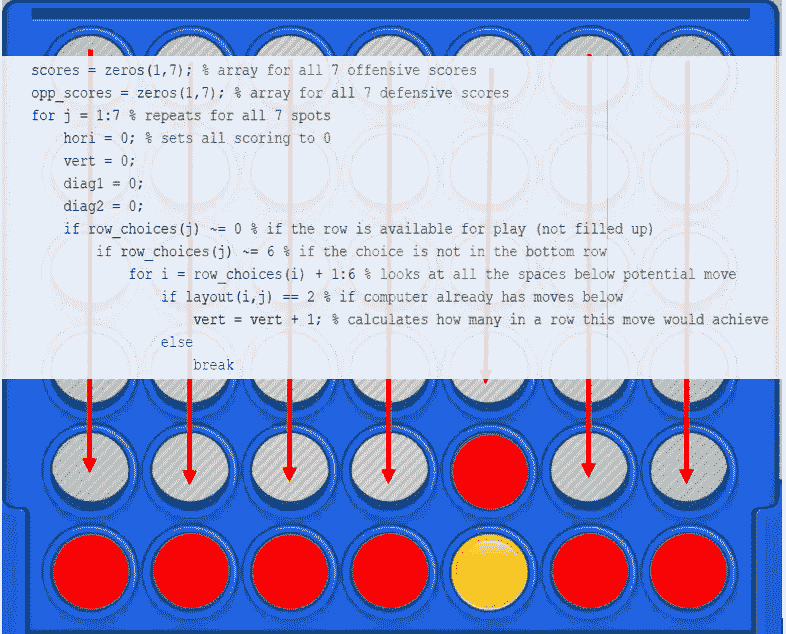
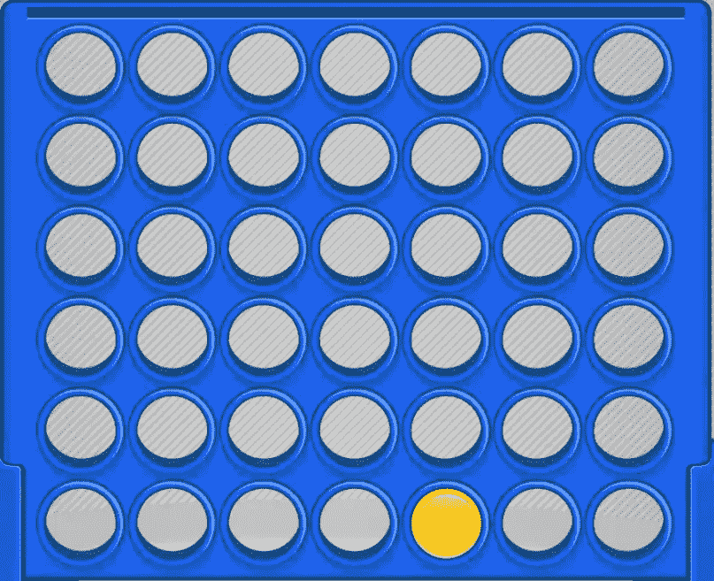
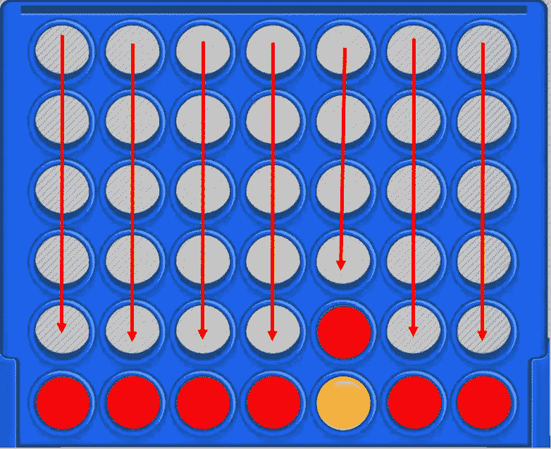

# 我教了一台机器如何玩 Connect 4

> 原文：<https://towardsdatascience.com/i-taught-a-machine-how-to-play-connect-4-df261da4e23f?source=collection_archive---------33----------------------->

## 我是如何构建一个可以在 Connect 4 中击败你的 MATLAB 程序



## 简介:

棋盘游戏提供了大量令人着迷的原始数据，对于对编程感兴趣的人来说非常有用。Connect 4 有 6 行 7 列，在一场比赛中包含了大量不同的游戏场景和决策。这让我有兴趣为这个经典的棋盘游戏设计一个战略算法。

## 工作原理:

在过去，我使用神经网络来完成所有的学习(就像我的文章[迪士尼乐园算法](/the-disneyland-algorithm-a-supervised-machine-learning-program-67c730cd62d5))。这种棋盘游戏的性质使得神经网络更难选择，只是因为它需要学习大量不同的场景。这就是为什么我离开了神经网络，而更倾向于一个基于评分的系统。

用户迈出第一步，然后程序开始对接下来的 7 步棋打分，找出最好的一步。



接下来的 7 个动作都基于 3 个标准评分:

*   进攻优势:这一步在水平、垂直和对角线方向对计算机有什么好处？如果该移动将使计算机连续三次移动，则该移动在该方向获得 3 分。
*   防守的好处:和进攻一样，但是权重更大，所以电脑对游戏采取了更保守的方法。
*   关键移动:阻止用户连续获得 4 个的移动，使计算机赢得游戏的移动，避免设置用户获胜的移动。所有这些都在“关键行动”部分考虑到了。

以下是计算所有 7 个动作在垂直方向上的进攻优势的一些代码:

```
scores = zeros(1,7); % array for all 7 offensive scoresopp_scores = zeros(1,7); % array for all 7 defensive scoresfor j = 1:7 % repeats for all 7spotshori = 0; % sets all scoring to 0vert = 0;diag1 = 0;diag2 = 0;if row_choices(j) ~= 0 % if the row is available for play (not filled up)if row_choices(j) ~= 6 % if the choice is not in the bottom rowfor i = row_choices(i) + 1:6 % looks at all the spaces below potential moveif layout(i,j) == 2 % if computer already has moves belowvert = vert + 1; % calculates how many in a row this move would achieveelsebreakendendvert = vert + 1; % adds 1 vertical point regardless (one move is still a tower of 1 in a row)elsevert = vert + 1; % adds 1 vertical point regardless (one move is still a tower of 1 in a row)end
```

防守效益占得分的 70%，进攻效益占剩下的 30%。在对之前的分数进行合计后，根据特殊情况增加关键移动点。该程序返回所有 7 个可能的移动的分数，然后选择最高分的一个。

例如，下面显示的是用户和程序在一轮移动后的输出。第一行是 7 个动作中每个动作的得分，在最高得分点(或最高得分点之一)标上“2”。从左边数第三列是 1.90 分，所以它是被选择的移动。“1”是用户的移动，“2”是程序的移动。

```
0.9000    1.2000    1.9000    1.9000    1.9000    1.2000    0.9000 0     0     0     0     0     0     0
     0     0     0     0     0     0     0
     0     0     0     0     0     0     0
     0     0     0     0     0     0     0
     0     0     0     0     0     0     0
     0     0     2     1     0     0     0
```

这个过程一直持续到游戏结束。根据下面代码的结果，游戏结束，该代码检查可能存在顺子 4 的每个可能位置，并在满足该条件时中断游戏循环。

```
iar = 0; % variable for same colors in a rowdone = 0; % break for "for" loopall_done = 0; % break for larger "for" loopfor i = 1:6 % for all rowsfor j = 1:7 % for all columnsif layout(i,j) == 2 % if there is a "2" in that spotiar = iar + 1; % one more in a rowif iar == 4 % if 4 in a rowall_done = 1; % ends larger "for" loopdone = 1; % ends smaller "for" loopbreak % ends the search for horizontal 4 in a rowendelseiar = 0; % if not 4 in a row, sets back to 0endendiar = 0; % sets back to 0if done == 1 % breaks a "for" loopbreakendendif all_done == 1 % ends gamedisp("Loss") % displays that you lostcomp_win = 1; % indicates the computer wonbreak % ends game loopend
```

一场已结束的游戏在下面显示为赢(四个 1 在对角线上)，或输(四个 2 在对角线上)。

```
Win
     0     0     0     0     2     2     2
     0     0     0     1     1     1     2
     1     0     2     2     1     2     1
     2     0     1     2     2     1     2
     1     2     2     1     2     1     1
     1     1     2     1     1     1     2Loss
     0     0     0     0     0     0     0
     0     0     0     0     2     1     1
     0     0     2     0     2     1     2
     0     0     1     2     1     2     1
     0     0     1     2     2     2     1
     0     0     2     1     1     2     1
```

## 结论:

我在一台在线 Connect 4 计算机上测试了这个 Connect 4 算法，看看它有多有效。10 场比赛后，我的 Connect 4 程序已经累积了 3 胜 3 平 4 负。虽然它不能 100%地赢得与其他计算机的比赛，但它为普通的 Connect 4 玩家提供了一个有价值的对手。在为未来的成功做准备时，它被证明是一个不错的决策者，并且在开发棋盘游戏算法时是一个很好的挑战。