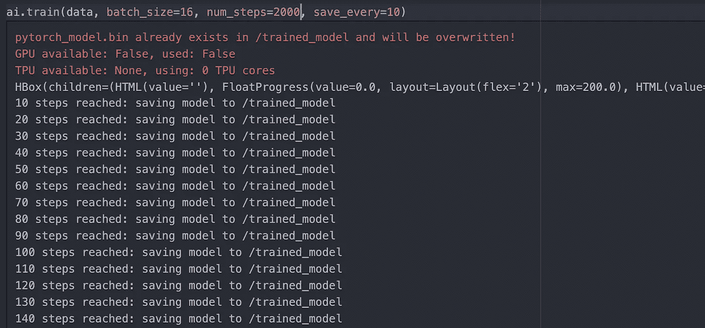
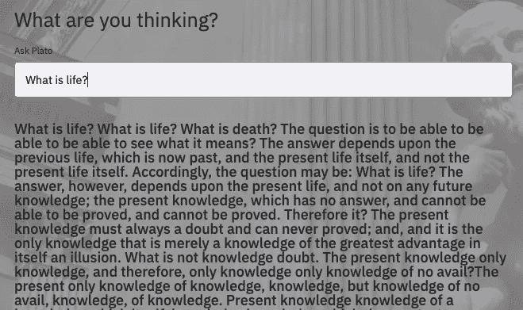
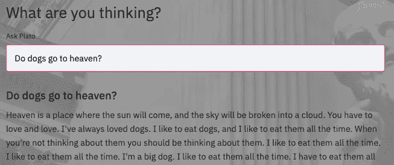
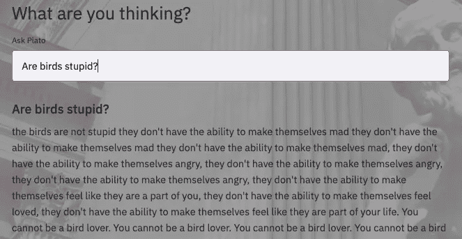
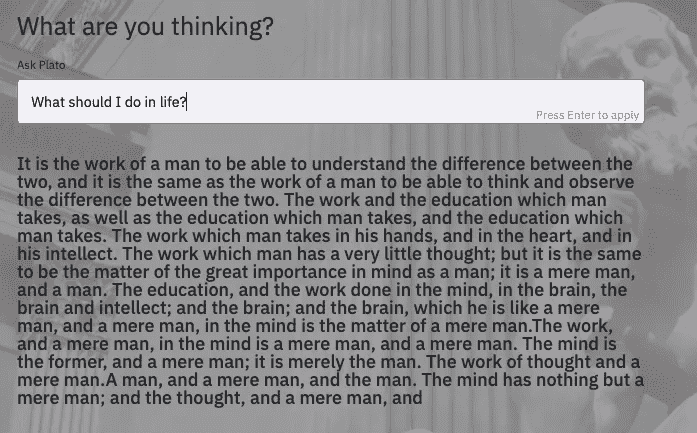
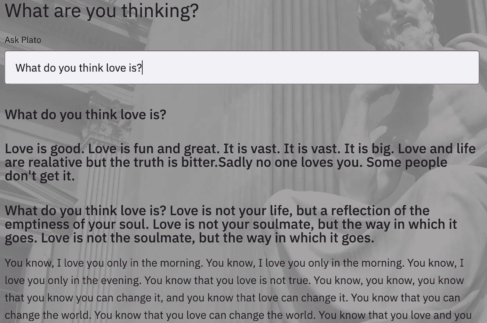
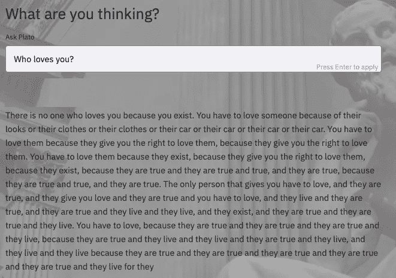

# 我给 GPT 2 号教授哲学，它感觉我在和一个疯狂但聪明的人说话

> 原文：<https://towardsdatascience.com/i-taught-philosophy-to-gpt-2-and-it-felt-i-am-talking-to-a-deranged-but-intelligent-person-875820735af5?source=collection_archive---------7----------------------->

## 我只是想有一个体面的谈话，但 GPT 有其他计划

到现在为止，你们每个人可能都已经看到了强大的 GPT 三号模型 [OpenAI](https://openai.com/) 产生的推文、应用程序、代码和文本。1750 亿参数模型是在互联网规模的大型数据语料库上训练的。它已经以其真实的结果让科技和非科技领域的人们感到惊讶，人们对未来几年的可能性垂涎三尺。

由[西蒙·马格](https://unsplash.com/@simonmaage?utm_source=medium&utm_medium=referral)在 [Unsplash](https://unsplash.com?utm_source=medium&utm_medium=referral) 上拍摄的照片

GPT 模型所做的是估计句子在现实世界中形成的可能性，例如*我在地上玩了一个足球*是一个字符序列 ***比*我在地上玩了一个苹果*更有可能是*** 。单词或短语从文本中随机删除，模型必须学会仅使用周围的单词作为上下文来填充它们。这项训练任务已经产生了一个强大的和可推广的模型。

我仍然在 GPT-3 的等待名单中，所以我决定使用 GPT-2，并享受其 2.55 亿参数模型的乐趣。

> 我对乐趣的想法是向机器教授哲学课本，然后寻求人类生活和存在中最深奥问题的答案！

我告诉你，有些人真的需要生活，需要理解快乐的定义。

GPT-3 是巨大的，GPT-2 也不小，所以关于模型的实时使用有两个因素要考虑:

> 1.程序员有多容易接触到它们？
> 
> 2.他们训练起来有多容易，在生产模式下部署时表现如何？

第二个因素是我非常固执于在本地机器上训练模型而不使用 Colab 或 Paperspace 的想法。我的机器是不起眼的 Macpro-16”没有 GPU 支持(感谢 Nvidia 的 CUDA！不是！！)

我先从少量文本开始，用亚里士多德和柏拉图的著作训练模型。在这个模型学习了柏拉图的《理想国》之后，我开始对我提出的问题获得一致的结果。微调模型非常简单，但有点耗时。

我们训练中的私人哲学家(图片由作者提供)

我创建了一个具有不错的用户界面/UX 的 streamlit 应用程序，这样我就可以在 GCP、EC2 或 Heroku 上部署它，但鉴于模型的大小，错误代码的闸门被打开了，我花了一整天来处理这些问题，但没有成功。后来，我决定专注于训练模型，而不是将这个人工智能哲学家用于公共用途。( [*Github 链接为回购*](https://github.com/Prashantmdgl9/ai-philosophy) )

人工智能哲学家对什么是生活的回答(图片由作者提供)

我相信在阅读了尼采和伏尔泰的作品后，模型结果变得非常怪异。同样的单词和句子会被重复，一些句子会以粗体印刷。

***是 GPT-2 在吼我吗？***

这算什么回答？(图片由作者提供)

很快就变暗了！全世界的狗，快跑吧！嗯，这不是一个好问题，因为我们已经知道是猫去天堂，而不是狗。好，我再问一个问题。

好吧，鸟不傻(图片作者)

这时，我决定使用参数' max-length '来限制这些胡言乱语答案的长度，但没有效果。我对模型进行了更多步骤的训练，以观察它是否会给系统带来任何健全性。

哇！这个是哲学(作者图片)

一个人和一台机器之间的哲学讨论！！！

好吧，再来一个关于爱情的谚语。

多么不顾别人的混蛋！(图片由作者提供)

好吧，是的，爱不是一个简单的概念，但它是一个迷人的实验。这些句子有几次是有意义的，但在其他时候，它们是垃圾。通常情况下，这就像是在和一个有严重心理问题的人交谈。

我已经在 GPT 3 号上看到了结果，它们看起来合理而真实。我得到的答案句子在语法上是正确的，但感觉就像一个精神错乱的人在声嘶力竭地回答它们。我已经可以看到一个动画戏剧演员/女演员声嘶力竭地大喊他们，调整音调和速度，描绘一个疯狂的表演。

也许训练过的模型产生的一切只是它从阅读的书籍中学到的一系列字符。它不是人工一般智能，机器没有编造新的思想，它只是从大型语料库中读取，计算句子的概率，在没有任何新句子的情况下，它继续重复旧句子。

另一个想法，我对增加字体大小有点毛骨悚然。当然，这台机器没有获得任何 AGI 奖，但它可能是迈向它的第一步。在许多句子中有许多重复，这让我想起了哥德尔、埃舍尔、巴赫，以及递归和重复是如何在无生命的事物如何产生我们周围的有生命的世界的中心。

# **结论**

我知道这只是一个在小型计算机上训练的小模型，但是如果在大型机器上训练，结果将意味着什么？在不久的将来，这些 GPT 模型的规模会越来越大，答案也会越来越清晰。

这种哲学模型的内部量子状态是不确定的，除非我们观察它们(感谢量子力学的深奥陈述)。那么，这是否意味着产生的这些陈述都没有任何实际意义呢？

> 虽然，检查模型的内部状态可能会提供一些关于机器在获得大量数据时如何思考的见解。它可以在思想上模仿人类，但同时给人的感觉是一个混蛋。

***PS:*** *还有，我的* [*Github 包含了这个作品*](https://github.com/Prashantmdgl9/ai-philosophy) *，我完全无法上传 PyTorch 的模型。想改进模型的可以联系我，我可以在 Dropbox 或者 GDrive 上分享训练好的模型。*

在说再见之前！我又问了一个问题。

作者图片

哇！真是个反复无常、冷漠无情的混蛋！