# IBM 数据科学顶点项目——邻里之战

> 原文：<https://towardsdatascience.com/ibm-data-science-capstone-project-battle-of-the-neighborhoods-c90648a0dbab?source=collection_archive---------21----------------------->

## 在解决问题的过程中要深思熟虑

## **结合结构化问题解决、数据分析&机器学习**来解决业务问题

Coursera 的 [IBM 数据科学专业课程](https://www.coursera.org/professional-certificates/ibm-data-science)的累积是一个顶点项目，要求课程参与者确定一个需要使用位置数据和邻域聚类的业务问题。分析业务问题、排除干扰、识别要解决的实际问题的能力是一项重要的技能，需要不断磨练。如果没有确定正确的问题，模型结果的有效性将会大大降低或变得毫无意义。因此，我还应用了波士顿咨询集团的几个解决问题的方法，这些方法是我最近在这个项目中接触到的，以增强问题陈述的框架。

本文提供了顶点的概述，从最初提出的问题陈述到建议。

**内容**

*   简介/业务问题
*   数据收集和准备
*   数据可视化和故障排除
*   探索性数据分析
*   剪影法
*   评估和建议
*   其他工具
*   编后记

## **简介/业务问题**

**背景:**一位客户联系了咨询公司，就在京都开设餐厅的业务战略和执行路线图提出建议。最初的业务问题是**“客户是否应该在京都设立连锁餐厅，地点在哪里？”**

照片由[索拉萨克](https://unsplash.com/@boontohhgraphy?utm_source=medium&utm_medium=referral)在 [Unsplash](https://unsplash.com?utm_source=medium&utm_medium=referral) 上拍摄

我没有深入问题并应用机器学习，而是仔细考虑了业务问题，并概述了以下可能不明显的考虑因素:

a)客户的目标是在京都建立餐厅

b)他们不确定市场饱和，也不确定京都的潜在地点。

将问题陈述重新组织为**“如何确定客户在京都的业务定位和潜在餐厅位置？”**通过重新构建的问题陈述，几个顶级业务驱动因素，即如下图所示，业务战略、运营和盈利能力成为关注的焦点。

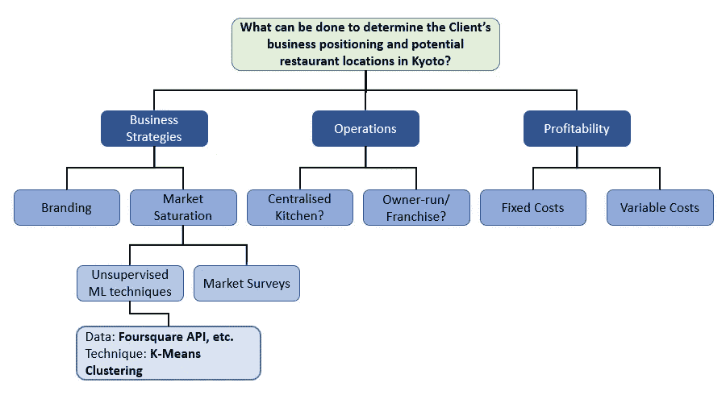

逻辑树|作者图片

关于商业策略， **K-Means 聚类**将应用于**相关餐馆的地理空间数据**以**聚类餐馆，并揭示诸如餐馆主题和合适位置的见解。**

## 数据收集和准备

确定使用两个数据源。这些是:

1) **京都选区及其各自地理坐标的列表**。病房列表可从以下[网页](https://en.wikipedia.org/wiki/Wards_of_Kyoto)中检索，而相应的坐标可使用 geopy 库检索。

2) **京都各个街区的餐厅**。可以使用 Foursquare API 检索数据，并指定感兴趣的特定类别。

京都病房的名单是用熊猫 **read_html()** 方法刮出来的。

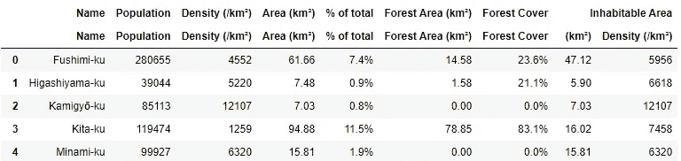

作者图片

然后使用 pandas **get_levels()** 方法来折叠标题。

然后使用 **geopy** 库检索的地理坐标提供数据。根据 Nominatum 的服务条款指定用户代理；也是为了避免自己的 IP 地址被屏蔽访问服务。

## 数据可视化和故障排除

京都病房的可视化是使用**叶子**库完成的。

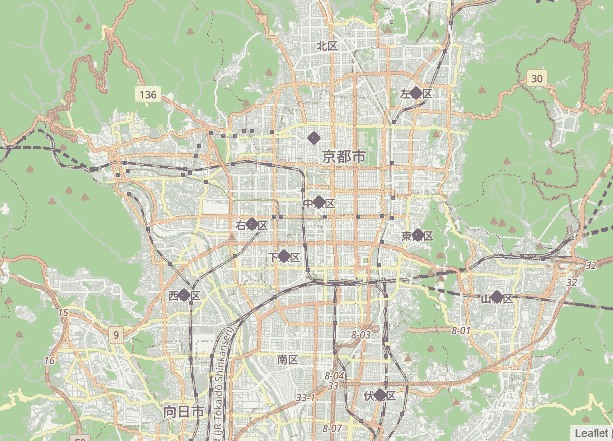

最初的京都病房地图|图片由作者提供

发现京都的“北 Ku”和“美并 Ku”没有标在京都地图上。一种假设是他们的坐标可能是指其他城市的选区。首先，我可能会检查返回的地址，找到正确的坐标。最后，我将替换数据框中经过校正的坐标。

返回的地址证实了检索到的坐标不正确的假设。将城市名称“京都”添加到选区名称中，可以获得正确的坐标。下面是该任务的代码片段。

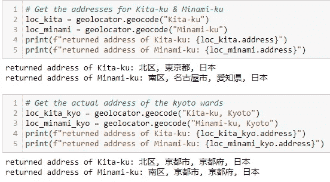

按作者调查地址|图片

更新后的地图将所有 11 个选区的坐标标绘在地图上，以此来验证校正后的坐标。

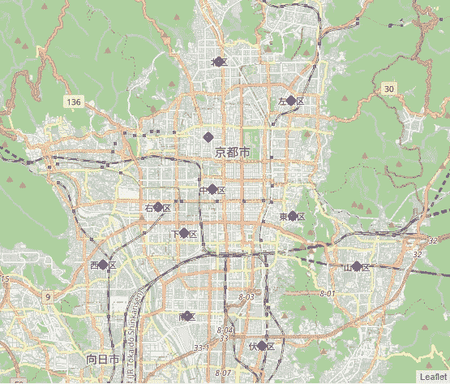

所有病房绘制|作者图片

## 探索性数据分析

然后使用 Foursquare API 来检索每个病房中餐馆的数据。指定条件以返回半径 500 米内的 100 家餐馆，结果如下所示。毫不奇怪，拉面和日本餐馆是最常见的餐馆类型。

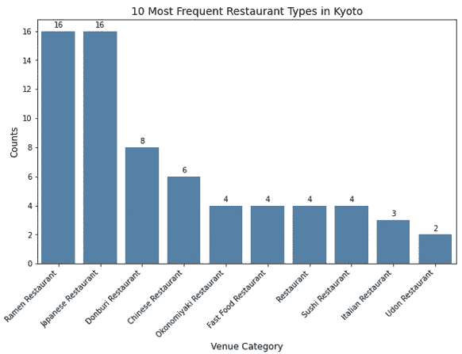

作者图片

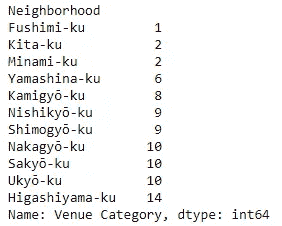

病房旁边的餐厅

与其他选区相比，**东山-Ku、御厨-Ku、西京-Ku &萨基-Ku** 的餐厅密度更高。

## 剪影法

注意特征(即每个区的餐厅类型比例)， **K 均值聚类**将用于**对这些实体进行聚类，并发现潜在的洞察力，如可行的餐厅主题和合适的餐厅位置。**这些见解有助于企业战略的制定。

对于 K-均值聚类，首先需要确定 K 的最佳数目。这是一个可能被忽略的步骤。有几种方法可供选择，如**肘法**和**剪影法。**下面简要讨论这些方法。

**肘法。**针对不同的 k 值计算误差平方和的组内值(WSS)。选择 WSS 最先开始下降的 k 值(即“肘”)。然而，如果数据集没有被很好地聚类(即，重叠聚类)，则肘部可能不明显。

**剪影法。**剪影方法测量一个点与其自己的聚类相比于其他聚类的相似性。轮廓系数的范围在+1 和-1 之间。趋向于+1 的正系数表示特定点被分配在理想聚类中。这也意味着该点实际上尽可能远离相邻的簇。系数为零表示特定点位于或非常接近两个相邻聚类之间的判定边界。负系数表示该点被分配给了错误的聚类。

选择侧影法来确定最佳 k 值。

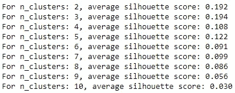

最佳 k = 3 |作者图片

然后使用 init='k-means++和 random_state=42 实现 K-Means 聚类，以获得结果的可重复性。然后，绘制生成的聚类。

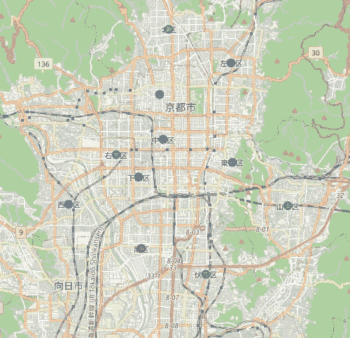

聚集的餐馆|作者图片

## 评估和建议

根据场馆类别检查每个集群，得出以下观察结果。

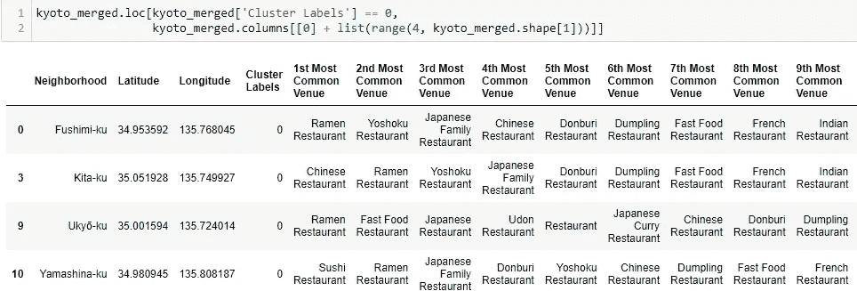

聚类 1 模式|作者图片

拉面餐馆在集群 1 中占主导地位。紧随其后的是提供亚洲风味菜肴的餐馆，如中国菜、寿司或寿司。

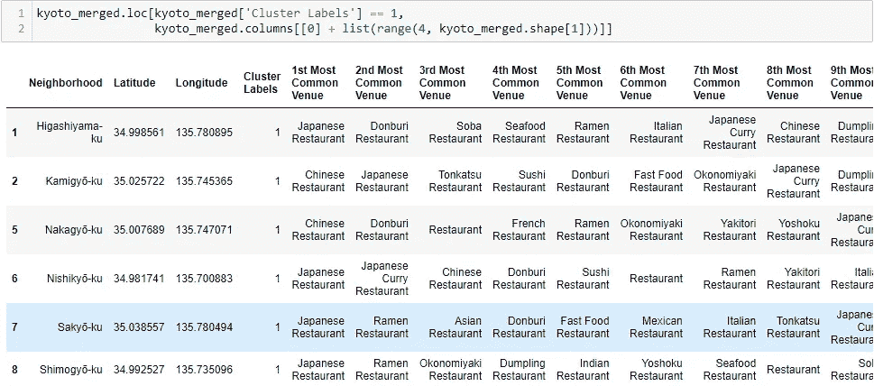

聚类 2 模式|作者图片

日本餐馆在集群 2 中占主导地位。紧随其后的是中式餐馆、拉面餐馆或顿武里餐馆。

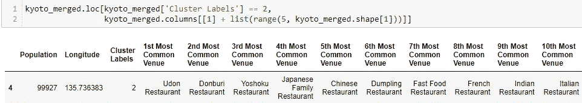

聚类 3 模式|作者图片

乌龙面餐馆在第 3 组中占主导地位，其次是东武里餐馆。

探索京都、东山 Ku、Ku 和 Ku 西京和 Ku 的街区，那里的餐馆密度更高(当地超过 10 家)。较高的餐馆密度可能意味着这些地区更受游客欢迎，附近有更多的旅游景点。

例如，东山 Ku 区有许多历史景点，如八坂神社前的祇园娱乐区、九坂、三年坂和清水寺(被指定为世界遗产)。uky-Ku 也是许多著名景点的所在地，如天目山和以枫叶闻名的岚山。

初步推荐的市场进入地点是 Ku 东山和 Ku。东山-Ku 被分配到群组 2；一家提供日本料理的餐馆更有可能赢得游客的青睐。乌基什-Ku 被分配到第 1 组；一家提供拉面的餐厅可能更有可能赢得游客的青睐。不管上述建议，F&B 服务的其他基本要素，如优质的食品和服务以及严格的卫生习惯也不容忽视。

## 其他工具

对于这个顶点项目，我还试用了 [readme.so](https://readme.so/) 来创建和编辑 readme 文件。该工具提供了几个用于编辑的预定义模板。用户只需选择所需的模板，进行必要的编辑，并将生成的自述文件上传到 Github。

## 编后记

我想说，capstone 项目是一个丰富的体验，引入了用于数据收集的 API，并能够处理地理空间数据。虽然陈述业务问题陈述和应用机器学习技术可能很容易，但 capstone 为应用 BCG 的业务问题解决方法提供了一个好机会。它有助于加强问题陈述的框架。如果没有应用这些方法，如果没有机器学习应用的明确方向和目的，顶点可能会更加困难。

顶石的代码可以在[这里](https://github.com/AngShengJun/Coursera_Capstone/blob/main/Capstone%20Project-Kyoto.ipynb)获得。