# ICLR 2021——你不该错过的 10 篇论文精选

> 原文：<https://towardsdatascience.com/iclr-2021-a-selection-of-10-papers-you-shouldnt-miss-888d8b8099dd?source=collection_archive---------4----------------------->

## 学习表现的国际会议已经在这里了，它的内容非常丰富:860 篇论文，8 个研讨会和 8 个特邀报告。选择关注的地方很难，所以这里有一些值得关注的想法！

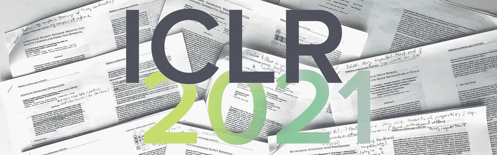

图片作者。

一年前，ICLR 2020 会议是第一个完全在线的大型会议，它为所有完全虚拟的会议设定了令人惊讶的高标准。今年，这个会议又是一个只在网上举行的活动，而且看起来很有希望:变形金刚在标题中出现的次数减少了…因为它们已经无处不在了！计算机视觉、自然语言处理、信息检索、ML 理论、强化学习……应有尽有！今年这一版内容的多样性令人瞠目结舌。

谈到受邀演讲，阵容也令人兴奋:Timnit Gebru 将在开幕式上谈论我们如何超越机器学习中的公平言论，这将在大会上引发一些关于该主题的讨论。研讨会也比以往任何时候都更加拥挤，以基于能量的模型为特色，反思 ML 论文和负责任的 AI 等。

理解这一令人印象深刻的阵容不是一件容易的事，但在[人工智能研究导航员](https://search.zeta-alpha.com/)在[泽塔阿尔法](https://www.zeta-alpha.com/)的帮助下，我们通过引用、twitter 人气、作者影响力、聚光灯演示和平台的一些推荐，浏览了最相关的 ICLR 论文，我们确定了一些非常酷的作品，我们想强调一下；有些已经众所周知，有些更多的是一颗*隐藏的宝石*。当然，这些选择并不旨在成为一个全面的概述——我们将错过许多主题，如神经架构搜索、ML 理论、强化学习或图形神经网络等——但是，嘿，我听说选择稀疏和深入往往比选择广泛和浅薄更好；所以这是我的 10 大，享受吧！

## [1。一幅图像相当于 16x16 个字:大规模图像识别变形金刚](https://openreview.net/forum?id=YicbFdNTTy) | 🖥 [ICLR 会议](https://iclr.cc/virtual/2021/poster/3013) |👾[代码](https://github.com/google-research/vision_transformer)

*Alexey Dosovitskiy，Lucas Beyer，Alexander，Dirk Weissenborn，Xiaohua Zhai 等人*

> **作者的 TL；DR** →直接应用于图像补丁并在大型数据集上进行预训练的变压器在图像分类方面非常有效。

**❓Why →** 第一篇论文展示了纯变形金刚如何在(某种)大图像上超越最好的 CNN，从而在过去的几个月里启动了快速的“视觉变形金刚革命”。

**💡关键见解→** 迁移学习已被证明对变形金刚极其有效:所有 NLP 最新技术都包含某种类型的迁移，例如来自自我监督的预培训。概括地说，人们发现网络越大，传输越好，而对于大型网络，变压器是首屈一指的。

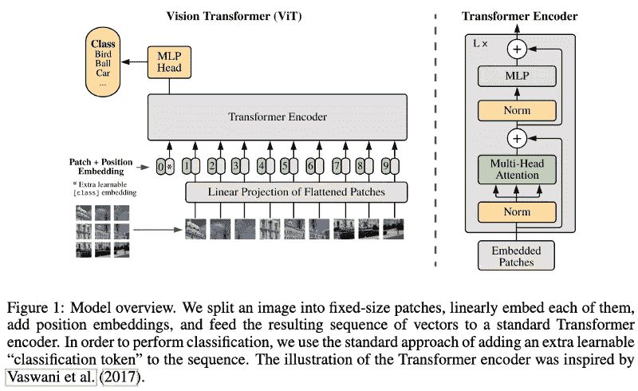

在这种愿景的驱动下，作者展示了一个纯粹的转换器如何在图像分类上表现得非常好，只需通过将图像作为一系列补丁嵌入——只是补丁像素的线性投影——并直接在大量监督数据 (ImageNet)上训练**。该论文暗示，该模型可以受益于自我监督的预训练，但没有为此提供完整的实验。**

结果显示，一旦模型离开数据受限的状态，ViT 如何胜过 CNN，甚至 CNN+注意力混合；甚至更高的计算效率！在许多有趣的实验中，作者展示了注意力的感受域如何跨层进化:最初非常多样(全局+局部)，后来在网络中专门针对局部注意力。

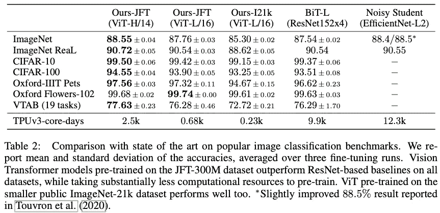

来源:[https://openreview.net/pdf?id=YicbFdNTTy](https://openreview.net/pdf?id=YicbFdNTTy)

**你可能也会喜欢在 ICLR:** [LambdaNetworks:建模远程交互而不被注意](https://openreview.net/forum?id=xTJEN-ggl1b)

## [2。与表演者一起反思注意力](https://openreview.net/forum?id=Ua6zuk0WRH) | 🖥 [ICLR 会议](https://iclr.cc/virtual/2021/poster/2726) | ✍️ [博客](https://ai.googleblog.com/2020/10/rethinking-attention-with-performers.html)

*作者:Krzysztof Choromanski、Valerii Likhosherstov、David Dohan、Xingyou Song、Andreea Gane、Tamas Sarlos、Peter Hawkins、Jared Davis 等人*

> **作者的 TL；通过可证明的随机特征近似方法，不依赖于稀疏性或低秩性，线性满秩注意力转换器【T21 博士】→表演者。**

❓Why → 全神贯注的复杂性仍然让许多 ML 研究者夜不能寐。高效变压器已经出现了很长一段时间，但是还没有一个提案明显地统治了这个领域……

**💡关键见解→** 与其他高效变形金刚的提议不同，表演者不依赖于特定的启发式近似注意力，例如将注意力限制在较低等级的近似或加强稀疏性。相反，作者提出将自我注意机制分解成以下矩阵，这些矩阵具有线性的组合复杂度。序列长度 L: *O(Ld log(d))* 而不是 *O(L d)。*

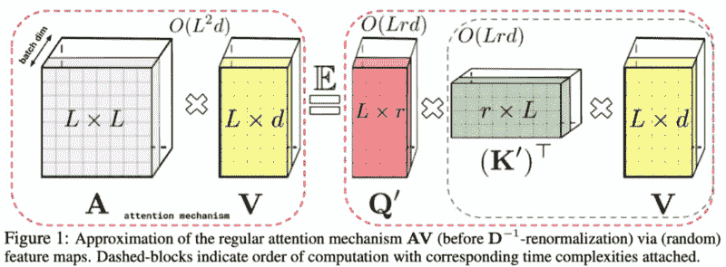

这种分解依赖于太多的技巧来实现，但仅仅是名称丢弃的缘故，我们谈论的是核，随机正交向量和三角 softmax 近似。都是为了建立好感+用非常严密的理论保证来估计自己的注意力。

当涉及到实际实验时，这项工作将 Performer 与现有的高效转换器(如 Linformer 和 Reformer)进行比较，在建模非常长的依赖性至关重要的任务中，如研究蛋白质序列，它的性能优于现有的架构。最后，这种方法最大的吸引力之一是，你可以使用新的线性注意力机制**重用现有的预训练变压器**，只需要一点微调就可以恢复大部分原始性能，如下图所示(左)。

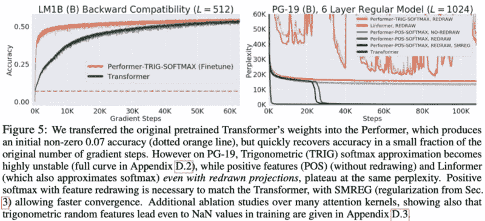

来源:[https://openreview.net/pdf?id=Ua6zuk0WRH](https://openreview.net/pdf?id=Ua6zuk0WRH)

**你可能也会喜欢:** [远程竞技场:高效变形金刚的标杆](https://openreview.net/forum?id=qVyeW-grC2k)，[随机特性注意](https://openreview.net/forum?id=QtTKTdVrFBB)

## [3。PMI 屏蔽:相关跨度的原则性屏蔽](https://openreview.net/forum?id=3Aoft6NWFej) | 🖥 [ICLR 会话](https://iclr.cc/virtual/2021/poster/2783)

*约夫·莱文等人*

> **作者的 TL；DR** →相关表征的联合掩蔽显著加快并改善了 BERT 的预训练。

**❓Why →** 这是一个非常清晰、直接的想法，同时也带来了同样显著的效果。它有助于我们理解掩蔽语言建模预训练的目标。

**💡关键见解→** 作者不是随机屏蔽标记，而是仅使用语料库统计数据来识别高度相关的标记跨度。为此，他们创建了对任意长度跨度的标记对之间的逐点互信息的扩展，并显示了如何以该目标训练 BERT 比诸如统一掩蔽、整个单词掩蔽、随机跨度掩蔽等替代方法更有效地学习。

直觉上，这种策略是可行的，因为你阻止了模型使用经常紧挨着出现的单词的非常浅的相关性来预测屏蔽的单词，迫使模型学习语言中更深层次的相关性。在下图中，你可以看到变形金刚如何通过 PMI-MLM 学习得更快。

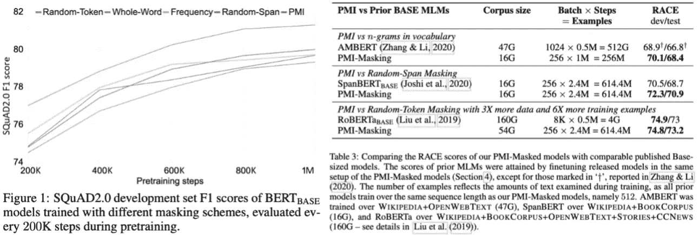

来源:https://openreview.net/pdf?id=3Aoft6NWFej

## [4。经常性独立机制](https://openreview.net/forum?id=mLcmdlEUxy-) | 🖥 [ICLR 会议](https://iclr.cc/virtual/2021/poster/3224)

*作者 Anirudh Goyal、Jordan Hoffmann、Shagun Sodhani 等人*

> **作者的 TL；博士**..

**❓Why →** 如果人工智能想要在某种程度上类似于人类智能，它需要超越训练数据分布进行推广。这篇论文——最初是在一年多后发表的——提供了洞察力、经验基础和这种概括的进展。

**💡关键见解→** 循环独立机制是实现注意力瓶颈的神经网络。这种方法从人脑如何处理世界中汲取灵感；也就是说，很大程度上是通过识别相互作用很少且没有因果关系的独立机制。例如，一组四处弹跳的球可以在很大程度上独立建模，直到它们相互碰撞，这是一个很少发生的事件。

RIMs 是一种递归网络形式，其中大多数状态在大部分时间都是自己进化的，只通过一种注意机制稀疏地相互交互，这种机制可以是自上而下的(直接在隐藏状态之间)或自下而上的(在输入特征和隐藏状态之间)。当输入数据分布发生变化时，该网络显示出比常规 RNNs 更强的泛化能力。

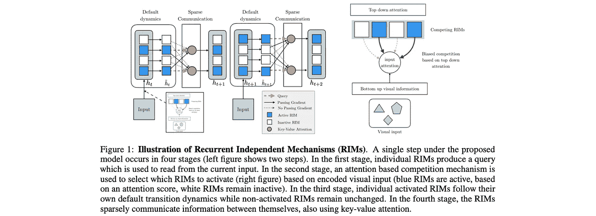

来源:[https://openreview.net/pdf?id=mLcmdlEUxy-](https://openreview.net/pdf?id=mLcmdlEUxy-)

整个变形金刚*事件*的一大收获是，神经网络中电感偏差的重要性可能被夸大了。然而，当在域内对模型进行基准测试时，这是正确的。本文展示了为了证明强先验(如注意力瓶颈)的有用性，如何需要**走出训练领域，**并且大多数当前的 ML/RL 系统都不是以这种方式进行基准测试的。

虽然结果可能不是最令人印象深刻的，但这篇论文——以及后续工作(见下文)——提出了一个雄心勃勃的议程，即如何将我们的人工智能系统转变为类似于我们大脑的东西，我甚至可以说，将过去十年的人工智能革命与过去十年的人工智能革命结合起来。我们应该庆祝这样的尝试！

**你可能还喜欢:** [快速和慢速学习循环独立机制](https://openreview.net/forum?id=Lc28QAB4ypz)，[在结构化的动态环境中分解陈述性和程序性知识](https://openreview.net/forum?id=VVdmjgu7pKM)，[寻找丢失的领域概括](https://openreview.net/forum?id=lQdXeXDoWtI)。

## [5。通过随机微分方程建立基于分数的生成模型](https://openreview.net/forum?id=PxTIG12RRHS) | 🖥 [ICLR 会议](https://iclr.cc/virtual/2021/poster/3177) |👾[代码](https://github.com/yang-song/score_sde)

*作者宋洋等人*

> **作者的 TL；DR**→一个基于分数的模型的训练和采样的通用框架，它统一和概括了以前的方法，允许可能性计算，并支持可控生成。

**❓Why →** 甘人仍然是怪异的生物……欢迎替代物，这个很有前途:把数据变成噪音很容易，把噪音变成图像是……生成式建模！而这正是本文所要做的。

**💡关键见解→** 好吧，我不能说我完全理解了所有的细节，因为有很多数学知识超出了我的理解范围。但它的要点很简单:你可以通过“扩散过程”将图像转换成“噪音”。想想单个水分子在流动的水中是如何运动的:有一些确定性的水流遵循一个梯度，还有一些附加的随机抖动。你可以对像素图像做同样的事情，*扩散它们*，这样它们最终就像一个易于处理的概率分布中的噪声。这个过程可以被建模为一个随机微分方程，在物理学中是已知的，基本上是一个微分方程，在每个时间点都有一些额外的抖动。

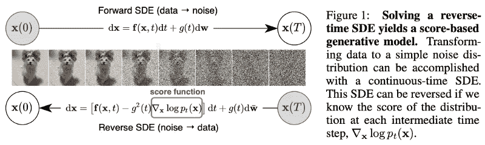

来源:https://openreview.net/pdf?id=PxTIG12RRHS

现在，如果我告诉你，这个随机扩散过程是…可逆的！你基本上可以从这种噪音中取样，然后再做一个图像。就像这样，作者在 CIFAR-10 上获得了 9.89 的 SOTA 初始分数和 2.20 的 FID。好吧，在引擎盖下还有更多的事情要做…你真的需要看看这篇文章！

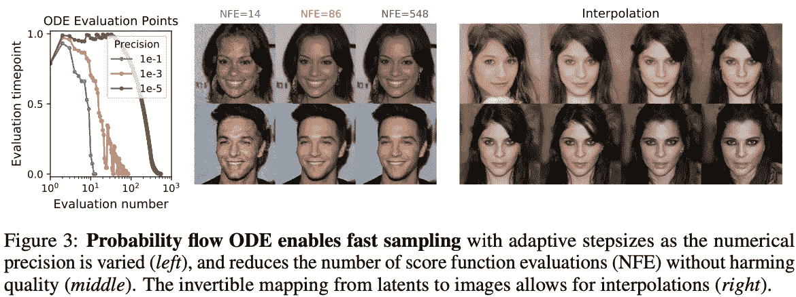

来源:[https://openreview.net/pdf?id=PxTIG12RRHS](https://openreview.net/pdf?id=PxTIG12RRHS)

## [6。自回归实体检索](https://openreview.net/forum?id=5k8F6UU39V) | 🖥 [ICLR 会话](https://iclr.cc/virtual/2021/poster/2642) |👾[代码](https://github.com/facebookresearch/GENRE)

尼古拉·曹德、戈蒂埃·伊萨卡、塞巴斯蒂安·里德尔、法比奥·彼得罗尼。

> **作者的 TL；DR**→我们通过以自回归方式从左到右生成实体的唯一名称标识符来处理实体检索，并以显示 SOTA 结果的上下文为条件，在 20 多个数据集内使用最近系统的一小部分内存。

**❓Why →** 一种新的直接的实体检索方法，令人惊讶地打破了一些现有的基准。

**💡关键见解→** 实体检索的任务是找到自然语言所指的精确实体(有时可能会有歧义)。现有的方法将此视为一个搜索问题，即给定一段文本，从 KG 中检索一个实体。直到现在。这项工作提出通过自回归生成实体标识符来寻找实体标识符:有点像 markdown 语法超链接的东西:`[entity](identifier generated by the model)`。没有搜索+重新排名，什么都没有，简单明了。实际上，这意味着对实体及其上下文进行交叉编码，这样做的好处是内存占用随着词汇表的大小而线性扩展(不需要在知识库空间中做大量的点积)，也不需要对负数据进行采样。

从预先训练的 BART⁵开始，他们微调最大化具有实体的语料库(维基百科)的自回归生成的可能性。在推断时，他们使用约束波束搜索来防止模型生成无效的实体(即不在知识库中)。结果令人印象深刻，见下表中的例子。

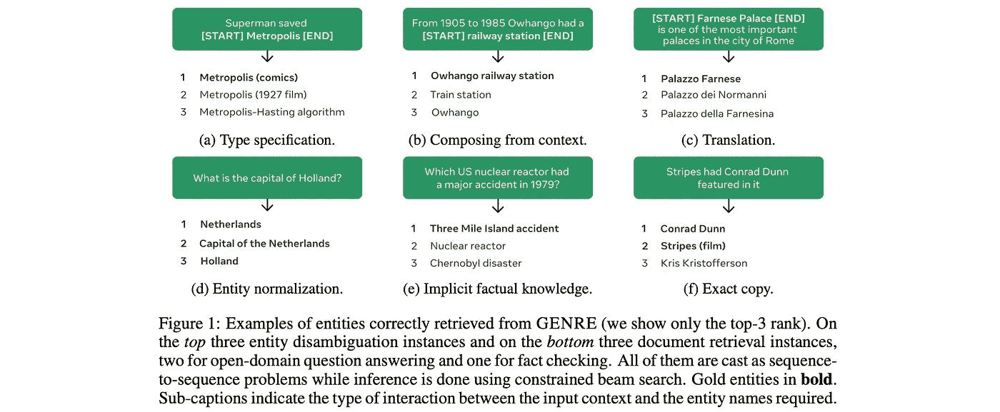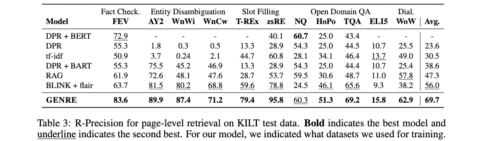

## [7。密集文本检索的近似最近邻否定对比学习](https://openreview.net/forum?id=zeFrfgyZln) | 🖥 [ICLR 会话](https://iclr.cc/virtual/2021/poster/2673)

*李熊、熊等*

> **作者的 TL；DR →** 使用 ANCE 改进密集文本检索，它使用异步更新的 ANN 索引选择具有较大梯度范数的全局否定。

**❓Why →** 信息检索抵制“神经革命”的时间比计算机视觉多很多年。但是自从伯特以来，密集检索的进步是巨大的，这是一个极好的例子。

**💡关键见解→** 当训练模型进行密集检索时，通常的做法是学习嵌入空间，其中查询-文档距离是语义相关的。对比学习是这样做的标准技术:最小化正面查询-文档对的距离，最大化负面样本的距离。然而，否定样本通常是随机选择的，这意味着它们不太能提供信息:大多数时候否定文档显然与查询不相关。

这篇论文的作者提出在训练期间从最近的邻居采样否定，这产生了接近查询的文档(即，当前模型*认为*相关的文档)。实际上，这意味着语料库的索引需要在训练期间异步更新(每次迭代更新索引会非常慢)。幸运的是，结果证实了 BM25 基线最终是如何落后的！

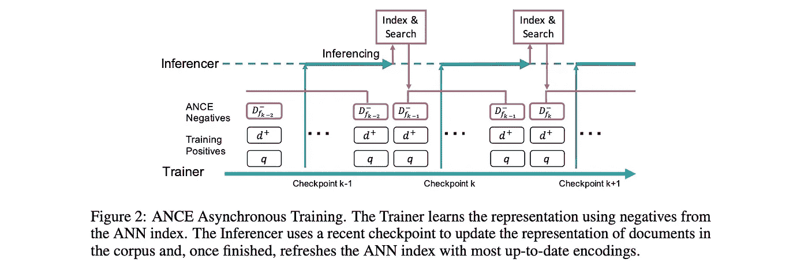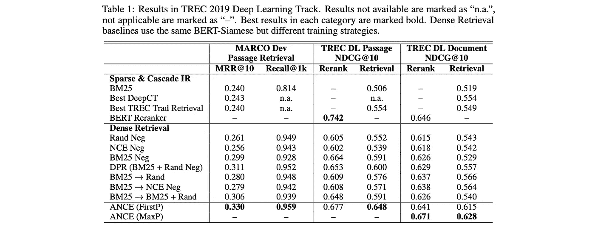

## [8。图像增强是你所需要的:从像素中规则化深度强化学习](https://openreview.net/forum?id=GY6-6sTvGaf) | 🖥 [ICLR 会话](https://iclr.cc/virtual/2021/poster/3188)

Denis Yarats，Ilya Kostrikovm 和 Rob Fergus。

> **作者的 TL；DR →** 首次成功演示图像增强可应用于基于图像的深度 RL，实现 SOTA 性能。

❓Why → 你支持什么？基于模型还是无模型 RL？回答问题前先看这篇论文！

**💡关键见解→** 现有的无模型 RL 成功地从状态输入中学习，但很难直接从图像中学习。直觉上，这是因为当从早期重放缓冲器学习时，大多数图像高度相关，呈现非常稀疏的奖励信号。这项工作显示了无模型方法如何能够极大地受益于像素空间的增强，从而在学习中变得更具样本效率，在 DeepMind control suite⁶和 100k Atari⁷基准测试中，与现有的基于模型的方法相比，实现了有竞争力的结果。

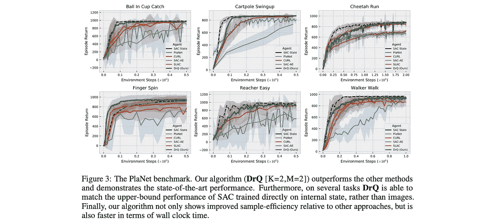

资料来源:https://openreview.net/pdf?id=GY6-6sTvGaf

## [9。自适应联邦优化](https://openreview.net/forum?id=LkFG3lB13U5) | 🖥 [ICLR 会话](https://iclr.cc/virtual/2021/poster/2691)

*萨尚克·雷迪、扎卡里·查理斯等人*

> **作者的 TL；我们提出了自适应联邦优化技术，并强调了它们相对于 FedAvg 等流行方法的改进性能。**

**❓Why →** 要让联合学习广泛传播，联合优化器必须变得无趣，就像 2021 年的亚当一样。本文正是试图做到这一点。

**💡关键见解→** 联合学习是一种 ML 范式，其中由*服务器*托管的中央模型由多个*客户端*以分布式方式训练。例如，每个客户可以使用他们自己设备上的数据，计算梯度相对于损失函数，并将更新的权重传送给中央服务器。这一过程提出了许多问题，例如应该如何组合来自多个客户端的体重更新。

本文在解释联邦优化器的当前状态方面做了大量工作，构建了一个简单的框架来讨论它们，并展示了一些关于收敛保证的理论结果和实验结果，以表明他们提出的自适应联邦优化器比现有的优化器(如 FedAvg⁸.)工作得更好本文中介绍的联邦优化框架不知道*客户端* (ClientOpt)和*服务器* (ServerOpt)使用的优化器，并使它们能够将动量和自适应学习率等技术插入到联邦优化过程中。有趣的是，他们展示的结果总是使用 vanilla SGD 作为 ClientOpt，使用 adaptive optimizer(ADAM，YOGI)作为 ServerOpt。

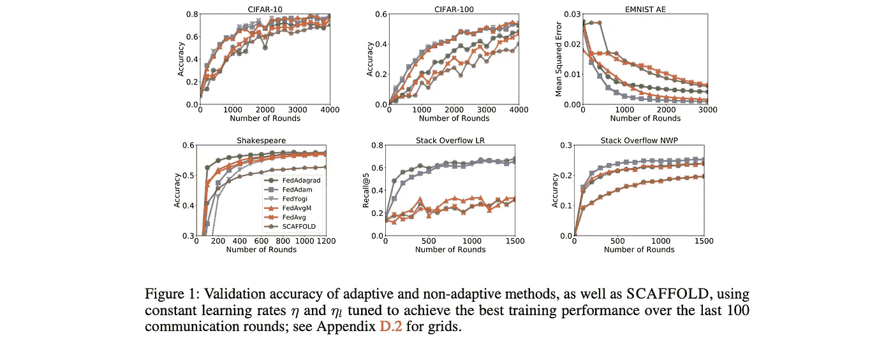

来源:[https://openreview.net/pdf?id=LkFG3lB13U5](https://openreview.net/pdf?id=LkFG3lB13U5)

## [10。果蝇能学习单词嵌入吗？](https://openreview.net/forum?id=xfmSoxdxFCG) | 🖥 [ICLR 会议](https://iclr.cc/virtual/2021/poster/3085)

*梁等著*

> **作者的 TL；果蝇大脑中的一个网络基序可以学习单词嵌入。**

**❓Why →** 这篇论文的前提太不可抗拒了，不能不包括在这里，它也是对 massive ML 的主导菌株的极好对比。

**💡关键见解→** 单词可以相当有效地表示为稀疏二进制向量(甚至上下文化！).这项工作在精神上非常类似于像 Word2Vec⁹和手套⁰这样的经典著作，在这个意义上，单词嵌入是使用非常简单的神经网络学习的，并巧妙地使用共现语料库统计来完成。

该架构的灵感来自果蝇的生物神经元的组织方式:感觉神经元(PN)映射到凯尼恩细胞(KC ),凯尼恩细胞连接到前侧成对的外侧神经元(APL ),后者负责反复关闭大多数 KC，只留下少量激活。

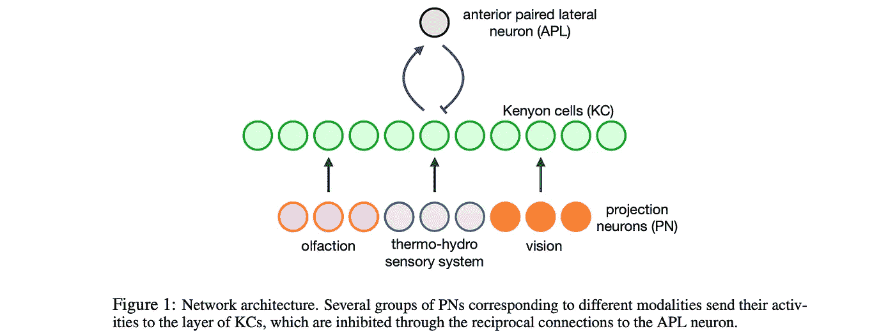

将此转化为语言，单词在 PN 神经元中表示为单词包上下文和中间单词的一个热点向量的串联(见下图)。然后这个向量被认为是训练样本，它被投射到 KC 神经元上并被稀疏化(只有 top-k 值存活)。通过最小化能量函数来训练网络，该能量函数强制共享上下文的单词在 KC 空间中彼此靠近。

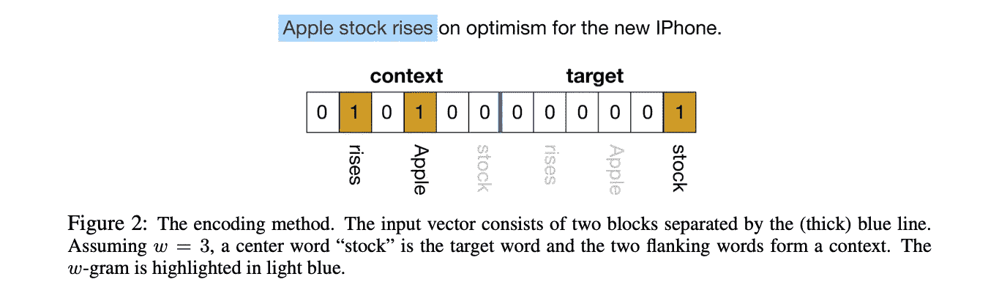

有趣的是，这允许即时生成上下文化的单词嵌入(😉)，假设在推理过程中给定单词的单词包上下文可能不同。

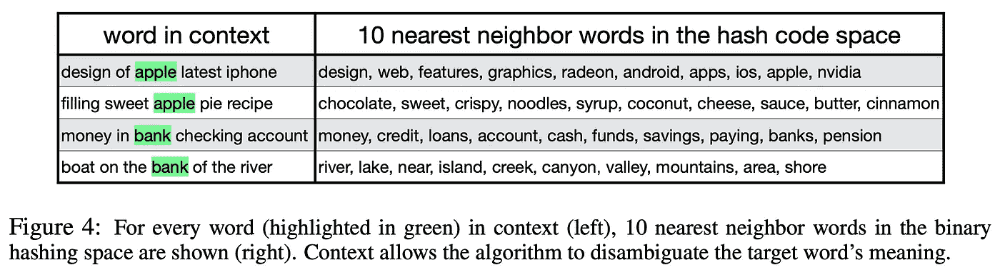

相当激动人心的一组论文！把范围缩小到 10 个确实是个挑战。作为结束语，我想提一下阅读 ICLR 的报纸是一件多么愉快的事情，因为它们比一般的 arxiv.org 出版物要精美得多。不管怎样，这个收藏到此结束，但是大会还有很多值得探索的地方，我真的很期待。该团队将通过我们公司的 twitter feed 在 [@zetavector](https://twitter.com/ZetaVector) 现场报道有趣的见解，所以如果你不想错过任何事情，请收听。

你呢？你对大会最期待的是什么？欢迎在评论中分享一些建议👇

*参考文献*

[1] [*林前者:具有线性复杂性的自我注意*](https://arxiv.org/abs/2006.04768) —司农王等著 2020

[2] [*改革者:高效的变压器*](https://arxiv.org/abs/2001.04451) —作者尼基塔·基塔耶夫等人 2020

[3] [*高效变压器综述*](https://arxiv.org/abs/2009.06732) —易泰等著 2020

[4] [*《大鸟:更长序列的变形金刚》*](https://papers.nips.cc/paper/2020/hash/c8512d142a2d849725f31a9a7a361ab9-Abstract.html)——曼齐尔·扎希尔等著，2020 年

[5] [*BART:自然语言生成、翻译和理解的去噪序列间预训练*](https://arxiv.org/abs/1910.13461) —刘纳曼戈亚尔等 2019

[6] [*DeepMind 控制套件*](https://arxiv.org/abs/1801.00690)—Yu val Tassa 等人 2018

[7][*atari*](https://arxiv.org/abs/1903.00374)*基于模型的强化学习——由祖卡斯·凯泽、穆罕默德·巴巴艾扎德、皮奥特·米奥斯、巴兹·̇ej·奥西斯基等人于 2019 年*

*[8] [*从分散数据进行深度网络的通信高效学习*](https://arxiv.org/abs/1602.05629) —作者 H.BrendanMcMahan 等人 2016*

*[9] [向量空间中单词表示的有效估计](https://arxiv.org/abs/1301.3781) —托马斯·米科洛夫等人，2013 年*

*[10] [GloVe:单词表示的全局向量](https://www.aclweb.org/anthology/D14-1162.pdf) —作者 [Jeffrey Pennington](https://www.aclweb.org/anthology/people/j/jeffrey-pennington/) ， [Richard Socher](https://www.aclweb.org/anthology/people/r/richard-socher/) ，[Christopher Manning](https://www.aclweb.org/anthology/people/c/christopher-d-manning/)2014*

*[11] [亚当:一种随机优化的方法](https://arxiv.org/abs/1412.6980) —作者 Diederik P. Kingma 等人，2015 年*