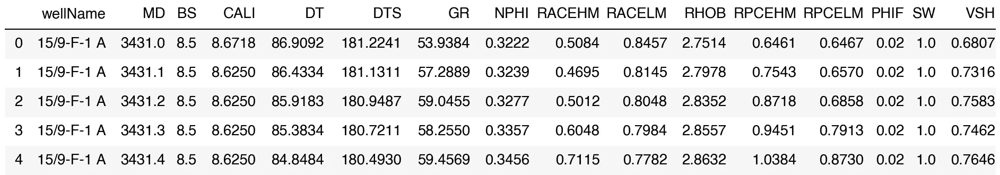
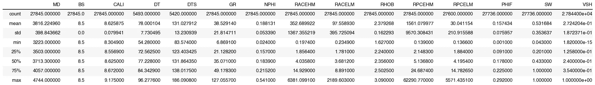
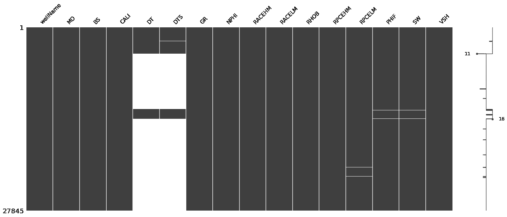
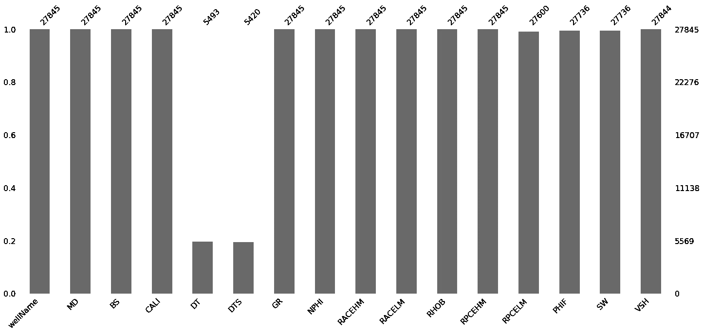
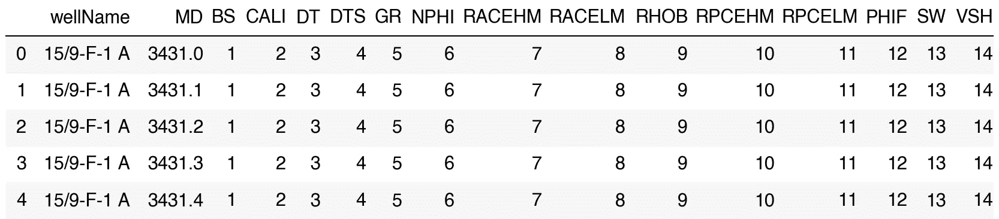
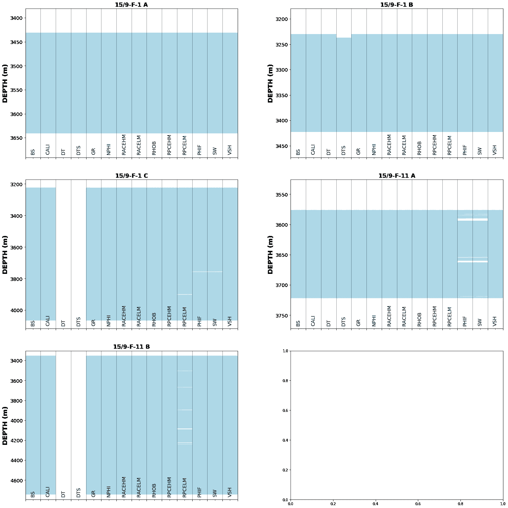
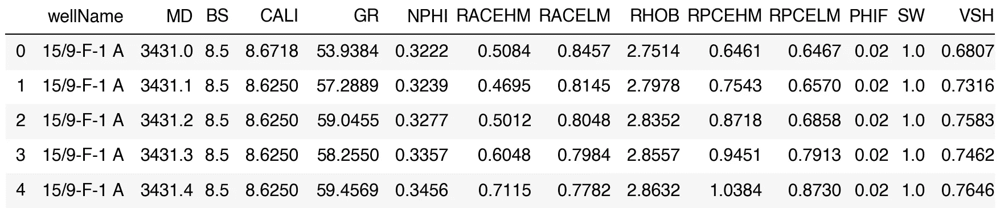

# 在岩石物理机器学习之前识别和处理丢失的测井数据

> 原文：<https://towardsdatascience.com/identifying-and-handling-missing-well-log-data-prior-to-machine-learning-5fa1a3d0eb73?source=collection_archive---------18----------------------->

## 从探索性数据分析到利用测井数据进行机器学习系列文章的第 2 部分


马库斯·斯皮斯克在 [Unsplash](https://unsplash.com/?utm_source=medium&utm_medium=referral) 上的照片

机器学习和人工智能在地球科学和岩石物理领域越来越受欢迎。尤其是在过去的十年里。机器学习是人工智能的一个分支，是计算机可以学习并根据数据进行预测的过程，而无需显式编程。我们可以在岩石物理学中以多种方式使用机器学习，包括自动化异常值检测、属性预测、相分类等。

这一系列文章将着眼于从基本测井测量到岩石物理性质预测的数据集。这些文章最初是在 2021 年 SPWLA 大会上的一个关于机器学习和人工智能的研讨会上作为 Jupyter 笔记本发表的。它们后来被扩展和更新以形成这些文章。该系列将包括以下内容，链接将包括一旦他们被释放。

[1。**Volve 油田数据集**](/exploring-well-log-data-using-pandas-matplotlib-and-seaborn-712779a39ac2) 2 中所选井的初始数据勘探。识别&处理缺失数据(本文)
3。使用手动和自动方法检测异常值/异常数据点
4。使用机器学习预测关键储层性质

这篇关于识别测井测量中缺失数据的文章是之前工作的高潮，具体文章如下:

*   [使用缺失号库识别缺失值](/using-the-missingno-python-library-to-identify-and-visualise-missing-data-prior-to-machine-learning-34c8c5b5f009)
*   [使用 Matplotlib 可视化油井数据覆盖范围](/visualising-well-data-coverage-using-matplotlib-f30591c89754)

此外，如果你想了解 missingno 库如何识别丢失的数据，可以查看我的 YouTube 视频，其中介绍了这个库及其特性。

[https://youtu.be/Wdvwer7h-8w](https://youtu.be/Wdvwer7h-8w)

# 识别和处理缺失数据

缺失值是数据集中的一个常见问题。在测井数据集中，数据丢失的原因有很多，包括工具/传感器故障、数据过时、遥测问题、卡住和拉动以及选择丢失。这些问题在 McDonald (2021)中有详细描述。

在 Python 世界中，我们可以利用易用库中的许多有用的函数来识别丢失的数据，这些方法包括:

*   熊猫数据帧摘要(例如。描述()和。信息())
*   缺少图书馆
*   可视化

处理丢失数据的过程可能会引起争议。许多岩石物理学家、数据科学家和其他人认为，数据的填充可能会导致最终结果增加更大的不确定性，而其他人则建议应该填充数据。可以使用简单的线性插值来填充缺失值，使用平均值进行填充，还可以扩展到使用机器学习算法来预测缺失值。和往常一样，在应用任何缺失数据插补技术后，您应该检查您的数据。

在本文中，我们将首先识别丢失的数据，然后使用多种技术删除受影响的行和列。将使用变量丢弃和列表删除方法演示数据删除。

# 数据

我们将在本文中使用的数据集来自 2018 年发布的流行的 Volve Field 数据集，以促进研究和学习。发布的数据包括:

*   测井记录
*   岩石物理解释
*   报告(地质、完井、岩石物理、岩心等)
*   核心测量
*   地震数据
*   地质模型
*   还有更多…

Volve 油田位于北海挪威部分斯塔万格以西约 200 公里处。1993 年在侏罗纪时代的胡金地层中发现了碳氢化合物。石油生产始于 2008 年，持续了 8 年(是计划时间的两倍)，直到 2016 年停止生产。在油田寿命期内，总共生产了 63 个 MMBO，达到了 56000 桶/天的稳定产量

有关 Volve 字段和整个数据集的更多详细信息，请访问:[https://www . equinor . com/en/what-we-do/Norwegian-continental-shelf-platforms/Volve . html](https://www.equinor.com/en/what-we-do/norwegian-continental-shelf-platforms/volve.html)

这些数据在 Equinor 开放数据许可证下获得许可。

# 导入库和数据

第一步是导入处理数据所需的库。对于本笔记本，我们将使用:

*   [熊猫](https://pandas.pydata.org/)用于加载和存储数据
*   [matplotlib](https://matplotlib.org/) 和 seaborn 用于可视化数据
*   [numpy](https://numpy.org/) 为多种计算方法
*   [缺失 no](https://github.com/ResidentMario/missingno) 显示缺失数据的位置

```
import pandas as pd
import matplotlib.pyplot as plt
import missingno as msno
import numpy as np
```

接下来，我们将使用 pandas `read_csv`函数加载数据，并将其赋给变量`df`。数据现在将存储在一个称为数据帧的结构化对象中。

```
df = pd.read_csv('data/spwla_volve_data.csv')
```

正如在上一篇文章中看到的，我们可以调用一些方法来检查数据内容和初始质量。

`.head()`方法允许我们查看数据帧的前 5 行。

```
df.head()
```



使用 df.head()方法从 dataframe 中获取标题行。图片由作者提供。

`.describe()`方法为我们提供了一些汇总统计数据。为了使用这种方法确定我们是否有丢失的数据，我们需要查看计数行。如果我们假设 MD(测量深度)是最完整的列，我们有 27，845 个数据点。现在，如果我们看一下 DT 和 DTS，我们可以看到我们分别只有 5，493 和 5，420 个数据点。一些其他栏目也有较低的数字，即:RPCELM，PHIF，西南，VSH。

```
df.describe()
```



使用 df.describe()方法的数据帧摘要统计数据—单击以放大。图片由作者提供。

为了获得更清晰的认识，我们可以调用`info()`方法来查看每列有多少非空值。我们可以立即看到之前突出显示的那些具有较少数量的非空值。

```
df.info()
```

这将返回以下内容:

```
<class 'pandas.core.frame.DataFrame'>
RangeIndex: 27845 entries, 0 to 27844
Data columns (total 16 columns):
wellName    27845 non-null object
MD          27845 non-null float64
BS          27845 non-null float64
CALI        27845 non-null float64
DT          5493 non-null float64
DTS         5420 non-null float64
GR          27845 non-null float64
NPHI        27845 non-null float64
RACEHM      27845 non-null float64
RACELM      27845 non-null float64
RHOB        27845 non-null float64
RPCEHM      27845 non-null float64
RPCELM      27600 non-null float64
PHIF        27736 non-null float64
SW          27736 non-null float64
VSH         27844 non-null float64
dtypes: float64(15), object(1)
memory usage: 3.4+ MB
```

## 使用缺失数据可视化数据稀疏性

missingno 库旨在获取数据帧，并允许您可视化可能存在的差距。

我们可以简单地调用`.matrix()`方法并传入 dataframe 对象。当我们这样做时，我们生成数据帧的图形视图。

在下图中，我们可以看到 DT 和 DTS 列中有明显的差距，而 RPCELM、PHIF 和 SW 列中有微小的差距。

图表右侧的迷你图提供了数据完整性的指示。如果该行位于最大值(右侧)，则表明该数据行是完整的。

```
msno.matrix(df)
```



缺失没有显示缺失数据值出现位置的矩阵图。作者图片

我们可以调用的另一个图是条形图，它提供了每一列中点数的图形汇总。

```
msno.bar(df)
```



缺少所选井内数据的条形图。图片作者。

## 使用 matplotlib 创建自定义数据覆盖图

我们可以生成自己的图来显示每口井的数据稀疏度如何变化。为了做到这一点，我们需要操纵数据帧。

首先，我们创建一个单独处理的数据帧的副本，然后如果数据为非空，用值 1 替换每一列。

为了让我们的绘图工作，我们需要将每一列的值增加 1。这允许我们将每一列绘制为前一列的偏移。

```
data_nan = df.copy()
for num, col in enumerate(data_nan.columns[2:]):
    data_nan[col] = data_nan[col].notnull() * (num + 1)
    data_nan[col].replace(0, num, inplace=True)
```

当我们查看数据帧的标题时，我们现在有一系列从 1 到 14 递增值的列。

```
data_nan.head()
```



包含基本值的数据框架，可用于绘制数据覆盖范围。作者图片

接下来，我们可以按照井名列对数据帧进行分组。

```
grouped = data_nan.groupby('wellName')
```

然后，我们可以使用新的数据帧为每个井创建多个子图。如果数据存在，我们可以从前一列的最大值渐变到当前列的最大值，而不是在子情节中创建子情节。如果缺少数据，它将显示为一个缺口。



显示五口选定井的每条测井曲线的数据覆盖范围的子图。蓝色表示数据存在的位置，白色表示缺少值。图片作者。

从图中，我们不仅可以看到每口井的数据范围，还可以看到 5 口井中有 2 口井的 DT 和 DTS 曲线缺失，2 口井的 RPCELM 数据缺失，2 口井的 PHIF 和 SW 曲线值缺失。

# 处理缺失数据

## 丢弃变量

变量丢弃可用于变量中存在缺失值的情况，这反过来会使该变量不适合预期用途。因此，它可以从数据集中删除。如果做到了这一点，它可以对机器学习建模产生广泛的影响，特别是如果变量很重要并且存在于其他油井中。

在我们的示例数据集中，两个井中的 DT 和 DTS 都缺失。我们可以选择从数据集中删除这些孔，或者我们可以删除所有孔的这两列。

以下是我们如何从数据帧中移除两条曲线的示例。为此，我们可以将一个列名列表传递给函数`drop()`,即我们希望沿着其放置数据的轴，在本例中是列(轴=1 ),而`inplace=True`参数允许我们从 dataframe 中物理删除这些值。

```
df.drop(df[['DT', 'DTS']], axis=1, inplace=True)
```

如果我们查看数据帧的标题，我们会看到我们已经删除了所需的列。

```
df.head()
```



然而，如果我们调用信息方法…

```
df.info()
```

它返回下面的结果。我们可以看到，我们仍然有一些测井曲线/列缺少值。即 PHIF、西南和 VSH。其中最后三个是岩石物理输出，并且可能只存在于感兴趣的区域上。

```
<class 'pandas.core.frame.DataFrame'>
RangeIndex: 27845 entries, 0 to 27844
Data columns (total 14 columns):
wellName    27845 non-null object
MD          27845 non-null float64
BS          27845 non-null float64
CALI        27845 non-null float64
GR          27845 non-null float64
NPHI        27845 non-null float64
RACEHM      27845 non-null float64
RACELM      27845 non-null float64
RHOB        27845 non-null float64
RPCEHM      27845 non-null float64
RPCELM      27600 non-null float64
PHIF        27736 non-null float64
SW          27736 non-null float64
VSH         27844 non-null float64
dtypes: float64(13), object(1)
memory usage: 3.0+ MB
```

## 使用列表式删除丢弃 nan

列表式删除，也称为事例删除，是处理不完整数据集的一种常见而方便的方法。该方法移除要素中有一个或多个缺失值的所有行(案例)。

在 Python 中，我们可以通过调用一个叫做`dropna()`的特殊函数来删除熊猫数据帧中缺失的值。这将从数据帧中删除任何 NaN(非数字)值。`inplace=True`参数允许我们从数据帧中物理删除这些值，而不必将其赋给一个新变量。

```
df.dropna(inplace=True)
```

如果我们调用`df.info()`,我们将看到我们的数据集已经减少到每列 27，491 个非空值。

```
<class 'pandas.core.frame.DataFrame'>
Int64Index: 27491 entries, 0 to 27844
Data columns (total 14 columns):
wellName    27491 non-null object
MD          27491 non-null float64
BS          27491 non-null float64
CALI        27491 non-null float64
GR          27491 non-null float64
NPHI        27491 non-null float64
RACEHM      27491 non-null float64
RACELM      27491 non-null float64
RHOB        27491 non-null float64
RPCEHM      27491 non-null float64
RPCELM      27491 non-null float64
PHIF        27491 non-null float64
SW          27491 non-null float64
VSH         27491 non-null float64
dtypes: float64(13), object(1)
memory usage: 3.1+ MB
```

# 摘要

现在，我们已经删除了丢失的值，我们可以进入下一步，即识别和处理异常值和坏数据。

这篇短文展示了可视化缺失数据的三种不同方法。第一种是使用 pandas 查询数据帧，第二种是使用 missingno 库，第三种是使用 matplotlib 创建自定义可视化。

最后，我们介绍了从数据帧中删除缺失数据的两种方法。第一种方法是丢弃变量，第二种方法是丢弃行中缺少的值。

本文中展示的例子说明了处理缺失值的基本工作流。在每个阶段都应该对数据进行彻底的质量控制，以确保其仍然符合目的。

*感谢阅读！*

*如果您觉得这篇文章有用，请随时查看我的其他文章，这些文章介绍了 Python 和测井数据的各个方面。你也可以在* [*GitHub*](https://github.com/andymcdgeo) *找到我和其他人在本文中使用的代码。*

*如果你想联系我，你可以在*[*LinkedIn*](https://www.linkedin.com/in/andymcdonaldgeo/)*或者我的* [*网站*](http://andymcdonald.scot/) *找到我。*

有兴趣了解更多关于 python 和测井数据或岩石物理学的知识吗？跟我上 [*中*](https://medium.com/@andymcdonaldgeo) *。*

<https://andymcdonaldgeo.medium.com/membership> 