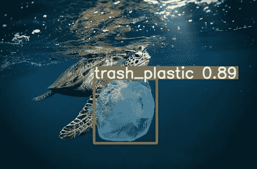
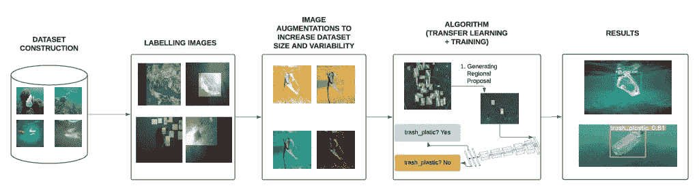
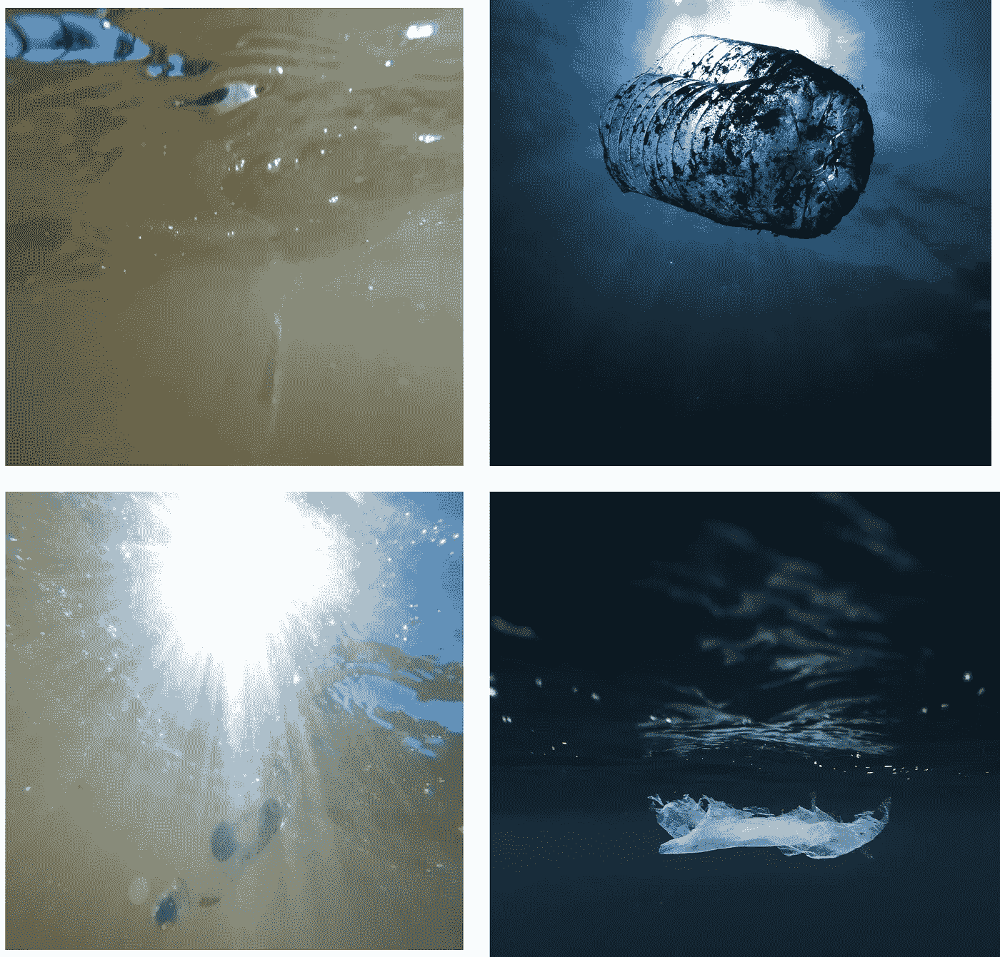
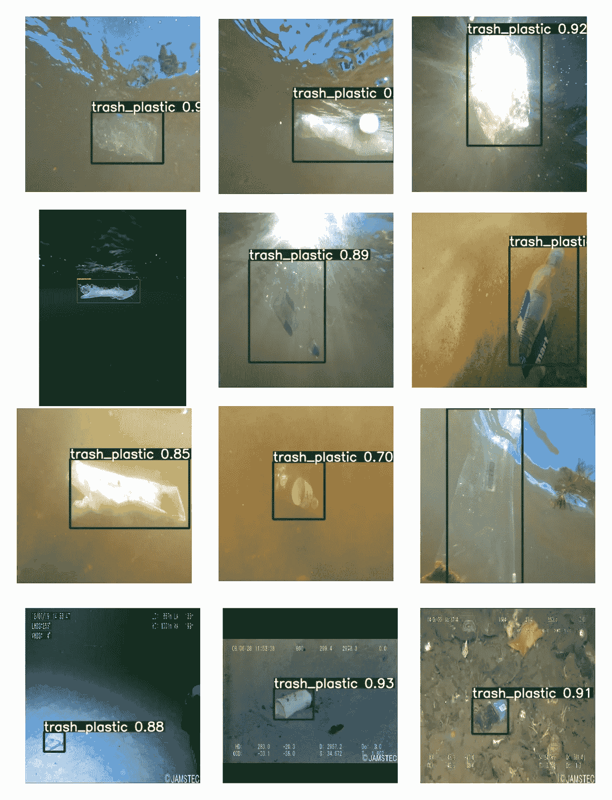

# 使用深度学习来量化、监控和清除海洋塑料

> 原文：<https://towardsdatascience.com/identifying-and-removing-marine-plastic-a-deep-learning-approach-6ad5e41bec41?source=collection_archive---------23----------------------->

## 能够识别和量化全世界的地下塑料的通用物体检测器

照片由[土坯库存](https://stock.adobe.com/ee/license-terms)的 [Jag_cz](https://stock.adobe.com/ee/contributor/201039361/jag-cz?load_type=author&prev_url=detail) 拍摄

我和我的团队一起参与了一个名为*深度塑料*的项目，这是一种利用深度学习识别海洋塑料的新方法，我想分享一下我的发现:

## 85%的平均精度！

使用我们的模型，我们现在可以平均检测海洋中 85%的表层塑料。我们基于名为 [**YOLOv5-S**](https://github.com/ultralytics/yolov5) 的神经网络架构实现了这一级别的精度。下面我们附上了一段视频，其中包含我们运行模型的海洋塑料示例:

利用深度学习模型检测海洋塑料

# 文件和代码在哪里？

这篇文章将主要作为我们研究论文的无代码摘要。如果你想直接跳到神经网络或代码的本质细节，你可以在这里访问它们:

arxiv 预印本:[https://arxiv.org/abs/2105.01882](https://arxiv.org/abs/2105.01882)

Github 代码库:[https://github.com/gautamtata/DeepPlastic](https://github.com/gautamtata/DeepPlastic)

如果你想让我再写一篇解释代码、数据扩充等的博文。，在下面的评论里告诉我吧！

# 我是怎么卷进来的？

我一直对海洋充满热情。从加州州立大学蒙特利湾分校毕业后，我知道我想开发工具/软件来帮助保护海洋。在我收集、注释和管理数据以及模型之后，我意识到精度指标非常重要，可能有一份手稿可以在这里发表。因此，我向海洋塑料专家萨拉-珍妮·罗耶博士以及杰伊·劳伊·T21 和奥利维尔·波里恩博士寻求帮助，帮助撰写和出版手稿。

# 摘要

正浮力海洋塑料垃圾的量化对于了解垃圾如何在世界海洋中聚集以及确定急需清除垃圾的高浓度垃圾热点至关重要。

目前，量化漂浮塑料的最常见监测方法需要使用蝠鲼拖网。在分析之前，物理移除的需要会导致高成本，并需要大量的劳动力，从而阻碍了实时海洋塑料监测服务在海洋中的可扩展部署。如果没有更好的监测和采样方法，塑料污染对整个环境的总体影响，以及特定海洋区域内影响的细节，将仍然是未知的。

这项研究提出了一个自动化的工作流程，利用在海洋表层捕获的视频和图像作为输入，对海洋塑料进行实时量化，以实现精确量化和清除。

> **YOLOv5-S** 是性能最好的车型，其平均精度(mAP)为 0.851，F1 得分为 0.89，同时保持接近实时的速度。此外，我们的方法可以利用“现成的”摄像设备和标准的低成本 GPU 来近乎实时地监测/量化表层塑料。

# 项目的目标

我们希望建立一个通用的物体探测器，能够识别和量化世界各地的地下塑料。

现在我们已经了解了我们的目标以及如何实现它，让我们进入工作流程。

检测海洋塑料的管道；作者照片

# 管理数据集

找到一个包含海洋废弃物注释图片的数据集非常困难。目前还没有关于海洋表层海洋塑料图像的数据集。所以，我决定创造一个。我买了一台 GoPro Hero 9、一套潜水服和浮潜设备，带着 2 个塑料袋和 2 个塑料瓶前往加利福尼亚的各个地方。

我去过的地方有:太浩湖，波德加湾，旧金山湾。在这里，我在 4K 拍摄了塑料的视频，然后将它们逐帧分解成图像。[在我完成视频拍摄后，所有使用的塑料都经过消毒并从环境中移除]最初的数据集有 10 万多张图像，然后我煞费苦心地逐一查看，选择了最好的图像，并使用 supervise.ly 对它们进行了注释。最终的数据集，加上从互联网上收集的图像，有 4000 张图像。

我尽力通过将物体埋在沙子里或放置在太阳对面来复制真实世界的场景，如遮挡和亮度。

(**右下**)照片由[娜佳·贝尔托尔特·詹森](https://unsplash.com/@naja_bertolt_jensen?utm_source=unsplash&utm_medium=referral&utm_content=creditCopyText)在 [Unsplash](https://unsplash.com/s/photos/underwater-plastic?utm_source=unsplash&utm_medium=referral&utm_content=creditCopyText) 上拍摄；(**右上**)照片由[纳里曼·迈沙拉法](https://unsplash.com/@narimanmesharrafa?utm_source=unsplash&utm_medium=referral&utm_content=creditCopyText)在 [Unsplash](https://unsplash.com/s/photos/underwater-plastic?utm_source=unsplash&utm_medium=referral&utm_content=creditCopyText) 上拍摄；(**左上，右下**)作者图片

## 数据格式编排

图像尺寸调整为 416x416，并转换为 Darknet 和 YOLOv5 PyTorch 要求的格式。

## 数据扩充

由于最终的数据集只包含 4000 张图像，我认为增加数据集大小的最佳方式是扩大它。所以，我用翻转，旋转，亮度来复制海洋环境。

我还使用了 B&W 来使模型不被颜色和剪切所影响，来模拟遮挡。

# 构建神经网络

构建神经网络是一项简单的任务。我选择模型有两个目标:模型必须有点准确，模型必须很快。足够快，可以用在浮标和无人机上。我试过很多型号，比如更快的 R-CNN，EfficientDet，SSD 等。，但坚持使用两种型号:YOLOv4-Tiny 和 YOLOv5-S。

*对 YOLOv5 的代码运行感兴趣？请在下面的评论中告诉我或者联系我。*

注意事项/调整超参数:

1.  我使用了一个叫做 ADAM 的*自适应学习率*来设置一个衰减的学习率。
2.  使用名为 *W & B* 的软件包(重量和偏差)并持续监控损失。
3.  我使用了一个 *softmax* 作为最后一层，并且只使用了*一个叫做trash_plastic 的类*。
4.  我用 paperspace.com 和谷歌 Colab pro 搭配*英伟达 v100 GPU*来训练模型。
5.  使用在*水下场景*和*深海残骸上训练的权重的迁移学习——jam stec JEDI 数据集。*

> 所有用于模型的代码包括架构都可以在 [YOLOv4](https://github.com/AlexeyAB/darknet) 、 [YOLOv5](https://github.com/ultralytics/yolov5) 找到
> 
> 对我们的代码感兴趣吗？找到这里:[https://github.com/gautamtata/DeepPlastic](https://github.com/gautamtata/DeepPlastic)

# 结果

在对训练方法、数据扩充和微调超参数进行了大量实验后，我们最终达到了一个结果足够好的点，可以在现实世界的部署中使用。

最佳模型 **YOLOv5-S** :精度:96%，均值-均值-精度:85%，F1-得分:0.89，推理速度:2.1 毫秒/img。

**(下排)**照片由[贾姆斯泰克绝地](http://www.jamstec.go.jp/e/about/informations/notification_2021_maintenance.html)、**(第二排第一张)** ( **右下**)照片由[娜佳·贝尔托尔特·詹森](https://unsplash.com/@naja_bertolt_jensen?utm_source=unsplash&utm_medium=referral&utm_content=creditCopyText)在 [Unsplash](https://unsplash.com/s/photos/underwater-plastic?utm_source=unsplash&utm_medium=referral&utm_content=creditCopyText) 上拍摄；作者提供的所有其他图像

# 下一步是什么？

目前，我们正在发表我们的论文。我们正试图让其他研究人员掌握这个模型，以测试和开发创新的方法来合成更多的数据。

如果你感兴趣，想投稿，或者想聊天，你可以在这里联系我:[gautamtata.blog@gmail.com](mailto:gautamtata.blog@gmail.com)。

**了解更多** arxiv 预印本:[https://arxiv.org/abs/2105.01882](https://arxiv.org/abs/2105.01882)