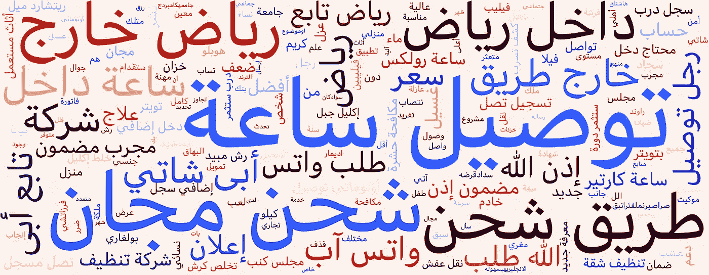
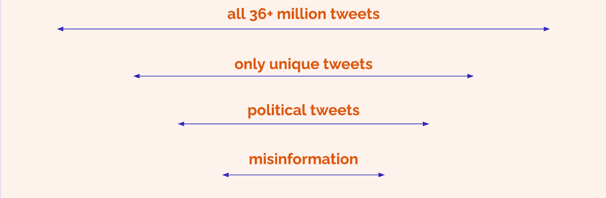
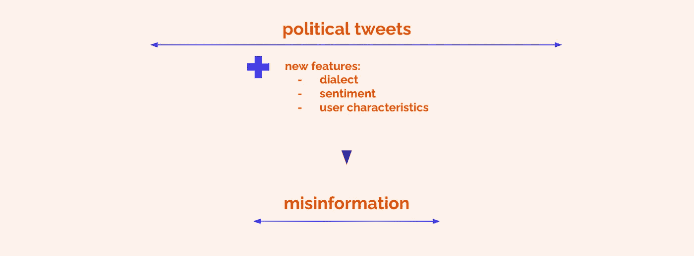
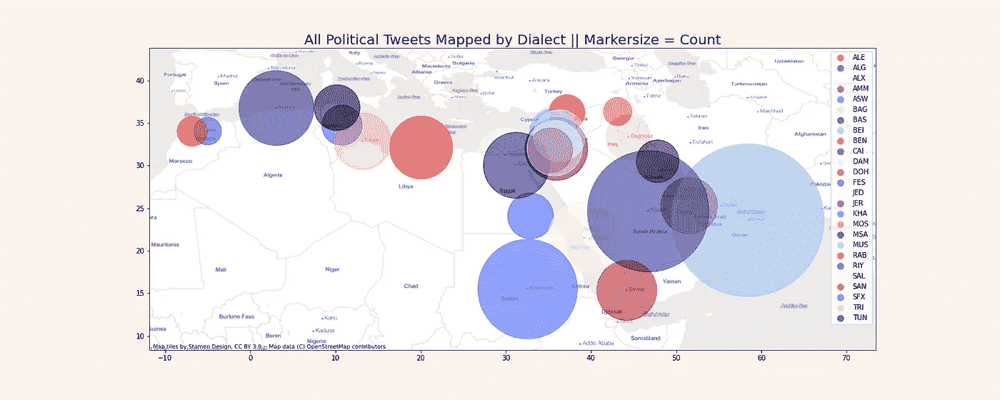
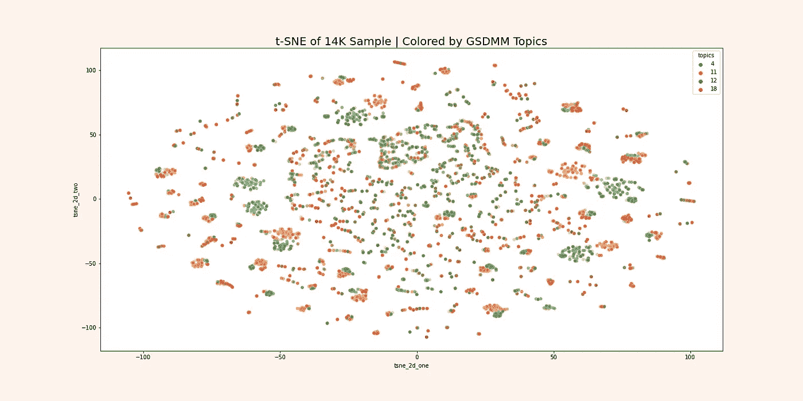

# 识别推特上的阿拉伯语政治错误信息

> 原文：<https://towardsdatascience.com/identifying-arabic-language-political-misinformation-on-twitter-3a614c489c00?source=collection_archive---------26----------------------->

## 使用无监督的 NLP 主题建模和聚类来构建能够识别短文本文档中的错误信息的机器学习分类器

作者图片

# TL；博士；医生

Twitter 等社交媒体平台正与政治错误信息作斗争。打击误传的一个主要挑战是缺乏带标签的数据集，特别是在低资源语言中。该项目提出了一种独特的主题建模混合方法，并将其应用于 3600 多万条阿拉伯语推文的数据集，这些推文是由 Twitter 标记为国家关联信息操作的一部分的用户发布的。混合主题聚类模型能够成功提取政治内容。由于技术限制和数据集的大小，应用进一步的聚类算法来识别政治内容，特别是错误信息还没有成功。

互联网——尤其是社交媒体——充斥着政治错误信息。除了在浏览你的推特信息时成为潜在的麻烦之外，这种错误信息也会在现实世界中产生巨大的反响，就像 1 月 6 日美国国会大厦的风暴一样。因此，对于政治、人道主义和情报部门的组织来说，发现政治错误信息和仇恨言论是一项重大挑战。打击误传的一个主要挑战是缺乏带标签的数据集，特别是在低资源语言中。

在与多个组织中涉及错误信息和仇恨言论检测的几个人交谈后，我决定使用我的跳板数据科学职业生涯的最后一个顶点项目来解决其中的一些问题。通过这个项目，我希望通过专门研究检测阿拉伯语推文中的政治错误信息所需的工具和过程，为该领域正在进行的研究做出贡献。

# 数据

在这个项目中，我使用了来自 Twitter 的[透明中心](https://transparency.twitter.com/en/reports/information-operations.html)的数据集，该数据集由 5350 个 Twitter 账户(以及所有 3600 多万条推文，其中 95%是阿拉伯语)组成，这些账户被 Twitter 认定为与国家相关的信息操作的一部分。

用推特自己的话来说，

> “一个与沙特阿拉伯有关、在包括 KSA、埃及和阿联酋在内的多个国家运营的账户网络，正在放大赞扬沙特领导的内容，并批评卡塔尔和土耳其在也门的活动。共有 5350 个账户被删除。”

数据下载于 2021 年 2 月 26 日。

# 方法

这里需要注意的重要一点是，*账户*被认定为“受损”,而不是其每一条推文本身。这意味着并非所有 3600 万条推文实际上都包含政治错误信息。

当然，一个账户早上在推特上赞扬沙特王室，下午放大可爱猫的模因，这是完全合理的。尽管这两者不一定是相互排斥的。

图片来自 9gag.com

诀窍是找出如何将 3600 多万条推文浓缩成实际的政治错误信息内容。

在这一点上，真正让我着迷的问题是，是否有可能使用**无监督学习方法**来筛选数据集中的 3600 多万条推文，以便成功地检测出那些特别是**政治错误信息**的推文。虽然雄心勃勃(异想天开？)，一个能够成功做到这一点的模型将是对该领域的一个巨大贡献，因为输出可以被输入到机器学习分类器中，而机器学习分类器又可以用于对其他看不见的数据进行分类。本质上，我们将构建一个半监督学习解决方案，它将绕过对大型标签数据集的需求。

从概念上讲，这意味着我想建立一个漏斗，从:

作者图片

这也成为我构建工作流程的一种非常直观的方式:

作者图片

1.  **争论**:清理数据，只获取独特的推文。
2.  **主题建模**:对独特的推文进行 NLP 驱动的分类，筛选出所有工作日结束时的猫迷因和其他垃圾，只获得政治内容。
3.  **聚类**:应用无监督学习方法，进一步区分政治内容和政治 ***误传*** 。
4.  **分类**:使用输出构建一个 ML 分类器。

# **扯皮**

除了通常的 NLP 数据争论步骤，如删除网址，表情符号，标签，重复字符等。这个项目还涉及一些特定于阿拉伯语自然语言处理的预处理。在之前的[帖子](https://richardpelgrim.medium.com/arabic-nlp-unique-challenges-and-their-solutions-d99e8a87893d)中，我提供了关于处理阿拉伯文本的特殊挑战的深入教程和解释…以及如何使用多功能的 **camel-tools** Python 包来克服它们。

在删除所有非阿拉伯语推文(~3%)和所有重复内容(即转发推文)后，我们剩下**615 万条独特的阿拉伯语推文**。

# 一些基本数据

在我们继续查看这 615 万条独特的推文是关于什么的之前，有必要提一下关于数据集中推文行为的一些基本信息。

数据集包含:

*   3530 万条阿拉伯语推文
*   4，273 个独立用户
*   2010 年 2 月 15 日**至 2020 年 1 月 22 日**之间发布的推文(2018 年和 2019 年的推文最多)****

****查看用户之间的推文、关注者和追随者的分布(在完整的 3600 万数据集中)，我们注意到一些非常不均衡的模式，例如:****

*   ****每个用户的关注者数量:从 0 到 120 万不等，中位数为 100。****
*   ****#每用户关注:范围从 0 到 877k，中位数为 228。****
*   ****最受关注的前 1%用户发布了**3500 万条推文中的近一半******
*   ****每个用户的推文:范围从 100 万到 140 万( **~整个数据集的 4.2%**)—中位数:203****

****只看独特的推文，我们看到:****

*   ****610 万条独特的推文****
*   ****超过 400 万条独特的推文在数据集中只出现一次****
*   ****78 条独特的推文出现超过 10，000 次****
*   ****这些 **78 条独特的推文**一起构成了数据集的 **4.5%(超过 150 万条推文)******

****所有这些都表明**极度放大**:少数用户和推文在数据集中被过度呈现，淹没了“正常”的推文行为。****

****仔细观察前 100 条最常出现的独特推文，也发现了大量非政治内容。以下是前 100 条推文中最常见的词汇:****

********

****作者图片****

****如你所见，在这里很难找到太多明确的政治内容。这或许可以为一种将政治错误信息淹没在普通“垃圾”中以避免被发现的策略提供依据。****

****经过一些进一步的 EDA 风格的挖掘，我可以自信地确定 3 个主要的内容集群:****

1.  ****宗教的****
2.  ****商业****
3.  ****政治的****

# ******主题的建模******

****这种三分法有助于指导我的下一步工作:使用**主题建模**从 615 万条独特的推文转移到具体的政治内容。为了筛选出政治内容，我使用了两种不同的主题建模方法:**潜在狄利克雷分配** (LDA)和**吉布斯抽样狄利克雷多项式混合** (GSDMM)。****

****虽然 LDA 是目前最流行的主题建模方法，但它假设每个文档有多个主题。另一方面，GSDMM 是专门为短文本聚类而构建的，并且假设每个文档只有一个主题。鉴于我们的文件是最大的。140 个字符长，假设它们只包含一个主题似乎是合理的。****

*****注意:在* [*的一篇附带文章*](https://richardpelgrim.medium.com/short-text-topic-modelling-lda-vs-gsdmm-20f1db742e14) *中，我列出了 LDA 和 GSDMM 的利弊，还提供了帮助您开始使用 GSDMM 的材料链接。*****

****我对每个模型进行了多次迭代，调整它们的超参数来比较它们的性能。毫无疑问，GSDMM 模型在识别连贯主题和提取特定政治主题方面做得更好。以下是 GSDMM 模型确定的一些主题的文字云:****

********

******宗教内容，**作者形象****

********

******金融服务内容，**作者图片****

********

******家政服务内容，**图片作者****

********

******内容露骨，**图片作者****

********

******政治内容**(“我的父母”是“平民”的误译)，作者图片****

****但是…****

****GSDMM 模型只能在包含 10 万条推文的数据子样本上运行时才能做到这一点。当我试图将 615 万条唯一推文的完整数据集传递给 GSDMM 模型时，该模型要么失败，要么需要几天时间才能运行。****

****由于 GSM DMM 无法并行化(然而… [本文](https://ojs.aaai.org/index.php/AAAI/article/view/4325/4203)似乎暗示有一个版本正在开发中，可以)我最终设计了一个解决方案，从最佳 LDA 模型中提取输出——总共 350，000 条，姑且称之为“主要是政治性的”推文——并将其输入我们的 GSM DMM 模型，进行最后一次筛选，从中剔除垃圾。这非常有效，产生了 285，000 条“纯政治”推文的连贯子集，分为 4 个子主题。****

# ****大集群****

****到目前为止，我对结果非常满意。主题建模非常有效，我已经为下一步做好了准备，尽管这是项目中最雄心勃勃的一步:使用无监督学习将政治推文分解为具体的“中立”和“错误信息”内容。****

****这里的想法是超越只看推文的文本内容，并在混合中添加一些功能，可能有助于区分“中立”和“错误信息”的政治内容。****

********

****作者图片****

****这些新功能包括以下方面的数据:****

*   ****写这条推文的方言(可以使用 camel-tools 库推断出来)****
*   ****推文的情绪:积极、消极还是中立****
*   ****总结发布推文的用户的**特征的多个特征，例如:该用户创建的推文的总数、该用户创建的具有相同时间戳的推文的数量(作为类似机器人行为的潜在指示)，以及关注者/追随者的数量。******

****生成方言功能有一个有趣的副作用，就是为我们提供了关于该数据集中推文地理分布的额外数据。下面的地图显示了 26 种方言中每一种的推文数量。这些方言是根据它们最常用的主要城市命名的。当然，一种方言在比一个城市大得多的地区使用。也不能保证一个用黎巴嫩方言写作的人真的是从黎巴嫩发推特*。所以虽然我们应该带着一粒(一勺！)的盐，这里仍然有一些关于这个数据集中的用户的地理和人口统计的有用信息。*****

**********

*****作者图片*****

*****在设计了新的特性之后，我试图通过一些不同的聚类算法来运行新的数据框架:K-Means、t-SNE 和层次聚类。不幸的是，此时我遇到了我正在使用的库的技术限制，以及项目的时间限制。由于数据集的大小(285k 行* 10K+特征)，以及无法有效地并行聚类算法，我还没有(到目前为止！)能够通过有意义的聚类算法运行整个数据集。*****

*****然而，我确实设法通过 t-SNE 聚类运行了 5%的子样本。这揭示了大量的小集群，它们似乎被 GSDMM 主题标签有效地定义了，如下面的截图所示。*****

**********

*****作者图片*****

*****有点令人沮丧；而且也是数据科学项目在技术上和实践上的现实局限性的坚实的一课。不过，我仍然认为这种方法值得探索，我渴望花更多的时间来尝试弄清楚在分布式集群中运行这些聚类算法的细节，并探索有意义的方法来区分这两种类别(错误信息与否)。*****

# *******外卖*******

*****该项目在当前状态下(至少)提供了以下 4 点启示:*****

1.  *****阿拉伯语自然语言处理呈现了它自己的一系列挑战……这些挑战需要深入研究，但肯定是可以克服的，尤其是在 camel-tools 包的帮助下。*****
2.  *****阿拉伯推文的主题建模**很有效**…而且非常有效！*****
3.  *****在处理短文本文档时，选择 LDA 而不是 GSDMM 的利弊是相当大的……但是也可以将它们结合起来，从而两全其美。*****
4.  *****分布式处理的世界在某些方面确实是一个不同的球赛，并提出了许多额外的挑战，需要额外的时间和勇气来克服。*****

# *****下一步是什么？*****

*****展望未来，我想至少用三种方式来扩展这个项目:*****

1.  *****进一步探索聚类方法，包括主成分分析、分布式 t-SNE /光谱*****
2.  *****与 Python 社区就扩展 GSDMM 以分布式模式运行的可能性进行交流*****
3.  *****广泛的网络分析，以检测**用户交互**的模式，并探索这些信息操作的**归属**到网络中特定节点的可能性。*****

*****如果你正在阅读这篇文章，并有一个想法或一些建设性的意见，请在下面的评论中分享。你可以在这里找到完整的 Jupyter 笔记本。*****

## *****!إلى اللقاء*****