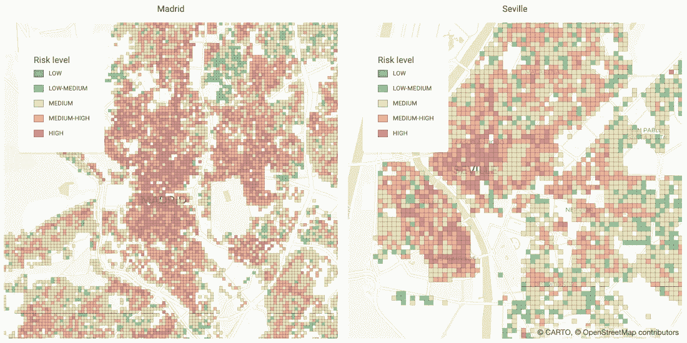
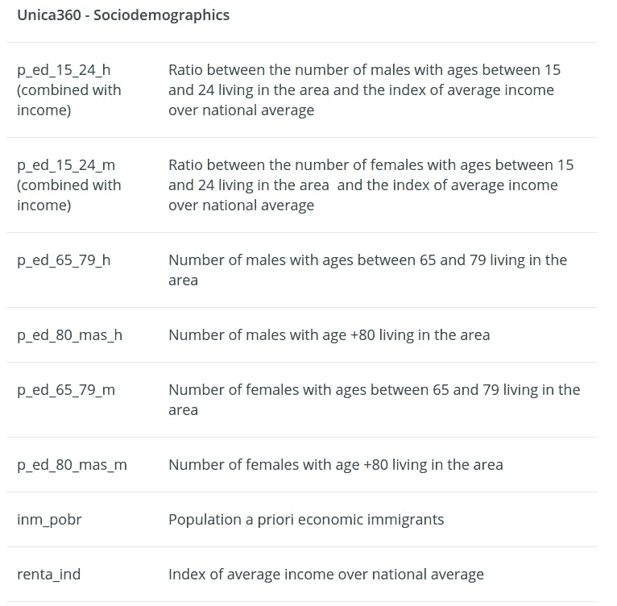
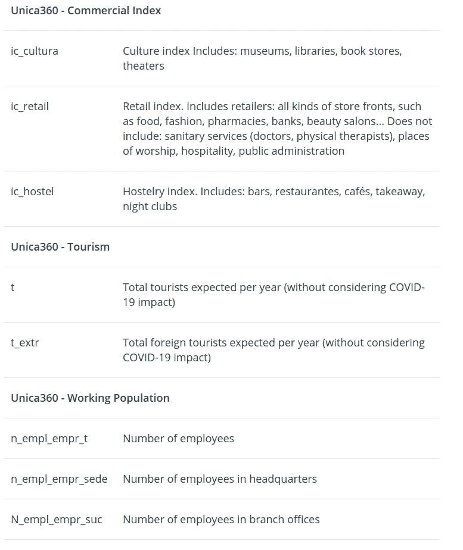
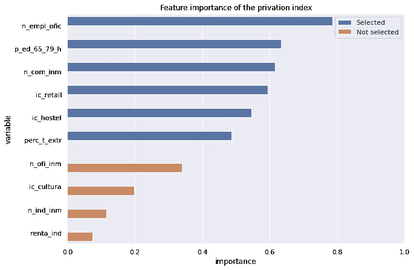
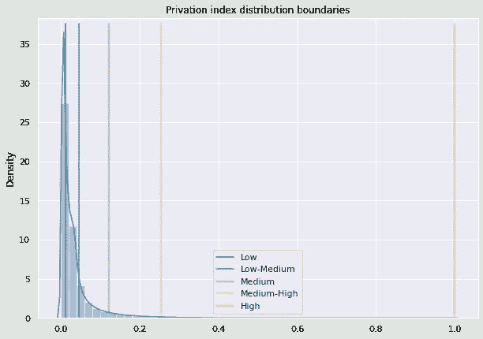
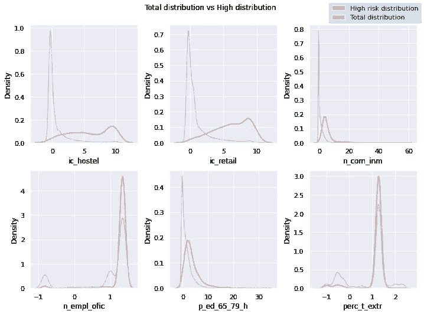
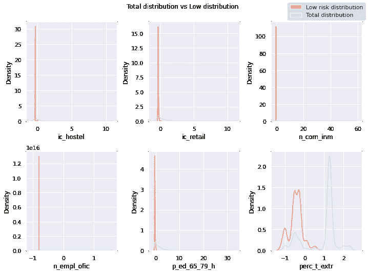

# 确定疫情后最有可能遭受衰退的地区

> 原文：<https://towardsdatascience.com/identifying-areas-most-likely-to-suffer-recession-post-pandemic-acc15803fb14?source=collection_archive---------27----------------------->

## 使用这种方法，查看后 covid 衰退将在哪些方面产生更大影响

*作者图片*

由于目前围绕新冠肺炎疫情的不确定性水平，即将到来的经济衰退的影响几乎不可能预测；然而，[历史告诉我们](https://www.sciencedirect.com/science/article/pii/S0213911119302729)某些社会人口统计、社会经济、教育和就业因素会让某些人群面临经济危机更严重的后果。这一次，与 2008 年不同，经济衰退将在全球疫情之后到来。世界各国政府采用的非药物干预措施(NPIs)；例如关闭学校、远程工作政策以及限制国内和国际流动的就地安置(封锁)战略，对零售业和旅游业等某些经济部门造成了额外的破坏。这也转化为一个额外的风险因素，对于那些靠这些受危害行业的商业活动所产生的经济支持谋生的个人来说。

基于一系列恶化的社会人口和社会经济因素，这项研究试图确定西班牙哪些地区面临即将到来的经济衰退的风险更高。为了帮助建立风险模型，使用了一组与这些地区的人口和经济活动相关的指标。

[图片](https://unsplash.com/photos/iaSzwYccV28)作者[小森正明](https://unsplash.com/@gaspanik)

# 数据集

在这项研究中，我们与我们的数据合作伙伴 [Unica360](https://www.unica360.com/) 合作，并利用了他们在我们的[数据观测站](https://carto.com/spatial-data-catalog/browser/?provider=unica360)中提供的一些数据产品。

我们从现有的不同数据集中选择具体的恶化指标的理由如下:

*   [社会人口统计](https://carto.com/spatial-data-catalog/browser/dataset/u360_sociodemogr_28e93b81/):老年人口较多的地区、低收入地区年轻人较多的地区、来自国内生产总值较低国家的外国人口较多的地区，以及平均收入低于全国平均水平的地区。
*   [地籍](https://carto.com/spatial-data-catalog/browser/dataset/u360_cadaster_1da95656/):办公、商业和工业物业较多的地区，由于 NPI 措施，这些地区的活动可能会减少。
*   [商业指数](https://carto.com/spatial-data-catalog/browser/dataset/u360_commerciali_dc05ce78/):旅馆业、文化业和零售业较多的地区，由于 NPI 措施，这些地区的活动可能有所减少。
*   [旅游业](https://carto.com/spatial-data-catalog/browser/dataset/u360_tourism_e1656c74/):游客预期较高的地区，尤其是来自外国的游客，他们可能受到国际旅行限制和减少的影响。
*   [工作人群](https://carto.com/spatial-data-catalog/browser/dataset/u360_workingpopu_ac666c1f/):在办公室工作的员工较多的地区，可能由于疫情期间远程工作的增加而受到影响。

值得注意的是，所有这些数据集都是在覆盖全国的 100x100m 网格上提供的。

# 方法学

风险指数是根据文章" 2011 年西班牙各地区贫困指数"中概述的方法计算的。

该方法使用[主成分分析](https://en.wikipedia.org/wiki/Principal_component_analysis) (PCA)构建了一个指数，允许我们通过捕获结果主成分中的大部分方差来降低问题的维度。

在应用 PCA 之前，我们需要对输入数据进行一些预处理。首先，我们删除列中没有充分通知条目的行，然后填充最后一个行子集中缺少的值。为了实现这一点，我们使用了该行数据所属的自治市的中值。一旦输入数据集中没有缺失值，我们就对数据进行标准化(这是运行 PCA 的必要步骤)。

使用标准化数据，我们然后检查每对可能的列的 [Spearman 相关性](https://en.wikipedia.org/wiki/Spearman%27s_rank_correlation_coefficient)，如果它们显示 Spearman 相关性高于 0.8，则删除一个。这相当于两列提供相同的信息(和方差)，意味着我们可以安全地删除其中一列。然后我们应用 PCA，只保留第一个成分(这将是我们的风险指数)。

最后，我们对照主成分分析的第一个成分检查每个协变量的 Spearman 相关性，去除相关性小于 0.4 的那些。我们执行此步骤是为了最大化第一个组件捕获的方差。然后，我们用得到的协变量重新计算 PCA，提供我们的最终指数。

在下图中，我们可以看到在第一轮 PCA 中考虑的不同特征(已移除相关特征)，以及每个特征与剥夺指数的相关性。这让我们感觉到了模型中特性的重要性。标有蓝色的是用于第二轮 PCA 的输入特征。

*作者图片*

接下来，我们为指数值计算一组聚类，以便我们可以将每个区域标记为受即将到来的衰退影响的风险低、低-中、中、中-高或高。为此，我们对指数值应用自然间断点(jenks)。这最小化了同一聚类的元素之间的差异，并且最大化了其他聚类的元素之间的差异。在下图中，我们可以看到通过计算自然间断点得出的不同风险类别的箱值。

*作者图片*

# 分析结果

对马德里不同区域的结果进行高层次分析，我们可以看到风险较高的区域(高或中高)是 M30 轨道高速公路内以及南部和西南部的邻近区域。

另一方面，被划分为低风险或中低风险的细胞密度较高的区域位于北部和西北部的 Aravaca 和 Chamartin 等社区。

通过仔细查看属于“高”和“低”风险类别的要素的分布，并将它们的分布与城市中的所有像元进行比较，我们可以更好地了解每个聚类中像元的特征。例如，下图显示了“高风险”类别中每个要素的分布与整个马德里市要素的总体分布之间的比较。

*作者图片*

我们可以清楚地看到，“高风险”细胞在最后一组恶化因素中的每个特征都具有更高的值。这意味着“高风险”细胞往往具有:

*   更多的旅馆和零售场所
*   更多的老年人口居住在该地区
*   更多的人在该地区的企业工作
*   国际游客数量增加

如果我们查看“低风险”单元，也会发生同样的情况，在这些单元中，分布趋向于正偏，表明这些单元的值比其余区域的值低。

*作者图片*

看看另一个城市，例如塞维利亚，我们可以看到高风险值分布在两个明显分开的区域:市中心和特里亚纳附近。这两个区域的酒吧和餐馆密度较高，在正常旅游条件下，预计外国游客会较多。

此外，我们还发现，绝大多数具有低风险指数和中低风险指数的像元都位于市中心周围的区域，这些区域的居民较多，游客较少。

# 结论

如导言中所述，本研究的目的是帮助确定西班牙哪些地区面临即将到来的经济衰退的风险较高。

鉴于当前全球的不确定性，以及 NPI 和政府经济反应的频繁和快速变化，准确预测衰退将如何以及在哪里产生最大影响是极其困难的。因此，为了做出更明智的预测，我们利用了参考最近其他经济衰退的研究的共性。

这项研究还提供了一个很好的例子，说明如何结合不同数据来源的指标，以建立一个派生指数。

*本文原载于* [*CARTO 博客*。](https://carto.com/blog/identifying-areas-most-likely-to-suffer-recession-post-pandemic/)