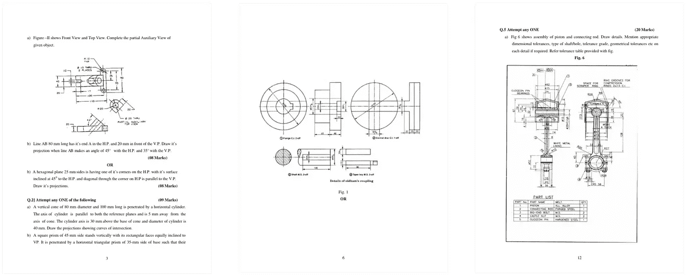
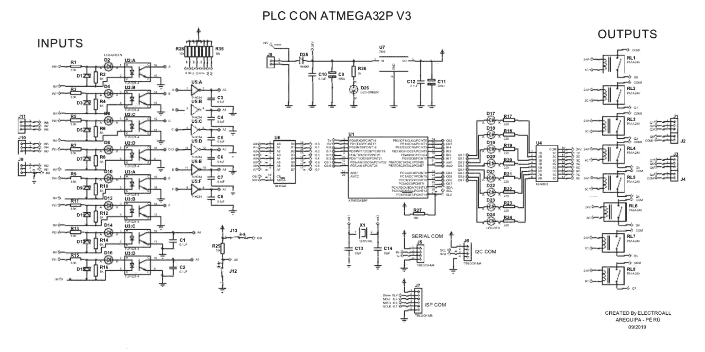
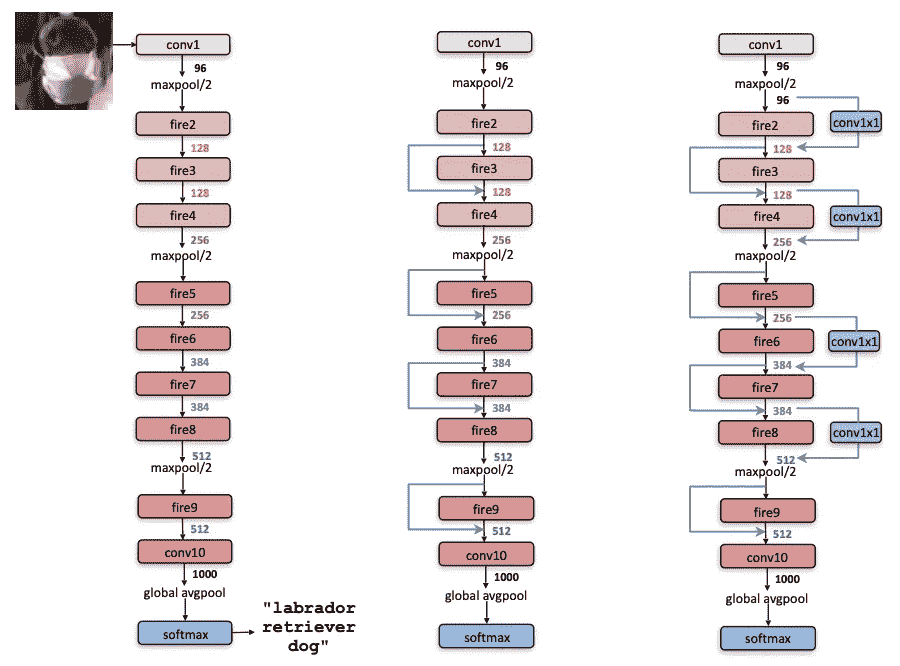
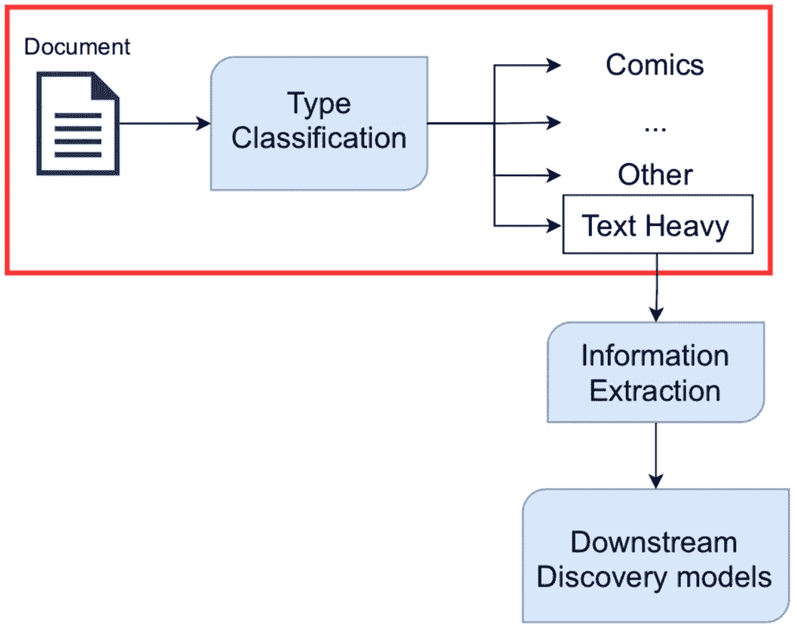

# 在 Scribd 识别文档类型

> 原文：<https://towardsdatascience.com/identifying-document-types-at-scribd-116311993c8e?source=collection_archive---------37----------------------->

## [行业笔记](https://towardsdatascience.com/tagged/notes-from-industry)

## 我们如何在多组件机器学习系统中开发一种将语义理解与用户行为相结合的方法。

用户上传的文档从一开始就是 Scribd 业务的核心组成部分；理解文档语料库中的*实际上是什么*，将为发现和推荐带来激动人心的新机遇。有了 Scribd，任何人都可以[上传和分享文档](https://www.scribd.com/docs)，类似于 YouTube 和视频。多年来，我们的文档库变得越来越大，越来越多样化，这使得理解变得越来越困难。在过去的一年中，应用研究团队的任务之一是提取关键文档元数据，以丰富下游发现系统。我们的方法在多组件机器学习系统中结合了语义理解和用户行为。

这是一系列博客文章的第 1 部分，解释了在构建这个系统时遇到的挑战和解决方案。这篇文章展示了在开发一个模型来分类任意用户上传的文档时遇到的限制、挑战和解决方案。你可以在 Scribd 技术博客查看这篇文章的[原始版本](https://tech.scribd.com/blog/2021/identifying-document-types.html)以及更多内容！

# 初始约束

Scribd 的文档集在内容、语言和结构方面延伸得很远。任意文档可以是任何内容，从数学作业到菲律宾法律到工程图表。在文档理解系统的第一阶段，我们想要利用文档中的视觉线索。这里使用的任何模型都必须是语言不可知的，才能应用于任意文档。这类似于人类的“第一眼”,我们可以快速区分漫画书和商业报告，而无需阅读任何文本。为了满足这些要求，我们使用计算机视觉模型来预测文档类型。但是什么是“类型”呢？

# 识别文档类型

这是一个必须要问的问题，但也是一个很难回答的问题——我们有什么样的文件？正如上一节提到的，我们感兴趣的是基于视觉线索区分文档，比如重文本、电子表格和漫画。我们对小说和非小说之类的更细致的信息还不感兴趣。

我们应对这一挑战的方法是双重的。首先，与 Scribd 的主题专家讨论他们在语料库中看到的文档类型。这在过去和现在都是非常有益的，因为他们拥有特定领域的知识，我们可以利用这些知识进行机器学习。第二个解决方案是使用数据驱动的方法来浏览文档。这包括根据文档的用途为文档创建嵌入。在交互式地图上聚集和绘制这些嵌入允许我们检查不同群中的文档结构。结合这两种方法推动了文档类型的定义。下面是我们用来探索语料库的其中一个地图的例子。

图 1:从用户交互嵌入中构建的文档语料库图。在以后的文章中会有更多关于这种方法的内容。

我们集中在 6 种文档类型上，包括乐谱、重文本、漫画和表格。更重要的是，这 6 个类并没有包含我们语料库中的所有文档。虽然在文献中有许多不同的方法来处理分布外的例子，但是我们的方法明确地向模型中添加了一个“other”类并训练它。在接下来的章节中，我们将更多地讨论它的直觉、问题的潜在解决方案以及面临的挑战。

# 文件分类

正如引言中提到的，我们需要一种与语言和内容无关的方法，这意味着相同的模型将适用于所有文档，无论它们包含图像、文本还是两者的组合。为了满足这些约束，我们使用计算机视觉模型来分类各个页面。然后，这些预测可以与其他元数据(如页数或字数)相结合，以形成对整个文档的预测。

## 收集带标签的页面和文档

在模型训练开始之前，我们面临一个有趣的数据收集问题。我们的目标是对文档进行分类，因此我们必须收集带标签的文档。然而，为了训练上面提到的页面分类器，我们还必须收集带标签的页面。天真地说，收集带标签的文档并为其每个页面使用文档标签似乎是合适的。这并不合适，因为一个文档可以包含多种类型的页面。作为一个例子，考虑这个文档的[中的页面。](https://www.scribd.com/document/258117251/Mechanical-Engineering-Drawing)

图 2:来自同一文档的三个不同页面，展示了为什么我们不能获取文档标签并将其分配给每个页面。

第一页和第三页可以被认为是重文本，但绝对不是第二页。把这份文件的所有页面都标上重文本的标签会严重污染我们的训练和测试数据。同样的逻辑也适用于我们的 6 个班级。

为了应对这一挑战，我们采取了主动学习的方法来收集数据。我们从每个类别的一小组手工标记的页面开始，反复训练二元分类器。二分类问题比多分类问题简单，需要较少的手动标记数据来获得可靠的结果。在每次迭代中，我们评估模型的最有信心和最没有信心的预测，以了解其归纳偏差。根据这些判断，我们为下一次迭代补充了训练数据，以调整归纳偏差，并对最终的模型和标签充满信心。活页乐谱课是调整归纳偏差的一个典型例子。下面是一个页面示例，如果模型知道乐谱是任何带有水平线的页面，则该页面会导致乐谱错误分类。在每次迭代中补充训练数据有助于消除这样的归纳偏差。

图 3:由于错误的归纳偏差导致的可能的乐谱错误分类的例子

在为每个类创建了这些二进制分类器之后，我们就有了一大组可靠的标签和分类器，如果需要的话，它们可以用来收集更多的数据。

# 构建页面分类器

页面分类问题与 ImageNet 分类非常相似，因此我们可以利用预先训练的 ImageNet 模型。我们在 [fast.ai](https://www.fast.ai/) 和 [PyTorch](https://pytorch.org/) 中使用迁移学习来微调页面分类器的预训练计算机视觉架构。经过最初的实验，很明显，具有非常高的 ImageNet 准确性的模型，如 EfficientNet，在我们的数据集上并没有表现得更好。虽然很难准确指出为什么会这样，但我们相信这是因为分类任务的性质、页面分辨率和我们的数据。

我们发现 [SqueezeNet](https://arxiv.org/abs/1602.07360) ，一个相对成熟的轻量级架构，是准确性和推理时间之间的最佳平衡。因为像 ResNets 和 DenseNets 这样的模型太大了，它们需要花费大量的时间来训练和迭代。然而，SqueezeNet 比这些模型小一个数量级，这在我们的训练方案中开辟了更多的可能性。现在，我们可以训练整个模型，而不局限于使用预训练的架构作为特征提取器，这是较大模型的情况。

图 4:摘自[论文](https://arxiv.org/pdf/1602.07360.pdf)的 SqueezeNet 架构。左:SqueezeNet 中:带简单旁路的挤压网；右图:带复杂旁路的 SqueezeNet。

此外，对于这个特定的模型，低推理时间是对数亿个文档运行它的关键。推理时间也与成本直接相关，因此最佳的成本/收益比需要显著更高的性能来证明更高的处理时间是合理的。

# 用于文档分类的集合页面

我们现在有一个模型来对文档页面进行分类，并需要使用它们来确定对文档的预测，并希望将这些分类与附加元数据(如总页数、页面尺寸等)结合起来。然而，我们在这里的实验表明，页面分类的简单集合提供了非常强的基线，很难用元数据来击败。

为了提高效率，我们从文档中抽取 4 页样本进行集成。这样我们就不会遇到处理数千页文档的问题。这是基于分类器的性能和文档语料库中的页面分布选择的，这从经验上验证了我们的假设，即这个样本大小合理地代表了每个文档。

# 错误分析和过度自信

在对来自生产的大量文档样本进行错误分析后，我们发现一些类返回了过于自信但错误的预测。这是一个非常有趣的挑战，也是最近学术研究激增的一个挑战。具体来说，我们发现有超过 99%的置信分数被错误预测的文档。这样做的一个主要后果是，它否定了为提高精度而设置模型输出阈值的有效性。

虽然有不同的处理方法，但我们的方法包括两个步骤。首先，我们利用了前面提到的“other”类。通过向“其他”类添加许多这些对立的、非分布的示例，并重新训练模型，我们能够在不改变模型架构的情况下快速改进度量。第二，这对某些阶层的影响比其他阶层更大。为此，建立了独立的二元分类器来提高精度。

# 我们将何去何从？

图 5:整个文档理解系统的示意图。红盒子就是我们在这篇文章中谈到的

现在我们有了一个基于视觉线索过滤文档的模型，我们可以为每种文档类型构建专用的信息提取模型——乐谱、重文本、漫画、表格。这正是我们从这里开始的方式，我们从大量文本文档中提取信息开始。

本系列的第 2 部分将深入探讨我们的团队在构建这些模型时遇到的挑战和解决方案。如果你有兴趣了解更多关于应用研究正在解决的问题或围绕这些解决方案建立的系统，请查看我们的空缺职位！

# 参考

*   [SqueezeNet: AlexNet 级精度，参数少 50 倍，< 0.5MB 模型大小](https://arxiv.org/pdf/1602.07360.pdf)