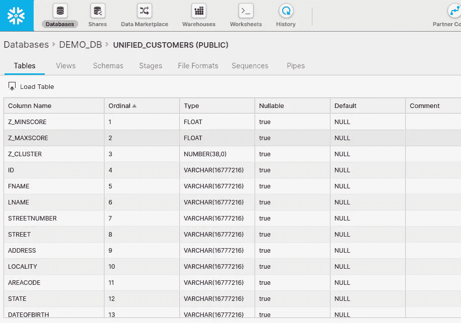

# 用 Zingg 识别雪花中的重复项

> 原文：<https://towardsdatascience.com/identifying-duplicates-in-snowflake-e95b3f3fce2b?source=collection_archive---------11----------------------->

## 使用开源来获得正确的维度表！

众所周知，仓库中的客户表很乱，多条记录指向一个客户。这个问题可能有多种原因，包括来自线下商店和线上渠道的数据、客人结账、多个内部客户系统(如 CRMs 和客户服务)...事实上，这个问题不仅仅局限于客户表。供应商表、位置和其他非事务性数据(传统仓库语言中的维度)也有同样的问题。

对于我们这些依赖仓库进行业务决策的人来说，这些副本可以完全抛弃我们的度量标准。如果我们的客户表没有一个可靠的客户 id，我们怎么能相信终身价值呢？细分、营销归因、个性化——没有可靠的维度数据，我们能实现什么？反向 ETL 如何——将这些数据输入我们的运营系统。如果我们用仓库里的副本来填充我们的系统，难道不会打乱我们的日常工作吗？

如果我们仍然不能正确地识别我们的核心实体，那么对仓库的投资是否值得呢？

从表面上看，这似乎是一个容易解决的问题——我们肯定有可以利用的电子邮件 id 吧？不幸的是，人们使用工作，个人，学校和其他电子邮件 id，虽然这是一个开始，但这并不能解决问题。让我们甚至不要从我们在网络和打印表单上输入姓名、地址和其他细节的不同方式开始。

让我们看看雪花中的客户表。表格中的数据是从[这个 csv](https://github.com/zinggAI/zingg/blob/main/examples/febrl/test.csv) 加载的。


作者图片

客户表确实有一个 SSN 列，但是在许多情况下这是不一致的，所以我们不能依赖它。该表确实有标识符列，但是它仍然有多个属于同一客户的不同 id 的记录。

例如，检查属于客户 Thomas George 的以下两条记录


作者图片

或者以下五条记录都属于客户 Jackson Eglinton


作者图片

我们可以构建一些相似性规则，并使用 SQL 或编程来构建我们的标识符并匹配这些记录。然而，这将很快变得复杂，以迎合上述变化。如果我们使用[雪花的编辑距离](https://docs.snowflake.com/en/sql-reference/functions/editdistance.html)功能会怎么样？或者 fuzzywuzzy 或者类似的图书馆？不幸的是，我们在这里面对的是一头野兽——知道要比较哪些对或者找到编辑距离实际上是非常重要的，否则我们将会在多个属性上得到一个笛卡尔连接。！).

作为一个例子，看看当我们的记录数量增加 10 倍或 100 倍时，我们可以遇到的比较数量。此表假设我们比较的是单个属性。因此，很明显，可伸缩性绝对是一个巨大的挑战，需要认真规划。


作者图片

幸运的是，开源有一个解决方案(什么时候没有？).看起来有一个叫做 [Zingg](https://github.com/zinggAI/zingg) 的工具，专门用来解决这个[实体解析](/an-introduction-to-entity-resolution-needs-and-challenges-97fba052dde5)的问题。(此处需要放一个免责声明，我是作者:)

让我们看看如何使用 Zingg 来解析我们的客户并识别重复项。

安装很简单，我们需要 Java、Apache Spark 和 Zingg 的二进制文件。如果您不是 Java 程序员或在 Pb 级集群上编写 Spark 程序的分布式编程极客，请不要害怕。Zingg 在幕后使用这些技术，因此对于大多数[实际用途](https://github.com/zinggAI/zingg/blob/main/docs/hardwareSizing.md)，我们可以在一台笔记本电脑或机器上工作。Zingg 是一个基于学习的工具，它根据我们的数据进行训练，并且不向外部方传输任何内容，因此当我们在自己的环境中运行 Zingg 时，安全性和隐私会得到自动保护。

我们需要告诉 Zingg 我们的雪花数据在哪里。为此， [Zingg 配置](https://github.com/zinggAI/zingg/blob/main/docs/configuration.md)是用我们的雪花实例和表细节设置的。下面是 Snowflake 中输入客户表的配置摘录。


作者图片

我们还配置 Zingg 将输出写入 UNIFIED_CUSTOMERS 表。这个表在 Snowflake 中还不存在，但是 Zingg 会在编写输出时创建它，所以我们不需要构建它。


作者图片

现在让我们指定哪些属性用于匹配，以及我们需要哪种类型的匹配。例如，名字属性是为模糊匹配类型设置的。


作者图片

我们不希望使用 SSN 进行匹配，这样我们就可以看到匹配执行得有多好，所以我们将该字段标记为 DO_NOT_USE。配置的其他部分相当样板，你可以在这里查看整个配置[。](https://github.com/zinggAI/zingg/blob/main/examples/febrl/configSnow.json)

Zingg 基于训练样本学习匹配什么(尺度)和如何匹配(相似度)。它配有一个交互式学习器，可以挑选出有代表性的样本对，用户可以将其标记为可接受的匹配或不匹配。现在让我们构建训练样本，Zingg 将从中学习。我们将配置传递给 Zingg，并在 [**findTrainingData**](https://github.com/zinggAI/zingg/blob/main/docs/running.md#findtrainingdata---finding-pairs-of-records-which-could-be-similar-to-train-zingg) 阶段运行它。这是一个简单的命令行执行。

```
zingg.sh --phase findTrainingData --conf examples/febrl/configSnow.json
```

在引擎盖下，Zingg 在 **findTrainingData** 期间做了大量工作，以找出正确的代表性配对，从而为匹配建立训练数据。不确定对被写入 zinggDir/modelId，这是通过输入 json 配置的。但是我们不需要担心这个。一旦工作完成，我们将进入下一个阶段，然后[标记或贴标签给线对](https://github.com/zinggAI/zingg/blob/main/docs/running.md#label---user-feedback-on-the-training-pairs)。

```
zingg.sh --phase label --conf examples/febrl/configSnow.json
```

上述阶段将启动交互式学习器，该学习器读取由 **findTrainingData** 阶段完成的工作，并向我们显示要标记为匹配或不匹配的记录对。这有助于 Zingg 构建出为我们的数据量身定制的机器学习模型。这是它看起来的样子


作者图片

Zingg 选择不同类型的配对——绝对不匹配、确定匹配以及可疑情况，以便建立一个健壮的训练集。这些记录是在对输入进行非常严格的扫描后选择的，这样可以进行适当的归纳，并且属性之间的每个变化都不必由用户手工标记。作为一个例子，下面是我们的数据的 Zingg 输出的摘录。


作者图片

将**查找训练数据**和**标记**的阶段重复几次，直到标记出 30-50 个阳性对。这应该足以训练 Zingg 以合理的准确度运行数百万条记录。每一个案例都不需要输入 Zingg，学习者会自动选择代表并通过它进行归纳。当不确定的时候，你可以停止学习，检查 Zingg 的输出，然后回来再多训练一点。

在我们只有 65 个例子的简单例子中，一轮 **findTrainingData** 和 **label** 就足够了，所以我们在这里暂停。现在我们有了带标签的训练数据，我们通过调用**训练**阶段来构建机器学习模型。在内部，Zingg 进行超参数搜索、特征加权、阈值选择和其他工作，以建立一个平衡的模型——一个不遗漏匹配(召回)的模型，一个不预测错误匹配(精度)的模型。

```
zingg.sh --phase train --conf examples/febrl/configSnow.json
```

以上将保存模型，我们可以将它们应用到这个和任何其他新数据来预测匹配。只要模式、要匹配的属性和输入格式保持不变，就不需要重新训练。

现在，让我们将模型应用于我们的数据，并预测哪些记录确实是匹配的——或者彼此重复。

```
zingg.sh --phase match --conf examples/febrl/configSnow.json
```

上面的代码运行后，我们可以看到已经创建了一个包含以下各列的新表。



作者图片

Zingg 复制了原始数据，但是在输出的每一行中添加了 3 列。

*   Z_CLUSTER 列是 Zingg 给出的客户 id——匹配或重复的记录获得相同的分类标识符。这有助于将匹配的记录分组在一起。
*   Z_MINSCORE 列是一个指示器，指示该记录与分类中的任何其他记录最少匹配
*   Z_MAXSCORE 是与聚类中的另一个记录最匹配的记录的指示器。

让我们看看输出中客户 Thomas George 的记录。两个记录获得相同的 z_cluster。没有其他记录获得相同的 id。分数也很好，这意味着我们对这场比赛充满信心。


作者图片

顾客杰克逊·艾灵顿怎么了？下面是输出的样子


作者图片

同样，这 5 条记录的标识符不同于表中的其他记录。在检查分数时，我们看到两个记录的最小分数接近 0.69，这意味着属于该聚类的这些记录的置信度较低。正确的做法是，在一个例子中，交换了街道和地址属性。在另一个例子中，姓氏不同于集群中的其他记录。

根据我们的数据，我们可以决定如何使用提供的分数。我们可以选择任何一个分数的截止值，以确保匹配，并将其余部分传送到另一个工作流——可能是人工审查。如果我们的情况允许的话，我们可以取分数的平均值。

在最有可能的场景中，Zingg 的输出在数据管道中被用作实体数据的最终来源。Zingg 的输出要么被 [DBT](https://www.getdbt.com/) 选中用于转换，要么被传输到湖边小屋用于数据科学。

在任何一种情况下，维度都是准确的，并且我们有一个可以信任的核心实体的统一视图。