# 确定全球特征与 SHAP 值的关系

> 原文：<https://towardsdatascience.com/identifying-global-feature-relationships-with-shap-values-f9e8b2b4121c?source=collection_archive---------8----------------------->

## 如何计算要素的全局信息，并将其用于不可知的要素选择过程 x


沙哈达特·拉赫曼在 [Unsplash](https://unsplash.com?utm_source=medium&utm_medium=referral) 上拍摄的照片

现在，使用 SHAP 值是解释机器学习模型和理解数据特征与输出之间关系的最常用方法之一。

SHAP 值的最大优势之一是它们提供了局部可解释性:我们可以看到每个特性如何影响每个实例的结果。

然而，这种能力是有代价的:使用 SHAP 值进行特征选择并不那么简单。通常根据要素的平均 SHAP 值或最大 SHAP 值来截断要素，但是，这些方法并不能保证不会从数据集中移除某些重要的要素。直到今天，对于如何使用它进行特征选择还没有达成共识。

另一种方法是根据对数据集的百分比影响来定义要素重要性。然而，这需要大量的微调，而且不够标准化，不能以不可知的方式使用。

在本帖中，我们将研究一篇[论文](https://arxiv.org/abs/2107.12436) [1】，该论文提出了一种使用 SHAP 值寻找全局解释的方法，这种方法使我们能够识别我们的要素之间的收敛程度，从而更好地理解数据集并提供更好的要素选择方法。

这篇文章的所有代码都可以在 [Kaggle](https://www.kaggle.com/tiagotoledojr/shap-s-i-r-global-explanations) 上的笔记本中找到，也可以在我的 [Github](https://github.com/TNanukem/paper_implementations/blob/main/SHAP%20S-R-I.ipynb) 上找到。

# SHAP 快速概览

首先，让我们回顾一下 SHAP 价值观和 SHAP 图书馆。这个想法不是解释方法的内部工作，而是回顾对库中结果的解释，并理解如何获得它们。

当我们从一对模型+数据集获取 SHAP 值时，我们会得到一个 NxM 矩阵，其中 N 是数据集实例的数量，M 是要素的数量。我们拥有与原始数据集相同的形状。

该矩阵中的每个 I，j 条目表示特征 j 对实例 I 的预测的影响。这允许我们在局部水平上解释我们的模型如何基于特征进行预测。

如果获取模型的平均预测值，并将其与 SHAP 值矩阵中每一行的总和相加，您将获得数据集每个实例的准确预测值。

这是我们将要使用的 SHAP 的基本结构。

另一个非常重要的结构是 SHAP 相互作用矢量。

## SHAP 相互作用矢量

两个要素之间的 SHAP 交互矢量定义了预测中这些要素之间的交互。为了计算它，当 j 存在和 j 不存在时，计算特征 I 的 SHAP 值。对所有可能性进行置换会生成交互向量。

如果我们将特征 I 的 SHAP 向量定义为包含每个样本的特征 I 的 SHAP 值的向量，则我们知道:

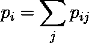

其中 pij 是特征 I 和 j 之间的 SHAP 相互作用矢量

正如我们将在下一节中看到的，这些概念很重要，因为所描述的方法有一个真正强大的几何解释，这将帮助我们理解正在发生的事情。

首先，让我们在空间上绘制这两个向量，并从那里开始构建:

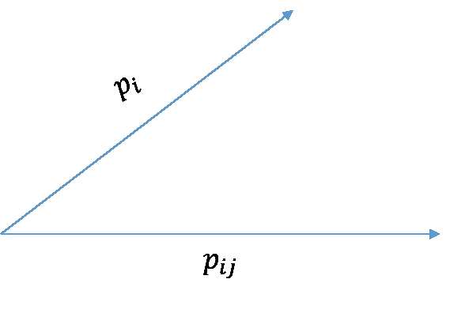

SHAP 矢量和 SHAP 相互作用矢量。图片由作者根据图片[1]提供

# 协同作用

协同具有测量一个特征如何受益于数据集中另一个特征的直觉。如果两个要素高度协同，那么它们都应该出现在数据集上，因为它们彼此帮助很大。

对此的几何解释是，我们可以利用 pi 向量在 pij 向量上的投影来创建协同向量，该向量可以被翻译为以下等式:

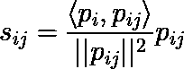

视觉上我们得到:

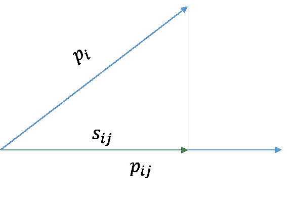

协同矢量。图片由作者根据图片[1]提供

然后，我们可以通过计算该投影的长度来生成这些特征之间的协同值:

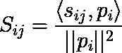

既然我们定义了这个向量，我们基本上是在说:给定我的特征 I 的预测能力，它有多少来自与特征 j 的相互作用？如果我们回答了这个问题，那么我们就知道有多少预测能力不是来自于此。

考虑到这一点，我们可以将这两个特征之间的自主向量定义为向量减法:

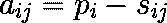

从几何学上讲，我们可以看到，协同(来自交互的内容)和自主(不来自交互的内容)的总和将合计为原始特征向量:

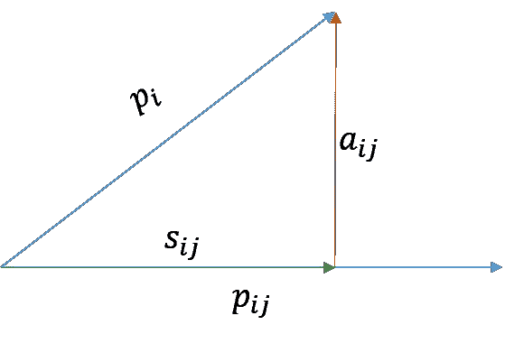

自主向量。图片由作者根据图片[1]提供

# 裁员

冗余的直觉是来自特征 I 的信息量被复制到特征 j 上。两个完全冗余的特征将具有完全相同的信息。一个例子是开尔文和摄氏度的温度。

我们可以通过将从 I 到 j 的自治向量投影到从 j 到 I 的自治向量来测量共享了多少信息。这在代数上转化为:

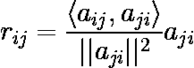

视觉上，我们有下面的图像。请注意，相对于 aij 和 pij 向量，aji 向量属于另一个平面:

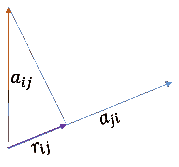

冗余向量。图片由作者根据图片从[1]

然后，正如我们对 synergy 所做的那样，我们可以通过计算投影的长度，从这个向量生成一个值:

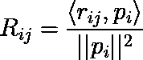

# 独立性ˌ自立性

最后，我们将定义最后一条信息:给定 I 中与特征 j 中的信息不协同或不冗余的信息，我们独立于特征 I。

这可以计算为特征之间的自主性和冗余性之间的差异:

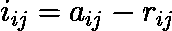

正如我们对其他特征所做的那样，我们可以通过计算这个向量在π上的投影长度来计算标量值:

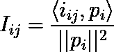

# 特征编码

现在，让我们深入一些编码，看看我们如何使用来自 [SHAP 库](https://github.com/slundberg/shap)的 SHAP 值结果来生成这些值。

对于这个例子，我们将使用来自 UCI 知识库的葡萄酒数据集，它是免费使用的，是从 sklearn 包的一个函数中获取的。然后，我们将应用随机森林分类器。

首先，让我们导入所需的库:

```
import shap
import numpy as np
import pandas as pdfrom sklearn.datasets import load_wine
from sklearn.ensemble import RandomForestClassifier
```

现在，让我们在数据集上安装分类器:

```
# Get the dataset and fit a Random Forest on it
X, y = load_wine(return_X_y=True, as_frame=True)rf = RandomForestClassifier()
rf.fit(X, y)
```

现在，我们可以使用 SHAP 库来生成 SHAP 值:

```
# Runs the explainer on the model and the dataset to grab the Shap Values
explainer = shap.Explainer(rf)
shap_values = explainer(X)
```

当我们执行上面的代码时，SHAP 库返回三个矩阵，所以我们将选择 SHAP 矩阵:

```
# The return of the explainer has three matrices, we will get the shap values one
shap_values = shap_values.values[:, :, 0]
```

现在，让我们生成相互作用值，以生成 SHAP 相互作用矢量:

```
shap_interaction_values = explainer.shap_interaction_values(X)[0]
```

我们现在将定义一些零矩阵来填充我们的计算。这不是最快的方法，但是，这样做是为了更有启发性:

```
# Define matrices to be filled
    s = np.zeros((shap_values.shape[1], shap_values.shape[1], shap_values.shape[0]))
    a = np.zeros((shap_values.shape[1], shap_values.shape[1], shap_values.shape[0]))
    r = np.zeros((shap_values.shape[1], shap_values.shape[1], shap_values.shape[0]))
    i_ = np.zeros((shap_values.shape[1], shap_values.shape[1], shap_values.shape[0]))S = np.zeros((shap_values.shape[1], shap_values.shape[1]))
R = np.zeros((shap_values.shape[1], shap_values.shape[1]))
I = np.zeros((shap_values.shape[1], shap_values.shape[1]))
```

我们为每个向量定义了一个矩阵，为每个标量值定义了一个矩阵。现在，让我们迭代每个 SHAP 值(想象 I 和 j 上的双 for 循环),并选择我们要使用的向量:

```
# Selects the p_i vector -> Shap Values vector for feature i
pi = shap_values[:, i]# Selects pij -> SHAP interaction vector between features i and j
pij = shap_interaction_values[:, i, j]

# Other required vectors
pji = shap_interaction_values[:, j, i]
pj = shap_values[:, j]
```

有了这些，就可以很容易地根据上面提供的等式计算出以下向量:

```
# Synergy vector
s[i, j] = (np.inner(pi, pij) / np.linalg.norm(pij)**2) * pij
s[j, i] = (np.inner(pj, pji) / np.linalg.norm(pji)**2) * pji# Autonomy vector
a[i,j] = pi - s[i, j]
a[j,i] = pj - s[j, i]# Redundancy vector
r[i,j] = (np.inner(a[i, j], a[j, i]) / np.linalg.norm(a[j, i])**2) * a[j, i]
r[j,i] = (np.inner(a[j, i], a[i, j]) / np.linalg.norm(a[i, j])**2) * a[i, j]# Independece vector
i_[i, j] = a[i, j] - r[i, j]
i_[j, i] = a[j, i] - r[j, i]
```

然后，使用长度计算公式，我们得到最终的标量值:

```
# Synergy value
S[i, j] = np.linalg.norm(s[i, j])**2 / np.linalg.norm(pi)**2# Redundancy value
R[i, j] = np.linalg.norm(r[i, j])**2 / np.linalg.norm(pi)**2# Independence value
I[i, j] = np.linalg.norm(i_[i, j])**2 / np.linalg.norm(pi)**2
```

此外，论文作者在[刻面库](https://github.com/BCG-Gamma/facet)上提供了这些方法的开源实现。

# 特征选择模型建议

既然我们已经了解了这个方法是如何工作的，我们可以开始考虑如何使用它来生成一个特征选择方法。

方法的提议可以是:

*   给定数据集上的训练模型，从中获取 SHAP 信息
*   运行信噪比计算
*   如果一对特征的冗余度大于阈值，则将它们标记为移除
*   从与数据集其余部分协同性最小的要素对中获取要素，并将其移除。为此，您可以使用平均协同效应或其他指标。

这只是如何使用这些值来改进您的特征选择方法的基本想法。我希望在未来能产生更多关于这个主题的想法。

[1] Ittner 等，利用 SHAP 向量分解的全局模型解释中的协同性、冗余性和独立性(2021)， [arXiv:2107.12436](https://arxiv.org/abs/2107.12436)**【cs .LG]**