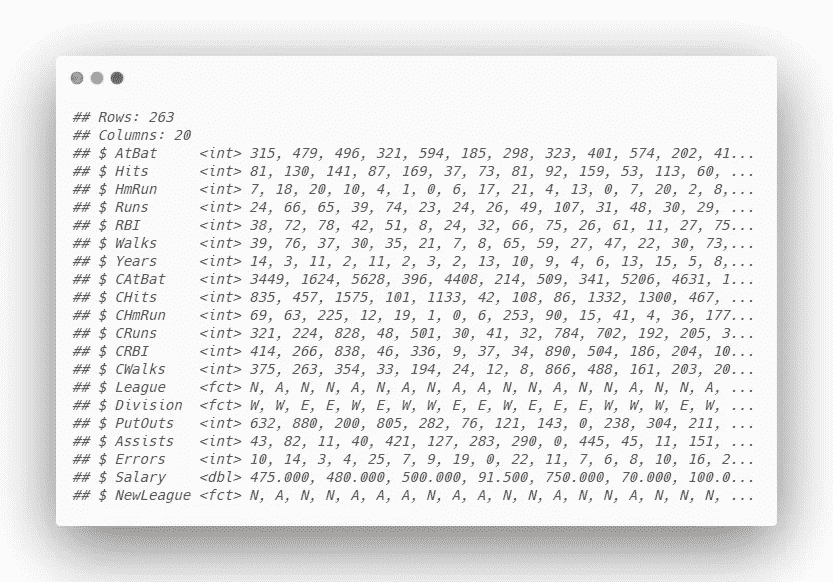
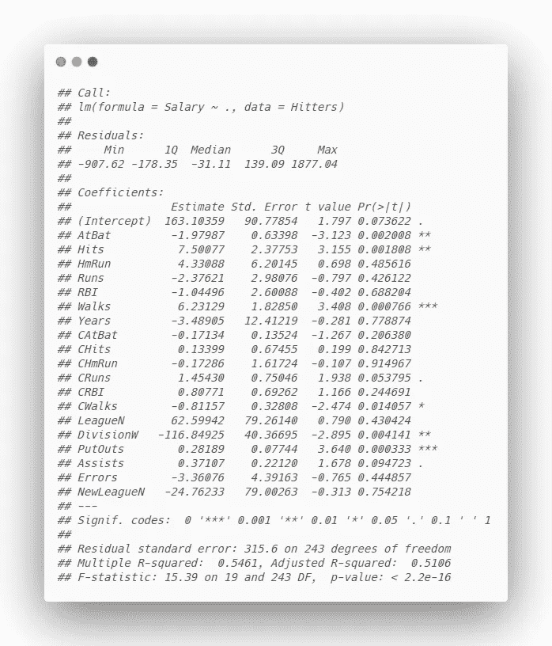
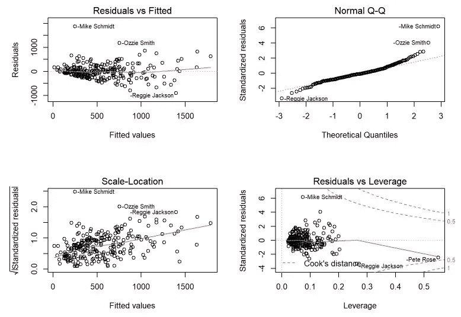
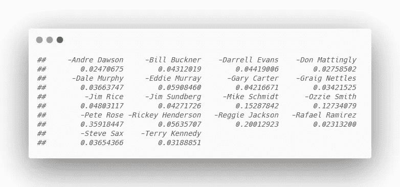
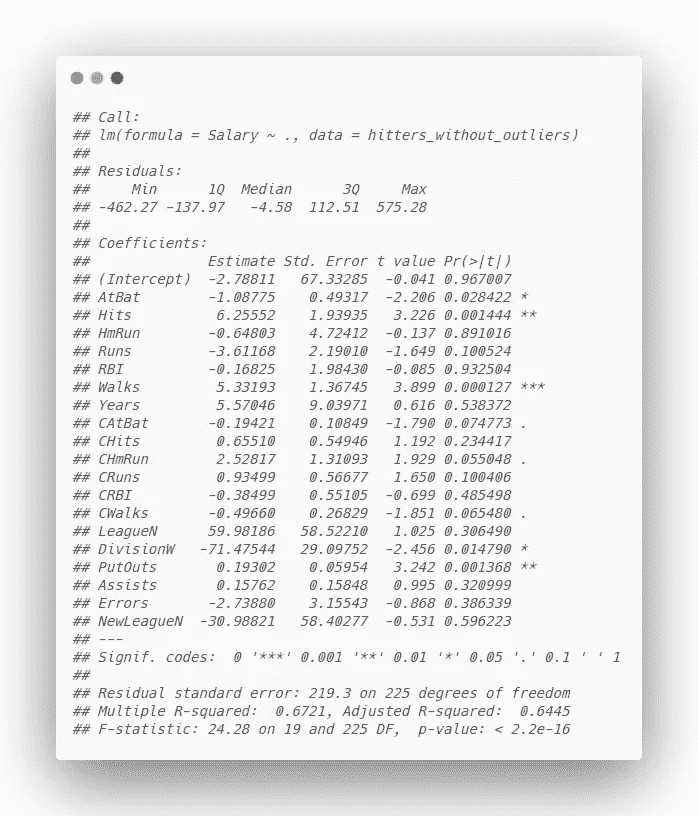
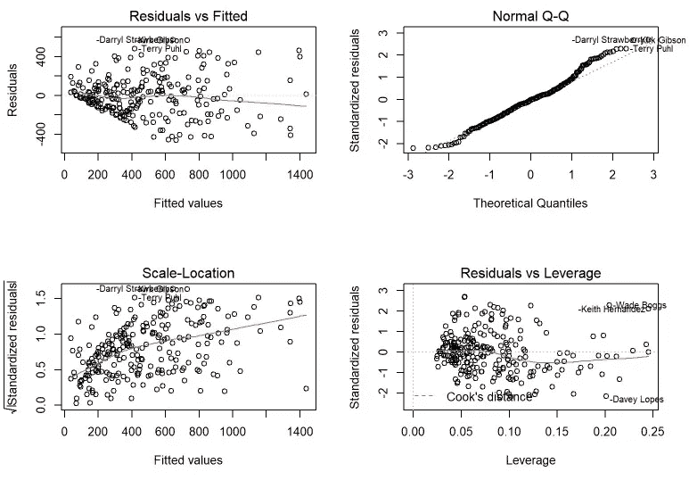

# 识别线性回归中的异常值——库克距离

> 原文：<https://towardsdatascience.com/identifying-outliers-in-linear-regression-cooks-distance-9e212e9136a?source=collection_archive---------1----------------------->

## 库克距离是什么，它如何帮助您识别和移除数据集中的异常值？


尼克·吉奥在 [Unsplash](https://unsplash.com?utm_source=medium&utm_medium=referral) 上的照片

有许多技术可以从数据集中移除异常值。回归设置中经常使用的一种方法是库克距离。库克距离是对一个数据点影响力的估计。它考虑了每个观察值的杠杆作用和残差。库克距离是当第一个*观察值被移除时，回归模型变化程度的总结。*

当查看哪些观察值可能是异常值时，一般的经验法则是调查所有距离的平均值大于 3 *x* 的任何点(*注意:还有其他几个常用的标准*)。我将展示一个例子，说明这是如何与来自 *ISLR* 库的一个著名数据集 Hitters 一起工作的。Hitters 数据集包含 250 多名棒球运动员及其职业统计数据和薪水的信息。

首先，我们将导入数据集:

```
library(ISLR)Hitters <- na.omit(Hitters)
glimpse(Hitters)
```



接下来，我们将使用所有可用的功能初始化一个多元线性回归模型，目标是预测球员的工资。

```
model <- lm(Salary ~ ., data = Hitters)
summary(model)
```



我们看到基线模型的调整后 R 平方为 0.5106。现在，让我们看看诊断图:

```
par(mfrow = c(2, 2))
plot(model)
```



在查看诊断图时，我们看到确实有一些异常值(在其他问题中，如异方差)。如果你看看右下角的图，*残差对杠杆*，你会发现一些异常值也有一些重要的杠杆。举例来说，我们希望从数据集中移除这些异常值，以便我们可以拟合更好的模型。我们如何做到这一点？我们可以在刚刚运行的模型上使用 *cooks.distance* 函数，然后过滤掉任何大于平均值 3 *x* 的值。让我们先来看看有多少观察符合这个标准:

```
cooksD <- cooks.distance(model)
influential <- cooksD[(cooksD > (3 * mean(cooksD, na.rm = TRUE)))]
influential
```



我们看到 18 个玩家的库克距离大于平均值的 3 倍。让我们排除这些玩家，重新运行模型，看看我们是否有更好的拟合。

```
names_of_influential <- names(influential)
outliers <- Hitters[names_of_influential,]
hitters_without_outliers <- Hitters %>% anti_join(outliers)model2 <- lm(Salary ~ ., data = hitters_without_outliers)
summary(model2)
```



我们的模型拟合度大幅提高。我们已经从 0.5106 的调整后 R 平方提高到 0.6445，仅去除了 18 个观察值。这证明了异常值在回归模型中的影响有多大。让我们来看看新模型的诊断图:

```
par(mfrow = c(2, 2))
plot(model2)
```



与我们以前的诊断图相比，这些图有了很大的改进。再次查看*残差与杠杆率*图，我们看到没有任何剩余的点具有显著的杠杆率，从而更适合我们的模型。

上面的例子只是为了演示。在没有对有问题的点进行深入彻底的分析的情况下，永远不要仅仅删除离群值。此外，这样做可能会导致对训练数据的良好拟合，但对看不见的数据的预测较差。

库克的距离是一个很好的工具，添加到您的回归分析工具箱！您现在有了一个有意义的方法来调查模型中的异常值。快乐造型！

# 谢谢大家的支持！

感谢您阅读本文！如果你觉得有帮助，请给我一两下掌声:)