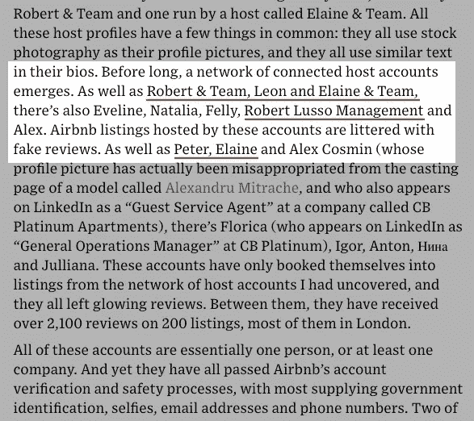

# 识别 Airbnb 上的潜在欺诈房源

> 原文：<https://towardsdatascience.com/identifying-potential-scam-listings-on-airbnb-e9aed41611e5?source=collection_archive---------18----------------------->

## 使用网络分析来查找由假冒评论者连接的 Airbnb 主机

Airbnb 上的主持人和评论者网络(图片由作者提供)

## I 简介

我最近在做一个项目，使用了伦敦 Airbnb 房源的数据。我的项目的最初目标是使用机器学习来根据房产的特征、位置和与房源相关的评论来预测租金价格(稍后会有更多相关内容)。在研究伦敦 Airbnb 的使用情况时，我看到了《连线》【2020 年 2 月发表的一篇文章,这篇文章启发我以另一种方式看待这些数据。

激发这个项目的连线文章(来源:[连线](https://www.wired.co.uk/article/airbnb-scam-london))

首先，一些背景。2015 年，一项法律出台，允许伦敦人在不需要规划许可的情况下短期出租房屋，每年最多 90 晚。这项政策的目的是让居民受益，让他们从家里赚取额外收入，而不是为商业部门提供机会。然而，人们越来越担心，短期租赁平台正变得越来越商业化，正在从长期租赁市场上清除住房存量，从而加剧伦敦的住房短缺。

2020 年 2 月大伦敦当局的一份报告显示，Airbnb 房源每晚的平均收入为 109 英镑，而长期租赁为 58 英镑。对于房东来说，超过 90 晚的限制有一个明显的激励，因为他们可以获得远高于长期租赁市场的回报。同一份报告估计，伦敦多达 23%的房源可能违反了 90 晚的限制(截至 2019 年 5 月)。占据伦敦短期租赁市场 65%份额的 Airbnb 于 2017 年在其网站上推出了一个上限，当达到 90 晚的限制时，自动使“整栋房屋”的房源不可用(除非有相关的规划许可，可以租赁更长的时间)。然而，主机可以通过重新列出不同地址或照片的属性，或者通过创建多个主机帐户，轻松绕过上限，以避免旨在检测重复的算法。在业内，这被称为“系统化”上市。

上面提到的连线文章详细描述了记者在伦敦揭露的 Airbnb 骗局。这个特殊的骗局围绕着一个事实上的酒店，该酒店是为短期租赁而建的，违反了 Airbnb 的政策和 90 夜法。公寓有重复的列表，大多数列表使用相同的照片或镜像照片，一些列表并不存在。客人经常抱怨被安排到与他们预订的不同的房间，有时房间被重复预订。许多评论和主持人简介是虚假的或误导性的。

这篇文章指出了 200 个“系统化”列表背后的主机账户网络。这些账户托管的列表有许多来自一小群评论者的虚假评论。所有这些账户本质上都是一个人，或者至少是一个公司。

连线文章的摘录(来源:[连线](https://www.wired.co.uk/article/airbnb-scam-london))和数据的网络图(图片由作者提供)

通常情况下，您不会期望找到一小组主机，这些主机的列表由同一小组审核者定期审核。我的目的是看看我是否可以使用网络分析来找到这种连接的主机，首先使用本文发表时的数据来测试概念证明。自从这篇文章发表后，继[在美国发现类似的欺诈房源](https://www.vice.com/en/article/43k7z3/nationwide-fake-host-scam-on-airbnb)之后，Airbnb 在一封名为“ [In The Business of Trust](https://news.airbnb.com/in-the-business-of-trust/) ”的电子邮件中表示，它将在 2020 年 12 月前审查其平台上的每一个房源和主机。在测试概念证明后，目标是将相同的网络分析应用于更近的数据，以查看类似的骗局是否仍然存在。

## 数据

数据集来自 Airbnb 内部的[，Airbnb 定期从 Airbnb 抓取数据，以促进公众讨论该网站的实际使用情况。](http://insideairbnb.com/)

为了测试概念的证明，我最初查看了 2019 年 10 月(从为文章进行研究的时间)和 2018 年 10 月(捕捉已被删除的账户)收集的数据。该数据包括一个评论表(包括 reviewer_id 和 listing_id)和一个列表表(包括 listing_id 和 host_id)。我将 listing_id 上的两个表连接起来，得到一个大约 170 万条边的列表，这些边连接着评论者和主持人。当评论者已经为属于该主机的列表写了评论时，边缘是评论者和主机之间的链接。

## 该过程

问题:边太多，不容易找到小网络。

解决方案:我决定根据更可能显示虚假评论和“系统化”列表的特征划分子集:

*   仅包括主持人和审阅人，其中审阅人对主持人留下了多个审阅(可以跨不同列表)
*   仅包括具有多个列表的主机
*   仅包括审查过多个主机的审查者

这产生了大约 10，000 条边。

步骤 1:使用 NetworkX 创建一个二分网络，其中一组节点用于主机，一组节点用于审核者(因为主机之间或审核者之间不存在直接链接),边如上所述。

步骤 2:在主机上创建投影图。

步骤 3:删除与其它主机没有链接的主机。

下面的网络图显示了此过程应用于约 1，000 条边的另一个子集(在应用于整个数据集之前测试此概念)。红色节点是审阅者，蓝色节点是主持人。文章中的已知网络在三个步骤中的每一个步骤中都被突出显示。最后一张图显示了使用这种方法识别的 6 个相连主机网络，包括本文中命名的网络。

如上所述的步骤 1、步骤 2 和步骤 3(图片由作者提供)

## 结果

我将这一过程应用于完整的数据集，揭示了已知的网络和许多其他网络。然而，很难进一步调查其他网络，因为许多帐户已被删除。

## 2020 年 12 月数据

我将同样的过程应用于 2020 年 12 月收集的数据，得到了下面的网络图，显示了主机之间通过审查者的连接。

网络图来自 2020 年 12 月数据(图片由作者提供)

我进一步研究了下面显示的两个网络。

简单示例(L)和复杂示例(R)(图片由作者提供)

## 简单的例子

这两个主机帐户具有相同的名称。主持人简介照片不同，但似乎是同一个人。两个主机帐户的列表看起来像是重复的(非常相似的名字，相同的照片)。

## 复杂示例

这些主机帐户中的大多数都有相同名称的变体(例如 X 和 Y、Y 和 X、X 和 Y、X/Y)。有重复的列表，一些带有从不同角度拍摄的照片，以使它们看起来不同。总体评价是积极的，但有些评价非常消极。关于不入住已预订的公寓，有多种评论。多份评论提到了由于泄露导致的最后一分钟取消，并且有不少关于糟糕的客户服务的投诉。这些都是与连线文章中骗局相似的特征。

复杂示例:审查者网络(红色)和主持人网络(蓝色)(图片由作者提供)

上面的网络图显示了此网络，其中添加了连接主机的审查者(红色审查者，蓝色主机)。

该中心有五名评论者，他们已经为这些主机的列表写了近 300 篇评论。两个评论者的账户似乎被删除了。其他三个评论者有许多来自“连接的”主机的相同文本的评论。

## 结论

《连线》的这篇文章揭示了 Airbnb(和其他类似平台)上的托管业务正变得越来越系统化，如果企业能够绕过 90 晚的限制，它们从短期出租中获得的收入远远高于长期出租。

Airbnb 等一些平台已经实施了每年 90 晚的房源上限，但有办法绕过这一限制，一些主机也在多个平台上房源，它们之间没有协调。地方当局目前没有简单的方法来跟踪他们所在地区的短期租房数量，这意味着 90 晚的限制很难执行。

我的分析展示了一种不同的方式，试图识别 Airbnb 等平台上的系统化房源，方法是找到由(可能是假的)审核者连接的主机网络。应该指出的是，只有 Airbnb 可以获得属于这些主机的房源的实际入住数据，因此无法检查其中任何一家是否违反了 90 晚的限制。然而，您通常不会期望找到由同一小组审查者定期审查的一小组主机，因此，这些网络肯定值得进一步调查。