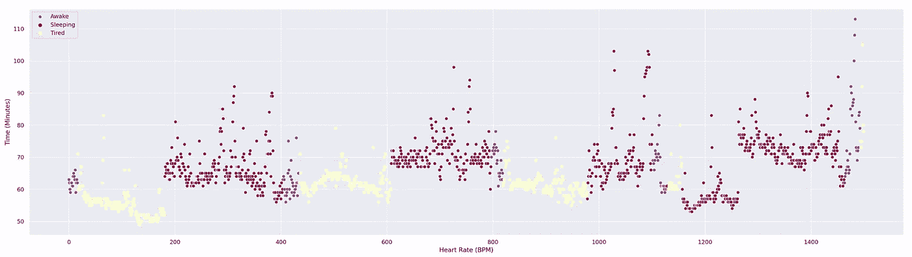
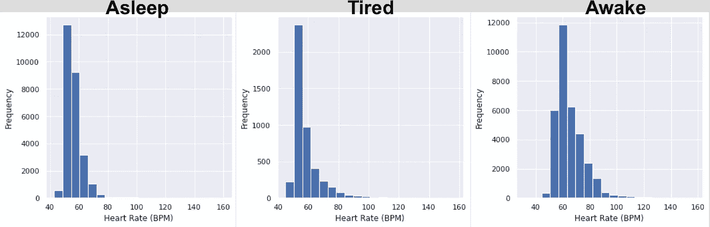
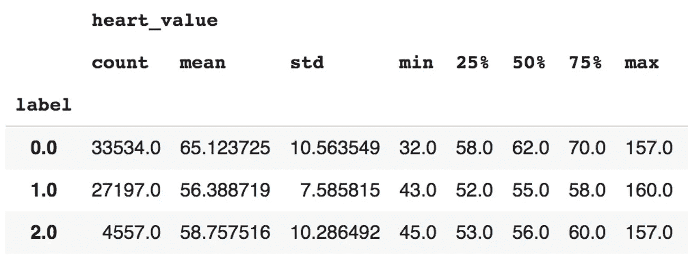
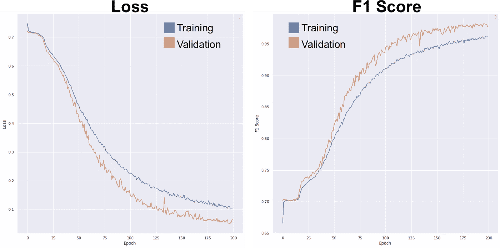
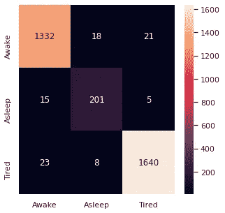

# 使用序列分类识别疲劳迹象

> 原文：<https://towardsdatascience.com/identifying-signs-of-tiredness-using-sequence-classification-f312e0adb6c?source=collection_archive---------39----------------------->

## [实践教程](https://towardsdatascience.com/tagged/hands-on-tutorials)

## 使用可穿戴健康数据训练模型以对疲劳进行分类


由 [Cris Saur](https://unsplash.com/@crisaur?utm_source=unsplash&utm_medium=referral&utm_content=creditCopyText) 在 [Unsplash](https://unsplash.com/s/photos/tired?utm_source=unsplash&utm_medium=referral&utm_content=creditCopyText) 上拍摄的照片

我想你已经在路上开了一会儿，天开始黑了。你感觉你的眼睛越来越沉重，你知道你应该停下来休息一下，但你想继续前进，这样你就可以按时到达目的地…

我相信很多人在某个时候都经历过这种情况，这是一个典型的“昏昏欲睡驾驶”的例子，这使我们发生交通事故的可能性增加了 3 倍。

如果有一种方法可以识别我们何时开始感到疲劳，会怎么样？

> 这是我们将尝试使用我的个人 [**Fitbit**](https://www.fitbit.com/global/us/home) 数据来解决的问题陈述。我用 Fitbit 数据写的另一个例子可以在[这里](/does-machine-learning-know-when-im-scared-anomaly-detection-in-wearable-health-data-72f537dd4370)找到。

# **挑战**

我们将使用从我的个人 Fitbit 手表收集的睡眠和心率数据。对于这项任务，睡眠数据给出了一个关于我何时开始睡眠的想法，并且可以用作一个点来划分清醒和睡眠。此外，这有助于我们估计疲劳的时间间隔；为了方便起见，这将被定义为睡觉前的最后三十分钟。定义这些不同的阶段有助于标记我们的心率数据，即测量每分钟的心跳次数。

这为我们提供了由睡眠间隔分类的心率测量的**标记的单变量序列**，其将被用作我们的序列分类模型的输入。我们的模型将是一个用 Keras 建造的 GRU。

在建立和训练我们的序列分类器后，我们将看到它在一些看不见的数据上的表现。

## **数据加载和准备**

睡眠和心率数据是存储在. csv 或。json，它代表一个月中的某一天，因此我们需要加载所有这些文件并将它们附加在一起。

```
#Import sleep data data and combine files
def Dataimport():
    datasets = ['sleep_files *.csv']
    for datatype in datasets:

        file_list=[]
        path = 'folder pathway'
        os.chdir(path)
        for file in glob.glob(datatype):
            file_list.append(file)
        dfs = [] 
        for file in file_list:
            data = pd.read_csv(path + file) 
            print('Reading: ' + str(file))
            dfs.append(data)
        concatenated = pd.concat(dfs, ignore_index=True)
        concatenated = concatenated[['sleep_start','sleep_end']]
    return concatenatedsleepdata = Dataimport()
```

这为我们提供了一个睡眠开始和结束的时间表，值如下:

```
Sleep start: 2021-01-12 22:10:00      Sleep end: 2021-01-13 05:37:30
```

我们可以将日期和时间分开，因为我们稍后将只需要找到记录睡眠数据和心率数据的日期:

```
#Splitting the date and time
def Datasplit(sleepdata):
    sleepdata['date_start'] = sleepdata['sleep_start'].str.split('T', 1, expand=True)[0]
    sleepdata['time_start'] = sleepdata['sleep_start'].str.split('T', 1, expand=True)[1]
    sleepdata['date_end'] = sleepdata['sleep_end'].str.split('T', 1, expand=True)[0]
    sleepdata['time_end'] = sleepdata['sleep_end'].str.split('T', 1, expand=True)[1]
    sleepdata['start_of_sleep'] = pd.to_datetime(sleepdata['date_start'] + ' ' + sleepdata['time_start'])
    sleepdata['end_of_sleep'] = pd.to_datetime(sleepdata['date_end'] + ' ' + sleepdata['time_end'])
    sleepdata = sleepdata[['start_of_sleep', 'end_of_sleep']]
    sleepdata = sleepdata.sort_values(by="start_of_sleep")
    return sleepdatasleepdata = Datasplit(sleepdata)
```

为了导入心率数据，我们可以重新使用相同的 *Dataimport()* 函数，替换文件名，在文件名中包含*“心率”*。这些数据需要以稍微不同的方式进行清理，因为我们希望删除所有不必要的字符串，并以与睡眠数据相同的分辨率(即以分钟为单位)对时间序列进行重新采样:

```
#cleaning the columns of the heart rate data
def HRclean(heart):
 heart = heart.sort_values(by=”dateTime”)
 heart = heart.set_index(‘dateTime’)
 heart[“value”] = heart[“value”].apply(str)
 heart[“value”] = heart[“value”].str.split(“{‘bpm’:”).str[1]
 heart[“value”] = heart[“value”].str.split(“,”, 1, expand = True)[0]
 heart[“value”] = heart[“value”].astype(int)
 heart = heart.resample(‘1Min’).mean()
 heart[‘value’] = heart[‘value’].round(0)
 heart[‘date’] = heart.index
 heart = heart[[‘date’, ‘value’]]
 return heartheartdata = Dataimport()
heart = HRclean(heartdata)
```

因为我们将我们的“疲劳”间隔定义为睡觉前的三十分钟，我们已经可以想象，与清醒和睡觉的时间相比，将会有**一个大的等级不平衡**。为了减轻这种情况，我们可以将心率数据过滤到更小的间隔，比如从傍晚到凌晨:

```
#selecting only values in the evening (times around the tiredness since mornings are irrelevant)
heart = heart.between_time(‘19:00’, ‘03:00’)
heart[“only_date”] = [d.date() for d in heart[“date”]]
sleepdata[“only_date”] = [d.date() for d in sleepdata[“start_of_sleep”]]#Identifying rows where sleep data exists for the given day of heart rate data
heart[‘sleep_data_exists’] = pd.Series(heart.only_date.isin(sleepdata.only_date).values.astype(int), heart.date.values)
heart = heart[heart[‘sleep_data_exists’] == 1]
```

我们现在可以根据睡眠的日期时间范围将心率数据标记为睡眠或清醒:

```
#for each HR row, need to see if that time was during sleep or not, and label as 1 or 0
def Labelling(heart):
 print(‘labelling the data…’)
 heart[‘sleep_label’] = 0#for each heartrate value, for each dt range, if hr date in dt range (per row), =1 else = continue
 for i in range(len(heart)):
 print(str(i) + ‘ of ‘+ str(len(heart)))
 for j in range(len(sleepdata)):
 if heart[‘date’][i] >= sleepdata[‘start_of_sleep’][j] and heart[‘date’][i] <= sleepdata[‘end_of_sleep’][j]:
 heart[‘sleep_label’][i] = 1
 else:
 continue
 return heartheart = Labelling(heart)
```

最后的准备步骤将是给我们的“疲惫”类贴上标签:

```
#selecting the time n rows before sleep starts
idx = heart.index.get_indexer_for(heart[heart['sleep_label'] == 1].index)

subset = heart.iloc[np.unique(np.concatenate([np.arange(max(i-30,0), min(i-30+1, len(heart)))
                                            for i in idx]))]
subset = subset[subset.sleep_label == 0]
heart['tired_label'] = pd.Series(heart.date.isin(subset.date).values.astype(int))#cleaning the final labels into numerical values
heart['label'] = pd.Series()
heart['label'][heart.tired_label == 1] = 2
heart['label'][heart.sleep_label == 1] = 1
heart['label'] = heart['label'].fillna(0)
heart = heart.dropna()
```

## **探索数据**

我们现在可以开始更详细地查看我们的数据集。让我们从导入有用的库开始。这是一个很好的主意，我们可以将一些标记的心率数据可视化，这样*我们就可以* *了解每一类心率是如何变化的*:

```
import pandas as pd
import numpy as np
from sklearn.model_selection import train_test_split
from tensorflow import keras
import matplotlib.pyplot as plt
import scipy.stats as stats
import seaborn as sns
from tensorflow.keras import backend as K
from keras.layers import Dense, Dropoutsns.set(rc={"figure.figsize":(30, 8)})
sns.scatterplot(x = df.index, y = df['heart_value'][:1500], hue = df.label, palette = 'Spectral')
plt.xlabel("Heart Rate (BPM)")
plt.ylabel("Time (Minutes)")
plt.show()
```



按状态着色的心率数据(BPM)时间序列图。

我们可以清楚地看到**心率在睡眠和清醒之间变化**。标记为“疲劳”的心率值是过渡性的，因此不太明显，这将使我们的建模变得有趣。尽管缩短了面试时间，我们仍然有一个需要稍后解决的班级不平衡问题。

查看每类心率值的分布也是一个好主意:



比较不同类别心率分布的直方图

并查看他们的汇总统计数据:



每类心率数据汇总表

在这种情况下， **0 是醒着的，1 是睡着的，2 是累着的**。“疲劳”类具有与“睡眠”类相似的平均值，然而具有与“清醒”类相似的标准差。这与我们通过观察心率时间序列得出的第一轮观察结果相呼应。

## **序列预处理**

现在让我们把数据分成固定长度的序列。**我们的序列将是 30 分钟**长，以符合我们的疲劳间歇的长度。我们还需要拆分我们的数据:

```
def create_dataset(X, y, time_steps, step):Xs, ys = [], [] for i in range(0, len(X) - time_steps, step):
v = X.iloc[i:(i + time_steps)].values
labels = y.iloc[i: i + time_steps]
Xs.append(v)
ys.append(stats.mode(labels)[0][0])
   return np.array(Xs), np.array(ys).reshape(-1, 1)interval = 30
X_train_full, y_train_full = create_dataset(x1, y1, 1, interval)X_train, X_test, y_train, y_test = train_test_split(X_train_full, y_train_full, test_size=0.05, stratify = y_train_full, random_state=42, shuffle = True)
```

我们可以使用 Keras 将我们的标签转换为编码类别，并进一步分割我们的数据集，这样我们就有了单独的训练集(76%)、验证集(19%)和测试集(5%)…事后回想起来，这是一个相当奇怪的分割:

```
y_train1 = keras.utils.to_categorical(y_train, num_classes = None)
y_test1 = keras.utils.to_categorical(y_test, num_classes = None)X_train = X_train.astype(np.float32)
y_train1 = y_train1.astype(np.float32)#making the validation set separately
X_train, X_val, y_train1, y_val = train_test_split(X_train, y_train1, test_size=0.2, stratify = y_train1, random_state=42, shuffle = True)
```

我们在 *train_test_split()* 中使用“分层”参数，以便我们的标签按比例分配给每个类。为了帮助解决类别不平衡，我们将使用**类别权重**，其中我们的模型将比其他类别对正确的“疲劳”预测赋予更高的权重。权重将与数据集中的观测值数量成比例:

```
class_weight = {3: 1., 1: 1., 2: int((sum(y_train1.iloc[:,0]) + sum(y_train1.iloc[:,2])) / sum(y_train1.iloc[:,1]))}
```

在这种情况下，与醒着或睡着时相比，我们的“疲劳”类有**13 倍多的重量**。由于这是一个**多类序列分类**，我们将使用 F1 分数来衡量准确性。可以在 [**这里**](https://neptune.ai/blog/implementing-the-macro-f1-score-in-keras) 找到这方面的有用指南以及 Keras 实现的代码。

## **模型构建**

最后走上模型建筑。如前所述**我们将使用 GRU 模式** l，因为它的**更快**来训练。我们如下使用 **Keras** 建立一个模型，确保添加漏失层以最小化过度拟合，并将输出序列从一个 GRU 传递到下一个。我们的 GRU 层将从 32 个单位开始，这些单位将在连续的层中增加。我们使用一个 **Adam** 优化器，将激活设置为 **softmax** (因为我们有多个类)并测量**交叉熵损失**:

```
def create_gru_model(unit):
  inputs = keras.Input(shape=(X_train.shape[1],X_train.shape[2]))
  x = layers.GRU(unit*1, activation='tanh', return_sequences=True)  (inputs)
  x = layers.Dropout(0.25)(x)
  x = layers.GRU(unit*2, activation='tanh', return_sequences=True)(x)
  x = layers.Dropout(0.25)(x)
  x = layers.GRU(unit*2, activation='tanh', return_sequences=True)(x)
  x = layers.Dropout(0.25)(x)
  x = layers.GRU(unit*3, activation='tanh')(x)outputs = layers.Dense(y_train1.shape[1], activation="softmax")(x)
model = keras.Model(inputs, outputs)opt = keras.optimizers.Adam(learning_rate=1e-3)
model.compile(loss='categorical_crossentropy', optimizer= opt, metrics=[custom_f1]) return modelmodel_2 = create_gru_model(32)
history2 = model_2.fit(X_train, y_train1, validation_data = (X_val, y_val), epochs = 200, batch_size = 256, shuffle= False, class_weight=class_weight)
```

经过 200 次训练和验证后，我们可以看到 F1 分数和模型损失:

```
sns.set(rc={"figure.figsize":(12, 12)})
plt.plot(history2.history['custom_f1'])
plt.plot(history2.history['val_custom_f1'])
plt.ylabel('F1 Score')
plt.xlabel('Epoch')
plt.legend()
plt.show()plt.plot(history2.history['loss'])
plt.plot(history2.history['val_loss'])
plt.ylabel('Loss')
plt.xlabel('Epoch')
plt.legend()
plt.show()
```



200 个时期后的模型损失和 F1 分数

超过 0.95 的最终确认分数看起来相当不错。最后，我们将对我们的测试集进行预测，并在混淆矩阵中评估结果。我们需要使用 np.argmax()来帮助我们处理多个类:

```
y_pred = np.argmax(model_2.predict(X_test), axis=1)
y_pred = np.expand_dims(y_pred, axis=-1)from sklearn.metrics import plot_confusion_matrix
matrix = confusion_matrix(y_test, y_pred)sns.heatmap(matrix, annot=True, fmt=’g’, yticklabels= [ ‘Awake’, ‘Asleep’, ‘Tired’], xticklabels= [ ‘Awake’, ‘Asleep’, ‘Tired’])
```



不可见测试数据集上的混淆矩阵

看起来大多数类都被正确预测了。我们看到疲劳和清醒之间的一些不正确的分类，这可以从我们之前看到的均值和直方图中理解。

## **总结/后续步骤**

我们采用了心率数据的单变量时间序列，结合从睡眠数据中获得的标签，**来创建一个序列分类模型，能够判断我们何时处于睡眠、清醒或疲劳状态**。我们的模型表现良好，但也许还有其他方面需要考虑:

*   对于二元序列分类，模型表现如何(即累/不累)？
*   衡量行走步数的数据有助于区分清醒和疲劳吗(假设疲劳时身体活动减少)？
*   如果我们延长时间间隔来记录我们醒来时的疲劳程度，与“晚间疲劳”相比，看起来是相同还是不同？

还有很多事情要做和探索，我会让你了解我的进展。感谢阅读！

*注意:本文并不声称预测或预防与疲劳相关的事故，仅应作为数据科学学习练习来阅读和使用。*