# 为您的任务确定正确的分类标准

> 原文：<https://towardsdatascience.com/identifying-the-right-classification-metric-for-your-task-21727fa218a2?source=collection_archive---------9----------------------->

## 为业务问题选择分类标准的指南

由 [rawpixel](https://www.freepik.com/rawpixel-com) 在 [Freepik](https://www.freepik.com/free-photo/retinal-biometrics-technology-with-man-s-eye-digital-remix_16016568.htm) 上的图片

今天，[机器学习](https://en.wikipedia.org/wiki/Machine_learning)已经成为许多商业领域不可或缺的一部分。智能垃圾邮件分类器通过过滤掉恶意或促销电子邮件来保护我们的收件箱。广告系统旨在通过学习用户的活动来定位相关广告。[推荐系统](https://en.wikipedia.org/wiki/Recommender_system)根据用户兴趣推荐内容。欺诈检测系统保护银行免受恶意攻击者的攻击。这个列表每天都在增加，但是为了评估这些复杂的机器学习系统的实际性能，我们需要正确的度量标准。机器学习系统在所选指标上的性能指导开发人员调整这些系统的方向。

[分类](https://en.wikipedia.org/wiki/Statistical_classification)的任务是使用从称为训练数据的现有标记数据集的学习，将新的观察值分配到类别或类之一。在垃圾邮件分类的情况下，任务将是从现有的标记的电子邮件数据中学习，将电子邮件标记为垃圾邮件或非垃圾邮件(垃圾邮件或非垃圾邮件的标签在之前是已知的)。通过这篇博客，我们将关注于为手头的分类任务确定正确的度量标准。

你也可以在 [DataTrek 频道](https://www.youtube.com/channel/UCg0PxC9ThQrbD9nM_FU1vWA)通过[在这里](https://youtu.be/E2HRSJKU-_4)浏览这个话题的视频内容。

[DataTrek](https://www.youtube.com/channel/UCg0PxC9ThQrbD9nM_FU1vWA) :逻辑回归简介

# 选择分类标准时要考虑的因素

我们肯定会考虑一些分类指标以及它们有意义的支持场景，但首先，让我们看看在选择分类指标时要考虑的因素。主要有两个因素决定分类的选择。

1.  **每个类的实例数**:lot 取决于每个类的实例数。我们需要检查它是一个类不平衡数据集(一些类比其他类有更多的数据)还是一个平衡数据集，即类有大致相同数量的实例。
2.  **要解决的业务用例**:了解业务需求，是给予每个类同等的重要性，还是给予某些类比其他类更高的重要性。这也给出了使用正确指标的方向。

# **重要术语和概念**

让我们考虑训练机器学习分类器来识别和标记淫秽或令人不安的社交媒体内容的任务。在这种情况下，我们将对淫秽内容使用“肯定”一词，对非淫秽或有效内容使用“否定”一词。每个帖子都可以归入这四个类别中的一个。

1.  **真阳性**:帖子含有淫秽内容，被预测为阳性。这是一个理想的场景，其中 ML(机器学习)分类器正在做它应该做的事情。
2.  **真阴性**:帖子内容有效，预测为阴性。这也是一个理想的场景，ML 分类器按照它应该做的那样工作。
3.  **误报**:帖子内容有效，但仍被预测为阳性。在这里，ML 分类器错误地将一个有效的帖子标记为淫秽内容。
4.  **假阴性**:帖子有淫秽内容，但预测为阴性。在这里，ML 分类器错误地将一个淫秽帖子标记为有效内容。

社交媒体内容分类器。作者图片

## 混淆矩阵

根据真阳性、真阴性、假阳性和假阴性来表示 ML 分类器性能的更好方法是使用[混淆矩阵](https://en.wikipedia.org/wiki/Confusion_matrix)。混淆矩阵是 ML 分类器性能的表格表示。行通常表示模型的预测，列表示实际的标签。

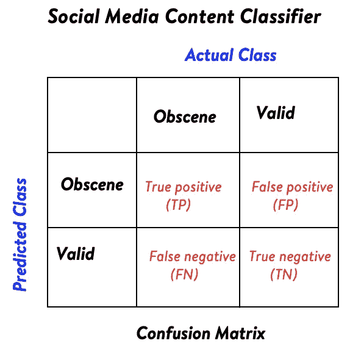

混乱矩阵。作者图片

混淆矩阵的概念也可以扩展到多类分类问题。混淆矩阵顾名思义，告诉分类器在类之间混淆的程度。

# 深入了解分类指标

在这一节中，我们将看看一些分类标准和它们有意义的场景。

## 准确(性)

准确度是正确标记的实例总数(不管是正还是负)与所有实例的总数之比。

准确度= (TP+TN)/(TP+FP+FN+TN)

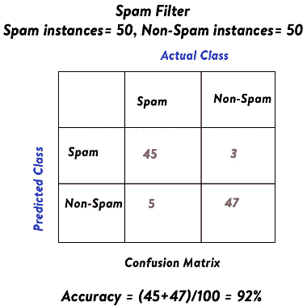

垃圾邮件分类器。作者图片

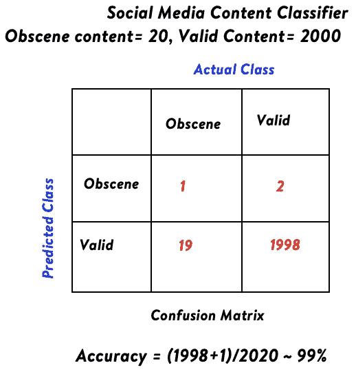

社交媒体内容分类器。作者图片

在第一种情况下，准确性是一个很好的度量，因为实例在两个类中是均匀分布的。在第二种情况下，该模型的性能不好，因为在 20 个淫秽内容中，它只能正确地检测出 1 个，但准确率仍然高达 99%。

只有在以下情况下，准确性才是一个好的衡量标准。

1.  类或类别具有均匀分布的实例，即它是一个平衡的数据集。
2.  假阳性的代价和假阴性的代价是一样的。

## 精确

[精度](https://en.wikipedia.org/wiki/Precision_and_recall)是被 ML 模型正确正标记的实例与所有正标记实例(不管那些实例实际上是否正)的数量之比。精度是一个度量标准，它表明我们对模型的正面预测有多大的信心，即使可能会遗漏一些实际的正面实例。

精度= TP/(TP+FP)

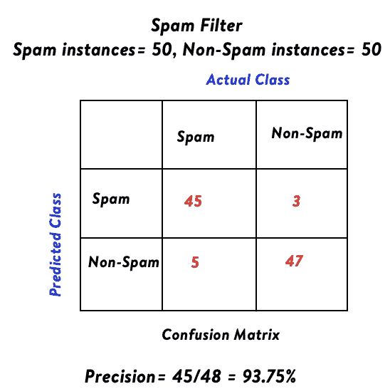

垃圾邮件分类器。作者图片

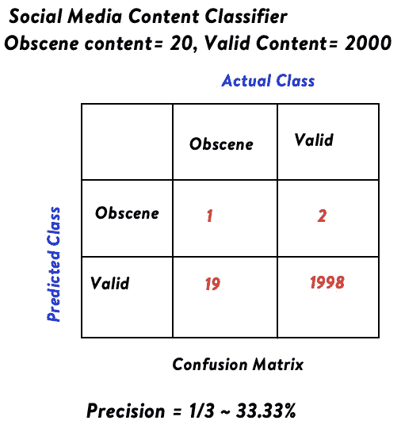

社交媒体内容分类器。作者图片

即使 ML 模型做得不好，并且只能正确地检测到 1 个淫秽内容，精确度也高达 33%,因为在预测为阳性的 3 个内容中，1 个实际上是阳性的，模型对此有 33%的把握。

> S 假设该公司要求暂停发布淫秽内容的客户的账户。在这种情况下，ML 模型的精度应该非常高。如果由于风险稍低，很少的罪犯没有被发现，这仍然是好的，但是那些被标记为阳性的人实际上应该是罪犯或真正的阳性。

## 回忆又名敏感性

[召回](https://en.wikipedia.org/wiki/Precision_and_recall)或灵敏度是由 ML 模型正确肯定标记的实例的数量与所有实际肯定实例的数量之比(不管 ML 模型是否能够正确检测)。召回作为一种衡量标准，强调的是假阴性的代价更高，不应遗漏任何真正的阳性。

精度= TP/(TP+FN)

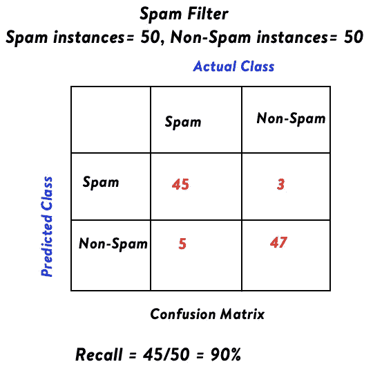

垃圾邮件分类器。作者图片

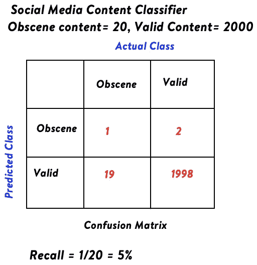

社交媒体内容分类器。作者图片

> 在创建一个检测社交媒体中淫秽内容的分类器的例子中，召回率需要很高，因为我们不能允许任何挑衅性的内容在网站上盛行。

## f1-分数

正如我们所见，精确度和召回率指标有时各有优势。 [F1 得分](https://en.wikipedia.org/wiki/Precision_and_recall#F-measure)考虑了两个指标的优劣。将其作为精度和召回率的[调和平均值](https://en.wikipedia.org/wiki/Harmonic_mean)。

**谐波是什么意思？**

两个值‘a’和‘b’的简单平均值由(a+b)/2 给出。而两个值‘a’和‘b’的调和平均值是通过首先取‘a’的倒数和‘b’的倒数，取平均值，然后求倒数而得到的。

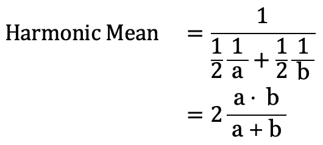

两个值的调和平均值。作者图片

因此，分类任务的 F1 分数如下所示。

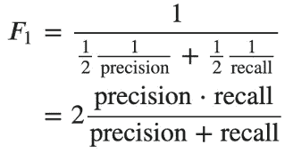

f1-分类任务的分数。作者图片

**F1-score 为什么取调和平均值，为什么不取简单平均值？**

为了理解调和平均数的重要性，让我们看一个例子。假设学生 A 在两个科目中得了 11 和 14 分，而学生 B 在这两个科目中得了 20 和 5 分。两个学生的简单平均分是 12.5，而学生 A 的调和平均分是 12.32，B 是 8。差异的原因是调和平均值也考虑了两个分数之间的和谐性(相似性)。由于 11 和 14 比 20 和 5 彼此更相似，第一种情况下的调和平均值大于第二种情况。如果精度或召回指标中的任何一个有所提高，F1 分数不会很高。当两者和谐一致时，情况会有所改善。例如，如果 Precision 为 1，Recall 为 0，则 F1 分数为 0，而简单平均值为 0.5。

## Fβ分数

如果我们仔细看看 F1 分数的公式，它给出了精确度和召回率的同等权重。

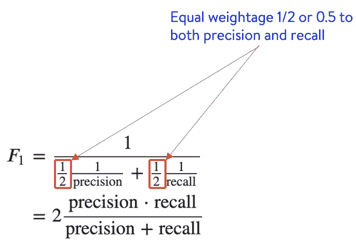

f1-得分公式。作者图片

精确度和召回率的权重都是 0.5。另一种说法是 F1 分数给出了相等的权重 1 表示精确，1 表示回忆，为了确保，总权重被归一化为 1，两个权重都除以 2。

Fβ-score 并没有给出等于 1 的精度和召回权重，而是分配归一化为 1 的权重，但是召回权重是𝛽乘以精度权重。因此，Fβ分数公式看起来像。

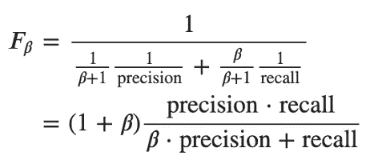

fβ-评分公式。作者图片

召回的权重是𝛽，精确的权重是 1。为了确保总权重归一化为 1，两者都除以(1+𝛽).

常用的𝛽值有:

*   𝛽 = 0.5，召回率低于精确度。
*   𝛽 = 1，表示召回率等于精确度。与 F1 得分相同
*   𝛽 = 2，召回率高于精确度。

# 结论

通过这篇博客，我们谈到了正确选择分类标准的重要因素。我们还查看了一些分类指标，如准确度、精确度、召回率、f1 分数和 fβ分数，以及它们有意义的不同示例场景。根据业务用例，如果检测所有的阳性非常重要，或者换句话说，假阴性的代价更高，我们可以使用 Fβ-score 给出更高的回忆权重。另一方面，如果避免任何误报更重要，我们可以使用 Fβ-score 来提高精确度的权重。如果假阳性和假阴性的成本相同，可以用 F1 值。对于多类分类任务，使用加权 F1 分数(通过每个类的实例数进行加权)也很常见。在平衡数据集的情况下，精确度也是一个很好的衡量标准。请以评论的形式让我知道你的想法。

***我的 Youtube 频道获取更多内容:***

[DataTrek Youtube 频道](https://www.youtube.com/channel/UCg0PxC9ThQrbD9nM_FU1vWA)

**关于作者-:**

> Abhishek Mungoli 是一位经验丰富的数据科学家，拥有 ML 领域的经验和计算机科学背景，跨越多个领域，并具有解决问题的思维方式。擅长各种机器学习和零售业特有的优化问题。热衷于大规模实现机器学习模型，并通过博客、讲座、聚会和论文等方式分享知识。
> 
> 我的动机总是把最困难的事情简化成最简单的版本。我喜欢解决问题、数据科学、产品开发和扩展解决方案。我喜欢在闲暇时间探索新的地方和健身。在 [**中**](https://medium.com/@mungoliabhishek81) 、**[**Linkedin**](https://www.linkedin.com/in/abhishek-mungoli-39048355/)、或**[**insta gram**](https://www.instagram.com/simplyspartanx/)**上关注我，查看我[以前的帖子](https://medium.com/@mungoliabhishek81)。我欢迎反馈和建设性的批评。我的一些博客:******

*   ******逻辑回归手册******
*   ******[线性回归完全指南](https://medium.com/geekculture/a-complete-guide-to-linear-regression-cfa984055671)******
*   ******[确定您数据的分布](/identify-your-datas-distribution-d76062fc0802)******
*   ******[降维:PCA 与自动编码器](/dimensionality-reduction-pca-versus-autoencoders-338fcaf3297d)******
*   ******[体验遗传算法的威力](/experience-the-power-of-the-genetic-algorithm-4030adf0383f)******
*   ******[每个数据科学家都应该避免的 5 个错误](/5-mistakes-every-data-scientist-should-avoid-bcc8142d7693)******
*   ******[以简单&直观的方式分解时间序列](/decomposing-a-time-series-in-a-simple-and-intuitive-way-19d3213c420b?source=---------7------------------)******
*   ******[GPU 计算如何在工作中真正拯救了我？](https://medium.com/walmartlabs/how-gpu-computing-literally-saved-me-at-work-fc1dc70f48b6)******
*   ******信息论& KL 分歧[第一部分](/part-i-a-new-tool-to-your-toolkit-kl-divergence-5b887b5b420e)和[第二部分](/part-2-a-new-tool-to-your-toolkit-kl-divergence-736c134baa3d)******
*   ******[使用 Apache Spark 处理维基百科，创建热点数据集](/process-wikipedia-using-apache-spark-to-create-spicy-hot-datasets-1a59720e6e25)******
*   ******[一种基于半监督嵌入的模糊聚类](/a-semi-supervised-embedding-based-fuzzy-clustering-b2023c0fde7c)******
*   ******[比较哪种机器学习模型表现更好](/compare-which-machine-learning-model-performs-better-4912b2ed597d)******
*   ******[分析 Fitbit 数据，揭开疫情封锁期间身体模式变化的神秘面纱](/analyzing-fitbit-data-to-demystify-bodily-pattern-changes-amid-pandemic-lockdown-5b0188fec0f0)******
*   ******[神话与现实围绕关联](/myths-and-reality-around-correlation-9b359456d8e1)******
*   ******[成为面向业务的数据科学家指南](/a-guide-to-becoming-business-oriented-data-scientist-51da5c829ffa)******