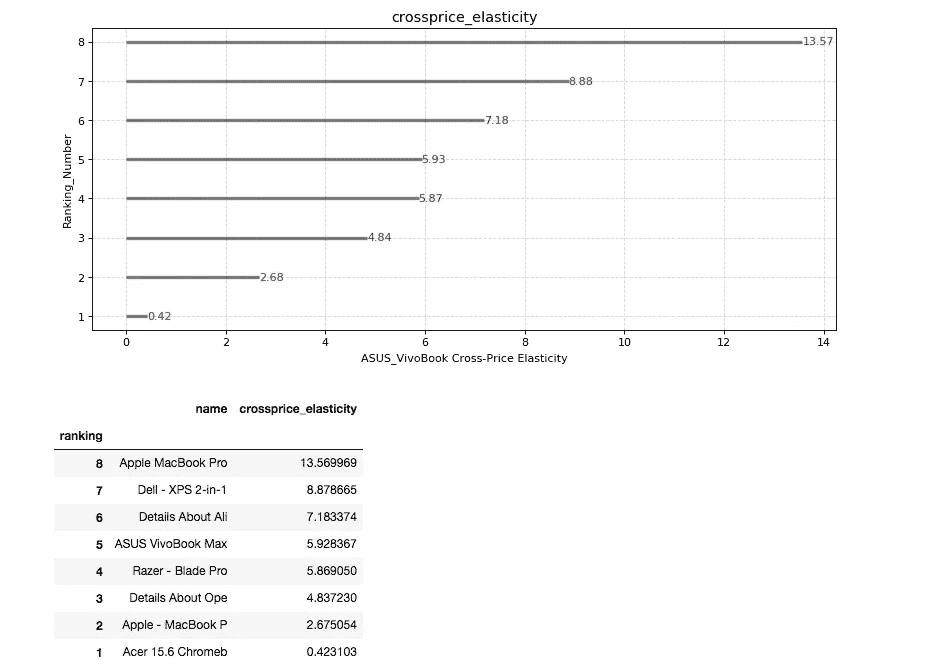

# 用交叉价格弹性识别价格竞争对手——一种实用的方法

> 原文：<https://towardsdatascience.com/identifying-your-price-competitors-with-cross-price-elasticities-a-practical-approach-26c19f12b1ee?source=collection_archive---------3----------------------->

## [实践教程](https://towardsdatascience.com/tagged/hands-on-tutorials)

## 确定谁是你的价格竞争对手是价格和促销分配的关键

由[尼古拉斯·霍伊泽](https://unsplash.com/@nhoizey?utm_source=medium&utm_medium=referral)在 [Unsplash](https://unsplash.com?utm_source=medium&utm_medium=referral) 上拍摄的照片

当你设定价格或促销时，最重要的事情之一是了解你的竞争对手是谁，还有哪些其他产品或产品促销会影响我们的产品销售。换句话说，当其他产品的价格有折扣时，这些折扣对我们产品销售的影响有多大。

在本帖中，我们将通过使用 Python 中的多元线性回归计算**交叉价格弹性，来探索和确定产品之间价格竞争的本质，如**星巴克咖啡 vs 胡安·瓦尔迪兹咖啡**或者产品可能是价格补充，如**番茄酱** **和意大利面**。**和往常一样，本帖全包；我将给你一个简单明了的交叉价格弹性的解释，并与你分享一个非常容易理解的代码，它一步一步地解释了一个电子商务行业中笔记本电脑交叉价格弹性的例子。

我们将能够探索以下内容:

> “当别人改变价格时，我的需求会发生什么变化？”

计算交叉价格弹性类似于价格弹性，但有一点扭曲，而基本价格弹性解释了当我们提高或降低相同产品价格时我们产品的销售需求的变化；其计算方法如下:

作者图片 1

交叉价格弹性解释了当其他产品价格上升或下降时，我们产品的销售需求的变化。换句话说，它解释了其他产品价格变化对我们产品销售需求的影响；其计算方法如下:

作者提供的图片 2

交叉价格弹性允许我们识别价格**竞争者/替代品**和**补充**。我将进一步解释这两个定义，举上面提到的价格竞争对手的例子，如星巴克咖啡 vs Juan Valdez 和价格补充，如番茄酱和意大利面。

# **竞争对手/替代者:**

让我们说，星巴克咖啡豆和胡安瓦尔迪兹咖啡豆是强有力的竞争对手，消费者是价格意识，通常在选择一个或另一个之间周旋。在这种情况下，可能发生的情况是，当星巴克的咖啡豆打折时，Juan Valdez 咖啡豆的销售量会减少，因为消费者会更喜欢价格更便宜的星巴克，而 Juan Valdez 的销售会受到影响。

因此，这将给我们带来以下**正**交叉价格相关性:

> **当星巴克咖啡价格降低时，胡安·瓦尔迪兹售出的咖啡数量减少**

照片由[在](https://unsplash.com/@mockupgraphics?utm_source=medium&utm_medium=referral) [Unsplash](https://unsplash.com?utm_source=medium&utm_medium=referral) 上的实体模型图形拍摄

# **补充:**

假设一位消费者正在购物，看到番茄酱在打折，因此这位消费者更有可能购买意大利面来烹饪美味的意大利面*“好吃！”*。这是当我们确定产品是互补的，当一种产品价格下降时，消费者可能会购买另一种产品以补充它；比如番茄酱和意大利面。

因此，这会给我们带来以下**负**交叉价格相关性:

> **当番茄酱价格下降时，意大利面的销量增加**

照片由[丹尼耶拉·普里约维奇](https://unsplash.com/@dacakockica?utm_source=medium&utm_medium=referral)在 [Unsplash](https://unsplash.com?utm_source=medium&utm_medium=referral) 上拍摄

# 毕竟，我们如何确定价格竞争对手或价格补充？

# 很棒的问题！

接下来，我将详细介绍完整的分步编码过程，并为您提供一个非常简单易懂的解释，说明需要哪些数据，以及如何使用多元线性回归来解释交叉价格弹性结果。万岁，让我们开始有趣的部分！

# **数据收集:**

# **收集哪些数据？**

为了分析交叉价格弹性，我们需要一个或多个潜在竞争对手的价格变化，以及在竞争对手价格变化发生的同一时间段内我们的产品销售需求(销售量),以便能够观察我们的销售需求对竞争对手产品价格变化的反应。

在这种情况下，该模型将更多地关注价格竞争对手/替代品，而不是价格补充，因为我们关注的是单一类别“笔记本电脑”的产品价格。如果我们想进一步分析价格补充，那么理想情况下，我们会添加笔记本电脑组件，如笔记本电脑包、笔记本电脑外壳、外部硬盘驱动器等。

# 使用的 Python 库有:

我们将使用以下 python 库: **pandas，numpy，matplotlib 和 statsmodels。**

在这里，我在开始时导入了 **pandas、numpy 和 matplotlib** ，但是在接下来的步骤中你会看到其中最重要的，那就是主要用于**多元线性回归模型**的 **statsmodels** 。

表 1 按作者分列

# 数据框特征说明:

> ***Date_imp:*** *捕获数据时的日期时间印象*
> 
> ***Category _ name:****Category name 是为了分析笔记本电脑、音箱等单独群组的价格而包含的功能*
> 
> ***名称:*** *产品名称*
> 
> ***disc _ Price:****扣除折扣后的产品价格*
> 
> ***商家:*** *商家是产品所在的平台*
> 
> ***状态:*** *产品状态。作为建议，从相同的条件下分析产品价格。否则，这可能会影响您的结果，因为条件为“二手”的产品价格通常比新产品价格便宜*
> 
> ***Sales _ count:****销售计数是产品在各自价格下的销售需求*

从数据来看，为了不出现任何不协调的情况，只选择了名为“Bestjam.com”的商家。其他商家可能有更多的用户流量(市场份额)，不同的消费者细分，因此销售的产品数量可能因商家而异。

由于上述原因，数据被“Bestjam.com”电子商务平台过滤，“笔记本电脑，计算机”类别和产品状况为“新”。

# 数据准备:

在多元线性回归中，我们希望合理地分配自变量和因变量。当我们谈到自变量和因变量时，你可以把它们看作是因果:自变量是你认为是因的变量，因变量是果。

众所周知，**价格弹性**和**交叉价格弹性**公式非常相似，只是有一点小小的变化。价格弹性衡量产品 Y 销售量对产品 Y 价格变化的敏感程度，换句话说，它衡量需求对其自身产品价格变化的敏感程度，而交叉价格弹性衡量产品 Y 需求(销售量)对产品(Z，M，W)竞争对手价格变化的敏感程度。

**价格弹性** = (x:黄色，y:黄色)

产品 Y 价格和产品 Y 销售数量

**交叉价格弹性=** (x:灰色，y:黄色)

产品价格(Z、M、W)和产品 Y 销售量

按作者分列的图表 1

对于交叉价格弹性，我们将把可能的竞争者的价格设定为自变量(x 值)，把我们产品的销售量设定为因变量(y 值)。竞争对手的价格变化和销售数量需要与同一时间段保持一致，以便能够观察我们的产品销售数量受竞争对手产品价格变化影响的可能性。

在这种情况下，我们将分析华硕 VivoBook 笔记本电脑的交叉价格弹性。接下来，我们可以观察到，我们的数据框中有多个笔记本电脑价格的变化，这些价格来自“Bestjam.com”电子商务网站中显示的多个产品，包括华硕 VivoBook 的价格和销售量。

表 2 按作者分列

我们将笔记本电脑价格设为 x 值(独立值)，将华硕 VivoBook 售出数量设为 y 值(依赖值)。

太好了，现在我们已经准备好将数据植入多线性回归模型。是时候跳到交叉价格分析中最酷的部分了，多重线性回归模型。

# 交叉价格弹性模型公式:

我们可能知道，交叉价格计算如下:

作者提供的图片 3

使用**多元线性回归**将其改写如下:

**多线性回归中需求的交叉价格弹性:**

> **系数(斜率)*产品 B 的价格平均值/产品 A 的数量平均值**
> 
> **简单来说，系数(斜率)是产品价格 B 和产品 A 销售量的系数**

我们计算 x 值的价格平均值(笔记本电脑价格)和 y 值的销售量平均值(华硕 VivoBook 数量),以便稍后植入交叉价格弹性公式。

一旦我们有了交叉价格弹性公式的平均值。我们将计算系数，如下所示:

我们导入 python 中的 statsmodels 库用于多线性回归，并拟合我们的模型，如下所示:

太好了，我们快到了。正如您在下面的 **coef** 中看到的，这些是我们将用于交叉价格弹性公式的系数。

为了分析我们的系数的统计意义，观察系数 p 值和 t (t-stats)是很重要的

> **t_score:** 等于 t-stats，表示发现的显著性。越接近 0，越可能没有显著性。t-stats 越大，无论是正面的还是负面的，研究结果的重要性就越大
> 
> **系数 _ 值:**检验零假设，即**系数**等于零(无效)。低的 **p** - **值** ( < 0.05)表示您可以拒绝零假设

作者图片 4

这太神奇了，现在我们有了计算交叉价格弹性所需的东西，我们知道了哪些系数可能是重要的，哪些应该从我们的分析中去掉。此外，我们将我们所有的计算播种到我们的交叉价格公式和魔术，我们将得到我们的交叉价格弹性。

祝贺你走到这一步，现在我们有了交叉价格弹性，我会进一步向你解释如何解释结果:)。

# 数据可视化:交叉价格弹性的发散图

**作为奖励**，我添加了一个数据可视化功能，它将帮助您展示交叉价格弹性，以及您如何从可视化中解读数据:)

上面，这个内置函数将帮助您可视化交叉价格弹性。为了进一步分析，使用了发散图，因为它为读者提供了一个更清晰的价格分析的**负交叉价格弹性和正交叉价格弹性**之间的概览。

# 交叉价格弹性结果

当我们有正的交叉价格弹性时，这意味着这些产品在定价上是替代品或主要竞争者。换句话说，从我们的样本数据中，我们可以观察到**华硕 VivoBook** **(我们的产品)的主要竞争对手是苹果 MacBook Pro、戴尔 XPS 和阿里。**这意味着当这些竞争对手产品的价格下降时，我们的产品需求或销售额也会下降，因为客户更有可能用这些竞争对手的产品来替代我们的产品。从交叉价格弹性中获得的这些经验对我们的促销策略至关重要，我们能够确定哪些竞争对手的产品对我们的需求影响最大，因此我们可以战略性地关注主要竞争对手的未来价格策略。

按作者分类的图表 2

> 如果苹果 MacBook Pro 降价 10%，华硕 VivoBook 的销量(我们的产品)可能会下降 130.56%，等等。

现在你明白了，你可以建立自己的交叉价格弹性模型，并使用数据来制定价格策略。

**参考文献:**

弗吉尼亚大学定价策略中的成本和经济学

# 感谢阅读！