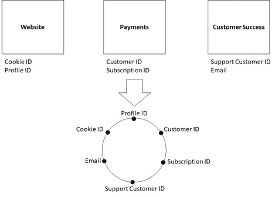
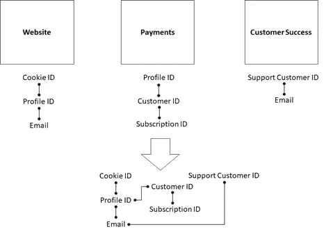

# 身份钥匙圈

> 原文：<https://towardsdatascience.com/identity-keyrings-201d17295954?source=collection_archive---------25----------------------->

## 关联整个企业中使用的不同身份

这是我的书《Azure 上的数据工程》的摘录。本文中的代码示例使用 Azure Data Explorer。如果你想运行它们，创建一个 [Azure Data Explorer 集群和数据库](https://azure.microsoft.com/en-us/services/data-explorer/)。一旦设置完成，您就可以使用[数据浏览器 web UI](https://dataexplorer.azure.com/) 连接到您的集群和数据库，并运行代码示例。Azure Data Explorer 使用 KQL，Kusto 查询语言。如果不熟悉，可以查阅一下[快速参考](https://docs.microsoft.com/en-us/azure/data-explorer/kql-quick-reference)。这本书更深入地介绍了 Azure Data Explorer，但是这篇文章是独立的。

# 身份钥匙圈

在一个足够大的企业中，全面了解系统是如何使用的并不是一件容易的事情。通常情况下，企业的不同部分会产生并掌握自己的身份。

例如，网站团队掌握 cookie IDs 来识别未登录的用户，以及已登录用户的配置文件 id。支付团队使用客户 id 来识别客户，使用订阅 id 来跟踪客户为哪些订阅付费。客户成功团队有一个支持客户 ID，用于在他们的支持工具中识别客户，以及客户的电子邮件地址。身份钥匙圈将不同系统中的所有身份汇集在一起，使我们能够快速找到所有联系。图 1 显示了不同团队使用的各种身份，以及一个密匙环如何将它们组合在一起。



图 1:网站、支付和客户成功团队都掌握了自己的身份。钥匙圈将这些身份组合在一起。(图片由作者提供)

企业越大，我们拥有的身份就越多，就越难从更广的角度了解用户是如何与企业互动的。拥有一个密匙环可以让我们关联不同系统的活动:例如，我们可以看到在客户成功团队中解决客户问题所花费的时间如何影响用户保留，由支付团队跟踪，或者我们可以看到网站上的 A/B 测试如何影响用户注册的订阅。

# 构建身份密钥环

各种系统在身份之间有一些联系。例如，一旦用户登录，网站团队可能有一个将 cookie IDs 与配置文件匹配的表，并且用户配置文件包括一个电子邮件地址。支付团队保留了客户到订阅的映射，并且还拥有给定客户 ID 的配置文件 ID。客户成功团队将他们各自的 id 与一个电子邮件地址关联起来。图 2 显示了这些联系，以及如何将它们组合在一起，让我们能够对系统中的所有身份进行分组。



图 2:不同的系统维护不同的连接。将它们放在一起可以让我们对系统中的所有身份进行分组。(图片由作者提供)

让我们创建包含这些身份的 Azure 数据浏览器表:

```
.set Profiles <|
datatable (ProfileId: int, Email: string, CookieId: guid) [
    10002, '[emma@hotmail.com](mailto:emma@hotmail.com)', '657d31b9-0614-4df7-8be6-d576738a9661',
    10003, '[oliver@hotmail.com](mailto:oliver@hotmail.com)', '0864c60d-cc36-4384-81a3-e4c1eee14fe7'
].set Customers <|
datatable (CustomerId: int, ProfileId: int) [
    1001, 10002,
    1005, 10003
].set Subscriptions <|
datatable (CustomerId: int, SubscriptionId: guid) [
    1001, 'fd10b613-8378-4d37-b8e7-bb665999d122',
    1005, '55979377-ed34-4911-badf-05e07755334c'
].set SupportCustomers <|
datatable (SupportCustomerId: int, Email: string) [
    21, '[emma@hotmail.com](mailto:emma@hotmail.com)',
    22, '[oliver@hotmail.com](mailto:oliver@hotmail.com)'
]
```

这些表来自不同的系统，但最终被纳入我们的数据平台。一旦我们有了这些原始数据，我们就可以通过分组所有相关的 id 来构建一个密匙环。我们的 keyring 表的模式由一个唯一标识一组相关身份的`GroupId`、一个指定我们在每行中捕获哪个身份的`KeyType`和一个作为身份值的`KeyValue`组成。

这是第一批摄入:

```
.create table Keyring(GroupId: guid, KeyType: string, KeyValue: string).append Keyring <| Profiles
| project GroupId=new_guid(), KeyType='ProfileId', KeyValue=tostring(ProfileId).append Keyring <| Profiles
| join (Keyring | where KeyType == 'ProfileId' 
    | project GroupId, ProfileId=toint(KeyValue)) on ProfileId
| project GroupId, KeyType='Email', Email.append Keyring <| Profiles
| join (Keyring | where KeyType == 'ProfileId'
    | project GroupId, ProfileId=toint(KeyValue)) on ProfileId
| project GroupId, KeyType='CookieId', tostring(CookieId)
```

`.append`类似于`.set`，但是当`.set`创建一个新的表时，`.append`期望一个现有的表被接收到。

我们首先生成新的 GUIDs，并将键类型设置为`'ProfileId'`，将键值设置为`Profiles`表中的`ProfileId`。接下来，我们将`Profiles`表与`ProfileId`上的`Keyring`表连接起来，这给了我们`GroupId`，我们添加了电子邮件。第三，我们将`Profiles`表与`ProfileId`上的`Keyring`表连接起来，并添加了`CookieId`值。

此时，我们将`Profiles`表“展开”到密匙环模式中。让我们给它添加`Customers`和`Subscriptions`id:

```
.append Keyring <| Customers
| join (Keyring | where KeyType == 'ProfileId'
    | project GroupId, ProfileId=toint(KeyValue)) on ProfileId
| project GroupId, KeyType='CustomerId', tostring(CustomerId).append Keyring <| Subscriptions
| join (Keyring | where KeyType == 'CustomerId'
    | project GroupId, CustomerId=toint(KeyValue)) on CustomerId
| project GroupId, KeyType='SubscriptionId', tostring(SubscriptionId)
```

这与我们之前所做的类似，除了当我们引入`SubscriptionId`时，我们必须加入`CustomerId`而不是`ProfileId`。这不是问题:我们可以加入任何我们已经在钥匙圈中的身份来找到`GroupId`并且用其他身份扩展这个组。

最后，让我们添加客户支持 id，加入电子邮件:

```
.append Keyring <| SupportCustomers
| join (Keyring | where KeyType == 'Email'
    | project GroupId, Email = KeyValue) on Email
| project GroupId, KeyType='SupportCustomerId', tostring(SupportCustomerId)
```

# 了解钥匙圈

现在，我们将所有这些不同表中的 id 整合到一个表中，并将它们分组在一起。如果我们查询密匙环表，我们会看到类似于下表的内容:

钥匙圈表

现在，给定系统中的任何 ID，我们可以轻松地检索所有连接的 ID。例如，给定一个`SupportCustomerId` (21)，我们可以检索所有相关的键:

```
Keyring
| where KeyType == 'SupportCustomerId' and KeyValue == tostring(21)
| project GroupId
| join kind=inner Keyring on GroupId
```

钥匙圈使我们能够关联不同的数据集，并全面了解我们的系统是如何使用的。我们使用一个模式，在这个模式中，我们可以根据需要插入任意多种类型的 ID，用一个`KeyType`列给出 ID 的类型，用`KeyValue`列存储 ID 值。

制作钥匙圈的步骤如下:

*   生成一个组 ID，并从获取一个身份开始(在我们的示例中为`ProfileId`)。
*   对于每个新的身份类型，在一个已知的连接上用密匙环加入以获得`GroupId`，然后将新的身份添加到它们各自的组中。

下面是一个关于构建钥匙圈的图形视图:

> **身份钥匙圈为图**
> 
> 考虑身份密匙环的另一种方式是作为一个图问题。系统中的每个身份代表图中的一个节点，每个已知的连接代表一条边。例如，`ProfileId`和`Email`是节点，因为它们是连接的(在`Profiles`表中)，我们在这些节点对之间有边。
> 
> 构建一个密匙环意味着识别所有相关联的身份组。在图的术语中，这意味着识别图的所有连接的组件，并给每个连接的组件分配一个`GroupId`。提醒一下，图中的连通分支是一个子图，其中任何一对节点之间都有一条路径，并且没有其他到超图的连接。
> 
> 构建密匙环的另一种方法是使用图形数据库:我们加载所有节点和边，然后遍历以找到连接的组件。

钥匙圈为我们提供了系统中所有身份的统一视图。这使我们能够关联原本不相交的数据集，并跨多个团队和系统连接信息。