# IEEE-CIS 欺诈检测-排名前 5%的解决方案

> 原文：<https://towardsdatascience.com/ieee-cis-fraud-detection-top-5-solution-5488fc66e95f?source=collection_archive---------10----------------------->

## Kaggle 竞赛 IEEE-CIS 欺诈检测的前 5%解决方案


照片由 [Unsplash](https://unsplash.com?utm_source=medium&utm_medium=referral) 上的[标志拍摄](https://unsplash.com/@paxtechnology?utm_source=medium&utm_medium=referral)

我知道您或您身边的任何人都是一些欺诈活动的受害者。我们无法直接控制人们通过欺诈活动轻松赚钱。在线交易是可能发生欺诈交易并导致金钱损失的领域之一。

在这场比赛中，我们将使用机器学习技术来检测在线欺诈交易。我们的目标是实施一个在 Kaggle 排行榜上排名前 5%的解决方案，这并不是一件容易的事情。IEEE-CIS 欺诈检测是由 IEEE 计算智能学会组织的 Kaggle 竞赛。Vesta Corporation 是担保电子商务支付解决方案的先行者之一，它为本次比赛提供了数据集。

在这篇博客中，我将很好地概述我是如何达到前 5%的结果的。我不会解释每一行代码。相反，我将给出我的解决方案的一个很好的概述。你可以随时在这里查阅我的 [**代号**](https://github.com/arunm8489/IEE-CIS-Fraud-detection) 。

# 关于数据集

数据被分成两个文件 identity 和 transaction，这两个文件通过 TransactionID 连接，分别用于训练和测试。因此，我们有 4 个文件—训练事务、训练身份、测试事务和测试身份。需要注意的是，并非所有交易都有相应的身份信息。

让我们熟悉一下目前的各种栏目:

**交易数据**

*   ***交易 id:*** *与交易相关的 Id*
*   ***TransactionDT:****给定参考日期时间的时间增量(不是实际时间戳)*
*   ***交易金额:*** *以美元计的交易支付金额*
*   ***product CD****【分类】:产品代码(每笔交易的产品)*
*   ***card 1–6****【分类】:支付卡相关信息，如卡种、国家等*
*   ***addr1，addr2*** *【分类】:地址信息*
*   ***dist1，dist2:*** *一些距离信息*
*   ***P _ email domain****【分类】:购买者的邮箱域。*
*   ***R _ email domain****【分类】:收件人的邮件域。*
*   ***C1-C14:*** *计数，比如找到多少个地址与支付卡相关联等。实际意义被掩盖了。*
*   ***-D15:时间差*** *，如前几笔交易之间的天数等。*
*   ***M1-M9*** *【分类】:匹配，如名片上的姓名和地址等。*
*   ***vxxxx:****Vesta 设计了丰富的功能，包括排名、计数和其他实体关系。*

**身份数据**

*   ***交易 id:*** *与交易相关的 Id*
*   ***设备类型*** *【分类】:用于交易的设备类型*
*   ***设备信息*** *【分类】:关于所用设备的更多信息*
*   ***id1–38****【分类+数字】:网络连接信息、浏览器信息等(id12–38 为分类信息)*

*注意:实际上我们无法获得关于列的确切信息。主要是因为我们在处理交易数据时的安全考虑。*

# 商业目标

发现欺诈交易的主要业务目标如下:

1.  如果发现欺诈交易，公司应立即封锁该卡。
2.  我们应该能够预测欺诈交易的概率
3.  我们不应将欺诈交易预测为非欺诈交易。反之亦然。所以应该注意精确度和召回率。

# 我的方法

1.  对每一列进行探索性的数据分析，了解每个特性的影响。
2.  建立一个基线模型。
3.  创建新特征，并查看这些特征是否能提高模型的性能。如果是，保留这些功能，否则放弃这些功能。为此，我使用了正向特征选择。
4.  迭代地继续这个方法，直到我们得到一个好的分数。

# 电子设计自动化(Electronic Design Automation)

在这里解释每一个特性的分析并不理想。我将解释我的一些有趣的观察。您可以从我的存储库中找到其余的分析。

让我们先加载数据

现在让我们加载保存的文件

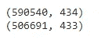

我们有形状的训练数据(590540，434)和形状的测试数据(590540，434)。让我们看看在训练和测试数据中丢失了多少值

我们将看到 90 %以上的值缺失的列。

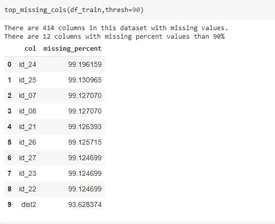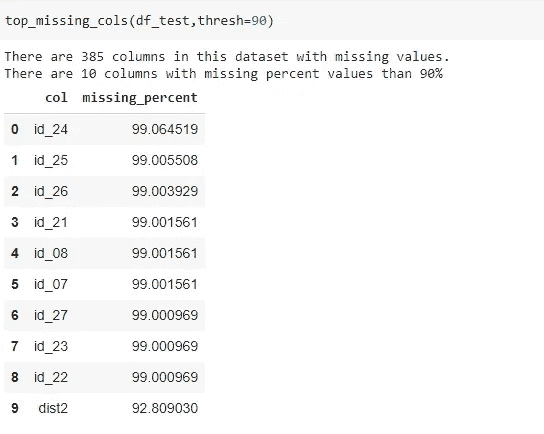

我们可以看到像 id_21、id_22、id_23、id_24、id_25、id_26、id_27、id_01、id_07、id_08 这样的列有超过 99%的缺失值。我们最好放弃这些功能。

**Is _ 诈骗(目标特征)**

这是我们需要预测的目标变量。让我们看看它是如何分布的。

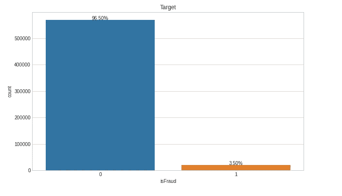

观察结果:

不出所料，我们可以看到这个阶层严重失衡。这里 96.5%的交易不是欺诈，其余 3.5%的交易是欺诈。我们将选择 ROC 曲线下面积(AUC)作为 ML 问题的度量。

> *为什么不平衡数据集的准确性不行？*

考虑这样一个场景，我们有一个不平衡的数据集。例如，考虑信用卡欺诈检测的情况，其中 98%的点数为非欺诈(1)，其余 2%的点数为欺诈(1)。在这种情况下，即使我们预测所有的点都是非欺诈的，我们也将获得 98%的准确性。但实际上，情况并非如此。所以我们不能用准确性作为衡量标准。

> *什么是 AUC ROC？*

AUC 是 ROC 曲线下的面积。它告诉我们这个模型在多大程度上能够区分不同的类。AUC 越高，模型预测 0 为 0 和 1 为 1 的能力越强。用 TPR 对 FPR 绘制 ROC 曲线，其中 TPR 在 y 轴上，FPR 在 x 轴上。

经过分析，我发现的另一件事是，在大多数情况下，如果客户的一笔交易是欺诈，他/她之前的所有交易都会被标记为欺诈。但并不是所有的情况都是如此。这里面也有例外。这使得我们的预测更加困难。

*注意:我可以通过创建自己的 uid 来识别客户。当我们继续进行的时候我会解释的。*

**交易日期**

这表示与给定参考日期时间的时间差异。例如，86400 可以是特定时间的 86400 秒，例如:从 2010 年 2 月 12 日 12:05:09 pm 开始。在这里，我们必须检查在训练中获得的数据，并且测试是随时间连续的。这对于训练测试分割是重要的。这意味着训练数据应该来自较早的时期，而测试数据应该来自较晚的时期。

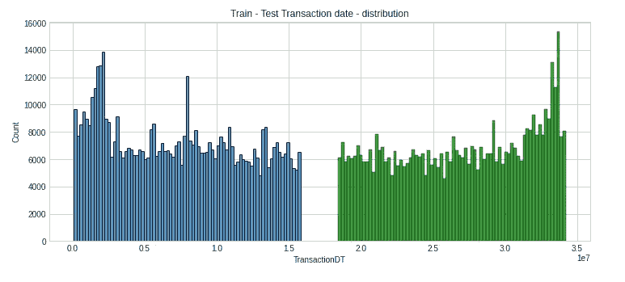

观察结果:

*   两者之间略有差距，但除此之外，定型集来自早期，测试数据来自后期。这可能会影响列车验证，应使用分割或交叉验证技术。
*   另一个观察结果是，在某些日子里，事务的数量超过 10000

现在让我们看看一周中不同的日子以及不同时间的欺诈交易。

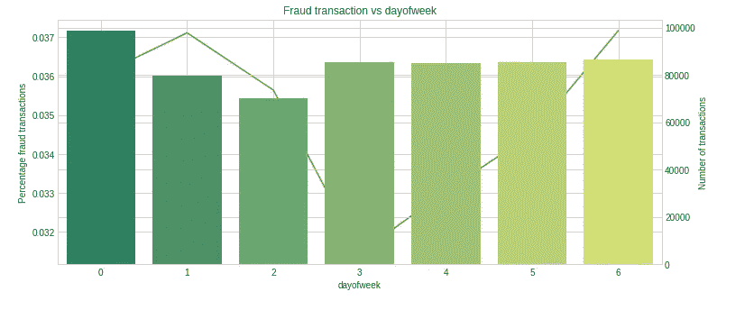

欺诈交易 vs 天数

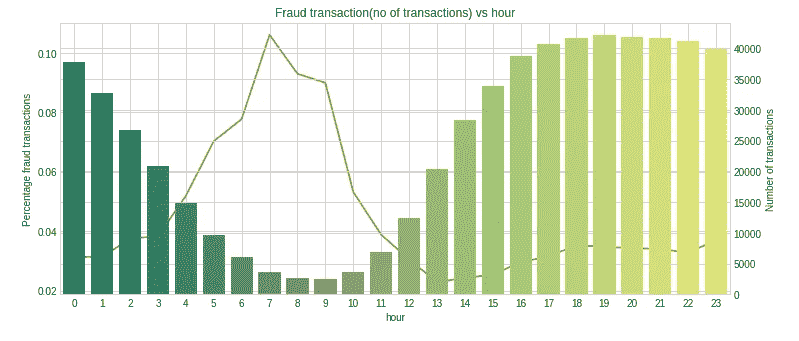

欺诈交易 vs 小时

我们可以看到，在第 3 天，欺诈性交易非常少，同样，在第 7 个小时，欺诈性交易的百分比比其他时间高。

**交易金额**

这是与每笔交易相关的金额。让我们看看交易金额是如何分布的。(我还记录了交易金额，以便更好地解释)

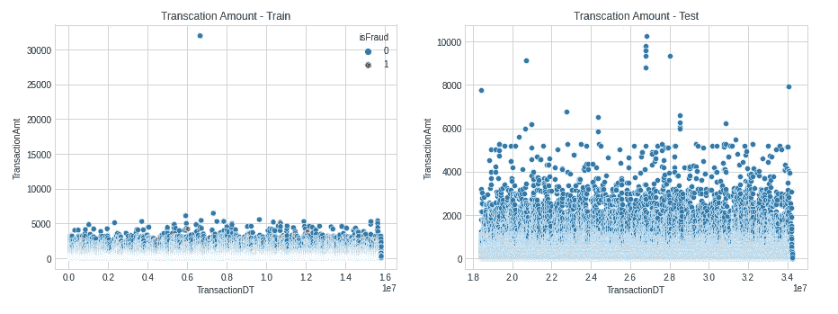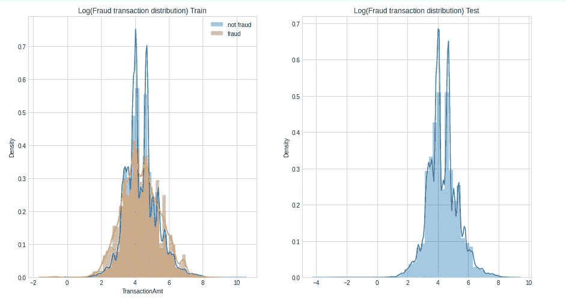

交易金额分布

观察结果:

*   我们可以看到，在训练数据中有一个点的数量> 30000。我们最好移除离群值，因为它会影响我们的模型(尤其是基于距离的算法，如逻辑回归、knn 等)。)在预测。
*   此外，像这样的异常值会导致过度拟合问题。例如，基于树的模型可以将这些离群值放在叶节点中，这些节点是噪声，不是一般模式的一部分。因此，我决定删除训练集中大于 30，000 的值。
*   “LogTransactionAmt”大于 5.5 (244 美元)且小于 3.3 (27 美元)的交易似乎具有更高的欺诈频率和概率密度。另一方面，那些“LogTransactionAmt”从 3.3 到 5.5 的人更有可能是合法的。

**产品光盘**

这是与每笔交易相关的产品代码。让我们看看在不同的产品代码中有多少百分比的交易是欺诈。

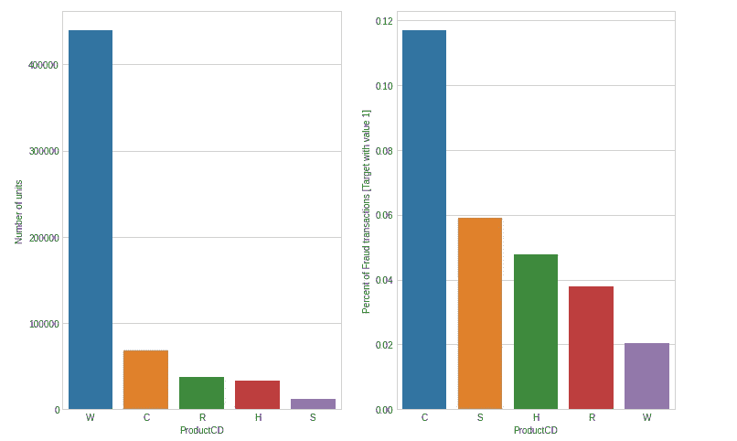

乘积码

我们可以看到，在与产品代码 C 相关的交易中，大约有 12%是欺诈交易。类似地，近 6%的交易是产品代码欺诈。

**维列斯**

我们有从 D1 到 D15 的 D 列。这些表示时间差，例如前一次交易和当前交易之间的天数、当前交易和第一次交易之间的天数等。尽管他们没有给出关于 D cols 的清晰的理解，但是我们在很好的分析之后得到了一些见解。

*   我们假设 D1 是开始使用信用卡的那一天。从交易日中减去这一数字将得出每个客户的内容价值。

```
df_train['D1n'] =  df_train['D1'] -   df_train.TransactionDT/np.float32(24*60*60)
```

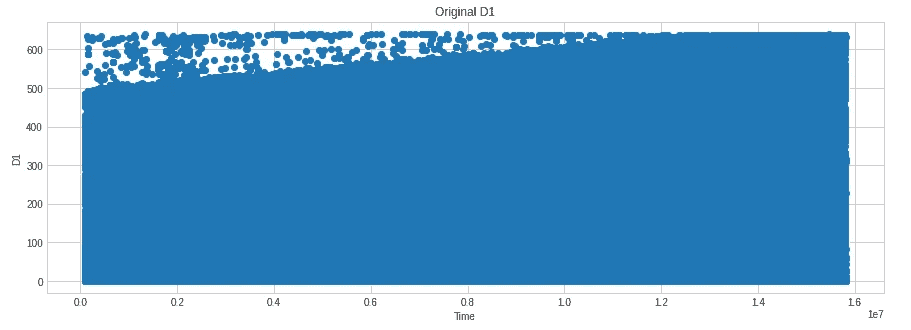

正常化前

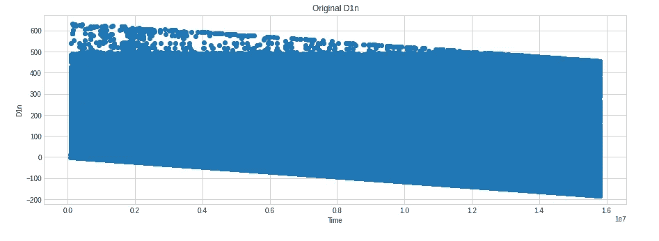

标准化后

我们对所有的 D 列进行了标准化，并允许模型决定哪些是重要的，哪些是不重要的。

**卡 1-卡 6**

这些列表示与卡相关的支付信息。从这些特性中可以观察到一些有趣的现象:

*   card1 中的值范围很广。如果我们看到分布有重叠。仅 card1 无法区分欺诈性交易和非欺诈性交易。card1 中没有缺失值。
*   card2 中丢失了一小部分数据。与 card1 相似，card2 中也有许多唯一的值。card3 与其他卡列的相关性较低。

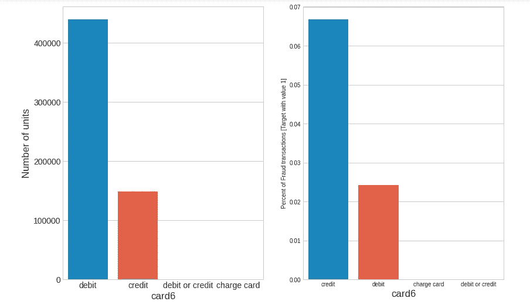

*   卡 4 表示客户使用哪种卡，visa、Mastercard、American Express 还是 discover。类似地，card6 表示卡的类型——借记卡或信用卡。

**P-邮箱域和 R-邮箱域:**分别是购买者和接收者的邮箱域。大约 76%的值在 R-email 域中丢失。在购买者的电子邮件域名中，大多数邮件来自 gmail.com。在这些欺诈交易中，超过 90%的交易来自域名 protonmail.com，这是一个严重的问题。

**addr1 和 addr2:** 这是一些与客户端相关的地址相关信息。addr1 和 addr2 都丢失了大约 11%的数据。addr1 中大约有 332 个唯一值，addr2 中有 74 个唯一值。

**dist1 和 dist2:** 这可能表示交易地点和持卡人地址之间的距离。这只是我的假设。dist2 中大约有 93%的值缺失。dist1 和 dist2 之间没有相关性。而 dist2 与所有其他属性的相关性非常弱。

C1-C14: 这些是计数之类的信息。C3 与 Cxx 的其他功能有些不同。对于来自 box pot 的 c3，很明显，在欺诈交易的训练数据中没有超过 3 的值。对于无欺诈交易，该值的范围为 0 到 26。此外，C3 与其他 Cxx 列的相关性很弱。

**M1-M9:** 超过 50%的值在 M 列中缺失。这些特征不能清楚地区分欺诈交易和非欺诈交易。

**V1-V399:** 这些是灶神星设计的特征。这些是被屏蔽的信息，可以是排名、计数或其他实体关系。许多特征之间存在强相关性(> 0.9)。如果可能的话，我们最好减少这些特征的数量，因为这样可以降低模型的计算复杂度。

# 基线模型

作为基线，我们创建了 3 个模型。—逻辑回归、随机森林和 XG Boost。在小的超参数调整之后，我们获得了以下结果。

**逻辑回归:** 0.84018(训练 AUC)，0.84245(测试 AUC)

**随机森林:** 0.9030(训练 AUC)，0.8600(测试 AUC)

**Xgboost:** 0.994(训练 AUC)，0.9234(测试 AUC)

由于 Xgboost 提供了更好的性能，我们决定坚持使用它。我们还绘制了特性重要性图，以获得各种特性影响的基本概念。对于 Xgboost，我们得到了 0.9004 的公共排行榜分数和 0.9238 的私人 LB 分数。

# 更多功能工程

## TransactionDT 和 TransactionID

两列都是唯一的。一个是时间相关信息，另一个是唯一 id。把这个加到模型里没有太大意义。所以我们去掉了这些特征。

## 减少 V-Cols

从我们的 Xgboost 模型中，在绘制了特性重要性之后，我们知道所有的 V 列对模型没有太大的贡献。同样通过分析，我们发现在几个“Vxx”列之间存在很强的相关性。所以我们决定通过相关性分析来减少列数。

**如何根据 NaN 值减少列？**

*   根据缺失值的数量对列进行分组，例如，如果有 4 列 v1、v2、v3 和 v4。如果 v1 和 v3 有 56 个缺失值，v2 有 21 个缺失值，v4 有 5 个缺失值，则我们有 3 个组['v1 '，' v3']，['v2']和['v4']
*   在每个组中，对于该组中的每一列，找出与其他列的相关性，并且只取相关系数> 0.75 的列。将具有公共元素的最大列表作为子组。每个组包含几个子组。例如:如果我们有[[v1，v2]，[v6]，[v1，v4，v2，v5]，[v5，v4]]，我们的输出将是[[v1，v2，v4，v5]，[v6]]。现在从每个子组中选择具有最多唯一值的列。例如，在子组[v1，v2，v4，v5]中，让 v2 具有最唯一的值。所以 out 输出变成[v2，v6]。

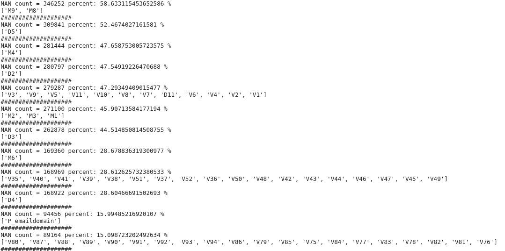

上图显示了我们产出的一部分。我们将对每个组进行相关性分析，以减少列数。

此处的列“V35”、“V40”、“V41”、“V39”、“V38”、“V51”、“V37”、“V52”、“V36”、“V50”、“V48”、“V42”、“V43”、“V44”、“V46”、“V47”、“V45”、“V49”缺少值。所以他们组成一个团体。现在我们将绘制一个相关矩阵。

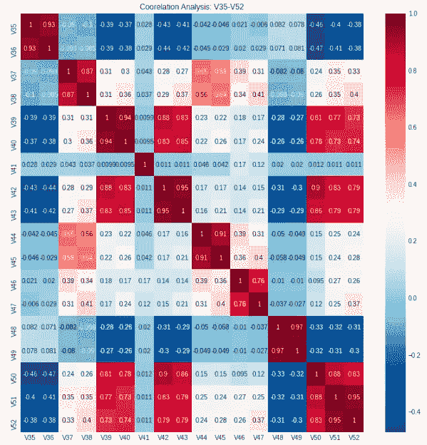

相关图

接下来，我们将根据相关性对它们进行分组。我们将相关性> 0.75 的列视为同一组。

[['V35 '，' V36']，['V37 '，' V38']，['V39 '，' V40 '，' V42 '，' V43 '，' V50 '，' V51 '，' V52']，['V41']，['V44 '，' V45']，['V46 '，' V47']，['V48 '，' V49']]

我们将使用上面的函数来减少这种情况，并以下列结束:

['V36 '，' V37 '，' V40 '，' V41 '，' V44 '，' V47 '，' V48']。

类似地，我们将对所有组都这样做，最后得到下面的 V 列。

```
['V1', 'V3', 'V4', 'V6', 'V8', 'V11', 'V13', 'V14', 'V17', 'V20','V23', 'V26', 'V27', 'V30', 'V36', 'V37', 'V40', 'V41', 'V44', 'V47', 'V48', 'V54', 'V56', 'V59','V62', 'V65', 'V67', 'V68', 'V70', 'V76', 'V78', 'V80', 'V82', 'V86', 'V88', 'V89', 'V91', 'V96','V98', 'V99', 'V104', 'V107', 'V108', 'V111', 'V115', 'V117', 'V120', 'V121', 'V123', 'V124', 'V127','V129', 'V130', 'V136', 'V138', 'V139', 'V142', 'V147', 'V156', 'V162', 'V165', 'V160', 'V166', 'V178','V176', 'V173', 'V182', 'V187', 'V203', 'V205', 'V207', 'V215', 'V169', 'V171', 'V175', 'V180', 'V185','V188', 'V198', 'V210', 'V209', 'V218', 'V223', 'V224', 'V226', 'V228', 'V229', 'V235', 'V240', 'V258','V257', 'V253', 'V252', 'V260', 'V261', 'V264', 'V266', 'V267', 'V274', 'V277', 'V220', 'V221', 'V234','V238', 'V250', 'V271', 'V294', 'V284', 'V285', 'V286', 'V291','V297', 'V303', 'V305', 'V307', 'V309', 'V310', 'V320', 'V281', 'V283', 'V289', 'V296', 'V301', 'V314', 'V332', 'V325', 'V335', 'V338']
```

减少 V 列不会降低局部验证的分数。我们在训练数据上得到 0.993 AUC，在 cv 数据上得到 0.9231。即使它将私有 LB 分数减少了 0.001，我们也能够减少 211 列，从而提高了模型的计算复杂性。因此，放弃这些特性是一个更好的方法。

## 减少 C 列和 M 列

我也试图以类似的方式减少 C 和 M 列。但是它降低了超过 0.002 AUC 的分数。所以到现在为止，我还留着。

## 工程 D 类

从卡格尔的讨论中，我了解到 D1 是信用卡开始使用的日子。从交易日中减去这一数字将使每个客户的价值几乎保持不变。我对所有的 D 级都采用了同样的方法。为了检查新创建的功能是否有用，我选择了一个向前的功能。

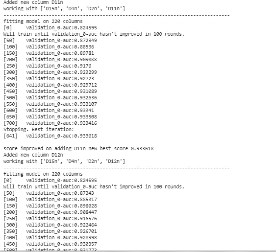

在外

**如何选择要修改的 D 列？**

*   我们知道我们的基线提供了 0.923 的 AUC。这将是我们最初的基本分数
*   在第一次迭代中，我添加了归一化的 D1，删除了原始的 D1，并创建了一个模型，并记录了测试的 AUC。现在，对从 D1 到 D15 的所有 Dcols 重复这一过程。每次记录 AUC，并选择从基线(0.923)进一步改善 AUC 的 Dcol。这个 AUC 成为我们最好的分数。
*   在下一次迭代中，包括较早的 D 列，并且对所有剩余的列以及 D1 重复步骤 1。
*   重复迭代，直到 AUC 没有改善。

最后，我们以规范化“D15”、“D4”、“D2”、“D 11”和“D10”结束。我们当地的 AUC 变成了 0.934。

## 编码功能等

接下来，我创建了以下特征:

*   星期几:交易发生的星期几
*   小时:交易发生的小时
*   美分:与交易金额相关的美分
*   LogTransactionAmt:交易金额的日志
*   P _ email _ company:P _ email _ domain 所属的公司。它是从互联网上获得的。
*   Device_corp:我根据设备信息创建了这个专栏。它基本上是从设备信息中获得的母公司详细信息。
*   小时欺诈状态:从我们在进行 EDA 时获得的图表中，我们知道每小时欺诈交易的百分比。在此基础上，我创建了 4 个类别非常低，低，中，高，这样每个小时都属于这些类别。

然后我使用 FFS，看看哪些功能可以改善结果。但是只有小时栏把分数提高到了 0.9338。正向特征选择的功能如下:

接下来，我创建了一些编码特性。在此之前，让我们熟悉以下功能。

基于这些，我创造了大约 45 个特征。

然后，我做了一个前向特征选择，并选择了那些提高模型性能的特征。结果，我得到了以下 6 个新特性

```
card4_addr1_R_emaildomain', 'card2_FE','card1_FE', 'card1_addr1_R_emaildomain', 'card3_addr1_P_emaildomain', 'card1_addr1','card4_addr1_P_emaildomain_FE'
```

这些提高了我的本地验证分数到 0.9634。

## 基于 UID 的功能

**为什么基于 UID(识别客户)的功能会起作用？**

假设我们有以下数据:

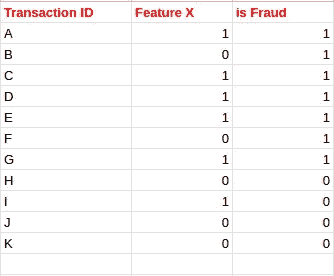

在这里，如果我们构建一个决策树，它可能如下所示

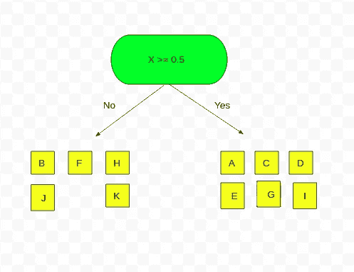

没有 UID 的决策树

在这种情况下，我们可以看到，在 11 分中，有 8 分被正确分类。假设我们可以识别个别客户。我将向你解释我如何能找到它。如果我能找到这样的 uid，我们的数据如下。

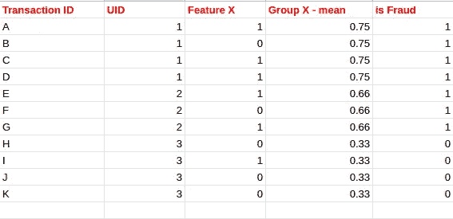

让我们从这个 uid 创建一个新的组聚合。让我们在此基础上构建一个决策树。

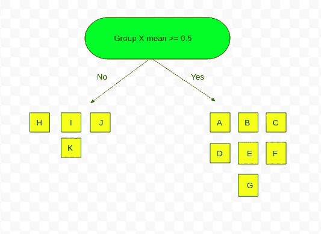

基于 uid 的决策树

我们可以看到，在这种情况下，所有 11 个点都被正确分类。即使在真实情况下这不会是准确的，但它肯定可以提高模型的性能。所以找到 uid 是提高我们分数的关键。

经过分析，我了解到 ***card1、d1 和 addr1*** 将帮助我识别客户。所以我把这三列组合起来，作为 uid。

现在，我用这个 uid 创建了几个平均值、标准偏差和几个特征的计数聚合。我使用下面的函数进行聚合。

我基于 uid 创建了大约 100 个聚合特性。但是在不同子集上进行正向特征选择之后，我最终得到了 9 个新特征。

```
'M9_uid_mean' ,  'M5_uid_mean' ,  'D2_uid_mean' ,  'D15_uid_mean' ,  'C13_uid_mean' ,  'C9_uid_mean' ,  'C1_uid_mean' ,  'C11_uid_mean' ,  'TransactionAmt_uid_std'
```

这使我的本地简历得分提高到 0.9470。来自私有 leader 板和公共 leader 板的结果分别是 0.9158 和 0.9423。

从分析来看，很明显没有一个 uid 是完美的。所以我试图通过将 card1 和 addr1 结合起来创建一个新的 uid。然后，我使用新的 uid 创建了类似的聚合，并查看哪些新特性改进了正向特性选择的结果。我总结了以下 4 个新特性:

```
'M4_uid2_mean' ,  'M1_uid2_mean' ,  'M7_uid2_mean' ,  'M8_uid2_std' 
```

这让我的本地 CV 提高到了 0.9481。此外，新的私立和公立 LB 分数分别为 0.917 和 0.940。因此，基于 UID 的特性确实有助于我们提高模型的性能。

## 超参数调整和交叉验证

这是两个重要的技术，确实提高了我的算法的性能。正如你所知道的，我们的模型在早些时候进行了调整，但是目前，已经引入了许多新功能。让我们找出符合模型的最佳参数。为此，我使用了 Sklearn 的随机搜索简历。

经过随机搜索后，我们得到了以下参数

```
n_estimators=5000,max_depth=12,learning_rate=0.002,
subsample=0.8, colsample_bytree=0.4
```

## 如何做交叉验证？

首先，我们创建了一个新列来指示交易的月份。

我们将使用以月为组的 GroupKFold 来预测 test.csv。训练数据为 2017 年 12 月、2018 年 1 月、2018 年 2 月、2018 年 3 月、2018 年 4 月、2018 年 5 月这几个月。我们把这些月份称为 12 月、13 月、14 月、15 月、16 月、17 月。Fold 将在第 13 个月到第 17 个月进行训练，并预测第 12 个月。请注意，第 12 个月的唯一目的是告诉 XGB 何时提前停止，我们实际上并不关心向后的时间预测。在第 13 到 17 个月训练的模型也将预测在时间上向前的 test.csv。

我们的代码如下所示:

最后，我们交叉验证后的本地 CV 分数变成了 0.951265。新的私有和公共 LB 分数分别变为 0.928873 和 0.954825。在 6351 家公司中，它大约排在第 226 位。(前 3.5%)。


我们在整个项目中的进展如下:

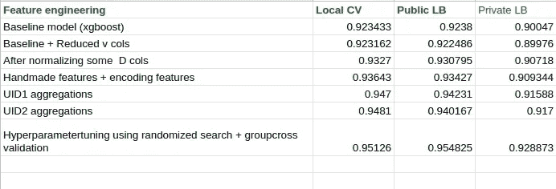

进步

你可以在 https://github.com/arunm8489/IEE-CIS-Fraud-detection 查看我的全部代码。这不是结束。尽管如此，还是有一些进步。一些我没有尝试过的方法:

*   我的全部工作都围绕着 XgBoost 算法。你可以尝试其他算法，如 Lightgbm、cat boost 等。
*   我已经根据 NaN 值的数量和皮尔逊相关系数减少了 v 列。您还可以在每个 NaN 组中尝试 PCA，看看它是否能提高性能
*   我已经应用了前向特征选择来选择重要的特征。我把它应用于不同的子集。在不同的子集上尝试会产生不同的结果。

# 参考

*   [https://www.kaggle.com/cdeotte/xgb-fraud-with-magic-0-9600](https://www.kaggle.com/cdeotte/xgb-fraud-with-magic-0-9600)
*   https://www.kaggle.com/artgor/eda-and-models
*   [https://www . ka ggle . com/ysjf 13/cis-欺诈-检测-可视化-特征-工程](https://www.kaggle.com/ysjf13/cis-fraud-detection-visualize-feature-engineering)
*   [https://www . ka ggle . com/xh lulu/IEEE-fraud-XG boost-with-GPU-fit-in-40s](https://www.kaggle.com/xhlulu/ieee-fraud-xgboost-with-gpu-fit-in-40s)