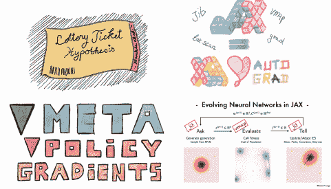

# 如果数据科学感觉像是一场斗争，你可能正走在正确的道路上

> 原文：<https://towardsdatascience.com/if-data-science-feels-like-a-struggle-you-might-just-be-on-the-right-path-e4a1e2393ae4?source=collection_archive---------26----------------------->

## [作者聚焦](https://towardsdatascience.com/tagged/author-spotlights)

## "大多数好事都伴随着些许不适。"

*在 Author Spotlight 系列中，TDS 编辑与我们社区的成员谈论他们在数据科学领域的职业道路、他们的写作以及他们的灵感来源。今天，我们很高兴与罗伯特·贾尔科·兰格进行对话。*

图片由罗伯特·兰格提供

[罗伯特](https://medium.com/u/638b9cae9933?source=post_page-----e4a1e2393ae4--------------------------------)是柏林科技大学的二年级博士生，致力于大型多智能体系统的强化学习。此前，他在伦敦帝国理工学院获得了计算机硕士学位，并在柏林爱因斯坦神经科学中心工作时涉足了认知神经科学。他还是一位多产的 TDS 作者，撰写深度学习的最新趋势和该领域的技术进步。他喜欢在一年中的任何时候狼吞虎咽地吃冰淇淋，喜欢和他心爱的(据他说，“更上镜”)四条腿的同伴一起散步。

## 你目前正在完成深度强化学习的博士学位——你能告诉我们你是如何实现这一目标的吗？

在我读经济学本科期间，我迷上了统计学和博弈论课程。他们觉得很有力量，我在图书馆花了很多时间阅读约翰·纳西和计量经济学技术。那时，我确信我可以更接近地回答最令我着迷的一个问题:*随着时间的推移，我们如何理解人类的决策？*

我喜欢蒙地卡罗模拟和斯坦伯格平衡等概念的神秘感觉。但我也知道我必须更深入，了解更多的技术细节。我决定在巴塞罗那攻读数据科学硕士学位，然后在帝国理工学院攻读另一个计算机科学硕士学位。

在那段时间里，我参加了几门计算神经科学课程，并致力于分层强化学习。一切都很有趣:认知、运动控制、变分推理和非凸优化。我费了很大劲才读完我感兴趣的所有东西。在那一点上，我知道我必须在机器学习、神经科学和集体决策的交叉点上攻读博士学位。

## 从一个学科起步，然后找到通往另一个学科的道路，这很难吗？

一开始，从经济学转型是一项精神挑战。只要我还在经济大学的泡沫中，下一步似乎就是攻读经济学博士学位。决定去巴塞罗那对我来说是一个很大的飞跃——19 岁住在国外，不会说西班牙语或加泰罗尼亚语，不认识任何人。当时德国没有类似的项目，我想推动自己。我从来没有真正回头看，并相信大多数美好的事情都伴随着一丝不适和挣扎。

然后还有所有需要克服的技术障碍。大多数本科经济学数学涉及标量值:GDP，通货膨胀，失业率。你会学到很多真实的分析，以及如何推导家庭和投资问题的一阶条件。不过，没有那么多线性代数。我记得花了几个周末在巴塞罗那图书馆自学标准工程数学(傅立叶分析、泰勒展开等)。).这同样适用于我的编程技能和基本的东西，比如通过 ssh 连接到远程机器。

我一直在挣扎，但随着我建立起直觉和知识，事情一天天变得越来越自然和容易。但我也不得不说，我有一群很棒的老师、导师和同学，他们给了我很多帮助。由于数据科学如此广泛，它吸引了一群不同的人，他们都非常了解一些东西。

## **是什么促使你开始为更广泛的读者撰写关于数据科学的文章？**

我喜欢学习，可视化概念框架，重组我的想法。写博客可以让我把所有这些东西结合在一起。一开始，出版需要一些勇气。你永远不知道——也许人们不会喜欢它。但是随着时间的推移，我开始将写作过程的大多数方面游戏化:我的许多博客文章都是从周末的业余项目开始的。我一般会有一个大概的想法，想多了解一个话题。我做了一些研究，做了笔记，编写了一些小的原型。之后，把所有的东西放到一个视觉上令人愉悦的帖子里并不需要太多时间，预期的满足感真的很激励人。

我也喜欢和那些非常关心内容的读者交流。我接触了很多很棒的人，否则我可能不会遇到他们。博客有如此多未知的外部性。接下来，你可能会因为分享你的激情而获得你梦想中的工作。

## **写博客的过程中，你最享受的是什么？**

这听起来可能很傻:我绝对喜欢为我的博客文章整理缩略图，并在我的 iPad 上绘制可视化插图。这真的很放松，也是我写作时所期待的。以下是我最喜欢的几个例子:

图片由罗伯特·兰格提供

我也喜欢记录我的成长。浏览我的第一批帖子总是让我起鸡皮疙瘩。它基本上是我从那时起的概念和想法的一个小的精神相册。有些已经改变了，有些发展成了项目，或者给我接上了新朋友。

写博客的另一个重要部分是它帮助我提高写作技巧。作为一名博士生，你写得不够多。通常，当你要结束一个项目时，你才开始用语言来表达你的想法。那不是很多经验——尤其是如果在某个时候你不得不自己写拨款申请的话。写博客帮助我学会组织我的想法，以及我写博客前所做的工作。

## 数据科学和机器学习是动态领域；在短期内，有什么你特别想看到的发展吗？

谈到我的研究领域(多智能体强化学习)，我对最近在跟踪大规模动物行为方面的革命感到非常兴奋。从零开始学习协调真的很难，因为联合行动空间在所考虑的代理数量上呈指数增长。为了在集中控制之外取得真正的进展，比如 DeepMind 的 AlphaStar 项目，我们需要找到正确的归纳偏差。

动物行为可以为我们提供很多关于什么可以促进大群体学习的见解。这包括探索鱼群的行为和社会学习任务中的信息共享。将高分辨率的集体跟踪数据纳入算法是一个真正具有挑战性和令人兴奋的前进方向。

我也希望看到更多的人分享他们对专业话题的经验和见解。就个人而言，我从没有成功的实验中学到了最多的东西——良好的超参数范围，训练非标准模型和放大事物的技巧。分享你的交易技巧是很有价值的。而且每个人都有自己知道的值得与世界分享的东西。

好奇想了解更多关于 Robert 的工作和研究兴趣？一个好的起点是他的中等身材。通过访问他的 [GitHub 页面](https://github.com/RobertTLange)，或者在 [Twitter](https://twitter.com/RobertTLange) 上找到他。以下是 Robert 最近在 TDS 上的一些亮点。

*   [2021 年 4 月要读的四篇深度学习论文](/four-deep-learning-papers-to-read-in-april-2021-77f6b0e42b9b) ( *TDS* ，2021 年 4 月)
    Rob 策划的一系列科学论文对社区来说是一项伟大的服务，让数据科学家能够与最前沿的研究保持同步。(当你在这里的时候，看看他的一些早期版本。)
*   [彩票假说:一项调查](/the-lottery-ticket-hypothesis-a-survey-d1f0f62f8884) ( *TDS* ，2020 年 6 月)
    这(非常)深入地探究了深度学习中最近最流行的概念之一，包括一个广泛的概述*和一个关于该主题的关键文章的详细文献综述*。
*   [JAX 进化中的神经网络](/evolving-neural-networks-in-jax-dda73bd7afd0) ( *TDS* ，2021 年 2 月)
    Rob 的帖子并没有止步于高层理论。这个实践教程就是一个很好的例子，向读者展示了 JAX 图书馆如何“驱动下一代可扩展的神经进化算法”
*   [iPad Pro 的机器学习工作流程](/a-machine-learning-workflow-for-the-ipad-pro-bc640eead25a) ( *TDS* ，2020 年 5 月)
    如今，先进的数据科学工作甚至机器学习研究可以在任何地方进行，包括在你的沙发上。这篇文章向我们展示了 Rob 灵活的 iPad 设置，并讨论了他最喜欢的一些应用程序。

请继续关注我们的下一位特色作者，即将推出！(如果你对你想在这个空间看到的人有建议，请在评论中给我们留言！)