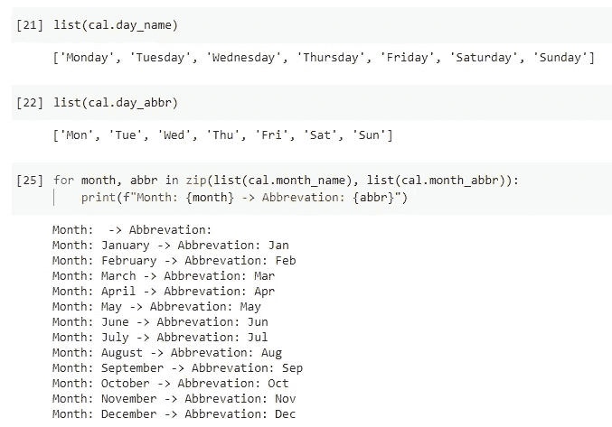
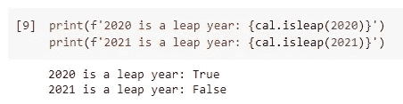
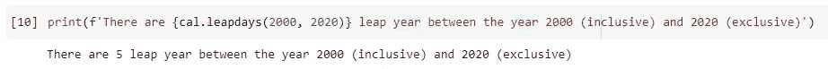
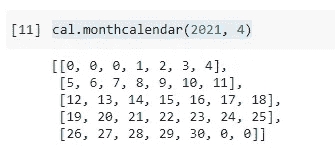
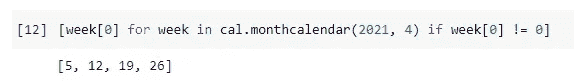
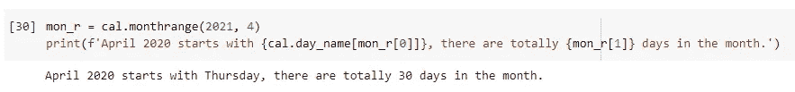
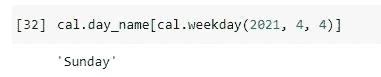
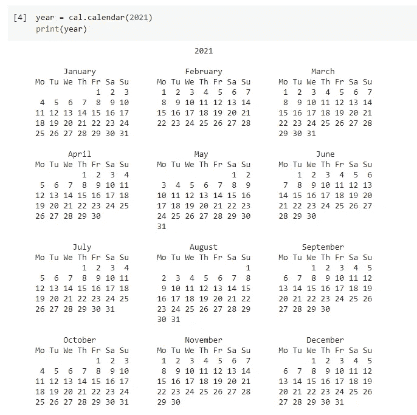
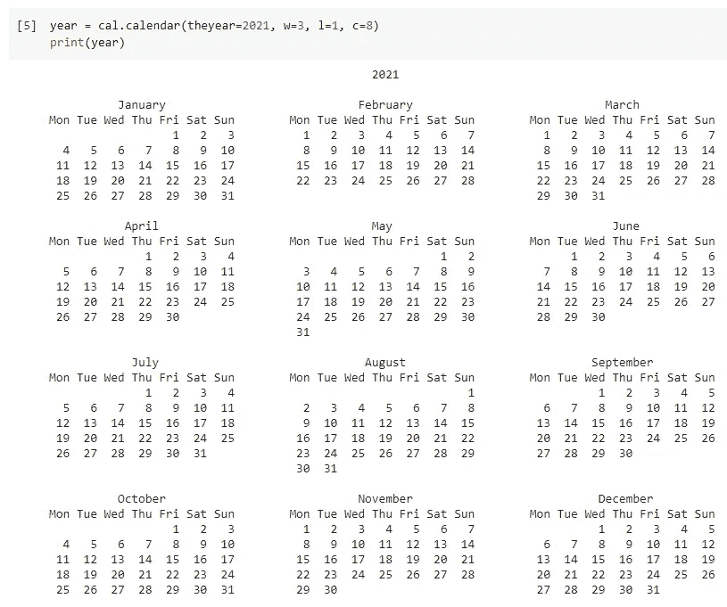
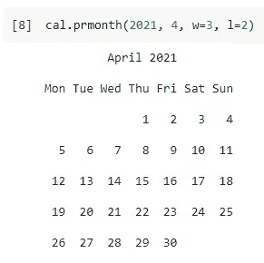

# 如果 Python DateTime 帮不上忙，试试日历模块

> 原文：<https://towardsdatascience.com/if-python-datetime-cant-help-try-calendar-module-907b6f773347?source=collection_archive---------19----------------------->


由 [MaeM](https://pixabay.com/users/maem-5698852/) 在 [Pixabay](https://pixabay.com/photos/calendar-pay-number-year-date-2428560/?download) 上拍摄的照片

## 使用 Python 中的日历库来填补 datetime 模块中的空白

如果你用过 Python 编程语言，我敢肯定你一定用过`datetime`模块，也可能你已经搞定了。的确，`datetime`模块作为一个重要的 Python 内置库，可以成为“Python”的代表之一。它的子模块`timedelta`是我最喜欢的创意之一。

[**关于 Python Timedelta 的 5 个冷知识点**](/5-cold-knowledge-points-about-python-timedelta-a791bbe4ed80)

然而，`datetime`模块在设计上有一些限制，这使得它有时不太方便。这完全没问题，因为 Python 中有大量的内置库，每个库都有自己的侧重点。在本文中，我将介绍`calendar`模块，它将填补`datetime`模块中的一些空白。

# 简单的例子


由 [valentinsimon0](https://pixabay.com/users/valentinsimon0-1187353/) 在 [Pixabay](https://pixabay.com/photos/paris-museum-orsay-clock-women-846873/) 上拍摄的照片

`datetime`模块被设计为关注基本的日期和时间对象，因此它处理“偶数”日期/时间单位，如秒、小时和天。你注意到没有“月”吗？

例如，我们有一个日期时间对象`t1`，我们想给它增加 1 天。这将非常容易，因为 1 天= 24 小时= 86400 秒，无论是哪一天。

```
t1 + timedelta(days=1)
```

但是，如果我们要给它加上 1 个月呢？有几个问题阻止我们在`datetime`模块的范围内解决这个问题。

1.  一个月中的天数是方差(28、29、30 或 31 天)
2.  “下个月的同一天”可能不存在，例如 2021 年 1 月 30 日(没有 2021 年 2 月 30 日)

因此，当我们需要解决任何与日历特别相关的问题时，`datetime`模块相当有限或不方便。在这种情况下，不要通过使用`datetime`定义日历规则来重新发明轮子，只需使用 Python 内置的`calendar`模块。

# 导入日历模块

Python 中的日历模块提供了许多功能。让我们来看看一些非常有用的典型例子。当然，我们需要先导入模块。

```
import calendar as cal
```

# 区域特定日历


由 [jarmoluk](https://pixabay.com/users/jarmoluk-143740/) 在 [Pixabay](https://pixabay.com/photos/clocks-time-idea-concept-257911/) 上拍摄的照片

当我们提到日历时，它必须伴随着地区。也就是说，不同的国家/文化/语言会有不同的定义。这一点 Python 处理的很好。语言环境信息将由操作系统决定。

使用日历模块，我们可以很容易地获得这些信息。

*   `day_name` —一周中的某一天
*   `day_abbr` —星期几的缩写
*   `month_name` —月份名称
*   `month_abbr` —月份名称的缩写

以下是列出这些数组的一些示例。



`month_name`和`month_abbr`的第一个元素为空的原因是为了方便起见。例如，我们可以通过`month_name[1]`直观地得到第 1 个月的名称，而不是使用索引 0。

现在，让我们来看看日历模块中的技巧。

# 闰年


由 [mohamed_hassan](https://pixabay.com/users/mohamed_hassan-5229782/) 在 [Pixabay](https://pixabay.com/photos/design-2019-2018-to-reach-new-year-3315253/) 上拍摄的照片

处理日历时的困难之一是确定一年是否是闰年。这就像调用一个函数并将年份作为参数传递一样简单。

```
cal.isleap(2020)
```



如果我们想知道一年中有多少个闰年，我们可以使用`leapdays()`函数。

```
cal.leapdays(2000, 2020)
```



不要被函数的名字搞糊涂了。事实上，2 月 29 日被称为闰日。所以，只有闰年才会有闰日。因此，闰年数=闰日数。

# 月历


照片由 [vkaresz72](https://pixabay.com/users/vkaresz72-2367351/) 在 [Pixabay](https://pixabay.com/photos/book-calendar-paper-1750740/) 上拍摄

通过使用函数`monthcalendar()`，我们可以得到一个包含一个月中所有日子的 2D 列表。例如，2021 年的四月看起来像这样。

```
cal.monthcalendar(2021, 4)
```



你注意到子列表保证有 7 个元素了吗？是的，对于每个子列表，索引代表一周中的某一天。也就是说，索引 0 表示星期一，索引 6 表示星期日(默认情况下)。

## **这为什么有用？**

我给你举个例子。你能列出 2021 年 4 月的所有星期一吗？

```
[week[0] for week in cal.monthcalendar(2021, 4) if week[0] != 0]
```



这个月历会有更多创造性的使用方式。你自己去找就行了:)

# 月份范围和星期几查询


照片由 [Amber_Avalona](https://pixabay.com/users/amber_avalona-1512238/) 在 [Pixabay](https://pixabay.com/photos/january-calendar-month-year-day-2290045/) 上拍摄

另一个简单但有用的函数是`monthrange()`函数。给定某个月，它将返回一个元组

1.  一个月的第一天是星期几
2.  一个月的总天数

例如，我们可以通过简单地调用`cal.monthrange(2021, 4)`来获得 2021 年 4 月的上述信息。



我们还可以通过调用如下的`weekday()`函数来查询某一天是星期几。

```
cal.weekday(2021, 4, 4)
```

如果我们想把它转换成可读性更强的东西，只需使用 locale 数组。

```
cal.day_name[cal.weekday(2021, 4, 4)]
```



# 显示日历


[tiger ly 713](https://pixabay.com/users/tigerlily713-194784/)在 [Pixabay](https://pixabay.com/photos/calendar-date-time-month-week-660670/) 拍摄的照片

我们甚至可以使用日历模块用 Python 打印一个“日历”。这极其简单。我们只需要调用`calendar()`函数并如下传入年份。

```
year = cal.calendar(2021)
print(year)
```



我们还可以通过三个参数来控制这个日历的显示风格

*   `c`:月份之间的填充
*   `w`:天与天之间的填充
*   `l`:周(行)之间的填充

```
year = cal.calendar(theyear=2021, w=3, l=1, c=8)
print(year)
```



我们也可以显示特定月份的日历，而不是显示一整年的日历。参数完全一样。

```
cal.prmonth(2021, 4, w=3, l=2)
```



# 摘要


由 [kaboompics](https://pixabay.com/users/kaboompics-1013994/) 在 [Pixabay](https://pixabay.com/photos/organizer-calendar-schedule-791939/) 拍摄的照片

在本文中，我介绍了 Python 内置的`calendar`模块。大多数时候我们可以使用`datetime`模块来解决任何与日期或时间相关的问题。当涉及到日历时，`datetime`模块可能会遇到它的不足，因为它不是为这类问题设计的。

当我们处理一些特定的日历问题时，例如闰年，日历模块非常方便。通过使用这样的内置模块，Python 中的开发会更快！

[](https://medium.com/@qiuyujx/membership) [## 通过我的推荐链接加入 Medium 克里斯托弗·陶

### 作为一个媒体会员，你的会员费的一部分会给你阅读的作家，你可以完全接触到每一个故事…

medium.com](https://medium.com/@qiuyujx/membership) 

如果你觉得我的文章有帮助，请考虑加入 Medium 会员来支持我和数以千计的其他作者！(点击上面的链接)