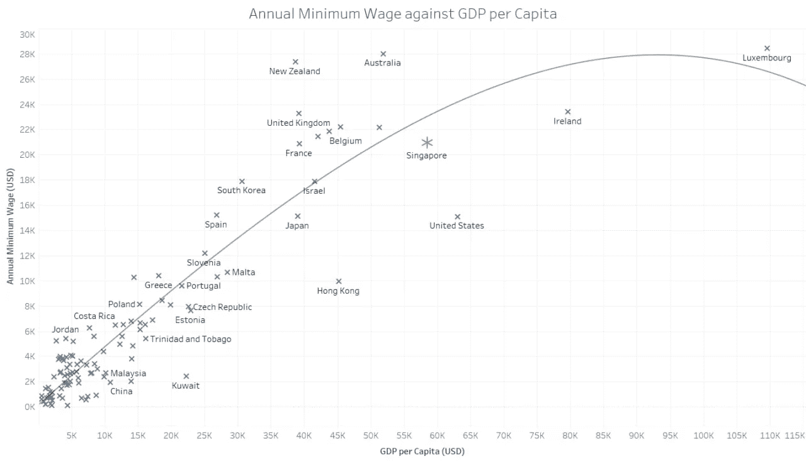

# 如果新加坡有最低工资，会是多少？

> 原文：<https://towardsdatascience.com/if-singapore-had-a-minimum-wage-what-could-it-be-afdcd3819cf2?source=collection_archive---------12----------------------->


迈克尔·朗米尔在 [Unsplash](https://unsplash.com/s/photos/piggy-bank?utm_source=unsplash&utm_medium=referral&utm_content=creditCopyText) 上的照片

## 使用机器学习回归模型预测新加坡的最低工资

新加坡政府没有规定新加坡所有工人的最低工资，无论是本地工人还是外籍工人。[人力部(MOM)](https://www.mom.gov.sg/faq/work-permit-for-foreign-worker/is-there-a-prescribed-minimum-wage-for-foreign-workers-in-singapore#:~:text=salary%2C%20annual%20leave-,Is%20there%20a%20prescribed%20minimum%20wage%20for%20foreign%20workers%20in,demand%20and%20supply%20for%20labour) 的官方立场是，由市场需求和劳动力供给决定的有竞争力的薪酬结构将有助于公司激励员工努力工作。精英管理的价值观根植于新加坡文化，这使得妈妈的这一立场不足为奇。

2018 年，根据减少贫富不平等的努力，新加坡在 157 个国家的乐施会指数中排名第 149 位。乐施会认为，没有最低工资是新加坡出现这种社会经济差距的原因之一。许多人就官方最低工资是否有必要减少不平等展开了辩论。

尽管公众认为需要最低工资来保护最弱势群体，但新加坡政府一直坚决避免最低工资政策。人力资源部部长 Josephine Teo 女士解释说，最低工资政策“没有充分利用不同部门的资源”。相反，新加坡采用的累进工资模式(PWM)鼓励工人提高技能或承担更多责任，以“提升工资”。

2020 年大选使反对党的宣言浮出水面，这些宣言强调新加坡需要最低工资。新加坡主要反对党工人党(Workers Party)提议，将全职工人的最低月工资定为 1300 美元，这是一个四口之家购买生活必需品所需的最低工资。这不是第一次提出这样的建议。反对新加坡最低工资政策的经济学家坚持认为，最低工资基准将违背新加坡精英管理的理想，因为无论工人的能力如何，他们都将得到最低工资的保证。经济学家还认为，如果最低工资过高，低技能工作有被自动化的风险。几十年来，公众、经济学家和政治代表参与了这场辩论，并将继续为此作出贡献。

我们不是经济学家，我们的目标不是说服你新加坡是否需要最低工资。然而，我们对这一主题感兴趣，因为最低工资影响到社会中最弱势的群体，即普遍未受教育或患有精神或身体残疾的人。已故的新加坡前总理李光耀先生坚定地认为，新加坡需要通过奖励成功来实行精英制度。新加坡人不得不努力工作，因为这个体系容不下任何人。虽然精英制度使新加坡以惊人的速度发展，但它也滋生了人们为什么“不成功”和贫穷的错误假设。“懒惰”和“无能”是经常用来形容那些贫困的人的词。然而，现实情况是，由于他们自己的行为，他们中的很大一部分人甚至可能没有这样的地位，贫困是一个循环，一个极难摆脱的循环。

在我们讨论新加坡人如何打破贫困循环之前，我们需要了解它的定义:一个人或一个社区缺乏维持最低生活水平的财政资源和必需品的状况。工资是决定一个人是否生活在贫困线以下的重要因素。如果一个人挣的钱不够买生活必需品，他或她就生活在贫困中。如果你对低工资工人在新加坡生存所需的全面分析感兴趣，请考虑阅读由[什么够了](https://whatsenough.sg/key-findings/)撰写的完整报告。

我们决定使用机器学习回归模型，因为这是一种描述一组变量之间关系的简单而有效的方法。回归分析产生了一个数学方程，使我们能够根据其他社会经济因素预测新加坡的最低工资。我们从 [100 个国家](https://en.wikipedia.org/wiki/List_of_countries_by_minimum_wage)收集数据，包括年度名义最低工资、每周工作时间、人均 GDP、[生活成本指数](https://www.numbeo.com/cost-of-living/rankings_by_country.jsp)和[生活质量指数](https://www.numbeo.com/quality-of-life/rankings_by_country.jsp)的得分，后者衡量稳定性、权利、健康、气候、受欢迎程度、安全性和成本。不同国家的值将用于创建回归模型，以根据除年度名义最低工资之外的所有其他变量来预测新加坡的最低工资。我们承认，世界各地的最低工资只是基于立法，通常不足以理解低工资收入阶层的公民将支付哪些必需品。

我们选择了以下变量，因为它们是衡量一个国家总体福祉的通用指标，并且在不同国家之间是标准化的和可比较的，这使得在回归模型中使用预测成为可能。除了生活成本指数和生活质量指数可能不被全球认可之外，其他指标几乎不需要向公众解释。我们选择使用生活成本指数而不是名义平均生活成本，因为该指数更好地反映了购买必需品的成本。生活质量也包括在内，因为每个社会经济因素的个人得分可以直接比较。也就是说，也很有可能探索衡量社会经济因素的其他指标。

导入了以下库来处理数据集并创建回归分析模型:

```
## importing all librariesimport pandas as pdfrom sklearn.linear_model import LinearRegressionfrom sklearn import metricsfrom sklearn.model_selection import train_test_splitimport numpy as np
```

将除新加坡以外的所有国家的变量整理成 CSV 文件后，该文件被加载到 Pandas 数据框中:

```
## loading the data setdata = pd.read_csv('training.csv')sample_size = data.shape[0]print("File has been successfully read.")print("Sample size: ", sample_size)print("Excerpt of data: ")print(data.head)
```

为了构建回归模型，工作周(小时)、人均国内生产总值、生活成本指数、稳定性、权利、健康、安全、气候、成本、受欢迎程度被用作输入值(x ),而年度名义值(美元)是𝐗𝐰=𝐲.方程中的输出值(y)w 是计算 X 和 y 的线性模型:

```
## fitting the data into a modelx_columns = ["Workweek (hours)", "GDP per capita", "Cost of Living Index", "Stability",  "Rights", "Health", "Safety", "Climate", "Costs", "Popularity"]x = data[x_columns]y = data["Annual Nominal (US$)"]linear_model = LinearRegression()linear_model.fit(x, y)
```

然后，新加坡的工作周(小时)、人均 GDP、生活成本指数、稳定性、权利、健康、安全、气候、成本、受欢迎程度被用作测试数据中的 x 值。预测的 y 值是预测的新加坡最低工资:

```
## predicting Singapore's minimum wagesg_data = pd.read_csv('testing.csv')x_test = sg_data[x_columns]print(x_test)y_pred = linear_model.predict(x_test)print(y_pred)
```

新加坡预计的年最低工资为 20，927.50 美元，与其他国家相比，是最低工资较高的国家之一。这相当于每月 1，743.96 美元或 2323.65 新加坡元。这仍然大大高于新加坡最低工资工作的最低工资。

[根据累进工资模式的最低工资](https://blog.moneysmart.sg/career/singapore-minimum-wage-pwm/):

普通清洁剂——1236 美元

桌面清洁剂——1339 美元

洗碗机/垃圾收集器——1442 美元

多技能清洁工/机器操作员——1648 美元

主管——1854 美元

[国际博客](https://www.internations.org/go/moving-to-singapore/living/the-cost-of-living-in-singapore#:~:text=Living%20in%20Singapore-,The%20Cost%20of%20Living%20in%20Singapore,(3%2C200%20USD)%20a%20month)估计，新加坡不包括房租在内的个人平均生活成本约为每月 800 新元，一个四口之家的平均生活成本约为每月 4400 新元。随着房租的增加，父母收入低的家庭可能会陷入困境。

为了比较新加坡和其他国家的年最低工资，我们决定在 Tableau 中绘制年最低工资和人均 GDP 以及年最低工资和生活成本指数的图表。下面的比较是专门进行的，因为它们涉及该国的经济表现和必需品的成本。



绘制年度最低工资和人均国内生产总值的图表，趋势似乎符合所反映的国家数值范围之间的二次曲线。模型有可能过度拟合数据以适应爱尔兰和卢森堡的情况，可以使用对数图来代替。在图表的左下角，年最低工资和人均国内生产总值之间似乎存在弱到中等的线性相关性。虽然图表右上角的点数不足以对人均 GDP 较高的国家的年最低工资趋势得出更明确的结论，但令人不安的是，年最低工资似乎停滞不前，甚至有所下降。

人均 GDP 是一个国家一年生产的商品和服务的最终价值除以该国的人口数量。虽然人均国内生产总值是通过个人产出来衡量一个国家经济表现的指标，并经常用来衡量一个国家的生活水平，但它不是衡量个人收入的指标。这是因为国家经济增长带来的财富平均分配的假设并不成立。也就是说，比较每个国家的数值仍然是公平的，因为我们很想知道人均 GDP 的提高是否意味着工人收入的增加。

新加坡的人均 GDP 很高，预计最低年薪也很高。新加坡似乎适度接近图表上的趋势线，但是如果将所列职业的任何 PWM 工资下限转换为年薪，并绘制在图表上作为近似的最低工资，新加坡的数据点将明显低于趋势线。


在绘制年度最低工资和生活费用指数图时，这一趋势似乎适度地遵循所反映的各国数值范围之间的指数曲线。这意味着随着每个国家生活成本的增加，预计年度最低工资将以更快的速度增长。生活费用指数以美国纽约为基准地区，衡量不同国家的生活必需品费用，以供参考。虽然指数值的增加反映了一个生活成本高的国家，但一个国家可能有必要大幅提高最低工资，因为每一项必需品的成本都在增加，这使得一个人靠低工资生存变得更加困难。

新加坡的生活成本指数也很高，预计年最低工资也很高。新加坡看起来接近图表上的趋势线，但与上面的情况类似，如果所列职业的任何 PWM 工资下限被转换为年薪，并作为近似的最低工资绘制在图表上，则新加坡的数据点将低于趋势线。尽管生活在一个生活成本很高的国家，但工资最低的工人的收入却低于预期。这就引出了一个问题，新加坡工资最低的工人工资够吗？

数字和统计数据给了我们新加坡最低工资的预测，但除此之外，我们谈论的是对成千上万个人的影响。可能还没有一个完美的解决方案，但总有进行有意义讨论的空间。

*   与 Ryan Kwok 合作撰写
*   【https://en . Wikipedia . org/wiki/List _ of _ countries _ by _ minimum _ wage
    [https://www . worldometers . info/world-population/population-by-country/](https://www.worldometers.info/world-population/population-by-country/)
    [https://www.worlddata.info/cost-of-living.php](https://www.worlddata.info/cost-of-living.php)
    [https://www.worlddata.info/quality-of-life.php](https://www.worlddata.info/quality-of-life.php)