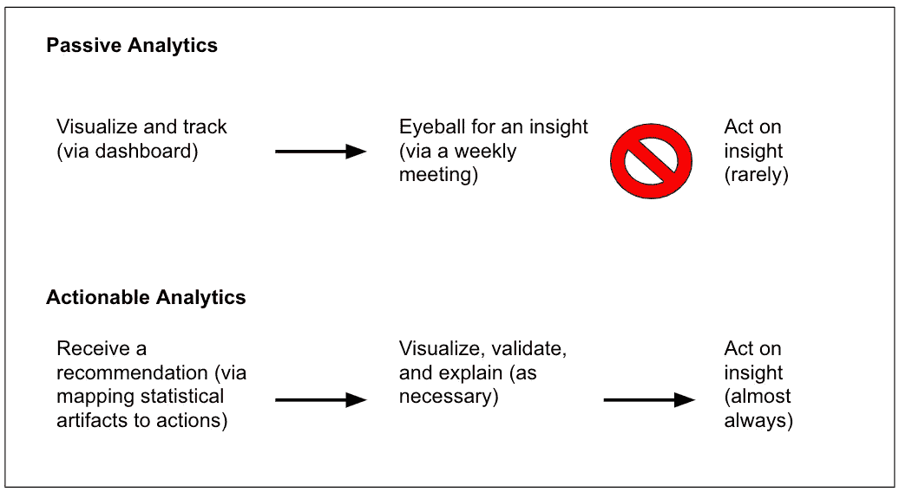
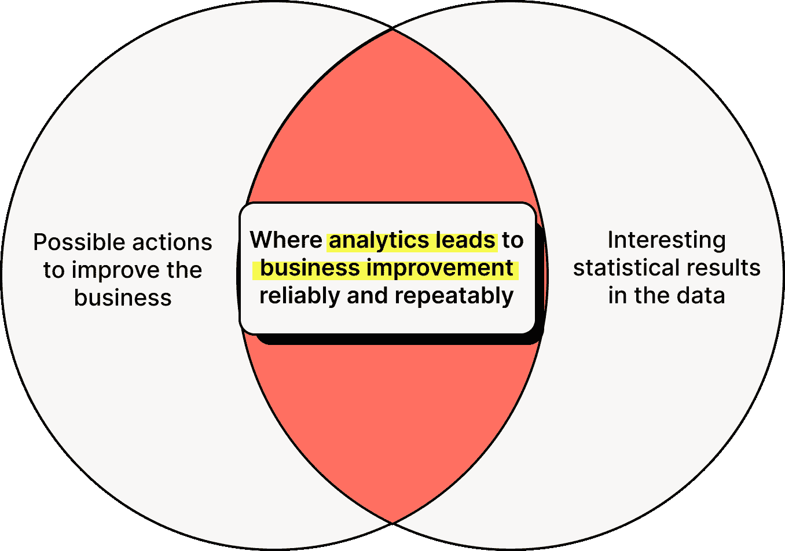

# "如果你想把松饼放在烤箱里久一点，就告诉我"

> 原文：<https://towardsdatascience.com/if-you-wanted-to-leave-the-muffins-in-the-oven-for-longer-just-tell-me-key-shifts-to-making-99599f727694?source=collection_archive---------42----------------------->

## 使分析可行的关键转变

作者图片

向云计算和分析的转移正在创造一个世界，在这个世界中，数据集的每一个可能的切割和聚合都可以自动完成。问题在于，虽然分析引擎可以无限扩展，但人类的注意力却不能。

有数百种可能的模型可以应用，并且每种模型都有无限可能的见解，从统计结果到明确的行动建议的过程是痛苦的、模糊的，并且缺乏传递见解的共同语言。最终，即使是精确度最高的模型也会遭遇反对——“我该拿这个怎么办？”

今天，分析师和商业领袖经常通过眯着眼睛看无数的图表和可视化来做决定，在寻找有用的见解中目测趋势。不幸的是，许多这些假设的洞察力很难被业务理解，并且由于不可解释性、与利益相关者无关或简单的不信任，大多数从未被付诸行动。

在 Sisu，我们看到顶级数据团队通过将这些观察结果与对**如何将统计结果映射到具体行动的清晰理解相结合来解决这一差距。**他们有效地建立了一个共同点，并以此推动对话。

当数据与行动联系在一起时，分析师可以提出行动建议，然后使用可视化作为补充机制来验证调查结果。要让更多的团队开启这种以行动为导向的分析风格，需要发生三个关键转变。

# **通过行动计划从数字转向建议**

在许多组织中，分析师和业务运营者之间通常存在脱节。分析师呈现一张又一张的时间趋势图和条形图，常常让操作员不清楚如何应对，甚至不知道应该考虑什么样的应对措施。

在上海外国语大学，我们在与一家大型特许经营餐厅合作时亲眼目睹了这个问题。在分析方面的投资使得每周通过电子邮件向经理报告关键的单个商店指标成为可能。一份特别的电子邮件报告详细描述了一家特定餐厅烘焙食品热度的周比周 CSAT 下降超过两个标准差。

也许这对于分析师来说很容易理解，但对于餐厅经理来说却是胡言乱语。没有人将这一事实转化为明确的建议。一位餐厅经理对看着一墙的数字并被期望据此采取行动感到恼火，他大声说道:“如果你想让我把松饼放在烤箱里更久，就告诉我！”分析团队跳过了将统计术语翻译成餐厅经理可以理解的清晰简洁的建议，让经理自己得出结论或完全忽略这一发现。

这种挫败感清楚地表明，虽然分析师可能会发现一个关键的统计结果，但在成为对业务有价值的东西之前，还有很长的路要走。**关键是通过深入了解运营商推动业务发展的手段，将这些统计结果转化为可行且易懂的建议。然后，就很容易解释像烘焙食品热度的每周 CSAT 变化这样的数据如何映射到像将烘焙食品在烤箱中放置更长时间这样的行为上。**

虽然许多统计结果可能没有相应的动作，反之亦然，但是在动作和数据有规律的和可重复的交集的地方有巨大的机会。即使在原型形式中，这种将某些统计结果映射为明确行动的“[智能行动板](https://www.mckinsey.com/business-functions/operations/our-insights/intelligent-actionboards-stop-staring-at-dashboards-and-start-getting-things-done)”已经在它们实现的任何地方产生了广泛的商业收益。在上面的研究中，麦肯锡测量了一家拉丁美洲电信公司如何实施这种行动图，从而使生产率提高了 18%。

# **从高层次的见解转向使用数据来触发行动**

作者图片

随着像 Segment 和 mParticle 这样的 CDP 以及像 [Census](http://getcensus.com) 这样帮助将数据从仓库传输回运营系统的工具的不断增加，我们看到了一组数量不多但迅速扩大的用例，其中可操作的见解将被使用数据触发行动所取代。

使用数据触发行动的最简单的用例是，当自动分析表明有问题时，发出精确的警报或电子邮件。例如，当页面加载时间超过阈值时，Devops 工具可以提醒开发人员和产品经理团队。传呼机值班警报是将数据表中的一些事件转化为简洁有效的行动的很好的例子。

简单、精确的警报有机会传播到更多的业务用例，而且还有工具来帮助通知后的步骤。例如，对于业务用例，CDP 可以共享推荐的消息和目标细分市场，供电子邮件营销人员在活动中使用，而不仅仅是通知电子邮件营销人员高度参与的细分市场。

我们仍然相信，员工，而不是机器，将是执行最终操作的人。这是因为最终，员工将对发送出去的营销邮件负责，无论是积极的还是消极的后果。在大多数情况下，人会想要回顾并拥有最终的发言权。

但是推荐员工可以采取的不同行动将加速数据驱动的行动。例如，在上面的 devops 用例中，开发人员可以在分析平台中看到一组按钮，这些按钮对应于可以用来解决问题的不同操作。

# **将分析从拉式改为推式**

仪表板和高管携手并进。这些业务利益相关者需要分析团队为他们构建一个业务中关键指标如何变化的鸟瞰图，以做出明智的决策并指导执行。虽然仪表板使利益相关者一眼就能获得洞察力，但它们很少推动行动，最终，它们甚至不会被检查，因为仪表板的有用性随着时间的推移而衰减。

尽管如此，在大大小小的组织中，我们几乎每周都会看到 10 多人参加的一两个小时的圆桌会议(《每周商业评论》,或 WBR ),在会议中，业务利益相关者和分析师盯着一个或多个仪表板审查他们的年度指标，并提出一些无法回答的问题，如“为什么销售额下降”或“为什么转换率发生了变化”。有高管和副总裁参加，还要准备几个小时，这些会议是业内最昂贵的。通过我们的采访，结论几乎是一致的——这些评论的效率低得令人痛苦，因为 WBR 的对话围绕着趋势的高层次变化，而不是任何人实际可以做些什么来应对。一位移动平台运营商强调，“这是我们做的最痛苦的事情，每个人离开时都有点沮丧。”

在创新型公司中，我们看到分析从每周一次的 WBR“拉动”模式转向更多的推动模式，在这种模式下，数据近乎连续地推动一线行动。洞察力和行动建议被推送给小型灵活的分析师和操作员团队。分析师深入挖掘并验证这些见解，而操作员则根据其控制范围采取行动。

随着越来越多的商业用户得到人工智能和前所未有的洞察力的支持，未来的“每周商业评论”将让运营商和分析师展示他们做了什么，甚至是他们选择了哪个行动建议，而不是浪费时间绞尽脑汁地解释 KPI 上升或下降的原因。

# **引入未来的商业智能**

我们期待更容易理解的商业智能，关注可操作性和及时性。

作为第一步，我们希望引入统计结果和计算与企业可能采取的具体行动之间的清晰映射。如果数据暗示烘焙食品需要在烤箱中放置更长时间，参考我们之前的餐厅经理的例子，那么这应该是可交付的，而不是一组图表和图形。

有了这种映射，我们将看到数据中的统计结果转化为行动的效率越来越高。这不是高层次的洞察力，而是数据触发行动的一种方式。也许这从给线路操作员一个精确的警告开始。但是工具也有巨大的机会来帮助完成通知后的步骤。

最后，分析的重心将转向数据仓库、分析系统和一线业务运营商之间的异步、不间断交换。高管业务审查仍将存在，但不是花时间挖掘数据来找出该做什么，而是可以自动提供见解，大多数会议时间将用于权衡每项建议的成本/收益。

在 [Sisu Data](http://sisudata.com) ，我们期待与客户和合作伙伴共同实现这一愿景。