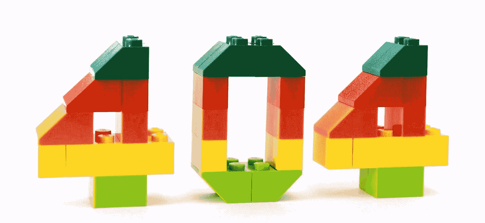
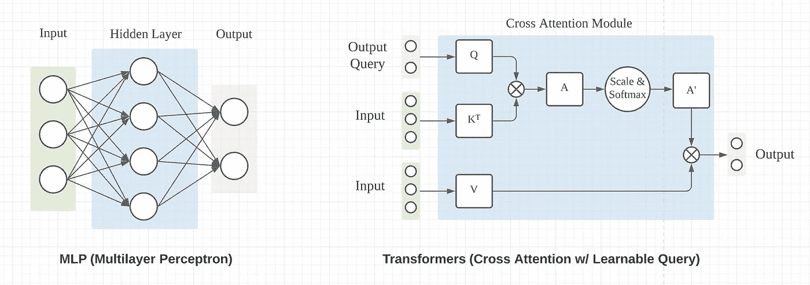
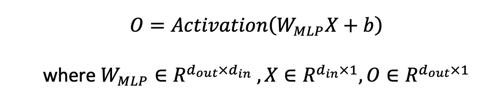
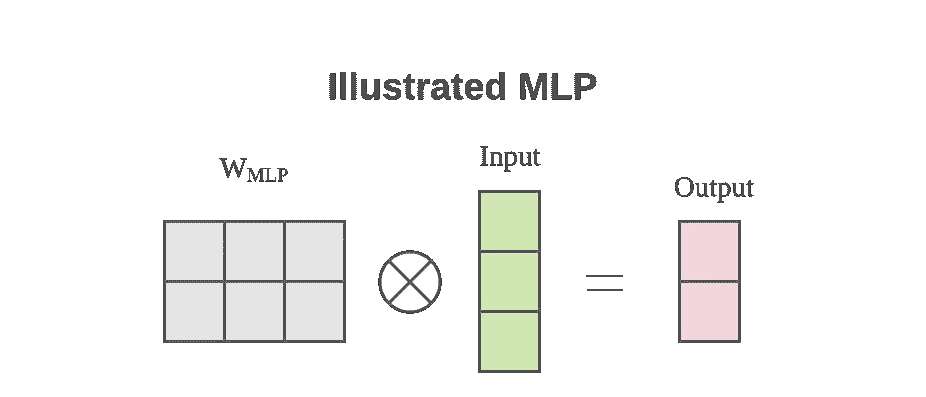
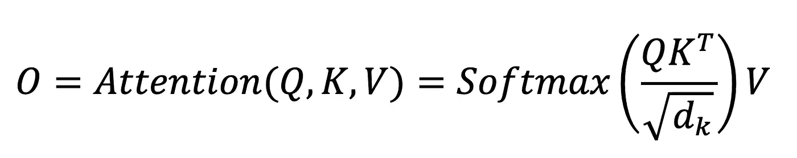
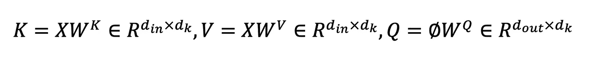
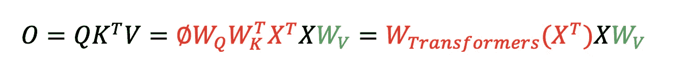
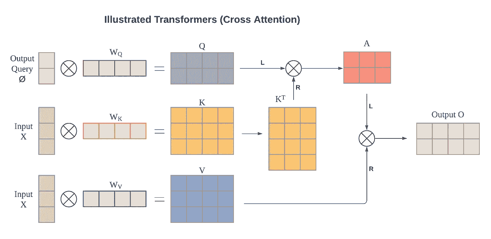
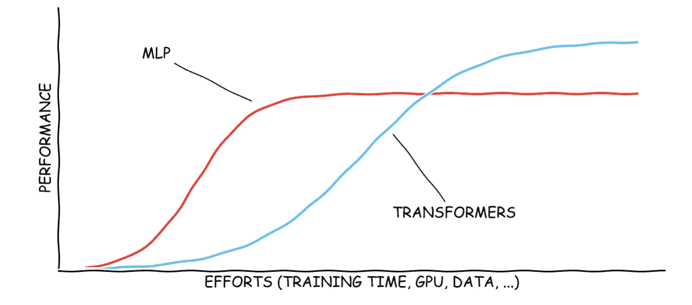
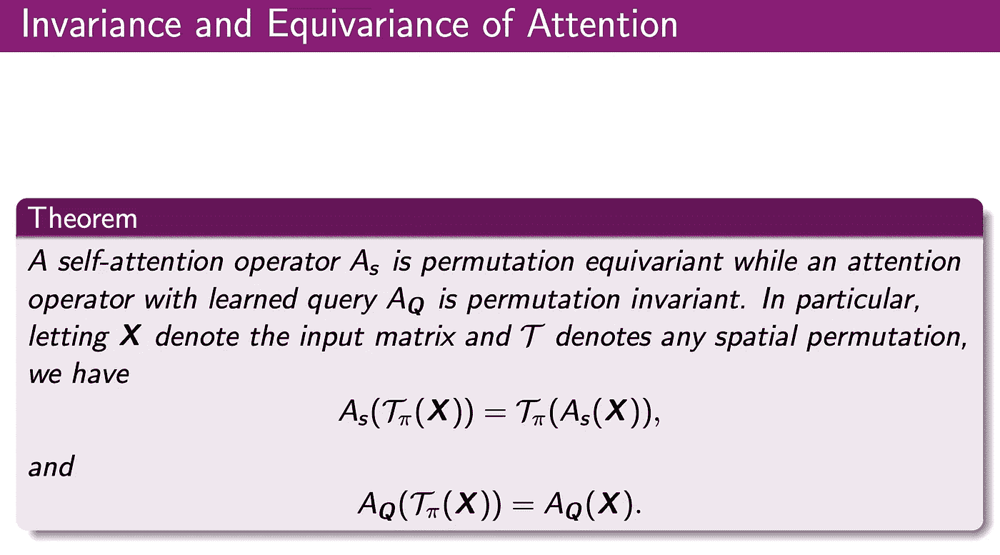

# 深度学习中张量整形的 MLP 和变压器之间的图示差异

> 原文：<https://towardsdatascience.com/illustrated-difference-between-mlp-and-transformers-for-tensor-reshaping-52569edaf89?source=collection_archive---------3----------------------->

## [思想和理论](https://towardsdatascience.com/tagged/thoughts-and-theory)

## 深入探究数学细节，并附有插图。

在设计神经网络时，我们经常面临张量整形的需要。张量的空间形状必须随着某一层而改变，以便能够适合下游的层。就像顶部和底部表面形状不同的特殊楔形乐高积木一样，我们也需要一些神经网络中的适配块。

你为你的神经网络找到合适的形状了吗？图片来源:[安德鲁·马丁](https://pixabay.com/users/aitoff-388338/?utm_source=link-attribution&utm_medium=referral&utm_campaign=image&utm_content=2129569)来自 [Pixabay](https://pixabay.com/)

改变张量形状最常见的方法是通过汇集或步长卷积(非单位步长卷积)。例如，在计算机视觉中，我们可以使用池化或步长卷积将输入形状的空间维度从 H x W 变为 H/2 x W/2，甚至变为不对称的 H/4 x W/8。然而，为了涵盖简单缩放之外的更复杂的转换，例如执行单应性，我们需要更灵活的东西。**多层感知器(MLP)** 或**变形金刚(带交叉注意力)**是两种现成的解决方案。

> 计算机视觉中使用的神经网络张量一般具有 NxHxWxC 的“形状”(批次、高度、宽度、通道)。这里，我们将关注空间范围 H 和 W 中的形状变化，为了简单起见，忽略批次维度 N，并保持特征通道维度 C 不变。我们将把 HxW 笼统地称为张量的“形状”或“空间维度”。
> 
> 在 pytorch 和许多其他深度学习库的标准术语中，“整形”不会改变张量中的元素总数。在这里，我们在更广泛的意义上使用单词 reshape，张量中元素的数量可以改变。

# 如何用 MLP 和变形金刚重塑张量？

MLP 和变形金刚有相似的输入和输出接口，如果我们忽略内部处理的详细机制(通过 MLP 中的隐藏层和变形金刚中的交叉注意模块)，如下图所示。

张量整形的 MLP 与变压器的相似界面(图表由作者制作)

使用 MLP 来改变输入张量的形状是相对简单的。对于只有一个全连接层的最简单形式的 MLP，从输入 X 到输出 O 的映射如下。

如果我们在这里忽略激活函数和偏差 b，那么本质是一个矩阵乘法，并且整形过程完全被权重矩阵 w 捕获。张量整形可以通过用 w 对**左乘**来实现。

MLP 的核心运算是带学习矩阵 W 的 matmul(作者制作的图表)

> 注意，我们在上面隐含地假设特征通道维数 C=1，并且张量格式是 HWxC，并且批次维数被忽略。这样，我们必须乘以输入左侧的 W 矩阵来改变空间形状。

按照最初的变压器公式，我们有以下映射。

对于交叉注意模块，在上面的等式中，K 和 V 是线性投影的输入 X，Q 是线性投影的输出查询。输出查询具有与输出 o 相同的空间形状。Q、K 和 V 具有以下形状。

与投影矩阵 W 相乘的目标是将输入 X 和输出查询提升到相同的特征维度。请注意，这里使用了**右乘**，这是一个与上述 MLP 中的整形操作不同的操作。如果我们忽略比例因子和 Softmax 激活函数，我们有以下等式。

《变形金刚》中图解的交叉注意机制(图表由作者制作)

> 自我注意机制是原变形金刚论文进行特征提取的亮点。然而，自我关注保持原始的输入形状，因为输出查询也是自我关注模块中的输入 X。为了对输入张量进行整形，必须使用具有不同形状(期望的输出形状)的输出查询。

与 MLP 相比，我们有非常相似的公式，两者都将输入与学习的加权矩阵 W 左乘，以实现形状改变。然而，有两个不同之处。

*   输出 O 经过一次额外的线性投影，将特征通道从输入 1 提升到输出 d_k。
*   变压器中的 W 矩阵取决于输入 x。

第一个差异相对较小，我们可以用一个额外的线性投影来匹配 MLP，以改变特征通道。然而，第二个有一些重要的含义。我们将深入探讨 MLP 和变形金刚的两种加权矩阵之间的差异。

# 区别 1:数据依赖性

MLP 学习的 w 矩阵不依赖于输入数据，而变压器的 w 矩阵依赖于输入数据。一旦在训练期间学习，MLP 的加权矩阵在推断期间是固定的。对于变压器，加权矩阵的数据依赖性可以被视为一种动态加权，使其自身适应不同的输入。类似的讨论也可以在 [StackOverflow](https://stackoverflow.com/a/64218982) 上找到。

这可能会让变形金刚更有表现力，但也会让变形金刚比 MLP 更难训练。具体地，对于固定的视图变换(例如[逆透视映射(IPM)](/monocular-birds-eye-view-semantic-segmentation-for-autonomous-driving-ee2f771afb59) 或其他类型的单应)，MLP 本质上只是学习输入和输出之间的固定映射。对于变压器，额外的输入数据可能会阻碍模型的初始收敛。在实现卓越性能之前，可能需要在 GPU、数据和训练时间方面做出巨大努力，才能达到与 MLP 的盈亏平衡点。

对《变形金刚》和《MLP》的投资回报率的过分简单化的看法(图表由作者绘制)

# 差异 2:对输入顺序的不变性

对于 MLP，输入和输出的顺序编码在矩阵 w 中。每行和每列对应于输入和输出形状的权重。MLP 不需要位置编码来帮助索引输入和输出。

另一方面，Transformers 中的交叉注意模块对输入顺序是不变的。再看一下交叉注意的等式

如果 x 沿着空间形状维度进行某种排列，红色部分$X^T X$将保持不变，因此输出也保持不变。从另一个角度来看，K 和 V 是一个字典的键值对，字典中的顺序并不重要，只要键值映射保持不变。交叉注意机制建立在查询和关键字之间的相似性上，而不是在位置上。

> 对于自我注意，其中输出查询φ= X，那么 O 的顺序也经历与输入 X 相同的排列，数学上，自我注意是**排列等变**，而交叉注意是**排列不变**。

关于注意力的等变和不变的数学陈述([来源](http://people.tamu.edu/~sji/classes/attn-slides.pdf)

注意机制不对位置信息进行编码的事实也正是位置编码(PE)对于顺序很重要的应用程序索引输入是必要的原因。具体来说，在 NLP 应用中，“猫追狗”和“狗追猫”会导致词对之间完全相同的注意力，这显然是有问题的。

上述交叉注意机制也常用于图形神经网络(GNNs)。它允许网络在训练期间从所有输入实例中捕获共同特征，因为查询独立于输入并且由所有输入实例共享。这里有一条来自 GNN 先驱之一的推文，Thomas Kipf 评论自我关注模块的排列等变。

# 用于 BEV 感知的张量整形

我写了一篇新的博客，是关于在自动驾驶中使用交叉注意力对 BEV 感知进行张量整形的应用。有关更多详情，请参考下面的链接。

[https://towards data science . com/monoclem-bev-perception-with transformers-in-autonomous-driving-c41e4a 893944](/monocular-bev-perception-with-transformers-in-autonomous-driving-c41e4a893944)

# 外卖食品

*   MLP 和变形金刚(交叉注意力)都可以用于张量整形。
*   MLP 学到的整形机制不依赖于数据，而变形金刚的机制依赖于数据。这种数据依赖性使得变压器更难训练，但可能有更高的性能上限。
*   注意力不对位置信息进行编码。自我注意是置换等变的，而交叉注意是置换不变的。MLP 对排列非常敏感，一个随机的排列可能会完全破坏 MLP 结果。

# 参考

*   [注意力是你所需要的全部](https://arxiv.org/abs/1706.03762)，NeurIPS 2017
*   [《变形金刚中注意的数学性质》](http://people.tamu.edu/~sji/classes/attn-slides.pdf)，教授纪的课堂笔记，