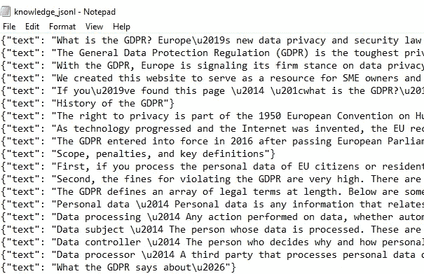
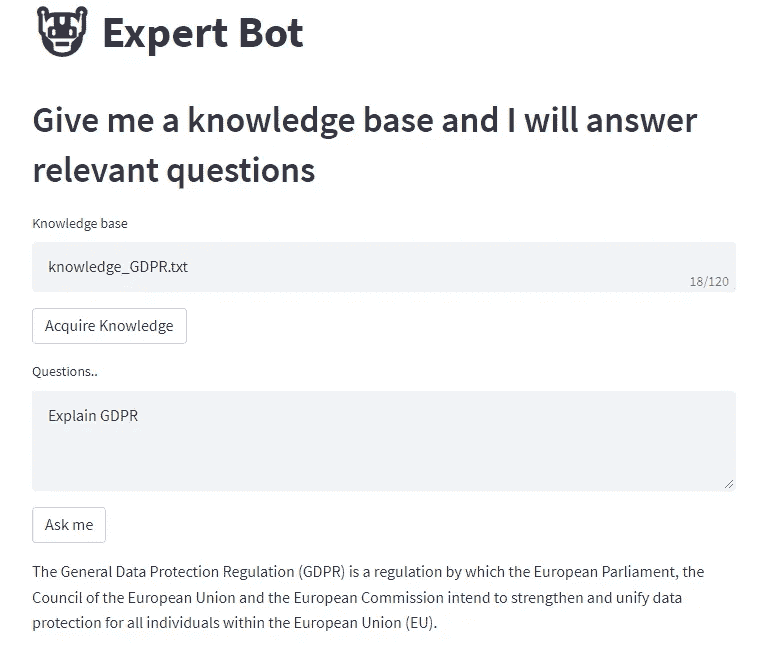

# 我正在用一个“专家”人工智能助手提高工作效率

> 原文：<https://towardsdatascience.com/im-making-work-efficient-with-an-expert-ai-assistant-a83919b196e?source=collection_archive---------8----------------------->

## [实践教程](https://towardsdatascience.com/tagged/hands-on-tutorials)，野外数据科学和机器学习

## 展示语言建模在提高工作效率方面的力量

由[路易斯·阿尔盖兹](https://unsplash.com/@luisargaiz?utm_source=medium&utm_medium=referral)在 [Unsplash](https://unsplash.com?utm_source=medium&utm_medium=referral) 上拍摄

# 人们在工作中做什么？

我热爱我作为数据科学领导者工作。我一直在探索人工智能可以增加价值的领域。我在自然语言理解领域看到了巨大的机会(NLU)。

让我们暂时忘记模型，把注意力放在人身上，来探索一下。人们实际上在工作中做什么？对我们许多人来说，工作主要是阅读、理解和交流。根据我的经验，90%的非会议活动都遵循这个过程。

> 阅读->理解->交流

在我所在的行业(银行业)，法律、合规和风险部门充斥着这些活动。银行雇佣律师、合规官和风险经理团队来解释冗长的文件并为活动提供建议。工作负载可能非常大，导致效率低下。

我发现了一个机会:一个能够回答基本监管问题并帮助解决更微妙问题的人工智能助理怎么样？

> 有没有足够强大的语言模型来做到这一点？

# 1750 亿参数模型

GPT-3 是 [Open AI](https://beta.openai.com/overview) 发布的最新生成式预训练模型。这是目前最先进的语言模型，有 1750 亿个参数。这使得它可以做一些有趣的事情，比如序列对序列建模、元学习和生成建模。用简单的英语来说，它似乎能够完成大多数语言任务，包括复杂的理解。开放人工智能已经向公众发布了 GPT-3 API，开发者已经在开发一些有趣的应用。

**一些很酷的:**

*   SQL 翻译
*   电影到表情符号生成器
*   语言翻译
*   Python 到自然语言

# 专家机器人概念验证

我被 GPT-3 说服了，但我知道我必须带着我的同事一起工作。我想向他们展示一些东西，让他们对语言模型有所启发，所以我决定建立一个概念证明。我称它为专家机器人。

它构建在 GPT-3 API 之上，而且出奇的简单。它接受一个知识库，有一个硬编码的上下文，并使用 GPT-3 引擎来回答与其知识库相关的问题。

# 我是这样建造的

*   [开 AI 账号](https://beta.openai.com/):在写的时候，他们给你 18 美元的免费 API 调用。
*   私有密钥:一旦你注册了，Open AI 会给你一个组织密钥和一个 API 密钥。
*   [Anaconda](https://www.anaconda.com/) :还需要我多说吗，这使得管理环境和确保安装所有的包依赖项变得容易了。
*   库:你需要这些来让机器人工作。**open ai**:GPT 3 API 的库。 [**streamlit**](https://streamlit.io/) :用于创建基于 web 的仪表板/GUI 的库。
*   一个 python IDE:我用的是 [PyCharm](https://www.jetbrains.com/pycharm/download/#section=windows) 社区版。
*   知识库:这需要在。txt 格式。为了演示，我从维基百科上抓取了一些关于 GDPR 的东西。

## 第一步:设置

您需要创建一个 PyCharm 项目，并确保它指向 Anaconda。您可以创建自己的虚拟环境，但我绝对推荐使用 Anaconda。

**安装**:你需要用 pip 安装所有的库。如果您正在使用 PyCharm，只需按 alt + f12 打开终端。然后 pip 安装先决条件中提到的所有库。

## Python 代码

我用 67 行代码编写了这个机器人。

**第 1 部分:导入所有库。**

**第 2 部分:调用 API 打开 AI。**

第 3 部分:为专家机器人设置 web GUI。

第四部分:创建你的知识库

知识库是一个. txt 文件，专家机器人可以从中读取、理解和回答问题。通过提供适当的知识库，你可以让机器人成为任何领域的专家。对于我的演示，我使用在线文章和维基百科页面来管理特定主题的知识库，包括 [GDPR](https://en.wikipedia.org/wiki/General_Data_Protection_Regulation) 和 [ESG](https://en.wikipedia.org/wiki/Environmental,_social_and_corporate_governance) ，因为这些主题与我所在的行业相关。我通过简单地复制文本并将其粘贴到。txt 文件。

GPT-3 answers API 要求将知识库转换成一种 [jsonl](https://jsonlines.org/) 格式。我使用 python 脚本完成了这项工作，该脚本读取。txt 文件，并将其重写为以“text”为关键字、以文本行为值的字典。最后一行代码将您的知识库文件上传到 OpenAI 的文件 repo。

上面的代码将创建一个类似如下的“knowledge_jsonl.jsonl”文件:

Jsonl 格式的知识库

**第 5 部分:查询 GPT3，并将答案打印到 UI。**

答案引擎本身只是一个由 Open AI 提供的框架，位于 GPT3 模型之上。您需要为它提供一些东西来获得想要的结果。

*   Search_model & model:这些基本上都是用于理解的模型。GPT3 有不同的水平，在不同的任务中表现良好。最“聪明”的是达芬奇，它可以执行需要理解上下文的任务。Ada 是最不复杂的，但是对于解析文本和分类这样的任务来说是最快的。每种模型都有资金和延迟成本，模型越智能，成本就越高，速度也越慢。
*   问题:这是用户想问专家 Bot 的问题。我已经将它设置为从第 3 部分中创建的 streamlit UI 传入。
*   File:这只是 jsonl 知识库的文件 id，因为它存储在 OpenAI 的 repo 中。
*   例与例 _context:你需要给模型提供一个问题的例子，引导它朝着你想要的语气和回答格式发展。您需要根据您自己的应用对其进行定制。
*   Max_tokens:这只是机器人生成的答案的最大令牌数。如果你只是想要简短的答案，你应该缩短这个。
*   Max_rerank:这是搜索排序的最大文档数。一个文档对应于 jsonl 文件中的每个字典行。较高的值可以提高结果的准确性，但会产生延迟成本。

您可以从 IDE 中的终端运行该应用程序。按 alt+f12 并在命令提示符下键入以下代码。

如果你按照说明做了，你会得到类似这样的东西…

专家机器人与 GDPR 知识库，我拉了维基百科

# 野外专家机器人

向同事们炫耀这一点让我很开心。当我向他们展示它的功能时，我可以明显地看到他们受到了鼓舞。最大的收获是听到他们谈论语言模型的其他用例！

没有严格的测试，我可以说，机器人的性能已经足够的演示使用 GDPR 和 ESG 知识库我给它。

以下是 GDPR 的一些问答:

> **解释 GDPR**
> 
> 🤖**专家 Bot 的回答** >《通用数据保护条例》(GDPR)是欧洲议会、欧盟理事会和欧盟委员会旨在加强和统一欧盟(EU)内所有个人的数据保护的法规。
> 
> **GDPR 的原则是什么？**
> 
> 🤖**专家机器人的回答** >责任、设计隐私、数据最小化、透明、合法、设计安全。
> 
> **什么是设计隐私？**
> 
> 🤖专家机器人的回答: >隐私设计是一种增强隐私的信息系统开发方法。这是一个自 20 世纪 80 年代以来就存在的概念，但被欧盟的通用数据保护法规(GDPR)赋予了新的生命。

我还试着在公司的“关于我们”页面上进行培训。我发现这并不奏效，但是我仍然在试验这个用例的参数和知识库管理。我发现，虽然答案很棒，但在传递它们时有很大的延迟，大约 20 秒左右。

我学到的是，一个好的 POC 的力量是无与伦比的，尤其是当您试图引入一些新的东西时。

> 如果一张图片胜过千言万语，那么一个好的 POC 值 1750 亿美元。

## 更上一层楼

但是，我们不能太得意忘形，在我可以声称已经提高了工作效率之前，还有许多工作要做。

*   **验证&测试:**这在任何机器学习任务中都是至关重要的。您需要确保您的模型按照您期望的标准运行。我的下一步将是想出一些方法来测试和验证围绕合规性和风险管理的特定任务的 bot 的性能，这是一项完全不平凡的工作。需要做一些工作来了解这些任务的关键业务指标是什么，然后我可以设置实验来测试机器人在这些方面的表现。
*   **微调** : GPT-3 已经在整个互联网上进行了训练，但是[文献](https://arxiv.org/abs/2005.14165)表明，在反映您的用例的数据子集上微调模型可以进一步提高性能。
*   **缩放**:如前所述，使用这些模型需要金钱成本。在多大的运营规模下，bot 具有净正贡献？只有在考虑了前两点之后，我们才能真正理解这一点。

⭐️ *我喜欢通过分享我在野外的数据科学经验来帮助人们。如果你还不是会员，可以考虑订阅 Medium，从我这里获得更多有用的内容。*

 [## 通过我的推荐链接加入 Medium—John Ade-Ojo

### 作为一个媒体会员，你的会员费的一部分会给你阅读的作家，你可以完全接触到每一个故事…

johnadeojo.medium.com](https://johnadeojo.medium.com/membership)