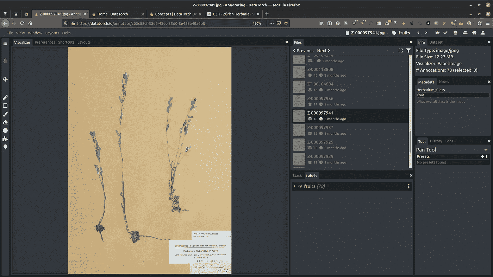
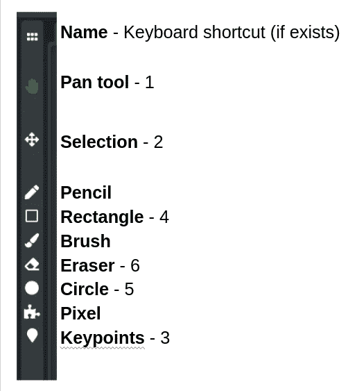
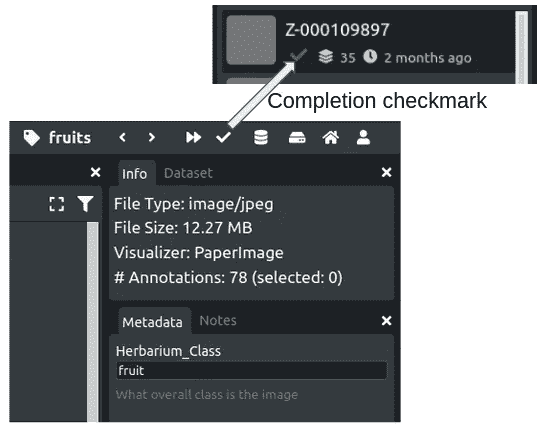

# 使用 DataTorch.io 进行图像注释

> 原文：<https://towardsdatascience.com/image-annotation-with-datatorch-io-4698506283f8?source=collection_archive---------52----------------------->

## 首次用户和图像注释初学者注释工具指南

制作计算机视觉模型，在保存的植物标本上寻找果实和花朵。(图片由作者提供)

DataTorch 是一款基于网络的机器学习数据标注工具。11 月，我需要为我的数据科学训练营的[期末项目的计算机视觉模型的图像添加注释。我以前从未从头开始创建过计算机视觉模型或图像训练数据，需要找到一个快速入门、使用相对直观、易于与项目合作伙伴分享工作的程序。DataTorch 检查了所有的箱子。](https://lindseyviann.medium.com/final-bootcamp-blitz-b0e94407b0a)

DataTorch 平台仍在开发中，因此用户文档尚未完成。首席执行官给了[一个简短的视频，概述了如何开始、导入数据集和导出注释，但关于注释图像的细节信息较少。](https://youtu.be/kM4O1HoyPDc)

在我们开始之前澄清一下，我与 DataTorch 没有任何关系。偶然发现的，喜欢上了，觉得别人可能也会喜欢。

如果你以前有过带注释的图片，DataTorch 是一个扩展的商业版本的 [COCO Annotator](https://github.com/jsbroks/coco-annotator) ，老实说，你可能不会在这篇文章中找到太多新的信息。与 COCO Annotator 相比，我更喜欢 DataTorch，因为它更容易与多人共享注释任务，并且我不必担心更新或覆盖工作。

因为 DataTorch 正在开发中，如果我注意到用户界面有变化，我会更新帖子。最后更新时间:2021 年 1 月 19 日

下图显示了正在进行的图像注释。让我们来看看左侧工具栏上可用的工具和快捷方式。

正在进行图像注释(UZH 植物标本室标本)

无论选择哪种工具，滚轮都会放大和缩小照片。

**平移:**拖动图像。**选择:**为了对一个遮罩进行编辑，需要选择它。如果只编辑一个遮罩，我们可以直接单击它，或者通过单击并拖动来创建一个突出显示的遮罩区域。只有选择区内完全*的屏蔽*会被突出显示。此外，如果您想将一个遮罩视为与您刚刚绘制的遮罩不同，您可能需要通过单击图像取消选择*。有些工具会自动切换到新的遮罩，有些则不会。*

下一组工具实际上创建了遮罩。**铅笔:**(官方多边形选择)最适合多边形，故名。每次单击，程序都会在点之间画一条直线，直到您单击它本身。或者你可以自由绘制，只要你在起点结束形状。跳到**笔刷:**非常类似于铅笔，但是你不需要关闭你开始的形状。一旦你画好了，这个程序会把你覆盖的任何区域变成一个遮罩。我使用画笔工具最多的是为了在我的图像中覆盖水果和花的奇怪形状。左右方括号键[ ]使画笔变小或变大。**橡皮擦:**只对选中/高亮的蒙版有效。像画笔一样，它用[ ]键改变大小。

**矩形**和**圆形**是不言自明的——单击并拖动以调整大小。如果您需要删除一个，右键单击并选择删除。到目前为止，我已经不需要**像素**或**关键点**了，尽管说实话，我还没有弄清楚它们是做什么的…

对于没有快捷方式的工具，您可以在右下角的框中更改工具设置。如果你需要改变一个标签，例如从花到果，右击并直接选择面具上的“改变标签”或底部中间框中的面具名称。

如果你想添加一些自定义信息到掩码文件的元数据中，你可以在右边的栏中。

注释完图像后，在右上角标记完成。绿色的完成复选标记将显示在注释页面以及数据集和文件页面上。

祝你的计算机视觉项目好运！