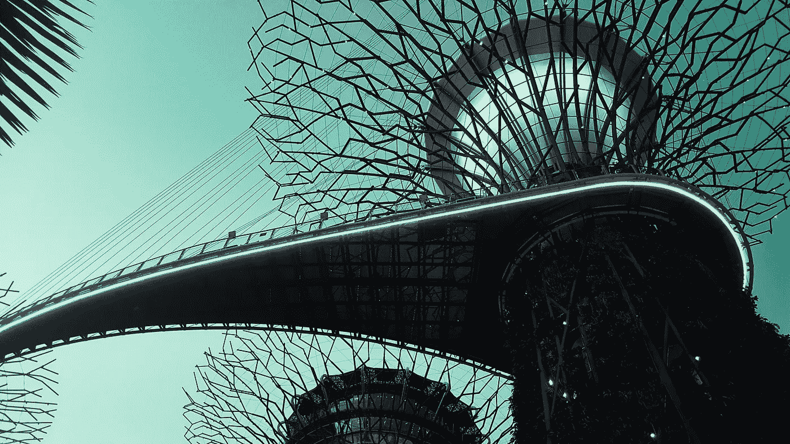
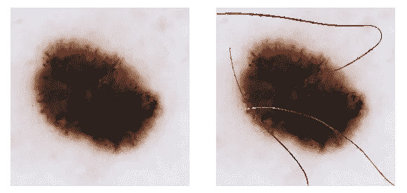
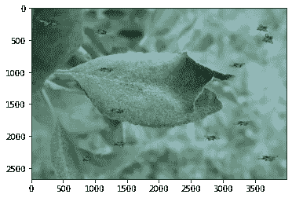
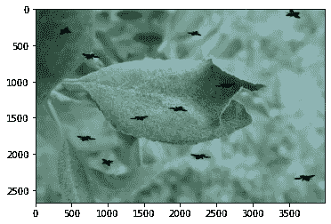
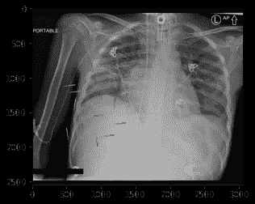
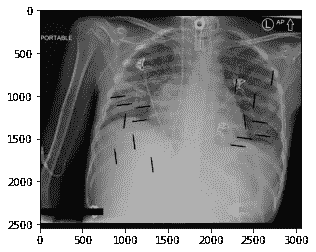

# 具有领域相关伪像的图像增强

> 原文：<https://towardsdatascience.com/image-augmentation-with-domain-related-artifacts-e5f333f40d48?source=collection_archive---------42----------------------->



图片来自 Unsplash 的 OpticalNomad

## 用头发，昆虫和针隆胸的例子

# 介绍

当在图像上训练深度神经网络模型时，扩充训练样本(图像)可以允许模型通过在由扩充人工生成的更多图像上进行训练来更好地概括。常用的增强包括水平和垂直翻转/移位、在某一角度和方向(顺时针/逆时针)的随机旋转、亮度、饱和度、对比度和缩放增强。

Python 中一个非常流行的图像扩充库是`albumentations`([https://albumentations.ai/](https://albumentations.ai/))，它通过直观的函数和优秀的文档使图像扩充变得容易。它也可以与 PyTorch 和 TensorFlow 等流行的深度学习框架一起使用。

# 领域相关伪影增强

## 直觉

这种用现实生活场景中可以找到的伪像来增加图像数据的方法背后的想法来自于模仿和概括现实中可能遇到的跨图像的模型的动机。例如，像雪或雨滴这样的增强物是不应在 x 光图像中发现的伪影，但胸管和起搏器是可以在 x 光图像内发现的伪影。

## 这个想法是从哪里来的

我第一次改变方法是从 Roman 的(@ nroman on Kaggle)为 SIIM-ISIC 黑色素瘤分类竞赛做的头发增加。他的方法的细节可以在这里找到:[https://www . ka ggle . com/c/siim-ISIC-黑素瘤-分类/讨论/159176](https://www.kaggle.com/c/siim-isic-melanoma-classification/discussion/159176) 。该增强的一个片段如下:



原图(左上)和头发增强图(右上)，摘自[https://www . ka ggle . com/c/siim-ISIC-黑色素瘤-分类/讨论/159176](https://www.kaggle.com/c/siim-isic-melanoma-classification/discussion/159176)

我的团队在我们的模型训练中使用了他的增强，这有助于提高我们大多数模型的交叉验证(CV)分数。我想说这种形式的增强可能在我们的最终排名中起到了关键作用！从那以后，用头发(或一般的人工制品)来增加图像数据的想法在我参加的随后的比赛中站得很近，并在我可以的地方应用它。特别是在[全球小麦检测](https://www.kaggle.com/c/global-wheat-detection)、[木薯叶部病害分类](https://www.kaggle.com/c/cassava-leaf-disease-classification)和 [RANZCR CLiP —导管和线位挑战赛](https://www.kaggle.com/c/ranzcr-clip-catheter-line-classification)中推广应用了该方法。

## 昆虫扩增

顾名思义，这种方法包括用昆虫来增强图像。这种人工制品的正确领域可以是数据中的一种自然设置，其中昆虫通常在空中或表面上到处可见。在这个例子中，在木薯和全球小麦检测比赛中，当增强叶子图像时，蜜蜂被用作选择的昆虫。以下是增强图像的外观示例:



蜜蜂在树叶周围飞舞的增强图像，摘自[https://www . ka ggle . com/khoongweihao/昆虫增强-et-al/notebook](https://www.kaggle.com/khoongweihao/insect-augmentation-et-al/notebook)

我们还可以使用伪像的掩蔽形式，在图像中产生黑点(类似于白蛋白中的`CoarseDropout`)，即没有颜色的黑色蜜蜂:



深色/黑色蜜蜂在树叶周围飞行的增强图像，取自[https://www . ka ggle . com/khoongweihao/昆虫增强-et-al/notebook](https://www.kaggle.com/khoongweihao/insect-augmentation-et-al/notebook)

以下以 albuminations 风格编写的代码允许工件增强与来自 albuminations 库的其他增强一起轻松使用:

```
from albumentations.core.transforms_interface import ImageOnlyTransform

class **InsectAugmentation**(ImageOnlyTransform):
    *"""*
 *Impose an image of a insect to the target image*
 *-----------------------------------------------*
 *Args:*
 *insects (int): maximum number of insects to impose*
 *insects_folder (str): path to the folder with insects images*
 *"""*

    def __init__(self, insects=2, dark_insect=False, always_apply=False, p=0.5):
        super().__init__(always_apply, p)
        self.insects = insects
        self.dark_insect = dark_insect
        self.insects_folder = "/kaggle/input/bee-augmentation/"

    def apply(self, image, **kwargs):
        *"""*
 *Args:*
 *image (PIL Image): Image to draw insects on.*

 *Returns:*
 *PIL Image: Image with drawn insects.*
 *"""*
        n_insects = random.randint(1, self.insects) *# for this example I put 1 instead of 0 to illustrate the augmentation*

        if **not** n_insects:
            return image

        height, width, _ = image.shape  *# target image width and height*
        insects_images = [im for im **in** os.listdir(self.insects_folder) if 'png' **in** im]

        for _ **in** range(n_insects):
            insect = cv2.cvtColor(cv2.imread(os.path.join(self.insects_folder, random.choice(insects_images))), cv2.COLOR_BGR2RGB)
            insect = cv2.flip(insect, random.choice([-1, 0, 1]))
            insect = cv2.rotate(insect, random.choice([0, 1, 2]))

            h_height, h_width, _ = insect.shape  *# insect image width and height*
            roi_ho = random.randint(0, image.shape[0] - insect.shape[0])
            roi_wo = random.randint(0, image.shape[1] - insect.shape[1])
            roi = image[roi_ho:roi_ho + h_height, roi_wo:roi_wo + h_width]

            *# Creating a mask and inverse mask* 
            img2gray = cv2.cvtColor(insect, cv2.COLOR_BGR2GRAY)
            ret, mask = cv2.threshold(img2gray, 10, 255, cv2.THRESH_BINARY)
            mask_inv = cv2.bitwise_not(mask)

            *# Now black-out the area of insect in ROI*
            img_bg = cv2.bitwise_and(roi, roi, mask=mask_inv)

            *# Take only region of insect from insect image.*
            if self.dark_insect:
                img_bg = cv2.bitwise_and(roi, roi, mask=mask_inv)
                insect_fg = cv2.bitwise_and(img_bg, img_bg, mask=mask)
            else:
                insect_fg = cv2.bitwise_and(insect, insect, mask=mask)

            *# Put insect in ROI and modify the target image*
            dst = cv2.add(img_bg, insect_fg, dtype=cv2.CV_64F)

            image[roi_ho:roi_ho + h_height, roi_wo:roi_wo + h_width] = dst

        return image
```

如果你想使用黑色版本的神器，将`dark_insect`设置为`True`。在我的 Kaggle 笔记本中可以找到一个示例实现:[https://www . ka ggle . com/khoongwihao/昆虫增强高效检测-d6/notebook](https://www.kaggle.com/khoongweihao/insect-augmentation-with-efficientdet-d6/notebook) 。

## 针头增大术

在这种方法中，使用针来增强图像，例如，图像可以是 x 射线图像或带有针线包的桌面。以下是增强图像的外观示例:



x 光左侧有针的增强图像，取自[https://www . ka ggle . com/khoongweihao/x-ray-needle-augmentation-et-al/notebook](https://www.kaggle.com/khoongweihao/x-ray-needle-augmentation-et-al/notebook)

类似地，我们可以使用针状伪像的黑色版本，从而得到以下增强图像:



x 光片两侧暗/黑色针状物的增强图像，取自[https://www . ka ggle . com/khoongweihao/x-ray-needle-augmentation-et-al/notebook](https://www.kaggle.com/khoongweihao/x-ray-needle-augmentation-et-al/notebook)

用作上述增强模块的代码片段如下:

```
def NeedleAugmentation(image, n_needles=2, dark_needles=False, p=0.5, needle_folder='../input/xray-needle-augmentation'):
    aug_prob = random.random()
    if aug_prob < p:
        height, width, _ = image.shape  *# target image width and height*
        needle_images = [im for im **in** os.listdir(needle_folder) if 'png' **in** im]

        for _ **in** range(1, n_needles):
            needle = cv2.cvtColor(cv2.imread(os.path.join(needle_folder, random.choice(needle_images))), cv2.COLOR_BGR2RGB)
            needle = cv2.flip(needle, random.choice([-1, 0, 1]))
            needle = cv2.rotate(needle, random.choice([0, 1, 2]))

            h_height, h_width, _ = needle.shape  *# needle image width and height*
            roi_ho = random.randint(0, abs(image.shape[0] - needle.shape[0]))
            roi_wo = random.randint(0, abs(image.shape[1] - needle.shape[1]))
            roi = image[roi_ho:roi_ho + h_height, roi_wo:roi_wo + h_width]

            *# Creating a mask and inverse mask* 
            img2gray = cv2.cvtColor(needle, cv2.COLOR_BGR2GRAY)
            ret, mask = cv2.threshold(img2gray, 10, 255, cv2.THRESH_BINARY)
            mask_inv = cv2.bitwise_not(mask)

            *# Now black-out the area of needle in ROI*
            img_bg = cv2.bitwise_and(roi, roi, mask=mask_inv)

            *# Take only region of insect from insect image.*
            if dark_needles:
                img_bg = cv2.bitwise_and(roi, roi, mask=mask_inv)
                needle_fg = cv2.bitwise_and(img_bg, img_bg, mask=mask)
            else:
                needle_fg = cv2.bitwise_and(needle, needle, mask=mask)

            *# Put needle in ROI and modify the target image*
            dst = cv2.add(img_bg, needle_fg, dtype=cv2.CV_64F)

            image[roi_ho:roi_ho + h_height, roi_wo:roi_wo + h_width] = dst

    return image
```

请注意，以上不是白蛋白格式，不能直接应用于通常的白蛋白增加。必须做一些调整，使其格式与上面的昆虫/蜜蜂增强相同。但是变化应该是微小的！

类似地，如果您希望使用工件的黑色版本，请将`dark_needles`设置为`True`。一个实现的例子可以在我的 Kaggle 笔记本这里找到:[https://www . ka ggle . com/khoongweihao/x-ray-needle-augmentation-et-al/notebook](https://www.kaggle.com/khoongweihao/x-ray-needle-augmentation-et-al/notebook)。

# 实验结果

总的来说，局部 CV 结果有所改善，但改善幅度不大(例如 0.001–0.003)。但是在训练中，使用这种伪影增强的方法会有“失败”的情况。在全球小麦探测竞赛中可以找到一个例子，其中任务涉及探测小麦穗，即物体探测任务。尽管进行了广泛的超参数调整，但使用蜜蜂的原始颜色进行蜜蜂增强导致了具有巨大波动的零星训练验证损失。虽然使用增强确实提高了 CV，但可以说这确实是一次幸运的尝试。使用仅保留黑色像素的伪影增强(如粗略丢失增强)被证明在应用领域中是稳定的。特别是，CV 的提高是实质性的，也是持续的。到目前为止，还没有找到蜜蜂扩增导致不同时期之间出现这种零星训练结果的原因，但一个假设是蜜蜂的颜色接近一些麦穗，因此“混淆”了检测算法，该算法随后在同一边界框内捕获麦穗和最近的蜜蜂。在一些边界框预测中观察到了这一点，但是没有足够多的观察案例来肯定地说该假设是正确的。在任何情况下，还应该考虑伪影的图像属性(颜色)是否具有接近目标(例如麦穗)的分布。另一方面，针隆乳被证明对两种隆乳都是相对稳定的(原始伪影及其黑色/深色版本)。在该示例中，尽管颜色分布相似，但预测的目标可能具有不同的特征(例如，胸腔管看起来与细小的针非常不同)，从而分类算法不会混淆针是否是正确的目标。