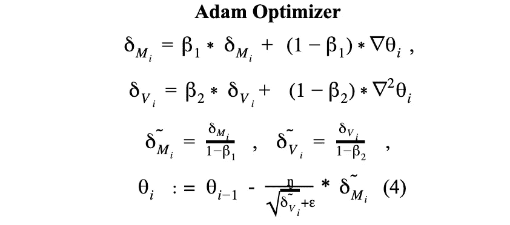
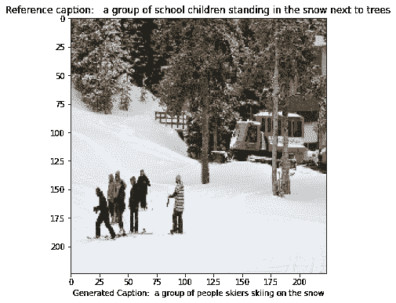

# 基于视觉-语言转换模型的图像字幕

> 原文：<https://towardsdatascience.com/image-captioning-by-translational-visual-to-language-models-d728bced41c3?source=collection_archive---------17----------------------->

## [思想和理论](https://towardsdatascience.com/tagged/thoughts-and-theory)

## 生成具有视觉注意力的自主字幕

示例生成的标题(图片由作者提供)

这是一个以实验为目的的研究项目，有很深的学术文档，所以如果你是一个论文爱好者，那么就去查看这篇文章的项目页面

<https://github.com/cankocagil/Image-Captioning>  

这篇文章将是从论文到文章的一个几乎直接的过渡，将涵盖使用简单而有效的计算机视觉和 NLP 应用程序的图像字幕任务，并具有深刻的解释。如果你正在寻找一个带有可解释的代码、计算和文档的图像标题的启动，你来对地方了。包括一切。本文将向您介绍任何图像字幕任务的概念和上下文设计，包括全面的视觉效果和“从头开始”的代码，以及解释。为了简单起见，代码被排除在外，但托管在项目页面上。来自其他来源的视觉资料的参考文献在标题中嵌入了链接，而其他参考文献则在最后给出。让我们潜入更深的地方。

***全景***

本文主要关注在深度学习环境下使用最新技术的图像字幕任务。图像字幕是通过使用自然语言处理和计算机视觉应用生成图像的文本描述的过程。该网络由卷积神经网络(CNN)组成，用于将图像编码为潜在空间表示，随后是递归神经网络(RNN ),用于解码特征表示和构建语言模型。具体来说，长短期记忆(LSTM)和门控循环单位(GRU)被用作 RNN 模型与注意机制和教师强迫算法。为了实现这一点，AlexNet、VGG 网络、ResNet、DenseNet 和 SquezeeNet 等迁移学习应用程序被用作卷积编码器，而单词表示的全局向量(GloVe)被用于单词嵌入。Microsoft 上下文中的公共对象(MSCOCO)数据集用于训练和测试。实施各种数据扩充技术来提高模型性能。该模型由 Adam optimizer 以预定的学习率编译。掩蔽的交叉熵损失被用作模型的标准。最后，实现了 beam 和贪婪搜索算法，以获得最佳的图像到字幕的翻译。

***要覆盖的关键字***

*   图像字幕问题的表述
*   图像字幕的理据
*   视觉和语言翻译模型
*   迁移学习
*   数据扩充
*   注意模型和教师强迫算法
*   传统 CNN:Alex Net、VGG 网络、ResNet、DenseNet 和 SquezeeNet
*   语言模型:长短期记忆(LSTM)和门控循环单元(GRU)
*   单词表示的全局向量(GloVe)
*   波束和贪婪搜索
*   蓝色分数和流星

## 1.简介和动机

随着与人工智能相关的新技术的出现，图像字幕已经成为最吸引研究者的领域之一。图像字幕，根据图像中观察到的内容自动生成自然语言描述，是场景理解的重要组成部分，融合了计算机视觉和自然语言处理的知识[1]。图像字幕的应用非常广泛，例如连接人机交互，它还可以帮助视障人士“看”未来的世界[1]。在图像字幕的早期阶段，统计语言模型被用来提出为图像生成字幕的解决方案。李等人提出了一种基于网络规模的 n 元语法方法，收集候选短语并将其合并以形成从零开始描述图像的句子[2]。Yang 等人提出了一种从英语 Gigaword 语料库训练的语言模型，以获得图像中运动的估计以及搭配的名词、场景和介词的概率，并使用这些估计作为隐马尔可夫模型的参数[2]。根据文献综述，我们提出了深度学习背景下图像字幕技术的基本阶段。以下是图像字幕管道和广泛使用的技术的概述:

***1.1 特征提取***

图像字幕任务从从图像中提取特征开始，以将可能的 3 (RGB)通道高维数据的维度减少到潜在空间表示中。在文献中，已经有预先训练的模型，这些模型通过使用由超过 120 万幅自然图像组成的称为“图像网”的数据集进行训练，例如 AlexNet、VGG 网、ResNet、GoogleNet、DenseNet、SqueezeNet 等等。我们实现了所有提到的模型，除了 GoogleNet，我们将在本文后面看到。

***1.2 语言模型***

作为图像字幕的第二阶段，字幕和潜在空间特征向量被赋予语言模型以生成字幕。为了实现这一点，有各种各样的模型在文献中广泛使用，如 LSTM 的，双向 LSTM 的，RNN 的，CNN 的，GRU 的，和 TPGN 的。我们在实现中使用了 LSTM 和 GRU 的递归网络，我们将在方法部分讨论。

***1.3 常用技巧***

为了生成图像字幕模型，在文献中使用了以下图像到序列技术:

*   编码器-解码器
*   注意机制
*   新对象范式
*   语义学

此外，注意有各种算法用于实现图像到序列网络，这些是广泛使用的技术。在这个项目中，我们使用了编码器-解码器模型和带有注意机制的教师强制器。

***1.4 数据集***

MS COCO 和 Flickr 数据集广泛用于图像字幕任务。我们在实现中使用了 MSCOCO。

***1.5 绩效指标***

为了评估图像到序列模型的性能，使用以下评估指标:

*   BLEU-i(对于 i = 1，…，4)(例如，BLUE-1)
*   苹果酒
*   流星

对于我们的实现，我们使用 BLUE-1、BLUE-2、BLUE-3、BLUE-4 和 METEOR 度量来评估语言模型在训练结束时的输出。

***1.6 建筑管道***

如上所述，在我们的例子中，MSCOCO 数据集用于训练/验证和测试，它有超过 80 000 幅自然图像。这些图像的网址给我们使用。但是，由于大约 10%的 URL 被破坏，我们有近 70 000 到 73 000 张图像用于训练和验证。整个集被分成 15%的验证集和 85%的训练集。此外，在该数据集中，每幅图像都配有 4 到 5 个描述该特定图像内容的相关标题。然后，实施各种数据扩充技术来提高模型的性能。对于特征提取，我们使用具有预训练模型的 CNN 编码器结构，ResNet152、AlexNet、VGG19-Net、DenseNet、SqueezeNet，来试验特征提取的性能。在这样的实验之后，ResNet152 的表现比我们在后面几页中看到的稍好一些。(ResNet 代表用于图像识别的深度残差学习。)我们的编码器 CNN 模型是在 ImageNet 数据集中预先训练的，由多个卷积层组成。对于 ResNet152，残差神经网络利用跳过连接或快捷方式跳过一些层，以降低层对给定图像数据的适应性。典型的 *ResNet* 模型通过双层或三层跳跃实现，其中包含非线性( [ReLU](https://en.wikipedia.org/wiki/Rectifier_(neural_networks)) )和[批处理归一化](https://en.wikipedia.org/wiki/Batch_normalization)[3]。跳过层的一个动机是避免[消失梯度](https://en.wikipedia.org/wiki/Vanishing_gradient_problem)的问题，通过重用前一层的激活，直到相邻层学习其权重【3】。我们的剩余网络由 152 层组成。

然后，对于语言模型，通过注意机制和教师强制技术，使用 LSTM 和 GRU 递归神经网络。作为第一步，单词嵌入层用于句子长度字幕的单词表示。为了实现这一点，我们使用了单词表示的全局向量(GloVe)，这是一种用于获得单词的向量表示的无监督学习算法[4]。在来自语料库的聚合的全局单词-单词共现统计上执行训练，并且产生的表示展示了单词向量空间的有趣的线性子结构[4]。我们使用的手套模型是用 60 亿个标记和 400 000 个语料库训练的。然后，为了最小化模型的开销，使用了掩蔽交叉熵损失，并通过 Adam 优化器对编码器和解码器模型进行优化。然后，在训练阶段的最后，我们希望我们的视觉和语言模型能够为自然图像生成人类级别的字幕。

## 2.方法

***2.1 训练/验证/测试拆分***

我们将给定的训练数据集分成 85%的训练和 15%的验证，以便在训练时跟踪模型的历史，并且我们还应用了交叉验证技术，以便在模型开始过度拟合时停止训练。因此，在数据集分割结束时，我们有 340 114 个唯一的训练图像和 60 021 个唯一的验证图像。此外，一个单独的测试数据集给我们，以衡量一个模型的性能与各种各样的自然图像。

***2.2 预处理***

由于图像有不同的大小，我们首先转换可接受大小的图像，在我们的例子中是 224x224，以满足视觉模型的要求。所有提到的 CNN 模型都接受(N x C x H x W)约定的输入，即 PyTorch RGB 图像批处理约定。在我们的例子中，所有 CNN 模型都接受 C，H，W = (3，224，224)约定。最后，对所有图像进行归一化，以获得零均值和单位标准差分布，从而加速训练。我们通过以下方式分别对每个颜色通道应用标准化

*   平均值= [0.485，0.456，0.406]
*   标准偏差= [0.229，0.224，0.225]

使用统一公式:

输出[通道] =(输入[通道] —平均[通道]) /标准[通道]

这些是 ImageNet 的 RGB 通道平均值和标准偏差，可以表示自然图像的广义平均值和标准偏差。

***2.3 数据扩充***

数据分析中的数据扩充是一种用于增加数据量的技术，通过添加已有数据的稍微修改的副本或从现有数据中新创建的合成数据[5]。它充当[正则化子](https://en.wikipedia.org/wiki/Regularization_(mathematics))，并在训练深度学习模型时帮助减少[过拟合](https://en.wikipedia.org/wiki/Overfitting)。为了实现这一点，我们应用了以下数据扩充技术:

*   **随机水平翻转**

我们以 0.5 的概率水平翻转图像数据。

*   **随机垂直翻转**

我们以 0.5 的概率垂直翻转图像数据。

*   **随机裁剪**

我们随机裁剪 224x224 尺寸的图像。

*   **随机调整大小裁剪**

我们将图像的大小调整为 256x256，然后随机裁剪 224x224 的部分。

*   **中心裁剪**

我们将图像的大小调整为 256x256，然后在中心裁剪 224x224 的部分。

***2.4 传输学习:编码器 CNN***

如前所述，我们分别使用了 ResNet152、AlexNet、VGG19-Net、DenseNet 和 SqueezeNet 将高维图像转换为潜在空间表示。因此，我们应用特征提取，即，我们在训练时冻结 CNN 模型的层的可学习/可训练参数，即，我们不更新编码器模型的网络参数。迁移学习的另一种可能的方法是微调网络，但由于计算方面的考虑，我们更喜欢只提取特征。然后，我们将我们的特征向量传递到嵌入层，得到一个嵌入的图像特征向量。这个嵌入层以一种可学习的方式将潜在空间表示转换成嵌入空间。现在，我们的图像已经准备好输入语言模型了。下图显示了所解释的体系结构。

[编码器 CNN 嵌入](https://gitlab.com/behnam.vr/image-captioning)由[贝南·瓦基利](https://www.behnamkvl.me/)

因此，嵌入的图像特征向量作为解码器网络的初始输入，在教师强制器算法中具有<x_start_>字幕。</x_start_>

[编码器 CNN 到语言模型](https://gitlab.com/behnam.vr/image-captioning)由 [Behnam Vakili](https://www.behnamkvl.me/)

***2.5 迁移学习:单词嵌入(手套)***

如前所述，我们为单词嵌入层购买了一个预训练的手套单词向量。这加快了我们的训练阶段，因为这些向量已经用 60 亿个英语标记进行了训练。因此，我们成功地将字幕转换成高级单词表示，以便它们可以输入到解码器模型中。

这一层将我们的句子长度序列字幕转换成嵌入的单词特征向量，以便字幕可以传递给语言模型。

***2.6 解码器配教师强迫器***

自然语言处理中的许多递归神经网络(例如，图像字幕，机器翻译)在训练过程中使用教师强制[6]。教师强制是一种快速有效地训练递归神经网络模型的方法，该模型使用来自先前时间步骤的基础事实[7]。我们举一个 teacher forcer 算法的例子，让任意图像的地面真相标题为“两个人在看书”。我们的模型在预测第二个单词时犯了一个错误，我们在第一个和第二个预测中分别有“两只”和“鸟”[8]

*   如果没有*老师强迫*，我们会把“鸟”喂回我们的 RNN 去预测第三个单词。假设第三个预测是“飞行”。尽管我们的模型预测“飞行”是有意义的，因为输入是“鸟”，但这与地面事实不同。[8]
*   另一方面，如果我们使用*教师强制*，我们将在计算并记录第二次预测的损失后，为第三次预测向我们的 RNN 提供“人”[8]

然后，我们来讨论一下 teacher forcer 的利弊。

*   **优点**

用*老师强制*训练收敛更快。在训练的早期阶段，模型的预测非常糟糕。如果我们不使用*老师强制*，模型的隐藏状态会被一系列错误的预测更新，误差会累积，模型很难从中学习。[10]

*   **缺点**

在推断过程中，由于通常没有实际情况可用，RNN 模型需要将自己之前的预测反馈给自己，以便进行下一次预测。因此，训练和推理之间存在差异，这可能会导致模型性能不佳和不稳定。这在文献[11]中被称为*曝光偏差*。

因此，我们在语言模型中使用了 teacher forcer 算法。

***2.7 带教师强制器和注意力机制的解码器***

作为模型的第二阶段，我们用 LSTM 和 GRU 网络实现了一个带注意机制的解码器。RNN 的工作是解码特征和单词向量，并将其转化为单词序列[6]。在解码器中，作为教师强制算法的一部分，我们首先在时间 t = 0 将嵌入的特征向量传递给解码器。然后，我们使用实际的 teacher forcer 算法逐字传递字幕。因此，我们实现了一个语言模型来将潜在的空间向量映射到单词空间。[7].这里的关键思想是在时间 t=0 [7]将表示图像的潜在空间向量作为输入馈送到递归单位单元。从时间 t=1 开始，我们可以开始将嵌入的目标句子馈送到递归单元中，作为 teacher forcer 算法的一部分[8]。然后，LSTM 单元的输出是隐藏状态向量。因此，我们需要某种从隐藏状态空间到词汇(字典)空间的映射[9]。我们可以通过在隐藏状态空间和词汇空间之间使用完全连接的层来实现这一点[9]。以下架构描述了 LSTM 机制:

[解码器机制](https://gitlab.com/behnam.vr/image-captioning)由[贝南·瓦基利](https://www.behnamkvl.me/)制作

然后，在注意力集中的*设置中，我们希望解码器能够在序列中的不同点查看图像的不同部分。我们使用所有像素的*加权*平均值，而不是简单的平均值，重要像素的权重更大【17】。该图像的加权表示可以在每一步与先前生成的单词连接，以生成下一个单词[17]。注意力机制计算这些权重来估计图像的重要部分。我们已经使用了随机软注意机制，其中像素的权重相加为 1，如在“展示、出席和讲述”论文[18]中所提议的。如果在我们的编码图像中有 P 个像素，那么在每个时间步长 t*

人们可以将这整个过程解释为计算一个像素是*一个*位置的概率，以生成下一个单词[17]。

[注意力随时间推移的机制](https://github.com/sgrvinod/a-PyTorch-Tutorial-to-Image-Captioning)由[萨加尔·维诺达巴布](https://github.com/sgrvinod)

数据流从卷积视觉模型开始，以创建图像的潜在空间表示，然后是递归模型，以创建 LSTM 的初始隐藏和单元状态，以及 GRU 解码器的隐藏状态。在解码的每个时间步，潜在空间表示和先前计算的递归单元的隐藏状态被用于生成图像像素的权重，作为注意机制的一部分。然后，基本事实字幕和编码的加权平均值被馈送到解码器语言模型，以生成下一个字幕，作为教师强制器和注意力算法的组合。下图代表了教师强迫者在软随机注意中的信息流。

[编码器到注意力管道](https://github.com/sgrvinod/a-PyTorch-Tutorial-to-Image-Captioning)由[萨加尔·维诺达巴布](https://github.com/sgrvinod)

***2.8 定额渐变裁剪***

梯度裁剪是一种防止在非常深的网络中(通常在递归神经网络中)爆发梯度的技术[17]。有许多方法来计算梯度裁剪，但一个常见的是重新调整梯度，使他们的范数最多是一个特定的值[17]。通过梯度裁剪，引入预定的梯度阈值，然后缩小超过该阈值的梯度范数以匹配范数[17]。这防止任何梯度具有大于阈值的范数，因此梯度被剪切[17]。

其中 g 是要限幅的梯度，thres 是作为超参数的阈值，而‖g‖是 g 的范数。

因此，我们实现了范数梯度裁剪，以将梯度保持在某个范围内，该范围由阈值表征，并且在这样的实验之后被确定为 10

***2.9 GPU 加速和并行分布式处理***

然后，由于我们正在使用 GPU 加速和分布式计算，我们需要将我们的数据类型转换为有能力在 GPU 中运行图像处理任务的张量。具体来说，NVIDIA Tesla K80 和 GeForce RTX 2080 TI 被用作 GPU 来加速训练。然后，我们使用了分布式数据并行(DDP ),它在模块级实现了数据并行，可以跨多个 GPU 运行。[10]使用 DDP 的应用程序产生多个进程，并为每个进程创建一个 DDP 实例[10]。因此，我们利用了 CUDA 多处理。为了实现这一点，利用了深度学习框架 PyTorch 的 DataParellel 包。

***2.10 掩蔽交叉熵***

屏蔽交叉熵实际上是一种分类交叉熵，将屏蔽应用于由序列长度确定的一些输入。这背后的原因是我们有填充序列，即数据集中的每个字幕都有不同的长度，因此要构建字幕向量，我们需要通过在字幕末尾添加<pad>来填充间隙。视觉表现是:</pad>

[用](https://github.com/sgrvinod/a-PyTorch-Tutorial-to-Image-Captioning)[萨加尔·维诺达巴布](https://github.com/sgrvinod)填充字幕

因此，为了不计算填充区域的损失和梯度，我们实现了采用预测字幕、实际字幕和句子长度的掩蔽交叉熵，并对非填充区域应用交叉熵。这加快了训练过程。

***2.11 Adam 优化器***

编码器和解码器模型都使用 Adam optimizer 通过以下数学表达式进行优化:

其中 M_i 和δ_V_i 分别是一阶和二阶矩中梯度的累加和，θ是要更新的参数。还要注意，也使用了基本的基于随机梯度下降的学习规则、RMSprop 和 AdaGrad，但是 Adam optimizer 的性能最差，因此我们继续使用 Adam optimizer。

***2.12 自适应学习率调度器***

在 PyTorch 优化器包的帮助下，我们应用了基于验证交叉熵和 argmax 搜索精度的动态学习率调度器。该算法在以下情况下降低学习率

*   *交叉熵损失没有减少*
*   *arg max 预测的准确性没有提高*

因此，当指标停止改善时，我们降低了学习率。它启用了动态学习率调度器，并且可以在提前停止之前提高模型的性能。此外，我们还应用了一个基于批量改进的简单学习率调度器。因此，使用三种不同的学习延迟调度器来提高模型的性能。注意，作为进一步的实现，自适应学习速率调度器可以通过使用蓝分数来执行，蓝分数可以在网络内给出额外的自适应性。

***2.13 交叉熵提前停止***

基于交叉熵损失，以批次和时段方式跟踪模型的历史，以避免过拟合。如果训练和验证损失之间的差距开始增大，我们就停止训练。注意，由于我们应用了自适应学习速率调度，我们让模型适应新的学习速率，如果模型不能自我改进，我们就停止训练。幸运的是，我们的模型在训练和测试中表现相似，因此早期停止并不用于整个训练过程。

***2.14 光束搜索***

Show and Tell 论文[11]提出了波束搜索，作为在给定输入图像的情况下生成具有最高出现可能性的句子的最终步骤。[12]该算法是一种最佳优先搜索算法，该算法迭代地将直到时间 t 的 k 个最佳句子的集合视为候选，以生成大小为 t + 1 的句子，并且仅保留它们中的最佳 k 个句子，因为这更好地近似了获得论文[12]中提到的全局最大值的概率。

[由](https://github.com/sgrvinod/a-PyTorch-Tutorial-to-Image-Captioning) [Sagar Vinodababu](https://github.com/sgrvinod) 对光束搜索进行视觉解释

我们使用从 1 到 9 的波束大小实现了波束搜索，以查看波束大小参数的变化。结果将在下一部分讨论。

***2.15 A 框架加速深度编解码***

让我们回忆并收集一下我们为提高模型性能所做的工作。我们通常主要使用多重处理和多线程的概念。为了加载和转换数据，我们使用了 4 个线程的多线程概念。此外，我们转换加载，并将应用程序转换为 GPU 格式以加速。然后，我们使用了 PyTorch 内部实现的生成器概念，这将提高 RAM 效率，并允许在训练阶段进行这样的操作。最重要的是，我们在 GeForce RTX 2080 TI 和 Tesla K80 上使用了 PyTorch 提供的分布式并行计算应用。然后，对于神经网络模型应用，我们冻结卷积模型和手套字嵌入模型的可学习参数，即，我们不计算将明显加速训练阶段的这些层的梯度。对于语言模型，我们实现了 teacher forcer 算法，该算法也提高了生成字幕的时间效率。此外，考虑到模型性能和时间效率，调整了各种超参数。最后，使用提到的不同优化器来测量优化时间，以便根据批量改进和更新时间的标准来选择最佳的优化器。

***2.16 翻译模型的评价指标***

如上所述，我们还使用 BLEU 分数来评估模型，BLEU 分数是双语评估替角，是用于将文本的候选翻译与一个或多个参考翻译进行比较的分数。它评估模型从一种语言翻译到另一种语言的效果。它根据生成的输出中存在的一元词、二元词或三元词为机器翻译分配一个分数，并将其与基本事实进行比较[15]。然而，它没有考虑语言的意义、句子结构和形态丰富的部分。此外，我们使用了 metric METEOR(用于评估具有显式排序的翻译的度量),该度量基于 unigram [精度和召回](https://en.wikipedia.org/wiki/Precision_and_recall)的[调和平均值](https://en.wikipedia.org/wiki/Harmonic_mean),召回权重高于精度。[14]此外，在训练模型时，还计算 argmax 准确度以查看批量改进。注意，这对于图像到序列的转换模型来说不是一个合适的度量，实现它只是为了查看学习曲线。

## **3。结果**

我们已经为卷积编码器实现了 ResNet152、AlexNet、VGG19-Net、DenseNet 和 SqueezeNet。然后，我们建立了一个可训练的嵌入层，嵌入大小为 256(嵌入大小的值是一个超参数，它是在这样的嵌入大小实验后发现的)。之后，我们将字幕转换成嵌入大小为 256 的文字嵌入层。然后，嵌入的特征向量和单词嵌入通过教师强制器和注意机制被传递到语言模型中以生成字幕。提到的算法是我们在图像字幕生成方面的研究的最终发现。我们尝试了不同的批量大小，如 32、64、128 和 256 作为批量调整。我们的最终模型是用批量 64 训练的。当批量大小为 256 时，即使两个模型的性能都稍好一些，我们也会遇到与 CUDA 内存相关的内存问题，因此我们更倾向于将 64 作为理想的批量大小。即使应用了动态学习调度器，我们也从编码器和解码器模型的较高学习速率开始。对于编码器，选择 4x 10–2 作为初始学习速率，选择 1x 10–2 作为初始解码器学习速率。然后，再来说说车型性能。该模型在 NVIDIA Tesla K80 GPU 和 GeForce RTX 2080 TI 上训练，具有 2-3 个纪元。每个纪元需要 1-1.30 GPU 小时 NVIDIA Tesla K80 和 45-60 分钟 GeForce RTX 2080 TI。因此，每个型号的总培训时间大约需要 2-4 小时，具体取决于性能。我们每个时期的训练时间非常快，因为我们已经实现了各种运行时高效算法。(参见加速深度编码器-解码器部分的框架)此外，对于所有模型，交叉熵损失从大约 7 开始，在训练结束时，我们已经达到了 1.60–1.10(对于下面给出的模型)。我们还计算贪婪精度，即使精度不是我们的图像到序列转换模型查看学习曲线的正确度量。argmax 的准确度从 1%开始，在训练结束时达到大约 70–80%。蓝色和流星分数是为所有型号计算的，如下所示。根据表 I(见下文),到目前为止，整体视觉和语言模型中的赢家是编码器的 ResNet152 和解码器的 GRU，其注意力机制通过 BLEU 评分和 METEOR 的标准来表示所生成字幕的语言性能，因此它们是图像到序列翻译模型的最佳评估指标。我们看到，在 3 个时期结束时，模型达到 1.05 熵损失，具有 78.2 argmax 准确度(即使准确度不是翻译模型的正确度量)。更重要的是，我们对 BLUE-1 和 METEOR 的评分分别达到了 67.5 和 22.59，这对于翻译模型来说几乎是完美的。略有不同的是，2ndwinner 是由 ResNet152 和 LSTM 组成的模型。因此，我们可以得出结论，ResNet152 对于我们的特征提取任务表现良好。然而，当我们比较所有的视觉和语言模型时，我们发现我们使用 MSCOCO 数据集的实现没有很大的区别。因此，我们可以说所有的视觉和语言模型在测试案例中都表现得非常好。

然后，让我们从测试图像的标题开始。但在此之前，值得讨论的是语言的结构，以评估生成的字幕。一般来说，语言由几个部分组成，如语音学、音韵学、形态学、句法、语义学和语用学。因此，以语言结构为标准来探讨字幕生成的语言特征是值得的。

以下是从测试中随机选择的样本，并为其生成了标题:

ResNet152-to-GRU 为从测试数据中随机选择的图像引用和生成的标题(图片由作者提供)

所有模型之间的交叉熵、Argmax 精度、BLEU-1、2、3、4 和流星度量比较(图片由作者提供)

生成的标题“一个骑马的女人”是该图像的完美标题，因此我们的模型实际上完全符合语言标准，因为它具有正确的语法、可理解的语义和正确的上下文含义。让我们继续检查例子。

由从测试数据中随机选择的图像的 ResNet152 到 GRU 字幕引用和生成(图像由作者提供)

AlexNet-to-GRU 从测试数据中随机选择的图片的参考和生成的说明(图片由作者提供)

有趣的是，我们的模型捕捉到大象是一个婴儿，天气晴朗。我们很高兴看到一个完美的标题。此外，有趣的是，我们的模型在图中捕捉到了一支笔。因此，即使满足了语言标准，也很高兴看到模型能够捕捉到细节。

由从测试数据中随机选择的图像的 ResNet152 到 LSTM 字幕引用和生成(图像由作者提供)

我们看到生成的字幕是人类级别的，即它们满足所有相应的语言结构组件。它有强大的语义和语法。让我们看看另一个由 beam search 创建的标题。

通过波束解码生成的字幕示例(图片由作者提供)

我们看到由我们的视觉和语言模型生成的字幕通过额外的波束搜索算法非常强大。标题满足所有的语言标准，甚至在某些情况下，我们有比参考标题更有意义的标题。这里有更多的字幕生成的 ResNet152 到 GRU 模型与波束搜索和波束宽度是 7。

ResNet152-to-GRU 为从测试数据中随机选择的图像提供参考并生成标题(图片由作者提供)

## **4。讨论和结论**

自动图像字幕远未成熟，有许多正在进行的研究项目旨在更准确的图像特征提取和语义更好的句子生成[19]。在我们的例子中，我们成功地生成了满足基本语言标准的标题，比如句法、语义、语用和形态意义。作为进一步的改进，有多种方法可以提高图像字幕环境中视觉和语言模型的性能。如上所述，出于计算考虑，我们没有对编码器模型和手套字向量的预训练参数进行微调，通过微调这些层可以获得额外的性能。此外，由于我们的 CUDA 内存有限，我们无法用更大的批量训练模型，这对我们的实现是一个缺点。甚至，我们使用多个 GPU 来训练模型，因为我们实现了 7 个不同的模型，它们是编码器和解码器的组合，由于计算限制，我们不能再次训练超过 2-3 个时期的模型。此外，可以通过 BLEU 分数来实现预定的学习速率，这使得学习速率对模型具有更准确的适应性。此外，你可以尝试用 BLEU 分数提前停止，当然是在训练时间较长的情况下。此外，波束搜索可以促进训练，这不是文献中常用的技术，但人们可以尝试看到差异。此外，可以使用更多 RAM 和 GPU 硬件组件实现更多超参数调整，可以尝试不同的学习速率、层数、神经元数量(隐藏和嵌入大小)、辍学率、批量标准化等。此外，更大的数据集可以用来达到更现实的字幕，人们可以尝试合并 fli̇ckr 和可可小姐数据集。在深度学习的背景下，可以尝试不同的视觉和语言模型架构作为进一步的调整。此外，还存在不止一种注意机制，如软注意(我们使用的)、硬注意、对数双线性注意、随机加倍注意等等。最后，我们在多个 GPU 的分布式并行计算的帮助下，使用不同的卷积编码器，然后使用不同的递归解码器，通过教师强制器和注意机制，成功实现了图像到序列的翻译模型。

文章到此结束。如果你有问题，不要犹豫，联系我，这里是如何。

# **如何联系我**

**电子邮件**:cankocagil123@gmail.com

*   **推特** : [坎科卡吉尔 2](https://twitter.com/canKocagil2)
*   **领英**

<https://www.linkedin.com/in/can-kocagil-970506184/>  

*   **GitHub**

<https://github.com/cankocagil>  

## **项目页面**

<https://github.com/cankocagil/Image-Captioning>  

**参考文献**

1.  [1] X .荣，word2vec 参数学习讲解。
2.  [2]“迁移学习”，CS231n 卷积神经网络用于视觉识别。【在线】。可用:【https://cs231n.github.io/transfer-learning/. 【访问时间:2021 年 1 月 8 日】。
3.  [3]“微调 Torchvision 模型”，微调 Torchvision 模型— PyTorch 教程 1.2.0 文档。【在线】。可用:[https://py torch . org/tutorials/初学者/fine tuning _ torch vision _ models _ tutorial . html .](https://pytorch.org/tutorials/beginner/finetuning_torchvision_models_tutorial.html.)【访问时间:08-Jan-2021】。
4.  [4] Pulkit SharmaMy 的研究兴趣在于机器学习和深度学习领域。拥有学习新技能和技术的热情。“迁移学习:Pytorch 中的迁移学习”，分析 Vidhya，2020 年 5 月 8 日。【在线】。可用:[https://www . analyticsvidhya . com/blog/2019/10/how-to-master-transfer-learning-using-py torch/？UTM _ source = blog&UTM _ medium = building-image-](https://www.analyticsvidhya.com/blog/2019/10/how-to-master-transfer-learning-using-pytorch/?utm_source=blog&utm_medium=building-image-)分类-模型-cnn-pytorch。[访问日期:2021 年 1 月 8 日]。
5.  [5] P. Radhakrishnan，“深度学习中的图像字幕”，Medium，2017 年 10 月 10 日。【在线】。可用:[https://towardsdatascience.com/image-captioning-in-](/image-captioning-in-)深度学习-9cd23fb4d8d2。[访问日期:2021 年 1 月 8 日]。
6.  [6]《基于注意力的模型教程(上)》，Karan Taneja，2018 年 6 月 2 日。【在线】。可用:[https://krntneja . github . io/posts/2018/Attention-based-models-](https://krntneja.github.io/posts/2018/attention-based-models-)1 #:~:text = Attention % 2d based % 20 models % 20 属于%20to，in % 20general % 2C % 20of %不同的% 20lengths。[访问日期:2021 年 1 月 8 日]。
7.  [7] S. Ulyanin，“用 PyTorch 为图像加标题”，中型，2019 年 2 月 23 日。【在线】。可用:[https://medium.com/@stepanulyanin/captioning-images-with-](https://medium.com/@stepanulyanin/captioning-images-with-)py torch-BC 592 e 5 FD 1 a 3。[访问日期:2021 年 1 月 8 日]。
8.  [8] K. Kshirsagar，“CNN 和 RNN 的自动图像字幕”，媒体，2020 年 1 月 21 日。【在线】。可用:[https://towardsdatascience.com/automatic-](/automatic-)带 cnn-rnn-aae3cd442d83 的图像字幕。[访问日期:2021 年 1 月 8 日]。
9.  [9]“用 nn 进行序列间建模。变形金刚和火炬报。【在线】。可用:[https://py torch . org/tutorials/初学者/transformer _ tutorial . html](https://pytorch.org/tutorials/beginner/transformer_tutorial.html.)【访问时间:2021 年 1 月 8 日】。
10.  [10]“nlpfromstack:translationwithesequencetosequencenetworkandattention”，nlpfromstack:translationwithesequencetosequencenetwork 和 Attention — PyTorch 教程 1.7.1 文档。【在线】。可用:[https://py torch . org/tutorials/intermediate/seq 2 seq _ translation _ tutorial . html .](https://pytorch.org/tutorials/intermediate/seq2seq_translation_tutorial.html.)【访问时间:08-Jan-2021】。
11.  [11]“序列模型和长短期记忆网络”，序列模型和长短期记忆网络 PyTorch 教程 1.7.1 文档。【在线】。可用:[https://py torch . org/tutorials/初学者/NLP/sequence _ models _ tutorial . html .](https://pytorch.org/tutorials/beginner/nlp/sequence_models_tutorial.html.)【访问时间:2021 年 1 月 8 日】。
12.  [12] KelvinXu，JimmyLeiBa，RyanKiros，KyunghyunCho，RuslanSalakhutdinov，RichardS。Zemel，andYoshuaBengio，Show，AttendandTell:带视觉注意力的神经图像标题生成，2016 年 4 月。
13.  [13]“单词嵌入:编码词汇语义”，单词嵌入:编码词汇语义— PyTorch 教程 1.7.1 文档。【在线】。可用:[https://py torch . org/tutorials/初学者/NLP/word _ embeddings _ tutorial . html .](https://pytorch.org/tutorials/beginner/nlp/word_embeddings_tutorial.html.)【访问时间:2021 年 1 月 8 日】。
14.  [14] Sgrvinod，“Sgrvinod/a-py torch-Tutorial-to-Image-Captioning”，GitHub。【在线】。可用:[https://github.com/sgrvinod/a-PyTorch-Tutorial-to-Image-](https://github.com/sgrvinod/a-PyTorch-Tutorial-to-Image-)字幕。[访问日期:2021 年 1 月 8 日]。
15.  [15] J. Brownlee，“如何实现用于自然语言处理的波束搜索解码器”，机器学习掌握，2020 年 6 月 3 日。【在线】。可用:[https://machine learning mastery . com/beam-search-decoder-natural-language-processing/。](https://machinelearningmastery.com/beam-search-decoder-natural-language-processing/.)【访问时间:2021 年 1 月 8 日】。
16.  [16] R. Khandelwal，“波束搜索的直观解释”，媒体，2020 年 2 月 3 日。【在线】。可用:[https://towardsdatascience.com/an-intuitive-](/an-intuitive-)解释-波束-搜索-9b1d744e7a0f。[访问日期:2021 年 1 月 8 日]。
17.  [17] S. Sarkar，“使用注意机制的图像字幕”，Medium，2020 年 3 月 7 日。【在线】。可用:【https://medium.com/swlh/image-captioning-using-】T2 注意力-机制-f3d7fc96eb0e。[访问日期:2021 年 1 月 8 日]。
18.  [18] Aayush Bajaj，Avantari 等人，机器学习工程师，“理解梯度裁剪”，2020 年