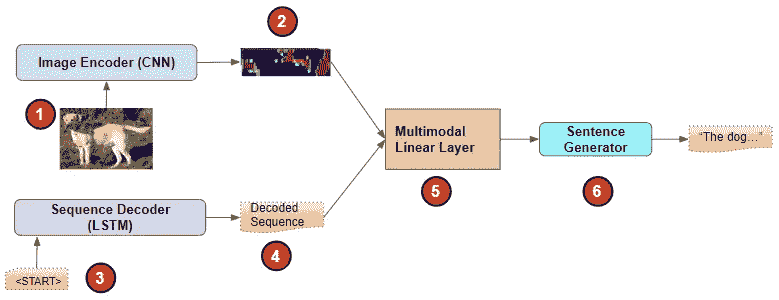

# 具有深度学习的图像标题:最先进的架构

> 原文：<https://towardsdatascience.com/image-captions-with-deep-learning-state-of-the-art-architectures-3290573712db?source=collection_archive---------7----------------------->

## [实践教程](https://towardsdatascience.com/tagged/hands-on-tutorials)，直观的图像字幕系列

## **用简单的英语介绍图像特征编码器、序列解码器、注意力和多模态架构的简明指南**

照片由[布雷特·乔丹](https://unsplash.com/@brett_jordan?utm_source=medium&utm_medium=referral)在 [Unsplash](https://unsplash.com?utm_source=medium&utm_medium=referral) 拍摄

图像字幕是深度学习的一个迷人应用，近年来取得了巨大的进展。更有趣的是，它将计算机视觉和 NLP 结合在一起。

# 什么是图像字幕？

它接受一个图像作为输入，并产生一个描述照片内容的简短文本摘要。

描述—“站在草丛中的狗”([来源](https://en.wikipedia.org/wiki/Labrador_Retriever#/media/File:Labrador_on_Quantock_(2175262184).jpg. By IDS.photos from Tiverton, UK - Labrador on Quantock, CC BY-SA 2.0, https://commons.wikimedia.org/w/index.php?curid=25739129 )))

这张图片的相关说明可能是“站在草地上的狗”或“站在草地上的拉布拉多犬”。

在本文中，我的目标是介绍这个主题，并概述常用于解决这个问题的技术和架构。

此外，如果您感兴趣，我还有一篇文章介绍了使用 Keras 和 Tensorflow 的端到端图像标题示例。

 [## Tensorflow 中带注意的图像标题，逐步

### Keras 和 Tensorflow 2.0 中使用编码器-解码器的端到端示例，用简单的英语讲述

towardsdatascience.com](/image-captions-with-attention-in-tensorflow-step-by-step-927dad3569fa) 

# 它是如何工作的？

概括地说，图像字幕利用了三个主要部分。顺便说一下，这些组件没有标准的名称，这些名称是我为了解释它们的用途而想出来的。

## 1.图像特征编码器

这将源照片作为输入，并产生一个捕捉其基本特征的编码表示。

(图片由作者提供)

这使用 CNN 架构，并且通常使用迁移学习来完成。我们采用为图像分类而预先训练的 CNN 模型，并移除最后的部分，即“分类器”。有几个这样的模型，如 VGGNet、ResNet 和 Inception。

这个模型的“主干”由几个 CNN 模块组成，这些模块从照片中逐步提取各种特征，并生成一个紧凑的特征图，以捕捉照片中最重要的元素。

它首先在初始层中提取简单的几何形状，如曲线和半圆，然后发展到更高层次的结构，如鼻子、眼睛和手，最后识别出面部和车轮等元素。

(经 Vigneashwara Solairaja Pandiyan 许可，改编自[来源](https://www.researchgate.net/figure/The-architecture-of-a-VGG-16-network_fig2_330467052)

在图像分类模型中，该特征图然后被馈送到最后一级，该最后一级是生成图像中主要对象的类别(例如猫或车)的最终输出预测的分类器。

当将该模型应用于图像字幕时，我们感兴趣的是图像的特征映射表示，而不需要分类预测。因此，我们保留主干并删除分类器层。

## 2.序列解码器

它获取照片的编码表示，并输出描述照片的标记序列。

典型地，这是一个递归网络模型，包括由嵌入层馈送的一堆 LSTM 层。

(图片由作者提供)

它将图像编码向量作为其初始状态，并以仅包含“开始”标记的最小输入序列作为种子。它“解码”输入图像向量并输出一系列标记。

它在一个循环中生成这个预测，一次输出一个令牌，然后将其反馈给网络作为下一次迭代的输入。因此，在每一步，它都采用迄今为止预测的记号序列，并生成序列中的下一个记号。最后，它输出一个“结束”标记来完成序列。

## 3.句子生成器

句子生成器的工作是获取标记序列并输出标题，标题是描述照片的所需语言的单词句子。

它由一个线性层和一个 Softmax 组成。这为目标语言的词汇表中的每个单词，为序列中的每个位置产生一个概率。

这个概率是这个单词出现在句子中那个位置的可能性。然后，我们可以使用贪婪搜索，通过在每个位置选择概率最高的单词来生成最终的句子。

(图片由作者提供)

然后，该句子将作为预测字幕输出。

几乎所有的图像字幕架构都使用这种方法，包括我们刚刚看到的三个组件。然而，随着时间的推移，这个框架已经有了很多变化。

# 架构:编码器-解码器

也许最常见的用于图像字幕的深度学习架构有时被称为“注入”架构，并直接将图像特征编码器连接到序列解码器，随后是句子生成器，如上所述。

(图片由作者提供)

# 建筑:多模态

注入架构是图像字幕的原始架构，现在仍然非常流行。然而，一种被称为“合并”架构的替代方案被发现可以产生更好的结果。

这两个组件彼此独立工作，而不是将图像编码器作为序列解码器的输入依次连接。换句话说，我们不混合这两种模式。带文本的图像。

*   CNN 网络只处理图像
*   LSTM 网络只对目前产生的序列进行操作。

(图片由作者提供)

这两个网络的输出然后与多模态层(可以是线性和 Softmax 层)结合在一起。它负责解释两种输出，然后是句子生成器，生成最终的预测字幕。

这种方法的另一个优点是，它允许我们不仅对图像编码器，而且对序列解码器使用迁移学习。我们可以为序列解码器使用预先训练的语言模型。

已经尝试了许多不同的组合输出的方法，例如级联、乘法等等。通常最有效的方法是使用加法。

# 架构:对象检测主干

前面我们讨论了使用来自图像编码器的预训练图像分类模型的主干。这种类型的模型通常被训练来识别整个画面的单个类别。

然而，在大多数照片中，你可能会有多个感兴趣的对象。不使用图像分类主干，为什么不使用预先训练的对象检测主干从图像中提取特征？

(图片由作者提供)

对象检测模型在场景中所有突出的对象周围生成边界框。它不仅能标记多个对象，还能识别它们在图片中的相对位置。因此，它能够提供图像的更丰富的编码表示，然后序列解码器可以使用该编码表示在其标题中包括所有那些对象的提及。

# 架构:专注的编码器-解码器

在过去的几年里，注意力在 NLP 模型中的应用已经获得了很大的关注。已经发现它显著提高了 NLP 应用的性能。当模型生成输出中的每个单词时，注意力有助于它关注输入序列中与该输出单词最相关的单词。

因此，毫不奇怪地发现，注意力也已经被应用于图像字幕，从而产生了最先进的结果。

当序列解码器产生字幕的每个单词时，注意力被用来帮助它集中在图像中与它所产生的单词最相关的部分。

(图片由作者提供)

注意模块从 LSTM 获取编码图像向量以及当前输出令牌。它会产生一个加权注意力分数。当该分数与图像结合时，它增加了 LSTM 在预测下一个令牌时应该关注的那些像素的权重。

例如，对于标题“狗在窗帘后面”，当它生成单词“狗”时，模型聚焦于照片中的狗，然后当它到达单词“窗帘”时，将焦点转移到窗帘，如您所料。

# 架构:带变压器的编码器-解码器

谈到关注度，目前的巨头无疑是变形金刚。它以注意力为核心，不使用多年来一直是 NLP 支柱的循环网络。该架构与编码器-解码器非常相似，只是用变压器代替了 LSTM。

(图片由作者提供)

已经提出了变压器架构的几种不同变体来解决图像字幕问题。一种方法试图不仅编码照片中的单个对象，还编码它们的空间关系，因为这对理解场景很重要。例如，知道一个对象是在另一个对象的下面、后面还是旁边，为生成标题提供了有用的上下文。

# 建筑:密集字幕

对象检测方法的另一种变体被称为密集字幕。这个想法是，照片通常是图片中不同位置的物体和活动的丰富集合。

因此，它不仅可以表示单个字幕，还可以表示图像不同区域的多个字幕。这个模型帮助它捕捉图像中的所有细节。

密密麻麻的字幕([来源](https://arxiv.org/pdf/1511.07571.pdf)，经费教授、许可)

# 具有波束搜索的句子生成器

当句子生成器生成最终标题时，它可以使用波束搜索，而不是我们上面提到的贪婪搜索。Beam Search 不是在每个位置只选择概率最高的单个单词，而是在每一步选择几个单词，基于到该点为止句子中所有单词的组合概率。

波束搜索(图片由作者提供)

波束搜索非常有效，在许多 NLP 应用中被广泛使用。我有几篇文章以直观的方式详细解释了这些。如果你感兴趣，我鼓励你去看一看。

 [## 自然语言处理的基础直观解释:波束搜索，它是如何工作的

### 波束搜索如何增强预测的简明指南

towardsdatascience.com](/foundations-of-nlp-explained-visually-beam-search-how-it-works-1586b9849a24)  [## 解释自然语言处理的基础——Bleu 评分和 WER 指标

### NLP 模型的两个基本指标(Bleu 分数和单词错误率)的简明指南，用简单的英语编写

towardsdatascience.com](/foundations-of-nlp-explained-bleu-score-and-wer-metrics-1a5ba06d812b) 

# Bleu 分数度量

在训练期间，一旦字幕生成，我们如何决定它有多好？用于评估图像字幕模型的常见度量是 Bleu 分数。对于其他 NLP 应用程序，如翻译和语言模型，这也是一个流行的指标。

这是一个简单的指标，衡量预测标题和真实标题之间匹配的连续单词的数量。为此，它比较了从 1 到 4 的各种长度的 n 元文法。

预测说明:“一只狗站在绿色的草地上”地面真实说明:“狗站在草地上”

*1-gram 的 Bleu 分数=正确预测的单词数/总预测单词数*

有三个预测单词也出现在真实字幕 ie 中。“狗”、“上”、“草”，一共出了六个预言词。

*Bleu 评分为 1 克(即。单字)= 3/6 = 0.5*

# 结论

随着计算机视觉和 NLP 的进步，今天的图像字幕模型能够产生几乎与人类表现相匹配的结果。当你输入一张照片，并得到一个完美的人类可读的说明，它几乎感觉就像有一些魔术在进行！

我们刚刚探讨了实现这一目标的常用方法。我们现在处于一个很好的位置，可以看到幕后的细节。在我的下一篇文章中，我将一步一步地介绍一个示例演示应用程序，这样我们就可以确切地看到它是如何工作的。

最后，如果你喜欢这篇文章，你可能也会喜欢我关于变形金刚、音频深度学习和地理定位机器学习的其他系列。

 [## 直观解释的变压器(第 1 部分):功能概述

### NLP 变形金刚的简明指南，以及为什么它们比 rnn 更好，用简单的英语。注意力如何帮助…

towardsdatascience.com](/transformers-explained-visually-part-1-overview-of-functionality-95a6dd460452)  [## 音频深度学习变得简单(第一部分):最新技术

### 颠覆性深度学习音频应用和架构世界的温和指南。以及为什么我们都需要…

towardsdatascience.com](/audio-deep-learning-made-simple-part-1-state-of-the-art-techniques-da1d3dff2504)  [## 利用地理位置数据进行机器学习:基本技术

### 简明的地理空间数据特征工程和可视化指南

towardsdatascience.com](/leveraging-geolocation-data-for-machine-learning-essential-techniques-192ce3a969bc) 

让我们继续学习吧！