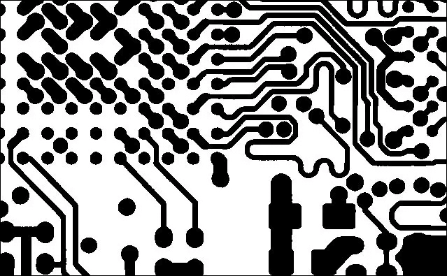

# 多氯联苯的图像分类及其网络应用(Flask)

> 原文：<https://towardsdatascience.com/image-classification-of-pcbs-and-its-web-application-flask-c2b26039924a?source=collection_archive---------6----------------------->

## 使用 Flask 创建多氯联苯的图像分类模型和设计 Web 应用程序。


来源: [alutriots](https://alutritos.vercel.app/index/view-29-simple-circuit-board-art/) (CC0)。

你好，这篇博客是关于为 PCB(印刷电路板)创建一个图像分类模型，以检测有缺陷的 PCB 并将其分类为好或坏。因此，我们将创建一个深度学习模型，并尝试获得最佳可能的结果，以及每个步骤的正确可视化。创建工作模型后，我们将使用 Flask 创建一个 Web 应用程序。你可以在我的 GitHub 上找到这个项目的代码，以及下面的安装说明文件。所以，让我们向前迈进，灵活应变。

> **要求**

1.  Jupyter 笔记本
2.  Python 3.5 或更高版本。(最好是 3.7)
3.  库— Tensorflow、Keras、Pandas、Numpy、Matplotlib、OpenCV、Pillow、Flask。【*所有最新版本*

> **了解数据集**


来源: [pcbways](https://pcbways.blogspot.com/1969/12/pcb-layout-altium-designer.html) (CC0)。

PCB(印刷电路板)是一种广泛使用的电子元件，几乎用于任何电子设备。有时在工厂的大规模生产过程中会出现一些异常，从而导致有缺陷的产品。电子公司必须承担这一损失。所以这种深度学习图像分类模型有助于仅在生产时识别好的和坏的电路。

因此，我们使用的数据集是 PCB 的二进制图像，其中黑色部分表示电路，白色部分表示空白电路区域。图像中的点或噪声显示异常。



图 2“无缺陷”PCB 的二进制图像。

正如我们所见，图像中没有异常和缺陷。现在，我们将看到另一个有缺陷的 PCB 图像。


图 2“有缺陷”的 PCB 的二进制图像(我编辑了图像并标记了缺陷)。

由于这里标记了缺陷，这是一个有缺陷的 PCB 的例子。你可以从 [***这里***](https://github.com/tangsanli5201/DeepPCB) 下载数据集。

> **数据准备/预处理**

现在，在我们下载数据集后，我们可以看到每张图像的尺寸为 640x640。如果我们降低它们的维数会更好，这样就更容易训练数据，但为了确保图像质量不受影响，我们将使用反走样技术压缩图像。

这是我的 [***链接***](https://github.com/utk-ink/Image-Operation-Tools) 到我的 GitHub repo，这也有助于做同样的事情。使用那里的图像调整工具，你会得到想要的结果。


图处理后的 224x224 图像。

因此，在将图像大小调整为 224x224 后，我们将它们保存到不同的文件夹中。我保存了 1，095 张良莠不齐的 PCB 图片。因此，该文件夹将成为您的训练数据集。挑选一些其他图像(不同于训练集)并把它们放到一个单独的文件夹中，作为测试数据集。确保测试文件夹是好图像和坏图像的良好混合，并保持适当的比例。

现在，我将检查我的训练数据集，它具有两种类型图像的适当比例，或者换句话说，检查可能的“类别不平衡”。作为参考，我将良好的 PCB 图像命名为 good()。jpeg 和 Bad as Bad()JPEG .然后我把好的图像标为‘0’，坏的图像标为‘1’。

然后我们画出他们的图表


因此，我们可以从图表中观察到，我们的班级相当平衡。现在为了交叉验证，我们将把训练数据集分成训练集和验证集。正如我之前提到的，我拍了 1095 张照片。我将它们分成 80%的训练数据和 20%的验证集。

```
train_df, validate_df = train_test_split(df, test_size=0.20, random_state=42)train_df = train_df.reset_index(drop=True)
validate_df = validate_df.reset_index(drop=True)
```

然后我们绘制训练和测试图像比率:-


⇙

*   这是最终“训练数据集”的绘图，即两个类别中大约 400+个图像。

⇖

⇙

*   这是“验证数据集”的绘图，即两个类别中大约有 100 多个图像。

⇖

___

现在，我将应用我认为最好的工具之一，即 Keras ImageDataGenerator。这是一个非常有用的工具，因为它有助于在训练模型的同时实时进行数据扩充。正如我们所知，我们的训练数据已经很少了，所以应用增强不仅有助于我们使我们的模型更健壮，而且还节省了内存。

现在，我们添加路径并将图像加载到生成器中。


所以，现在我们可以说我们的数据准备/预处理部分已经完成了。

> **模型实现**

现在是时候设计大脑了。这里我使用了在 ImageNet 数据集上预先训练好的*"****MobileNet****"*模型。MobileNet 是一种基于深度学习的卷积神经网络架构。它是一种轻量级架构，使用深度方向可分离的卷积。你可以从它的论文 [***这里***](https://arxiv.org/abs/1704.04861) *了解更多。*


图 MobileNets 架构。资料来源:[欣达维](https://www.hindawi.com/journals/misy/2020/7602384/fig1/) (CC0)。

正如我提到的，我们使用 ImageNet 数据集预训练的 MobileNet 模型，因此这里我们使用迁移学习的概念。因此，不是训练整个模型，我们将冻结基础层，并根据我们的要求添加一些其他层。

由于我们使用预训练的重量，我们将确保所有的重量是不可训练的，除了最后几个密集层。我把前 20 层设为不可训练。

```
for layer in model.layers[:20]:
    layer.trainable=False
for layer in model.layers[20:]:
    layer.trainable=True
```

但是如果你想把所有的层都设置成不可训练的，你可以用这个来代替。

```
for layer in model.layers:    
    layer.trainable=False
```

现在，我们已经完成了模型实现部分。

> **训练**

因此，我们的数据准备与模型实现一起完成。现在，是时候训练我们的模型了。在继续之前，我想提一下，我使用了两个回调函数，分别名为“*提前停止*和“*学习率降低*”。

我们需要仔细考虑历元的数量，因为太多会导致数据过拟合，而太少会导致数据过拟合。早期停止允许您指定任意大数量的训练时期，并在模型停止对保留验证数据集进行改进时停止训练。这里有一个 [***链接***](https://machinelearningmastery.com/how-to-stop-training-deep-neural-networks-at-the-right-time-using-early-stopping/) 如果你想了解更多。

当指标停止改善时，ReduceLROnPlateau 会降低学习率。一旦学习停滞，模型通常会受益于将学习速度降低 2-10 倍。这种回调监控一个数量，如果在“耐心”次数内没有看到改进，则学习率降低。这个可以从 [***这里***](https://keras.io/api/callbacks/reduce_lr_on_plateau/) 查。

现在，我们将开始训练我们的模型。嗯，我在 Google Colab 上训练了我的模型，因为它有一定的优势，我会建议每个人尝试使用 Google Colab，你只需要在 google drive 上上传或链接数据集，然后通过给出正确的文件夹位置，使用这个简单的调用将其安装在 Colab 上

```
from google.colab import drive
drive.mount('/content/drive')
```

现在，我们将在 model.fit.generator()中设置所有变量，然后开始训练我们的模型。


嗯，我把我的纪元设定为 50，但它停在 42，因为它停止改善。我根据训练模型时提取的数据绘制了两张图表。


.

⇙

*   “损失与时代”图表。

⇖

.

⇙

*   “精确度与时代”图。

⇖

.

*注意:-在两个图表中，蓝线表示训练，红线表示验证变量。*

于是，在训练完模型后，我得到了一个***95.71%的验证准确率。***

**现在，我们将训练好的权重保存在. h5 或. hdf5 文件中(两者相同)。**

```
model.save_weights("model.h5")
```

**如果你通过 Google Colab 训练它，你可以像这样直接在驱动器中保存重量**

```
model.save('/content/drive/My Drive/folder (1)/model.h5')
```

**因此我们的训练已经完成，现在是检查结果的时候了。**

> ****预测和结果****

**首先，我们将加载我们的模型。**

```
model = load_model(r'C:/Users/nEW u/Flask/model.h5')
```

**然后我们将使用 ImagedataGenerator 来访问测试文件夹，并共同调用图像文件。并将调用预测函数并用图像生成器函数对其进行设置。**

**现在，我们将把结果和图像一起绘制出来。我借助了 Matplotlib 库。**

**这就是我们的结果**

****

*****注*** *:-正如我前面提到的，我将图像文件命名为好的和坏的，以供参考。因此，初始部分是图像文件的名称，结果在括号中。因此，您可以根据图像名称将结果与实际图像质量进行比较。***

**至此，我们的图像分类模型成功完成。现在，是时候创建 Web 应用程序了。我要用烧瓶来装它。**

# ****使用 Flask 的 Web 应用程序****

**Flask 是用于创建 web 应用程序的 Python API。所以，首先，我会给你一个基本的代码片段，这是我们在使用 Flask 时通常遵循的。**

**希望你有一点想法，现在让我们开始实施。**

> ****功能****

**首先，我们必须编写函数来调用模型，以便在将图像传递给我们的模型和预测函数之前处理图像，预测函数让我们的图像通过模型并返回结果。**

*   **用于调用模型:-**

*   **为了处理图像:-**

*   **预测函数(使用*“load _ image”*函数):-**

> ****设计****

**当我们完成了我们的功能，我们将继续设计我们的网页。因此，这里我们将需要两个页面，在第一页，它会要求选择和上传图像。第二页将显示图像和结果。**

*****重要提示*** *:-使用 Flask 时，我们必须非常小心，因为我们需要创建一个单独的文件夹。在该文件夹中，我们将创建使用 flask 的 python 文件，我们还需要创建两个名为“Templates”和“Static”的子文件夹。模板是我们保存 HTML 文件的地方，在静态文件夹中，我们保存图像和其他东西。如果你想把自己从错误循环中拯救出来，你必须遵循这个惯例。***

**因此，由于我们需要两个页面，我相应地设计了两个 HTML 页面。出于设计目的，我使用了*“自举”*。Bootstrap 是一个开源的前端框架，用于创建网站和网络应用。它包含各种基于 HTML、CSS 和 JavaScript 的设计模板，用于 UI 界面元素，如按钮和表单等。**

**这是我的第一个网页 HTML 文件，名为 home.html**

**注意在第三行，使用了设计的引导链接(基于 CSS 的模板)。**

**这是第二页 HTML 文件，保存为 predict.html:-**

**这里同时使用了 CSS 和 JavaScript 模板。**

> ****编译和部署****

**我们的模型准备好了，功能准备好了，模板也准备好了。现在是时候编译所有这些东西，享受魔法了。**

**首先，我们运行烧瓶:-**

```
app = Flask(__name__)
```

**然后，我们通过调用函数来加载模型:-**

```
get_model()
```

**现在，我们调用这两个页面以及函数和模板:-**

**好了，现在到了最后一步，即运行一切并生成 URL:-**

****

**现在生成了一个 URL(注意蓝色部分)。点击它，我们会得到这样的第一页:-**

****

**然后，我们选择要检查的图像文件，然后单击上传。按下上传按钮后，用 url+"/predict "重定向到下一个页面。它将显示图像和结果:-**

****

**这是最终结果。因此，基于深度学习模型的 PCB 缺陷检测 Web 应用程序的实现是成功的。**

****您可以通过以下方式克隆存储库:-****

```
git clone [https://github.com/utk-ink/Defect-Detection-of-PCB.git](https://github.com/utk-ink/Defect-Detection-of-PCB.git)
```

**或者**

****这是我的 GitHub 的链接，是整个代码** :-**

**<https://github.com/utk-ink/Defect-Detection-of-PCB>  

希望你喜欢！！！

> 这个博客没有商业化，我只是想以最好的方式分享我的知识。请鼓掌，关注和分享，因为它激励我写更多。谢谢大家！！** 

***参考资料:-***

1.  **[https://deeplizard.com/learn/video/XgzxH6G-ufA](https://deeplizard.com/learn/video/XgzxH6G-ufA)**
2.  **[https://github . com/charm ve/Surface-Defect-Detection/tree/master/deep PCB](https://github.com/Charmve/Surface-Defect-Detection/tree/master/DeepPCB)**
3.  **[https://arxiv.org/abs/1704.04861](https://arxiv.org/abs/1704.04861)**
4.  **[https://machine learning mastery . com/how-to-stop-training-deep-neural-networks-at-the-right-time-using-early-stopping/](https://machinelearningmastery.com/how-to-stop-training-deep-neural-networks-at-the-right-time-using-early-stopping/)**
5.  **[https://towards data science . com/transfer-learning-using-mobilenet-and-keras-c 75 daf 7 ff 299](/transfer-learning-using-mobilenet-and-keras-c75daf7ff299)**
6.  **[https://keras.io/api/callbacks/reduce_lr_on_plateau/](https://keras.io/api/callbacks/reduce_lr_on_plateau/)**
7.  **[https://www . ka ggle . com/uysimty/get-start-image-class ification](https://www.kaggle.com/uysimty/get-start-image-classification)**
8.  **[https://get bootstrap . com/docs/5.0/入门/简介/](https://getbootstrap.com/docs/5.0/getting-started/introduction/)**