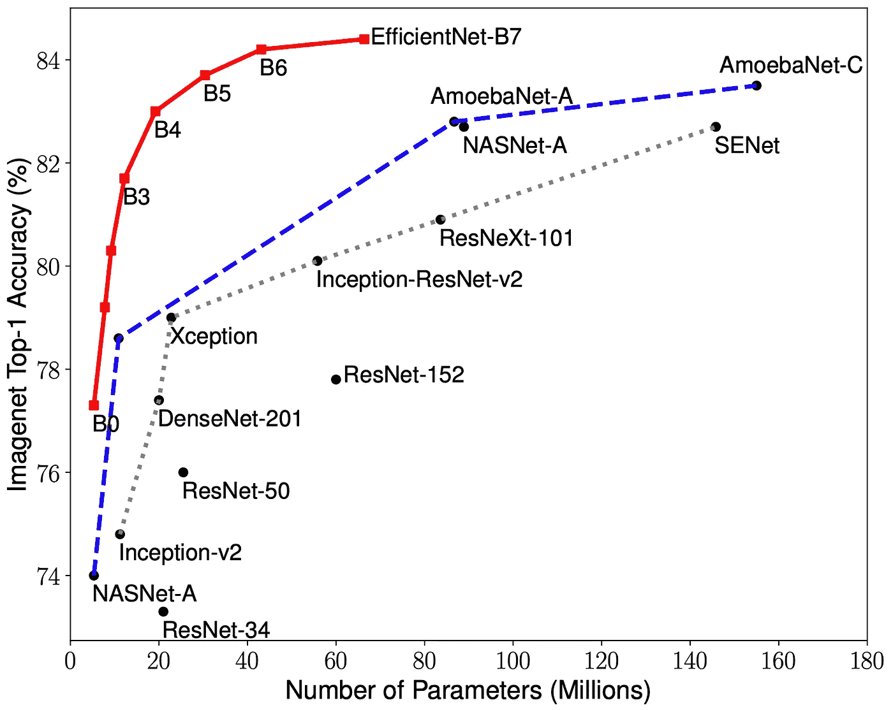
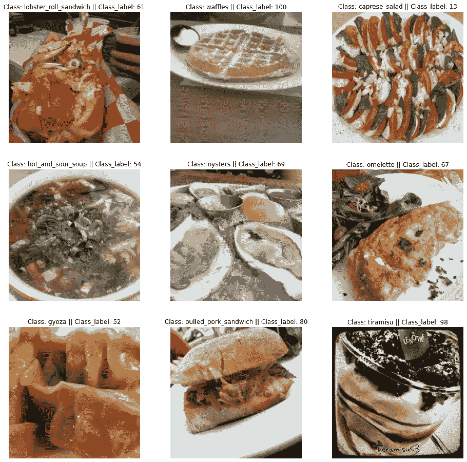
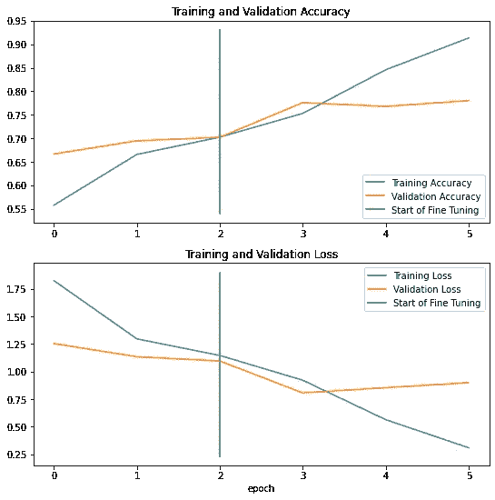
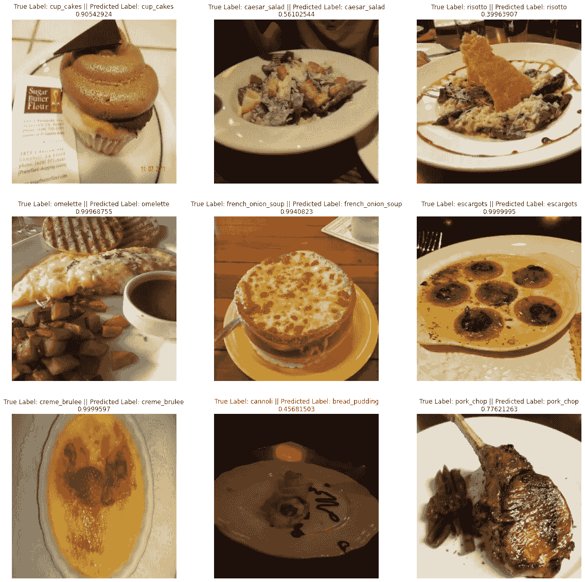
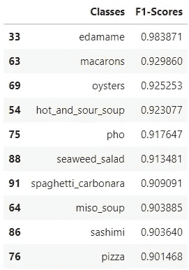
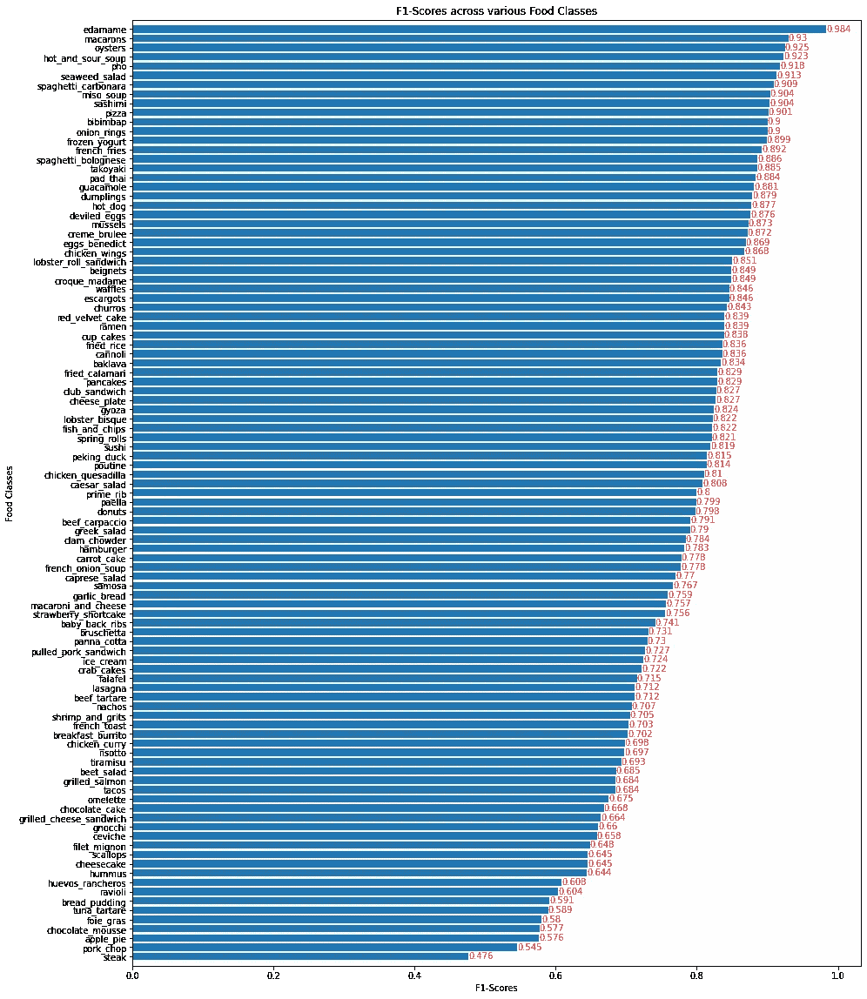
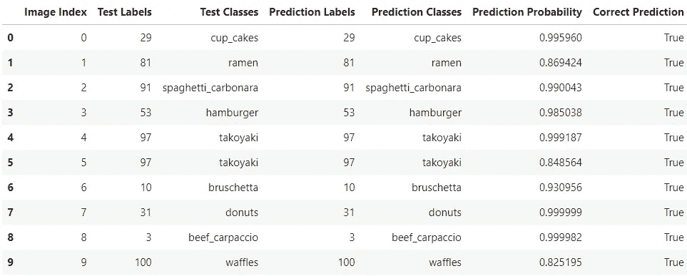
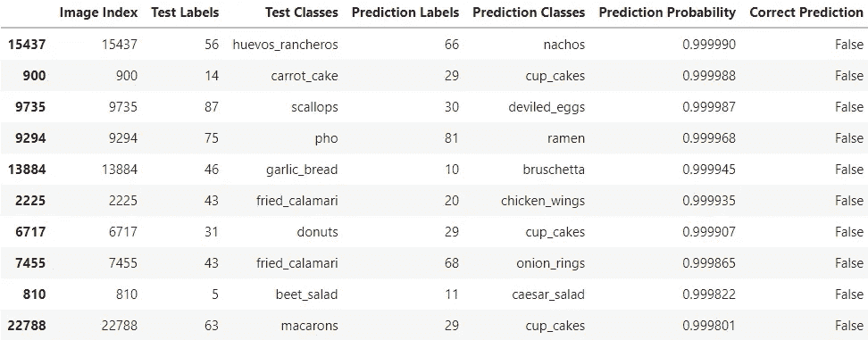
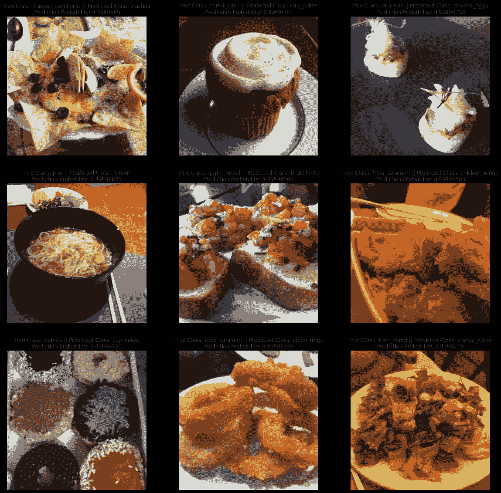
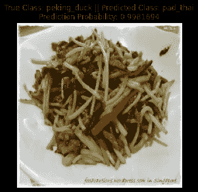

# 基于张量流的图像分类迁移学习和微调

> 原文：<https://towardsdatascience.com/image-classification-transfer-learning-and-fine-tuning-using-tensorflow-a791baf9dbf3?source=collection_archive---------3----------------------->

## 迁移学习/微调/张量流

## 理解深度学习中迁移学习和微调的力量

这里使用来自[tensor flow datasets](https://www.tensorflow.org/datasets/catalog/food101)的 food101 数据集上的 [EfficientNetB0](https://www.tensorflow.org/api_docs/python/tf/keras/applications/efficientnet/EfficientNetB0) 模型，完成了一个带有微调的简单 CNN(卷积神经网络)迁移学习应用程序。在 Jupyter 笔记本界面上使用 Python 3 内核进行实验。

**EfficientNet** ，首次在 [Tan 和 Le 中介绍，2019](https://arxiv.org/abs/1905.11946) 是最高效的模型之一(即需要最少的 FLOPS 进行推理)，在 imagenet 和普通图像分类迁移学习任务上都达到了最先进的精度。我们将使用 **EfficientNetB0** 架构，因为它是最不复杂的，可以处理较小尺寸的图像。



与其他 ImageNet 模型相比的 EfficientNet 系列(来源:[谷歌人工智能博客](https://ai.googleblog.com/2019/05/efficientnet-improving-accuracy-and.html))

从图中可以看出，尽管 **EfficientNetB0** 的最高精度相对较低，但我们将在本实验中使用它来实现迁移学习、特征提取和微调。EfficientNet 系列中的其他更高型号架构将需要计算能力更强的硬件。

我们从导入必要的包开始:

```
*#importing the necessary packages*
**import** tensorflow **as** tf
**import** tensorflow_datasets **as** tfds
**import** pandas **as** pd
**import** numpy **as** np
**import** matplotlib.pyplot **as** plt
**import** random
```

由于数据集包含 75750 幅训练图像和 25250 幅测试图像，因此可以将其归类为大型数据集。我们希望确保使用 GPU 来计算这个大型数据集，因为它可以显著减少处理、计算和训练时间。

```
print(f"The number of GPUs: {len(tf**.**config**.**list_physical_devices('GPU'))}")
**!**nvidia-smi -LThe number of GPUs: 1
GPU 0: NVIDIA GeForce RTX 3060 Laptop GPU (UUID: GPU-75f6c570-b9ee-76ef-47cd-a5fe65710429)
```

太好了，我的笔记本电脑的 GPU 正在使用中。

我们使用`tfds.load()`函数创建训练和测试数据集。`shuffle_files`参数设置为`False`,因为我们稍后将单独混洗训练数据集图像，同时保持测试数据集不混洗，因为我们希望在对测试数据集进行评估后将测试集与预测集进行比较。我们还将`as_supervised`参数设置为`True`，因为我们想要一个`('image', 'label')`格式的干净数据集。

> **注意**:由于 Tensorflow 下载整个 Food101 数据集并将其存储在本地(约 4.65 GiB)，根据您的网络速度和处理能力，以下步骤可能需要很长时间(约 1 小时)

```
(train_data, test_data), ds_info **=** tfds**.**load("food101",
                                             data_dir**=**"D:\Food Vision",
                                             split**=**["train", "validation"],
                                             shuffle_files**=False**,
                                             with_info**=True**,
                                             as_supervised**=True**)
```

我们打印保存在通过传递`wiht_info = True`参数获得的`ds_info`中的数据集的元数据信息，并获得数据集结构的大量元数据信息。快速检查训练和测试数据集中的图像数量，确认训练数据集包含 75750 个图像(每类 750 个图像)，测试数据集包含 101 个类中的 25250 个图像(每类 250 个图像):

```
len(train_data), len(test_data)(75750, 25250)
```

在`ds_info`上调用`features`方法产生数据集结构，该数据集结构目前是字典的形式，其中键是`image`和它们对应的`label`。它们的数据类型分别是`uint8`和`int64`。

```
ds_info**.**featuresFeaturesDict({
    'image': Image(shape=(None, None, 3), dtype=tf.uint8),
    'label': ClassLabel(shape=(), dtype=tf.int64, num_classes=101),
})
```

从字典中调用`label`键上的`names`方法可以获得所有 101 个食品类的类名。将显示前十个类名和列表长度:

```
class_names **=** ds_info**.**features['label']**.**names
class_names[:10], len(class_names)(['apple_pie',
  'baby_back_ribs',
  'baklava',
  'beef_carpaccio',
  'beef_tartare',
  'beet_salad',
  'beignets',
  'bibimbap',
  'bread_pudding',
  'breakfast_burrito'],
 101)
```

由于 EfficientNetB0 最适用于大小为`(224, 224, 3)`的图像，因此我们必须将数据集中的所有图像转换为上述大小。我们通过定义一个函数来做到这一点，稍后我们可以将该函数映射到训练和测试数据集中的所有元素。哦，由于神经网络最适合使用`float32`或`float16`数据类型，我们需要将图像的`uint8`数据类型转换为`float32`数据类型。

```
**def** resize_images(image, label):
    image **=** tf**.**image**.**resize(image, size**=**(224,224))
    image **=** tf**.**cast(image, dtype **=** tf**.**float32)
    **return** image, label
```

既然我们已经定义了调整图像大小、更改数据类型和返回图像元组及其关联标签所需的函数，现在我们将跨数据集的所有元素映射创建的函数。在这个阶段，我们还创建了一个性能管道来适应内存中的数据集，并加快计算和处理速度。`map()`函数中的`num_parallel_calls`参数被设置为`tf.data.AUTOTUNE`，它自动调整映射函数以提高并行处理效率。接下来，我们仅对缓冲区大小为`1000`的训练数据集进行混洗，以避免一次消耗大量内存，并且我们还将训练数据集和测试数据集分成几批`32`，因为我们无法一次将训练数据集中的所有图像放入 GPU 的带宽中。我们还利用了`prefetch()`，它重叠了训练步骤的预处理和模型执行，从而提高了效率，减少了训练时间。这里，我们也将`buffer_size`参数设置为`tf.data.AUTOTUNE`，让 Tensorflow 自动调整缓冲区大小。你可以在这里阅读更多关于预取[的内容。](https://www.tensorflow.org/guide/data_performance#prefetching)

```
train_data **=** train_data**.**map(map_func**=**resize_images, num_parallel_calls**=**tf**.**data**.**AUTOTUNE)
train_data **=** train_data**.**shuffle(buffer_size**=**1000)**.**batch(batch_size**=**32)**.**prefetch(buffer_size**=**tf**.**data**.**AUTOTUNE)

*#test_data doesn't need to be shuffled*
test_data **=** test_data**.**map(map_func**=**resize_images, num_parallel_calls**=**tf**.**data**.**AUTOTUNE)
test_data **=** test_data**.**batch(batch_size**=**32)**.**prefetch(buffer_size**=**tf**.**data**.**AUTOTUNE)
```

既然我们已经预处理了训练和测试数据集，那么重要的一步就是可视化数据集中的图像。我们运行下面的代码，在训练数据集中随机可视化 9 幅图像。图像被`255`分割，因为只有当图像张量中的所有值都在`0`和`1`之间时，`plt.imshow()`函数才会以正确的格式输出可视化。我们还打印训练数据集中可视化图像的类名和相应的类标签:

> N **注意**:每次运行这个代码块，它都会显示另一组随机图像。这对于进行几次迭代并检查数据集的结构以及任何标签错误或其他数据输入问题(如果发生的话)非常有用。

```
plt**.**figure(figsize**=**(16,16))
**for** i **in** range(9):
    **for** image,label **in** train_data**.**take(1):
        image **=** image**/**255.
        plt**.**subplot(3,3,i**+**1)
        plt**.**imshow(image[0])
        plt**.**title("Class: " **+** class_names[label[0]**.**numpy()] **+** " || Class_label: " **+** str(label[0]**.**numpy()))
        plt**.**axis(**False**);
```



作者图片

既然我们已经向数据集传递了`resize_images()`函数来调整图像大小和更改数据类型，我们可以使用`element_spec`属性来检查数据集的属性:

```
train_data**.**element_spec, test_data**.**element_spec((TensorSpec(shape=(None, 224, 224, 3), dtype=tf.float32, name=None),
  TensorSpec(shape=(None,), dtype=tf.int64, name=None)),
 (TensorSpec(shape=(None, 224, 224, 3), dtype=tf.float32, name=None),
  TensorSpec(shape=(None,), dtype=tf.int64, name=None))
```

太好了！现在所有图像的大小都是`(224, 224, 3)`，数据类型是`float32`数据类型。`None`形状表示图像和标签已经被分成我们之前指定的批次。

哦，我们还可以做另一件事来提高我们的处理速度，从而减少在这个过程中训练一个神经网络所花费的时间，那就是从`keras`模块中实现`mixed_precision`训练。混合精度是在训练期间在模型中同时使用 16 位和 32 位浮点类型，以使其运行更快并使用更少的内存。Keras 混合精度 API 允许我们混合使用 float16 和 float32，以获得 float16 的性能优势和 float32 的数值稳定性优势。你可以在这里阅读更多关于`mixed_precision`培训[的内容。](https://www.tensorflow.org/guide/mixed_precision)

```
**from** tensorflow.keras **import** mixed_precision
mixed_precision**.**set_global_policy('mixed_float16')INFO:tensorflow:Mixed precision compatibility check (mixed_float16): OK
Your GPU will likely run quickly with dtype policy mixed_float16 as it has compute capability of at least 7.0\. Your GPU: NVIDIA GeForce RTX 3060 Laptop GPU, compute capability 8.6mixed_precision**.**global_policy()<Policy "mixed_float16">
```

我们可以看到会话的全局数据类型策略当前被设置为`mixed_float16`。另一件要记住的事情是，到目前为止，混合精度训练只在计算能力为`7.0`或更高的 GPU 上有效。我们可以看到，我的 GPU 具有混合精确训练能力和计算能力`8.6`。谢谢 Nvidia！

在我们开始实际的迁移学习和微调之前，我们将创建一些方便的回调以在培训期间实施。第一个将是`TensorBoard`回调，它可以在 Tensorboard Dev 站点上生成定义良好的图形和我们模型指标的可视化。为此，我们只需提供一个路径来存储训练期间的回调。

其次，我们将创建一个`ModelCheckpoint`回调，它将为我们的模型创建一个检查点，如果需要的话，我们稍后可以恢复到这个检查点。在这里，我们只保存模型的权重，而不是整个模型本身，因为这可能需要一些时间。验证准确性是这里被监控的度量，我们还将`save_best_only`参数设置为`True`，因此回调将只保存导致最高验证准确性的模型的权重。

```
**def** tensorboard_callback(directory, name):
    log_dir **=** directory **+** "/" **+** name
    t_c **=** tf**.**keras**.**callbacks**.**TensorBoard(log_dir **=** log_dir)
    **return** t_c

**def** model_checkpoint(directory, name):
    log_dir **=** directory **+** "/" **+** name
    m_c **=** tf**.**keras**.**callbacks**.**ModelCheckpoint(filepath**=**log_dir,
                                             monitor**=**"val_accuracy",
                                             save_best_only**=True**,
                                             save_weights_only**=True**,
                                             verbose**=**1)
    **return** m_c
```

好了，现在我们已经预处理了我们的数据，可视化并创建了一些方便的回调，我们继续实际的迁移学习部分！我们使用`tf.keras.applications.efficientnet`创建基础模型，并从可用的 EfficientNet 预构建模型列表中选择`EfficientNetB0`。我们还将`include_top`参数设置为`False`，因为我们将使用适合我们的 food101 分类应用程序的输出分类器层。由于我们现在只是提取特征而不是微调，我们将设置`base_model.trainable = False`。

```
base_model **=** tf**.**keras**.**applications**.**efficientnet**.**EfficientNetB0(include_top**=False**)
base_model**.**trainable **=** **False**
```

现在我们已经准备好了特征提取基础模型，我们将使用 Keras Functional API 来创建我们的模型，该模型包括基础模型作为特征提取训练模型的功能层。首先创建输入层，并将形状设置为`(224, 224, 3)`。然后通过传递输入层来实例化基本模型层，同时将`training`参数设置为`False`，因为我们还没有对模型进行微调。接下来，设置`GlobalAveragePooling2D`层来为我们的卷积神经网络执行汇集操作。之后，在这个模型不同于传统 CNN 的地方做了一个小的改变，在传统 CNN 中，输出层被分离成`Dense`和`Activation`层。通常对于任何分类， **softmax** 激活可以与输出密集层一起包含在内。但是在这里，由于我们已经实现了 **mixed_precision** 训练，我们在最后单独传递了 **Activation** 层，因为我们希望 softmax activation 的输出是`float32`数据类型，这将通过保持数值稳定性来消除任何稳定性错误。最后，使用`Model()`功能创建模型。

```
**from** tensorflow.keras **import** layers

inputs **=** layers**.**Input(shape **=** (224,224,3), name**=**'inputLayer')
x **=** base_model(inputs, training **=** **False**)
x **=** layers**.**GlobalAveragePooling2D(name**=**'poolingLayer')(x)
x **=** layers**.**Dense(101, name**=**'outputLayer')(x)
outputs **=** layers**.**Activation(activation**=**"softmax", dtype**=**tf**.**float32, name**=**'activationLayer')(x)

model **=** tf**.**keras**.**Model(inputs, outputs, name **=** "FeatureExtractionModel")
```

既然我们已经构建了仅包含特征提取的模型，我们使用`summary()`方法来查看我们的特征提取模型的架构:

```
model**.**summary()Model: "FeatureExtractionModel"
_________________________________________________________________
Layer (type)                 Output Shape              Param #   
=================================================================
inputLayer (InputLayer)      [(None, 224, 224, 3)]     0         
_________________________________________________________________
efficientnetb0 (Functional)  (None, None, None, 1280)  4049571   
_________________________________________________________________
poolingLayer (GlobalAverageP (None, 1280)              0         
_________________________________________________________________
outputLayer (Dense)          (None, 101)               129381    
_________________________________________________________________
activationLayer (Activation) (None, 101)               0         
=================================================================
Total params: 4,178,952
Trainable params: 129,381
Non-trainable params: 4,049,571
_________________________________________________________________
```

我们看到，整个基本模型(EfficientNetB0)是作为我们的特征提取模型中的一个单一功能层来实现的。我们还可以看到为构建我们的模型而创建的其他层。基本模型包含大约 400 万个参数，但是它们都是不可训练的，因为我们已经冻结了基本模型，因为我们没有进行微调，而只是从基本模型中提取特征。唯一可训练的参数来自输出密集层。

接下来，我们详细了解我们的特征提取模型中的各个层、它们的名称、它们是否可训练、它们的数据类型以及它们对应的数据类型策略。

```
**for** lnum, layer **in** enumerate(model**.**layers):
    print(lnum, layer**.**name, layer**.**trainable, layer**.**dtype, layer**.**dtype_policy)0 inputLayer True float32 <Policy "float32">
1 efficientnetb0 False float32 <Policy "mixed_float16">
2 poolingLayer True float32 <Policy "mixed_float16">
3 outputLayer True float32 <Policy "mixed_float16">
4 activationLayer True float32 <Policy "float32">
```

我们可以看到除了基本模型层之外的所有层都是可训练的。数据类型策略表明，除了具有`float32`数据类型策略的输入层和输出激活层，所有其他层都兼容并采用`mixed_float16`数据类型策略。

现在我们可以继续编译和拟合我们的模型了。因为我们的标签不是一次性编码的，我们使用`SparseCategoricalCrossentropy()`损失函数。我们使用带有默认学习率的`Adam()`优化器，并设置模型指标来测量`accuracy`。

然后我们开始拟合我们的特征提取模型。我们将模型拟合历史变量保存到`hist_model`中，并在 3 个时期的训练数据集上训练我们的模型。我们在训练时使用我们的测试数据集作为验证数据，并使用 10%的测试数据作为验证步骤计数，以减少每个时期所用的时间。我们还将之前创建的回调函数传递到`callbacks`列表中，以创建 TensorBoard Dev 可视化和 ModelCheckpoint，后者保存我们模型的最佳权重，同时监控验证准确性。

```
model**.**compile(loss **=** tf**.**keras**.**losses**.**SparseCategoricalCrossentropy(),
              optimizer **=** tf**.**keras**.**optimizers**.**Adam(),
              metrics **=** ["accuracy"])

hist_model **=** model**.**fit(train_data,
                       epochs **=** 3,
                       steps_per_epoch**=**len(train_data),
                       validation_data**=**test_data,
                       validation_steps**=**int(0.1 ***** len(test_data)),
                       callbacks=[tensorboard_callback("Tensorboard","model"),                                  model_checkpoint("Checkpoints","model.ckpt")])Epoch 1/3
2368/2368 [==============================] - 115s 43ms/step - loss: 1.8228 - accuracy: 0.5578 - val_loss: 1.2524 - val_accuracy: 0.6665

Epoch 00001: val_accuracy improved from -inf to 0.66653, saving model to Checkpoints\model.ckpt
Epoch 2/3
2368/2368 [==============================] - 97s 41ms/step - loss: 1.2952 - accuracy: 0.6656 - val_loss: 1.1330 - val_accuracy: 0.6946

Epoch 00002: val_accuracy improved from 0.66653 to 0.69462, saving model to Checkpoints\model.ckpt
Epoch 3/3
2368/2368 [==============================] - 100s 42ms/step - loss: 1.1449 - accuracy: 0.7024 - val_loss: 1.0945 - val_accuracy: 0.7021

Epoch 00003: val_accuracy improved from 0.69462 to 0.70214, saving model to Checkpoints\model.ckpt
```

哇！我原以为每个纪元的训练时间会更长。看起来我们的输入数据管道、GPU 和混合精度策略的实施确实帮助我们显著减少了训练时间。

嗯……考虑到我们有 101 个输出类，我们的训练和验证精度还不错。我们还创建了一个模型检查点，其模型权重导致最高的验证准确性，以防我们希望在下一阶段进行微调后恢复到它。现在让我们对整个测试数据评估我们的模型，并将它存储在一个变量中。

```
model_results **=** model**.**evaluate(test_data)790/790 [==============================] - 27s 34ms/step - loss: 1.0932 - accuracy: 0.7053
```

不错，一点也不错。对于一个特征提取模型来说，70.53%的准确率已经相当不错了。

使用基于 EfficientNetB0 基本模型的特征提取模型，我们获得了大约 70.53%的准确率。我们现在通过微调我们的特征提取模型来增加准确度分数怎么样。为此，我们将模型的 base_model 层(EfficientNetB0 功能层)设置为可训练，并解冻之前冻结的基础模型。

```
base_model**.**trainable **=** **True**
```

然而，`BatchNormalization`层需要保持冷冻。如果他们也被转为可训练，解冻后的第一个历元将会显著降低精度([详情在此](https://keras.io/guides/transfer_learning/))。由于基础模型中的所有层都已设置为可训练，我们使用以下代码块再次仅冻结基础模型的**批处理规范化**层:

```
**for** layer **in** model**.**layers[1]**.**layers:
    **if** isinstance(layer, layers**.**BatchNormalization):
        layer**.**trainable **=** **False**
```

快速检查基本模型的层、它们的数据类型和策略，以及它们是否可训练:

```
**for** lnum, layer **in** enumerate(model**.**layers[1]**.**layers[**-10**:]):
    print(lnum, layer**.**name, layer**.**trainable, layer**.**dtype, layer**.**dtype_policy)0 block6d_project_conv True float32 <Policy "mixed_float16">
1 block6d_project_bn False float32 <Policy "mixed_float16">
2 block6d_drop True float32 <Policy "mixed_float16">
3 block6d_add True float32 <Policy "mixed_float16">
4 block7a_expand_conv True float32 <Policy "mixed_float16">
5 block7a_expand_bn False float32 <Policy "mixed_float16">
6 block7a_expand_activation True float32 <Policy "mixed_float16">
7 block7a_dwconv True float32 <Policy "mixed_float16">
8 block7a_bn False float32 <Policy "mixed_float16">
9 block7a_activation True float32 <Policy "mixed_float16">
```

很好！看起来除了`BatchNormalization`层之外，基础模型中的所有层都是可训练的，并准备好进行微调。我认为我们可以继续微调我们的特征提取模型`'model'`。我们从再次编译模型开始，因为我们已经改变了层属性(解冻)，但是这一次，作为一个通用的良好实践，我们将`Adam()`优化器的默认学习率降低了 10 倍，以减少过度拟合，并在很大程度上阻止模型学习/记忆训练数据。

然后我们开始拟合我们的微调模型。我们将模型拟合历史变量保存到`hist_model_tuned`中，并且我们在训练数据集上训练我们的模型 5 个时期，然而，我们将初始时期设置为来自我们的特征提取模型训练的最后时期，其将是`3`。因此，微调模型训练将从纪元编号 **3** 开始，并将运行到 5(总共三个纪元)。我们在训练时使用我们的测试数据集作为验证数据，并使用 10%的测试数据作为验证步骤计数，以减少每个时期所用的时间。我们再次将之前创建的回调函数传递到回调列表中，以创建 TensorBoard Dev 可视化，用于在特征提取和微调模型之间进行比较，还创建了 ModelCheckpoint，用于保存我们模型的最佳权重，同时监控验证准确性。

```
model**.**compile(loss **=** tf**.**keras**.**losses**.**SparseCategoricalCrossentropy(),
              optimizer **=** tf**.**keras**.**optimizers**.**Adam(learning_rate**=**0.0001),
              metrics **=** ["accuracy"])
hist_model_tuned **=** model**.**fit(train_data,
                             epochs**=**5,
                             steps_per_epoch**=**len(train_data),
                             validation_data**=**test_data,
                             validation_steps**=**int(0.1*****len(test_data)),
                             initial_epoch**=**hist_model**.**epoch[**-**1],
                             callbacks**=**[tensorboard_callback("Tensorboard", "model_tuned"), model_checkpoint("Checkpoints", "model_tuned.ckpt")])Epoch 3/5
2368/2368 [==============================] - 313s 127ms/step - loss: 0.9206 - accuracy: 0.7529 - val_loss: 0.8053 - val_accuracy: 0.7757

Epoch 00003: val_accuracy improved from -inf to 0.77571, saving model to Checkpoints\model_tuned.ckpt
Epoch 4/5
2368/2368 [==============================] - 297s 125ms/step - loss: 0.5628 - accuracy: 0.8457 - val_loss: 0.8529 - val_accuracy: 0.7678

Epoch 00004: val_accuracy did not improve from 0.77571
Epoch 5/5
2368/2368 [==============================] - 298s 125ms/step - loss: 0.3082 - accuracy: 0.9132 - val_loss: 0.8977 - val_accuracy: 0.7801

Epoch 00005: val_accuracy improved from 0.77571 to 0.78006, saving model to Checkpoints\model_tuned.ckpt
```

好极了。看来验证精度提高了不少。现在让我们在整个测试数据上评估我们的微调模型，并将其存储在一个变量中。

```
model_tuned_results **=** model**.**evaluate(test_data)790/790 [==============================] - 26s 33ms/step - loss: 0.9043 - accuracy: 0.7772
```

你看看那个！微调后的模型精度提高了约 10%，现在约为 **77.72** %。仅仅通过迁移学习和微调，我们已经取得了巨大的进步。感谢 EfficientNet 提供您的模型！

作为对比， [Deep Food](https://arxiv.org/ftp/arxiv/papers/1606/1606.05675.pdf) 在 2016**的**6 月**实现的卷积神经网络模型已经达到了 **77.4** %的顶级精度。Deep Food 的 CNN 模型花了几天时间来训练，而我们的迁移学习应用模型只用了不到 15 分钟就建成了！此外，通过使用简单的迁移学习技术和微调，我们的模型几乎与它不相上下，甚至略胜一筹。在其他方法中，训练更多的时期并增加正则化技术以减少过度拟合，肯定可以提高我们微调模型的准确度分数。此时，我们还可以使用`.save()`函数将模型保存到一个目录中，以便在本地运行时之外使用。**

**由于我们已经创建了`TensorBoard`回调，我们可以将指定目录中保存的 TensorBoard 日志上传到 TensorBoard Dev。可以点击获得的链接在 TensorBoard Dev 中在线查看模型的度量可视化。**

```
**!**tensorboard dev upload --logdir ./Tensorboard \
 **--**name "Food101"\
 **--**description "Feature Extraction Model vs Fine Tuned Model"\
 **--**one_shotNew experiment created. View your TensorBoard at: https://tensorboard.dev/experiment/hveaY1MSQBK6wIN6MwXoHA/

**[2021-11-16T23:06:17]** Started scanning logdir.
Data upload starting...
Uploading binary object (884.4 kB)...
Uploading binary object (1.1 MB)...
Uploading 36 scalars...
**[2021-11-16T23:06:22]** Total uploaded: 36 scalars, 0 tensors, 2 binary objects (2.0 MB)
**[2021-11-16T23:06:22]** Done scanning logdir.

Done. View your TensorBoard at https://tensorboard.dev/experiment/hveaY1MSQBK6wIN6MwXoHA/
```

**因为我们已经为特征提取模型和微调模型创建了两个历史对象，所以我们可以创建一个函数来一起绘制这两个历史，并比较训练和验证指标，以获得这两个模型的性能的一般概念:**

```
**def** compare_histories(original_history, new_history, initial_epochs):
    """
    Compares two model history objects.
    """
    acc **=** original_history**.**history["accuracy"]
    loss **=** original_history**.**history["loss"]

    val_acc **=** original_history**.**history["val_accuracy"]
    val_loss **=** original_history**.**history["val_loss"]

    total_acc **=** acc **+** new_history**.**history["accuracy"]
    total_loss **=** loss **+** new_history**.**history["loss"]

    total_val_acc **=** val_acc **+** new_history**.**history["val_accuracy"]
    total_val_loss **=** val_loss **+** new_history**.**history["val_loss"]

    plt**.**figure(figsize**=**(9, 9))
    plt**.**subplot(2, 1, 1)
    plt**.**plot(total_acc, label**=**'Training Accuracy')
    plt**.**plot(total_val_acc, label**=**'Validation Accuracy')
    plt**.**plot([initial_epochs**-**1, initial_epochs**-**1],
              plt**.**ylim(), label**=**'Start of Fine Tuning')
    plt**.**legend(loc**=**'lower right')
    plt**.**title('Training and Validation Accuracy')

    plt**.**subplot(2, 1, 2)
    plt**.**plot(total_loss, label**=**'Training Loss')
    plt**.**plot(total_val_loss, label**=**'Validation Loss')
    plt**.**plot([initial_epochs**-**1, initial_epochs**-**1],
              plt**.**ylim(), label**=**'Start of Fine Tuning')
    plt**.**legend(loc**=**'upper right')
    plt**.**title('Training and Validation Loss')
    plt**.**xlabel('epoch')
    plt**.**show()
```

**太好了！现在，让我们在函数中使用`hist_model`和`hist_model_tuned`对象，并将`initial_epochs`设置为`3`，因为我们已经为 3 个时期训练了第一个特征提取模型。**

```
compare_histories(hist_model, hist_model_tuned, initial_epochs**=**3)
```

****

**作者图片**

**嗯…这是一个很好的情节。训练和验证曲线对于特征提取模型来说看起来很好，然而，在微调之后，在仅仅一个时期之后，训练损失显著降低，而训练准确度急剧增加。在此期间，验证准确性和损失开始趋于平稳。这无疑表明我们的模型在一个时代之后是过度拟合的。其他正则化技术，包括退出、增强和提前停止回调技术，可以用来减少过度拟合，并可能提高我们的模型在看不见的测试数据上的准确性分数。然而，我们现在不会探究它们，因为这个实验只是为了展示迁移学习和微调的不可思议的力量，只需要几个简单的步骤。**

**既然我们已经基于 EfficientNetB0 训练了我们的微调模型，我们将使用它对整个测试数据集进行预测，并将其存储在`preds`中:**

```
preds **=** model**.**predict(test_data, verbose **=** 1)790/790 [==============================] - 27s 32ms/step
```

> **注意:预测存储在单个测试图像的每个类别的预测概率的集合中。**

**现在我们已经有了给定测试图像的每个类别的预测概率，我们可以使用`tf.argmax()`函数轻松获得预测标签，该函数返回包含给定轴上最高概率的索引。我们将预测标签存储在`pred_labels`中:**

```
pred_labels **=** tf**.**argmax(preds, axis**=**1)
pred_labels[:10]<tf.Tensor: shape=(10,), dtype=int64, numpy=array([ 29,  81,  91,  53,  97,  97,  10,  31,   3, 100], dtype=int64)>
```

**现在，我们已经进行了预测并获得了预测标签，我们可以将其与测试数据集标签进行比较，以获得有关微调模型的预测效果的详细信息。我们使用下面的代码块通过列表理解从测试数据集中获取测试标签:**

```
test_labels **=** np**.**concatenate([y **for** x, y **in** test_data], axis**=**0)
test_labels[:10]array([ 29,  81,  91,  53,  97,  97,  10,  31,   3, 100], dtype=int64)
```

**太好了！我们现在有了预测标签和基础事实测试标签。然而，为了绘制我们的预测标签和相关图像，我们需要一个数据集，只包含从`test_data`提取的图像，它包含图像和标签。为此，需要两个步骤。首先，我们创建一个空列表，并传递一个`for`循环，该循环使用`take()`函数从测试数据集中提取每一批并将其附加到新创建的空列表`test_image_batches`。`take()`函数内的`-1`使`for`循环遍历**测试数据中的所有**批次。结果输出是测试数据中所有批次的列表。由于图像仍然是以子列表的形式批量存在于列表`test_image_batches`中，在步骤 2 中，我们使用列表理解来提取每个子列表，即主列表中的每个图像，并将它们存储在`test_images`列表中。结果列表`test_images`包含原始测试数据集中包含的所有`25250`测试图像，使用列表上的`len()`功能进行验证。**

```
*# Step 1*
test_image_batches **=** []
**for** images, labels **in** test_data**.**take(**-**1):
    test_image_batches**.**append(images**.**numpy())

*# Step 2*
test_images **=** [item **for** sublist **in** test_image_batches **for** item **in** sublist]
len(test_images)25250
```

**现在我们已经有了测试图像(`test_images`)、它们的基本事实测试标签(`test_labels`)和它们相应的预测标签(`pred_labels`)以及预测概率(`preds`)的列表，我们可以很容易地可视化测试图像以及它们的预测，包括基本事实和预测类别名称。**

**在这里，我们从`test_images`中取出 9 个随机图像，并在图标题中将它们与基础事实类名和预测类名一起绘制，在`class_names`上使用索引与相应的基础事实和预测标签并排。我们还在每幅图像上显示预测的预测概率，以了解模型在预测中的可信度。此外，为了使图看起来更好，信息更丰富，对于错误的预测，我们将标题颜色设置为红色，而对于通过我们的微调模型进行的正确预测，我们将标题颜色设置为绿色。**

> ****注意**:每次运行这个代码块时，它都会显示一组新的随机图像和它们的预测，这在识别两个看起来相似的食物类别时特别有用，在这两个类别中，我们的模型可能会混淆，或者在一个实例中，我们的模型已经正确预测了一个图像，但是由于错误的地面真实测试标签，它落入了错误预测的类别中。**

```
plt**.**figure(figsize **=** (20,20))
**for** i **in** range(9):
    random_int_index **=** random**.**choice(range(len(test_images)))
    plt**.**subplot(3,3,i**+**1)
    plt**.**imshow(test_images[random_int_index]**/**255.)
    **if** test_labels[random_int_index] **==** pred_labels[random_int_index]:
        color **=** "g"
    **else**:
        color **=** "r"
    plt**.**title("True Label: " **+** class_names[test_labels[random_int_index]] **+** " || " **+** "Predicted Label: " **+**
              class_names[pred_labels[random_int_index]] **+** "\n" **+** 
              str(np**.**asarray(tf**.**reduce_max(preds, axis **=** 1))[random_int_index]), c**=**color)
    plt**.**axis(**False**);
```

****

**作者图片**

**由于我们既有测试标签又有预测标签，我们还可以使用 **SciKit-Learn** 库中的`classification_report()`函数，并通过将`output_dict`参数指定为`True`来将每个类的`precision`、`recall`和`f1-scores`存储在字典`report`中。**

```
**from** sklearn.metrics **import** classification_report
report **=** classification_report(test_labels, pred_labels, output_dict**=True**)

*#check a small slice of the dictionary*
**import** itertools
dict(itertools**.**islice(report**.**items(), 3)){'0': {'precision': 0.5535055350553506,
  'recall': 0.6,
  'f1-score': 0.5758157389635316,
  'support': 250},
 '1': {'precision': 0.8383838383838383,
  'recall': 0.664,
  'f1-score': 0.7410714285714286,
  'support': 250},
 '2': {'precision': 0.9023255813953488,
  'recall': 0.776,
  'f1-score': 0.8344086021505377,
  'support': 250}}
```

**现在我们已经有了一个包含各种评估指标(`precision`、`recall`和`f1-scores`)的字典，不如我们创建一个`pandas` dataframe，它只包含类名及其对应的 F1 分数。我们在评估指标中选择 F1 分数，因为它实现了精确度和召回率之间的平衡。你可以在这里阅读更多关于评估指标的信息。**

**但是，为了创建所需的数据框架，我们需要从分类报告字典中提取类别标签(键)和相应的 F1 值(值的一部分)。这可以通过创建一个空字典`f1scores`并传递一个`for`循环来实现，该循环遍历原始字典`report`的条目(键和值)，并使用键索引附加类名，通过值索引附加相应的 F1 值。**

```
f1scores **=** {}
**for** k,v **in** report**.**items():
    **if** k **==** 'accuracy':
        **break**
    **else**:
        f1scores[class_names[int(k)]] **=** v['f1-score']

*#check a small slice of the dictionary*
dict(itertools**.**islice(f1scores**.**items(), 5)){'apple_pie': 0.5758157389635316,
 'baby_back_ribs': 0.7410714285714286,
 'baklava': 0.8344086021505377,
 'beef_carpaccio': 0.7912087912087912,
 'beef_tartare': 0.7118644067796612}
```

**现在我们已经准备好了所需的字典，我们可以轻松地从下面的代码行创建一个数据帧`F1`，并按照各个类的 **F1-scores** 的降序对数据帧进行排序:**

```
F1 **=** pd**.**DataFrame({"Classes":list(f1scores**.**keys()),
                   "F1-Scores":list(f1scores**.**values())})**.**sort_values("F1-Scores", ascending**=False**)

*#check a small slice of the dataframe*
F1[:10]
```

****

**作者图片**

**太好了！似乎食物类`edamame`在所有类中取得了最高的 F1 分，其次是`macarons`。是什么阻止了我们创建一个整洁的柱状图，以降序显示所有 101 种食物类别及其 F1 分数？**

```
fig, ax **=** plt**.**subplots(figsize **=** (15,20))
plt**.**barh(F1["Classes"], F1["F1-Scores"])
plt**.**ylim(**-**1,101)
plt**.**xlabel("F1-Scores")
plt**.**ylabel("Food Classes")
plt**.**title("F1-Scores across various Food Classes")
plt**.**gca()**.**invert_yaxis()
**for** i, v **in** enumerate(round(F1["F1-Scores"],3)):
    ax**.**text(v, i **+** .25, str(v), color**=**'red');
```

****

**作者图片**

****

**毛豆([来源](https://www.houseofdimsum.co.za/products/edamame-beans))**

**太棒了。到目前为止，食品类别`edamame`的正确预测数最高，而类别`steak`的 F1 分数最低，表明正确预测数最低。嗯（表示踌躇等）..这有点可悲，因为我们都喜欢牛排！**

**作为我们基于 EfficientNetB0 的迁移学习微调模型的最终评估步骤，让我们将我们模型的*最错误的*预测可视化，即预测概率最高的模型的错误(错误)预测。这将有助于我们了解我们的模型是否在类似的食品类别中混淆，或者测试图像是否被错误标记，这将是数据输入错误。**

**为此，让我们创建一个简洁的数据帧`Predictions`，它包含测试数据集中各种图像的“图像索引”，它们对应的“测试标签”、“测试类别”、“预测标签”、“预测类别”和“预测概率”。**

```
Predictions **=** pd**.**DataFrame({"Image Index" : list(range(25250)), 
                            "Test Labels" : list(test_labels), 
                            "Test Classes" : [class_names[i] **for** i **in** test_labels],
                            "Prediction Labels" : list(np**.**asarray(pred_labels)),
                            "Prediction Classes" : [class_names[i] **for** i **in** pred_labels],
                            "Prediction Probability" : [x **for** x **in** np**.**asarray(tf**.**reduce_max(preds, axis **=** 1))]})
```

**由于我们已经创建了所需的数据帧`Predictions`，我们还可以创建一个新的“正确预测”列，其中包含由我们的模型正确预测的测试图像的`True`和错误预测的测试图像的`False`:**

```
Predictions["Correct Prediction"] **=** Predictions["Test Labels"] **==** Predictions["Prediction Labels"]
Predictions[:10]
```

****

**作者图片**

**太好了，我们的数据框看起来棒极了！然而，这不是我们数据帧的最终形式。我们希望当前数据帧的子集仅包含那些“正确预测”等于`False`的记录，因为我们的目标是绘制和可视化微调模型的*最错误的*预测。我们使用以下代码块获得最终数据帧，并按照**“预测概率”**的降序对数据帧记录进行排序:**

```
Predictions **=** Predictions[Predictions["Correct Prediction"] **==** **False**]**.**sort_values("Prediction Probability", ascending**=False**)
Predictions[:10]
```

****

**作者图片**

**印象深刻！我们的最终数据帧`Predictions`仅包含错误预测的图像记录(图像索引)以及它们的基本事实测试标签、测试类、预测标签、预测类，按照它们的预测概率的降序排序。我们可以手动从该数据集中取出一个图像索引，并将其传递到测试数据集的绘图函数中，以获得图像的可视化，并显示其基本真实类名和预测类名。然而，这里我们将取第一个 **9** 图像或图像索引，它们是我们的数据帧中*最错误的*图像，并将其与真实的类名、预测的类名和相应的预测概率一起绘制。**

```
indexes **=** np**.**asarray(Predictions["Image Index"][:9]) *#choosing the top 9 records from the dataframe*plt**.**figure(figsize**=**(20,20))
**for** i, x **in** enumerate(indexes):
    plt**.**subplot(3,3,i**+**1)
    plt**.**imshow(test_images[x]**/**255)
    plt**.**title("True Class: " **+** class_names[test_labels[x]] **+** " || " **+** "Predicted Class: " **+** class_names[pred_labels[x]] **+** "\n" **+**
             "Prediction Probability: " **+** str(np**.**asarray(tf**.**reduce_max(preds, axis **=** 1))[x]))
    plt**.**axis(**False**);
```

****

**作者图片**

**嗯嗯嗯…你知道什么！通过快速的谷歌搜索(是的，我不知道这些食品类别名称中的大多数是什么)，很明显，事实上，一些测试图像的地面真相测试标签被错误地标注，就像第一个图像的情况一样，它显然不是 huevos rancheros，而是我们的模型预测的类别——玉米片！此外，第五个图像显然不是大蒜面包，但也是我们的模型预测的类别——bruschetta！我们的模型加分！其他常见的错误预测来自于我们的模型混淆了相似的食物类别。例如，一些图像中的`chocolate_cake`与`tiramisu`非常相似，在某些情况下，甚至连人类都很难对其进行分类。**

**好在我们决定可视化最错误的预测！有了这个，我们可以执行适当的数据清理技术来纠正错误的真相标签，并可能删除一些真正令人困惑的看起来相似的食物类别。经过这些修正和调整，我认为我们的微调模型的准确性可以大幅提高！**

**同样，在随机浏览*最错误的*预测图像时，我偶然发现了这张图像，它在测试数据集中被明确标记为`peking_duck`，但实际上是`pad_thai`！再一次，这可以通过快速的谷歌搜索得到证实，因此我们的模型实际上做出了正确的预测。嗯（表示踌躇等）...也许存在许多其他带有错误地面真相标签的图像，如果它们都被纠正，想象一下我们的模型的准确度分数！**

```
plt**.**figure(figsize**=**(5,5))
plt**.**imshow(test_images[11586]**/**255)
plt**.**title("True Class: " **+** class_names[test_labels[11586]] **+** " || " **+** "Predicted Class: " **+** class_names[pred_labels[11586]]
          **+** "\n" **+** "Prediction Probability: " **+** str(np**.**asarray(tf**.**reduce_max(preds, axis **=** 1))[11586]))
plt**.**axis(**False**);
```

****

**作者图片**

****

**北京烤鸭和泰式炒面完全不同！(图片由作者提供)**

**现在想象一下，如果我们必须建立一个超过 200 层的复杂模型(如 EfficientNetB0)来完成我们的图像分类任务，并达到这一精度水平，需要花费我们多少天时间？迁移学习的确是一种神奇的技术！**

**感谢您的阅读。**

**如果你喜欢我的作品，可以在 [Linkedin](https://www.linkedin.com/in/davidbengurion/) 上联系我。**